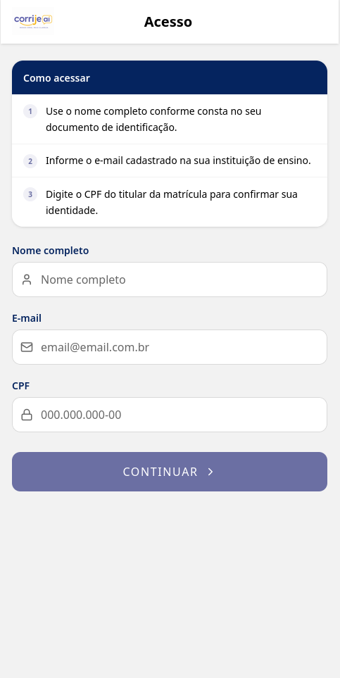
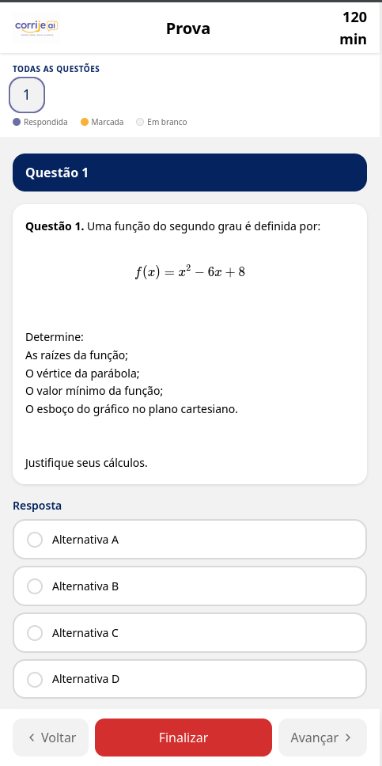
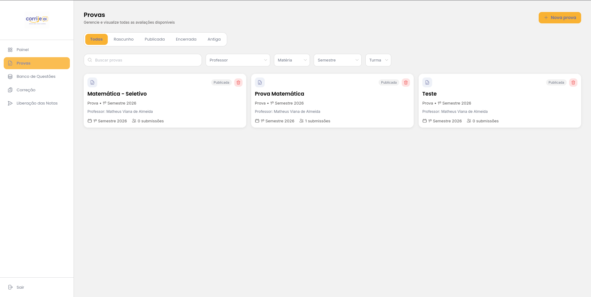
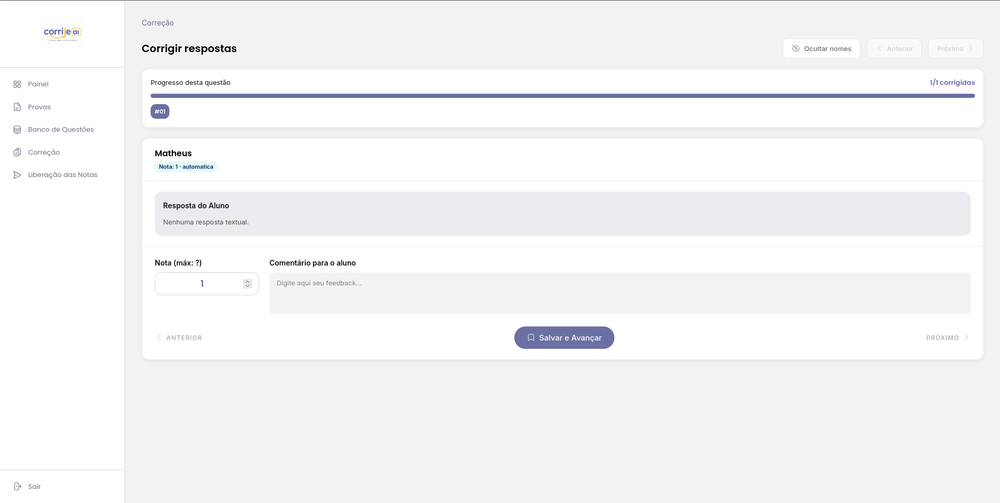
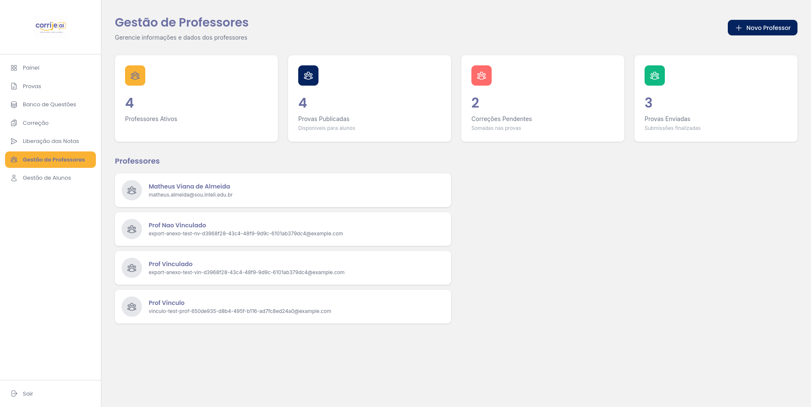
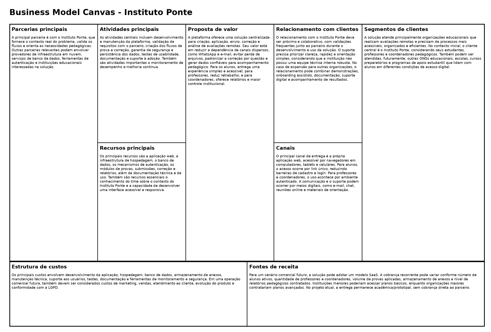

# WAD - Web Application Document - Módulo 2 - Inteli

<!-- **_Os trechos em itálico servem apenas como guia para o preenchimento da seção. Por esse motivo, não devem fazer parte da documentação final_** -->

## Nome do Grupo

#### Nomes dos integrantes do grupo

- Álvaro Leme de Toledo Almeida <br>
- Heloísa Noda Kadota <br>
- Joana Auriemo Racy <br>
- Luiz Gustavo Campos Cazelatto <br>
- Matheus Viana de Almeida <br>
- Pablo Marchina <br>
- Rafael Morgado Ferreira <br>

## Sumário

[1. Introdução](#c1)

[2. Visão Geral da Aplicação Web](#c2)

[3. Projeto Técnico da Aplicação Web](#c3)

[4. Desenvolvimento da Aplicação Web](#c4)

[5. Testes da Aplicação Web](#c5)

[6. Estudo de Mercado e Plano de Marketing](#c6)

[7. Conclusões e trabalhos futuros](#c7)

[8. Referências](#c8)

[Anexos](#c9)

<br>

# <a name="c1"></a>1. Introdução (sprints 1 a 5)

&emsp;O Instituto Ponte é uma Organização da Sociedade Civil de Interesse Público (OSCIP), fundada em setembro de 2014, com a missão de ser “a Ponte para a ascensão social em uma geração” por meio da educação de qualidade para jovens em situação de vulnerabilidade social. Atualmente, a organização atende 440 estudantes distribuídos em 18 estados do Brasil, em modelo híbrido de ensino (INSTITUTO PONTE, 2024). Nesse contexto, a equidade do processo avaliativo é central à missão institucional.

&emsp;Foi identificado que a realização e a correção de avaliações remotas ocorrem de forma descentralizada, com uso de WhatsApp, e-mail e outras ferramentas não estruturadas. Isso gera perda de arquivos, dificuldade de organização das submissões, sobrecarga para professores e ausência de mecanismos para correção isonômica por questão. A falta de critérios uniformes e transparentes compromete a justiça avaliativa para os alunos atendidos.

&emsp;Diante disso, propõe-se o desenvolvimento de uma aplicação web para criar, publicar, aplicar e corrigir avaliações remotas no Instituto Ponte. A solução centraliza o processo em uma única plataforma, promovendo três resultados principais: equidade para os alunos, com interface acessível em dispositivos limitados; eficiência para os professores, com correção padronizada por questão; e inteligência institucional para os coordenadores, com relatórios automáticos de desempenho. Com isso, espera-se reduzir falhas operacionais, fortalecer a integridade dos dados e ampliar a inclusão social por meio da tecnologia.

# <a name="c2"></a>2. Visão Geral da Aplicação Web

## 2.1. Escopo do Projeto (sprints 1 e 4)

### 2.1.1. Modelo de 5 Forças de Porter

<div align="center">
  
</div>

<div align="center">
  <strong>Figura 1 — 5 Forças de Porter do instituto Ponte.</strong><br><em>Fonte: elaboração própria.</em>
</div>

#### Rivalidade entre Concorrentes
A rivalidade no setor de organizações sociais voltadas à educação é moderada. Relatórios do terceiro setor apontam a presença de mais de 1.200 ONGs atuando em educação social no Brasil, e a disputa por recursos privados e públicos cresce a mais de 8% ao ano. Observa-se a atuação de diversas ONGs em inclusão educacional, captação de bolsas e preparação de jovens, mas poucas combinam seleção rigorosa com acompanhamento contínuo como o Instituto Ponte. A competição por doadores, visibilidade e parcerias existe, mas a diferenciação tende a reduzir a pressão direta.  
Referências-base: IDIS (2020), Transparência Brasil (2022), OECD (2019).

---

#### Ameaça de Novos Entrantes
A ameaça de novos entrantes é moderada. A criação de uma ONG é relativamente simples, mas menos de metade das iniciativas alcança maturidade financeira e impacto comprovado após três anos de operação. Replicar redes de escolas parceiras e demonstrar impacto exige tempo e gestão qualificada, criando barreiras informais mesmo em um setor de forte demanda social.  
Referências-base: ABONG (2021), Itaú Social (2020), McKinsey (2022).

---

#### Ameaça de Produtos Substitutos
A ameaça de substitutos é alta. Programas públicos específicos como **ProUni** e **FIES** competem diretamente pelo mesmo público-alvo do Instituto Ponte; juntos, atendem mais de 1,5 milhão de estudantes e mobilizam recursos na ordem de bilhões de reais por ano. Bolsas privadas e iniciativas como **Pé-de-Meia**, além de fundos de apoio de organizações como Fundação Estudar e Fundação Lemann, oferecem alternativas de acesso ao ensino superior e de apoio pedagógico, mesmo que não entreguem o mesmo pacote de mentoria e correção contínua. Esses substitutos reduzem a dependência do instituto em relação a doadores privados e ampliam a concorrência por recursos e estudantes.  
Referências-base: MEC (2023), Fundação Estudar (2023), Fundação Lemann (2022), OECD (2023).

---

#### Poder de Barganha dos Fornecedores
No contexto de uma OSCIP, os fornecedores primários são os doadores institucionais e empresariais, cujo financiamento constitui o principal insumo operacional da organização. O poder de barganha desses fornecedores é alto e heterogêneo. Grandes financiadores como Fundação Lemann e Itaú Social costumam apoiar projetos educacionais com orçamentos de dezenas de milhões de reais e exigem metas claras, relatórios detalhados e governança sólida. Doadores menores, por sua vez, normalmente aportam valores na faixa de dezenas a centenas de milhares de reais e têm menor influência estratégica, embora contribuam para a diversificação financeira. Como as ONGs dependem de financiamento recorrente, esses financiadores influenciam fortemente prioridades e critérios de gestão.  
Referências-base: IDIS (2022), CAF (2022), GIFE (2021).

---

#### Poder de Barganha dos Clientes
O poder dos beneficiários é baixo. Jovens vulneráveis têm poucas alternativas gratuitas com suporte prolongado, mentoria e acompanhamento acadêmico. A demanda supera muito a oferta, reduzindo a capacidade de barganha das famílias atendidas.  
Referências-base: IPEA (2021), UNICEF (2022), Todos Pela Educação (2023).

### 2.1.2. Análise SWOT do Instituto Ponte

<div align="center">
  
</div>

<div align="center">
  <strong>Figura 2 — Matriz SWOT do Instituto Ponte.</strong><br><em>Fonte: elaboração própria.</em>
</div>

&emsp;Identificou-se no Instituto Ponte posicionamento diferenciado no terceiro setor educacional: a taxa de aprovação de 92% nos vestibulares (INSTITUTO PONTE, 2024) — e o acompanhamento individualizado consolidam-se como diferenciais frente a organizações de maior escala, como Gerando Falcões e Parceiros da Educação. Os 2.375 inscritos anuais no processo seletivo, ante 440 alunos ativos, evidenciam alta demanda reprimida. Constatou-se vulnerabilidade financeira pela dependência de doações privadas e concentração no Espírito Santo. Verificaram-se oportunidades na expansão regional e na agenda ESG corporativa. Como ameaça central, reconheceu-se a disputa crescente por doadores institucionais em cenários de instabilidade econômica.

### 2.1.3. Solução (sprints 1 a 5)

&emsp;A solução é baseada no desenvolvimento de uma aplicação web para o Instituto Ponte, voltada à criação, aplicação e correção de avaliações remotas. Priorizam-se acessibilidade, organização e isonomia no processo avaliativo.

1. **Problema a ser resolvido**  
Verifica-se que o Instituto Ponte não possui uma plataforma centralizada para avaliações remotas. O processo atual, realizado por WhatsApp e e-mail, gera perda de arquivos, desorganização das submissões, correção pouco estruturada e inconsistências no acesso a feedbacks.

2. **Dados disponíveis**  
São atendidos 440 estudantes distribuídos em 18 estados do Brasil, em modelo híbrido (INSTITUTO PONTE, 2024). Esses dados ajudam a dimensionar o público atendido e reforçam a necessidade de uma solução simples e escalável.

3. **Solução proposta**  
Propõe-se uma plataforma web responsiva com interface simplificada, suporte a fórmulas matemáticas via LaTeX, upload estruturado por questão, salvamento automático e painel de correção por item. A solução também gera relatórios de desempenho e feedbacks individuais.

4. **Forma de utilização da solução**  
O acesso ocorre por link único. As questões são respondidas e os arquivos são enviados pelos alunos na própria plataforma. A correção é realizada por questão em um ambiente organizado. O histórico, os relatórios e as métricas são acompanhados pelos coordenadores para apoiar decisões pedagógicas.

5. **Benefícios esperados**  
Espera-se que a dificuldade de uso para alunos seja reduzida, que a perda de progresso seja evitada e que a segurança na navegação seja ampliada. Para docentes, a solução traz mais eficiência e padronização. Para a gestão, garantem-se dados centralizados e relatórios organizados.

6. **Critério de sucesso e avaliação**  
A solução será considerada bem-sucedida se: ≥ 90% dos alunos concluírem a prova sem suporte técnico; 100% das submissões forem persistidas sem perda; o coordenador acessar relatórios automatizados em todas as provas encerradas; e o tempo médio de correção por questão diminuir em relação ao processo manual.

### 2.1.4. Value Proposition Canvas

&emsp;Elaboraram-se três Value Proposition Canvas (VPC), um para cada perfil de usuário do sistema — Alunos, Professores e Coordenadores. Para cada segmento, analisaram-se as tarefas (Customer Jobs), dores (Pains) e ganhos (Gains) do cliente, e mapearam-se os produtos e serviços, aliviadores de dores (Pain Relievers) e criadores de ganhos (Gain Creators) da proposta de valor. O fit entre proposta e perfil é explicitado ao final de cada segmento.

---

#### VPC — Alunos

<div align="center">
  
</div>

<div align="center">
  <strong>Figura 3 — Value Proposition Canvas (Alunos) do Instituto Ponte.</strong><br><em>Fonte: elaboração própria.</em>
</div>

##### A. Perfil do Cliente

###### Tarefas do cliente (Customer Jobs)

No contexto da plataforma de avaliação remota, os alunos assumem o papel de participantes ativos do processo avaliativo digital. Ao longo da experiência, as seguintes tarefas são realizadas:

- acessar provas em um ambiente centralizado;
- responder avaliações diretamente na plataforma;
- enviar respostas e arquivos de forma correta;
- acompanhar seu desempenho acadêmico;
- participar de avaliações organizadas e padronizadas.

Na prática, todas as etapas da avaliação são realizadas em um único ambiente, reduzindo a complexidade e facilitando o processo.

---

###### Dores (Pains)

Durante o uso de sistemas tradicionais, os alunos enfrentam dificuldades que impactam sua experiência. Entre as principais dores estão:

- dificuldade no envio de arquivos e respostas;
- insegurança quanto ao sucesso da submissão;
- uso de múltiplos canais desorganizados;
- risco de perda de informações;
- dificuldades tecnológicas;
- falta de clareza no processo avaliativo.

Essas dores são geradoras de ansiedade e prejudicam o desempenho, especialmente em ambientes digitais pouco estruturados.

---

###### Ganhos (Gains)

Com a plataforma, os alunos passam a ter uma experiência mais clara e segura. Entre os principais ganhos estão:

- maior segurança na realização de provas;
- facilidade no envio de respostas;
- acesso centralizado a conteúdos;
- melhor organização das avaliações;
- maior transparência no processo;
- inclusão digital.

Ao final, o aluno consegue focar no aprendizado, sem se preocupar com problemas técnicos ou organizacionais.

---

##### B. Mapa de Valor

###### Produtos e Serviços

A solução oferece:

- sistema de provas online;
- envio seguro de respostas e arquivos;
- interface simples e intuitiva;
- confirmação visual de submissão;
- acompanhamento de resultados e feedbacks.

---

###### Aliviadores de Dores (Pain Relievers)

Para reduzir as dificuldades, a plataforma:

- centraliza todas as atividades em um único ambiente;
- garante armazenamento seguro;
- reduz falhas no envio de arquivos;
- simplifica o uso com uma interface intuitiva.

---

###### Criadores de Ganhos (Gain Creators)

A solução gera valor ao:

- melhorar a experiência do aluno;
- aumentar a confiança no sistema;
- facilitar o acesso ao conteúdo;
- promover um ambiente mais organizado e justo.

&emsp;**Fit entre proposta e perfil:** A dor de insegurança quanto ao sucesso da submissão é diretamente aliviada pela confirmação visual de envio (US11) e pelo salvamento automático de progresso (US10). A dificuldade tecnológica é reduzida pela interface mobile-first (US09) e pelo acesso sem cadastro por link único (US08). O ganho de inclusão digital é criado pela renderização de fórmulas em qualquer dispositivo (RF011) e pelo suporte a uploads de resoluções manuscritas (RF006).

---

#### VPC — Professores

<div align="center">
  
</div>

<div align="center">
  <strong>Figura 4 — Value Proposition Canvas (Professores) do Instituto Ponte.</strong><br><em>Fonte: elaboração própria.</em>
</div>

##### A. Perfil do Cliente

###### Tarefas do cliente (Customer Jobs)

Os professores são responsáveis pela criação e gestão das avaliações. Durante o processo, as seguintes atividades são desempenhadas:

- criar provas e atividades avaliativas;
- organizar e publicar avaliações;
- corrigir respostas dos alunos;
- corrigir avaliações por questão, garantindo isonomia;
- acompanhar o desempenho das turmas.

Na prática, essas tarefas são centralizadas na plataforma, tornando o trabalho mais estruturado e eficiente.

---

###### Dores (Pains)

Sem uma plataforma adequada, os professores enfrentam diversos problemas, como:

- sobrecarga administrativa;
- uso de ferramentas dispersas;
- perda de arquivos;
- falta de padronização nas correções;
- dificuldade em organizar avaliações;
- retrabalho constante.

Essas dificuldades resultam em um processo mais lento e menos eficiente.

---

###### Ganhos (Gains)

Com a solução, os professores passam a ter:

- maior organização das avaliações;
- correção mais eficiente e padronizada;
- redução de erros operacionais;
- economia de tempo;
- melhor acompanhamento dos alunos.

Assim, o professor consegue focar mais no ensino e menos em tarefas operacionais.

---

##### B. Mapa de Valor

###### Produtos e Serviços

A plataforma oferece:

- criação e publicação de provas;
- sistema de correção estruturado por questão;
- armazenamento de avaliações;
- acompanhamento acadêmico.

---

###### Aliviadores de Dores (Pain Relievers)

A solução reduz problemas ao:

- automatizar processos;
- centralizar informações;
- evitar perda de arquivos;
- padronizar correções;
- diminuir a sobrecarga.

---

###### Criadores de Ganhos (Gain Creators)

A plataforma gera benefícios ao:

- aumentar a eficiência do trabalho;
- melhorar a organização;
- facilitar o acompanhamento pedagógico;
- reduzir o tempo gasto em tarefas repetitivas.

&emsp;**Fit entre proposta e perfil:** A dor de falta de padronização nas correções é aliviada pelo módulo de correção por questão (US12), que agrupa todas as respostas de uma mesma questão em sequência. A sobrecarga administrativa é reduzida pela correção automática de questões objetivas (US13) e pela geração de planilhas de resultados (US14). O ganho de eficiência é criado pelo banco de questões reutilizáveis (US05) e pelo editor com suporte a LaTeX (US04).

---

#### VPC — Coordenadores

<div align="center">
  
</div>

<div align="center">
  <strong>Figura 5 — Value Proposition Canvas (Coordenadores) do Instituto Ponte.</strong><br><em>Fonte: elaboração própria.</em>
</div>

##### A. Perfil do Cliente

###### Tarefas do cliente (Customer Jobs)

Aos coordenadores é atribuído um papel estratégico dentro da instituição. As seguintes responsabilidades são exercidas:

- organizar processos avaliativos;
- supervisionar avaliações;
- monitorar desempenho acadêmico;
- acessar relatórios institucionais;
- apoiar decisões pedagógicas;
- garantir segurança e padronização.

Na prática, uma visão ampla e centralizada de toda a operação é proporcionada pela plataforma.

---

###### Dores (Pains)

Entre os principais desafios enfrentados estão:

- falta de centralização de dados;
- dificuldade de monitoramento;
- processos manuais e descentralizados;
- risco de inconsistências;
- dificuldade na tomada de decisão;
- baixa visibilidade dos resultados.

Esses problemas resultam em dificuldades para a gestão eficiente da instituição.

---

###### Ganhos (Gains)

Com a plataforma, os coordenadores passam a ter:

- acesso a dados organizados;
- relatórios automáticos;
- maior controle dos processos;
- melhoria na tomada de decisão;
- aumento da eficiência institucional;
- maior segurança da informação.

Com isso, a gestão é fortalecida e a qualidade dos processos educacionais é melhorada.

---

##### B. Mapa de Valor

###### Produtos e Serviços

A solução inclui:

- painéis administrativos;
- relatórios automáticos;
- armazenamento de dados;
- monitoramento acadêmico;
- gestão centralizada.

---

###### Aliviadores de Dores (Pain Relievers)

A plataforma ajuda ao:

- centralizar informações;
- automatizar relatórios;
- reduzir falhas humanas;
- melhorar o controle dos processos.

---

###### Criadores de Ganhos (Gain Creators)

A solução agrega valor ao:

- melhorar a gestão institucional;
- aumentar a transparência;
- apoiar decisões estratégicas;
- modernizar processos educacionais.

&emsp;**Fit entre proposta e perfil:** A dor de falta de centralização de dados é aliviada pelo painel de visualização de todas as provas (RF018) e pelos relatórios automáticos de desempenho (RF019). A dificuldade de monitoramento é reduzida pelo módulo de logs e analytics (US16), que oferece métricas de participação e desempenho por questão. O ganho de eficiência institucional é criado pela exportação estruturada de resultados em Excel (US14) e pelo histórico de envios de e-mail com status (US15).

---

### 2.1.5. Matriz de Riscos do Projeto

A seção foi estruturada com base no contexto do Instituto Ponte, no escopo da solução e nas restrições formais do TAPI.

#### Critério de classificação

A classificação foi definida pela combinação entre probabilidade e impacto, priorizando os riscos mais prováveis e com maior efeito sobre o cumprimento do escopo, do prazo e da qualidade da solução. Foram considerados os tipos esperados para este projeto: tecnológicos, de usuário, de negócio, de conteúdo e ético/regulatórios. A resposta foi descrita em três frentes: mitigação, prevenção e plano contingencial.

#### Matriz de riscos

<div align="center">
  
</div>

<div align="center">
  <strong>Figura 6 — Matriz de Risco do Instituto Ponte.</strong><br><em>Fonte: elaboração própria.</em>
</div>

| Risco | Tipo | Descrição | Probabilidade | Impacto | Classificação | Plano de resposta | Responsável |
|---|---|---|---|---|---|---|---|
| **A01 — Dificuldade de uso em cenários de acesso digital limitado** | Usuário / tecnológico | O público atendido pelo Instituto Ponte está distribuído em 18 estados e em contexto de vulnerabilidade social, o que pode gerar condições heterogêneas de uso e dificultar a realização da prova remota por parte de alguns alunos. | 70 | Muito Alto | Alta prioridade | **Mitigação:** interface simples, com fluxo curto e instruções claras; **Prevenção:** validação de usabilidade com foco no público-alvo; **Contingência:** orientação ao parceiro para disponibilizar janela de aplicação mais ampla quando necessário. | Equipe de UX e front-end |
| **A02 — Complexidade das funcionalidades de prova com equações e uploads** | Tecnológico / conteúdo | O escopo prevê suporte nativo a equações e envio de arquivos, o que amplia a complexidade da implementação e aumenta o risco de inconsistência entre o editor, a visualização e a submissão. | 70 | Alto | Alta prioridade | **Mitigação:** desenvolvimento incremental por entregas; **Prevenção:** priorização do fluxo mínimo de prova no MVP; **Contingência:** redução temporária de recursos secundários caso a integração comprometa a estabilidade. | Equipe de desenvolvimento |
| **A03 — Falhas no fluxo de submissão de respostas e anexos** | Tecnológico | Como a solução depende do envio de respostas e arquivos de resolução, qualquer falha nesse fluxo pode comprometer a integridade da prova e gerar retrabalho para o aluno e para o professor. | 50 | Muito Alto | Alta prioridade | **Mitigação:** validações de formulário e confirmação explícita de envio; **Prevenção:** testes do fluxo completo de submissão; **Contingência:** registro de falhas e reenvio orientado pelo sistema. | Equipe de back-end |
| **A04 — Dificuldade na correção por item** | Negócio / usuário | A proposta inclui organização da correção por itens da avaliação. Se a navegação entre questões não for clara, o ganho de padronização da correção pode ser reduzido. | 50 | Alto | Média-alta prioridade | **Mitigação:** arquitetura de navegação simples entre itens; **Prevenção:** revisão do fluxo com o parceiro antes da entrega final; **Contingência:** ajustes no agrupamento das respostas conforme o uso real. | Equipe de produto e validação com o parceiro |
| **A05 — Atraso na entrega das funcionalidades centrais** | Negócio / tecnológico | O projeto reúne criação de prova, submissão do aluno e painel de correção em um único produto, o que pode pressionar o cronograma e afetar a conclusão das entregas prioritárias. | 50 | Moderado | Média prioridade | **Mitigação:** divisão do escopo em incrementos; **Prevenção:** priorização do MVP e controle das sprints; **Contingência:** corte controlado de funcionalidades não essenciais. | Gestão do grupo |
| **A06 — Identificação não autenticada no fluxo do aluno** | Ético/regulatório / negócio | O acesso dos alunos ocorre por identificação simples (nome, CPF e e-mail), sem autenticação forte. Embora professores e coordenadores utilizem OAuth2 Google, o fluxo do aluno permanece sem verificação de identidade robusta, o que pode permitir submissões com dados falsos ou acesso não autorizado a provas por link. | 50 | Alto | Média-alta prioridade | **Mitigação:** registrar o acesso de forma transparente dentro do fluxo definido; **Prevenção:** documentar claramente o procedimento de uso; **Contingência:** adotar conferência manual quando o parceiro julgar necessário. | Equipe de produto e parceiro |
| **A07 — Limitação de expansão por ausência de APIs externas** | Negócio | Como o projeto não contempla integração com WebAPIs externas, a evolução futura da solução pode ficar limitada a funcionalidades internas da própria aplicação. | 50 | Moderado | Média prioridade | **Mitigação:** organizar a arquitetura com contratos internos bem definidos; **Prevenção:** documentar pontos de extensão; **Contingência:** tratar integrações futuras como evolução fora do escopo atual. | Equipe de back-end |
| **A08 — Ausência de mecanismos de proctoring** | Ético/regulatório | O TAPI exclui bloqueio de navegador e monitoramento por câmera. A solução, portanto, prioriza acessibilidade, mas não oferece meios de supervisão avançada durante a aplicação da prova. | 50 | Moderado | Média prioridade | **Mitigação:** reforçar a clareza das regras de aplicação com o parceiro; **Prevenção:** manter o escopo aderente ao TAPI; **Contingência:** eventual adoção de procedimentos manuais de supervisão pela instituição. | Parceiro e equipe de alinhamento |
| **O01 — Ampliação do alcance da solução para contextos semelhantes** | Negócio | A estrutura do Instituto Ponte e o problema enfrentado pelo parceiro indicam uma demanda que pode ser compartilhada por outras organizações com realidade educacional parecida. | 50 | Alto | Alta oportunidade | **Aproveitamento:** manter a solução simples, adaptável e documentada para facilitar futuras adaptações. | Equipe de produto |
| **O02 — Fortalecimento da padronização da correção** | Negócio / usuário | A organização da correção por item pode aumentar a consistência do processo avaliativo e reduzir dispersões entre professores. | 70 | Moderado | Alta oportunidade | **Aproveitamento:** destacar o painel de correção por questão como fluxo principal da experiência do professor. | Equipe de UX e back-end |
| **O03 — Melhoria da experiência avaliativa com suporte a equações e uploads** | Tecnológico / conteúdo | O suporte a equações e anexos permite uma prova mais próxima das necessidades reais de avaliação do parceiro e amplia a utilidade pedagógica da solução. | 50 | Moderado | Média oportunidade | **Aproveitamento:** integrar os recursos de forma estável e com linguagem visual consistente. | Equipe de front-end |
| **O04 — Ganho reputacional pela entrega de uma solução aderente ao contexto social do parceiro** | Negócio / ético | Uma solução coerente com acessibilidade, simplicidade e equidade pode reforçar o valor institucional do projeto junto ao parceiro. | 50 | Moderado | Média oportunidade | **Aproveitamento:** registrar as decisões de projeto e os resultados obtidos para uso em documentação e apresentação final. | Gestão do grupo |

## 2.2. Personas

&emsp;Foram elaboradas três proto-personas representando os perfis de usuários do sistema: Edgar Romeo (aluno), estudante com baixo letramento digital que necessita de interface simples e intuitiva; Ronaldo Silva (professor), docente experiente que busca eficiência e organização no processo de correção; e Valéria dos Santos (coordenadora), profissional com alto domínio digital que depende de dados estruturados para apoiar decisões pedagógicas. As personas são hipotéticas e foram construídas a partir do contexto institucional do Instituto Ponte e dos dados do TAPI (INSTITUTO PONTE, 2024).

<div align="center">
  
</div>

<div align="center">
  <strong>Figura 7 — Persona do Aluno.</strong><br><em>Foto de <a href="https://unsplash.com/pt-br/@sooprun?utm_source=unsplash&utm_medium=referral&utm_content=creditCopyText">Alex Suprun</a> na <a href="https://unsplash.com/pt-br/fotografias/man-in-black-button-up-shirt-ZHvM3XIOHoE?utm_source=unsplash&utm_medium=referral&utm_content=creditCopyText">Unsplash</a>
      </em>
</div>

### 2.2.1 Mapa de Empatia — Aluno (Edgar Romeo)

#### Visão Geral
Este mapa de empatia representa Edgar Romeo, aluno do Instituto Ponte, e auxilia na compreensão das suas necessidades durante o uso da plataforma de avaliação remota.

#### Dados Demográficos
- Idade: 17 anos  
- Localização: Espírito Santo  
- Escolaridade: Ensino Médio em andamento  
- Nível de letramento digital: Baixo  
- Condição socioeconômica: vulnerabilidade social  

#### O que pensa?
- "Eu preciso conseguir acessar a prova sem confusão."  
- "Espero entender o enunciado e não errar por causa da tecnologia."  
- "Tenho medo de perder a entrega ou o arquivo."  

#### O que sente?
- Ansiedade com o cronômetro e com o tempo disponível para responder.  
- Insegurança ao enviar imagens manuscritas de respostas.  
- Frustração diante de perguntas com fórmulas difíceis de ler no celular.  

#### O que diz?
- "Não sei se minha resposta foi enviada de verdade."  
- "Tenho dificuldade para ler as questões no meu celular."  
- "Fico preocupado se a foto da minha resolução vai chegar com qualidade."  

#### O que faz?
- Usa o celular para acessar a prova.  
- Tenta enviar fotos de resolução manuscrita.  
- Pausa para reler cada questão e verifica o envio antes de finalizar.  

#### Objetivos
- Completar a prova com confiança.  
- Entregar respostas sem problemas técnicos.  
- Entender claramente cada enunciado e cada questão.  

#### Dores
- Dificuldade de acesso inicial e insegurança no login.  
- Ansiedade com o tempo de prova e com o envio de anexos.  
- Falta de clareza nos enunciados com fórmulas e imagens.  
- Medo de perder progresso ou de que a plataforma trave.  

#### Necessidades
- Interface simples e feedback claro de envio.  
- Visibilidade do status das respostas e anexos.  
- Suporte a visualização de fórmulas e imagens no celular.  
- Orientação passo a passo durante a prova.

<div align="center">
  
</div>

<div align="center">
  <strong>Figura 8 — Persona do Professor.</strong><br><em>Foto de <a href="https://unsplash.com/pt-br/@lancereis?utm_source=unsplash&utm_medium=referral&utm_content=creditCopyText">Lance Reis</a> na <a href="https://unsplash.com/pt-br/fotografias/um-homem-com-barba-pp76Y6Fq6xw?utm_source=unsplash&utm_medium=referral&utm_content=creditCopyText">Unsplash</a>
      </em>
</div>

<div align="center">
  
</div>

<div align="center">
  <strong>Figura 9 — Persona da Coordenadora.</strong><br><em>Fonte: Foto de <a href="https://unsplash.com/pt-br/@ageing_better?utm_source=unsplash&utm_medium=referral&utm_content=creditCopyText">Centre for Ageing Better</a> na <a href="https://unsplash.com/pt-br/fotografias/uma-mulher-sentada-em-uma-cadeira-segurando-uma-xicara-de-cafe--UPMX2uynvA?utm_source=unsplash&utm_medium=referral&utm_content=creditCopyText">Unsplash</a>
      </em>
</div>

### 2.2.1 Mapa de Empatia de uma persona

#### Mapa de Empatia — Professor do Ensino Médio (Ronaldo Silva)

<div align="center">
  
</div>

<div align="center">
  <strong>Figura 10 — Mapa de sentimento de persona.</strong><br><em>Fonte: elaboração própria.</em>
</div>

#### Visão Geral
Este mapa de empatia representa o perfil de Ronaldo Silva, professor do Ensino Médio, e tem como objetivo compreender suas necessidades, dores e comportamentos no processo de correção de provas. A análise auxilia na definição de soluções mais eficientes para plataformas de avaliação.

---

#### Dados Demográficos
- Idade: 40 anos  
- Renda: R$ 5.000/mês  
- Escolaridade: Ensino Superior Completo  
- Localização: Espírito Santo  
- Nível de letramento digital: Alto  

---

#### O que pensa?
Ronaldo frequentemente reflete sobre a eficiência e segurança do processo de correção:
- Dúvidas sobre a organização das respostas  
- Preocupação com perda de progresso  
- Busca por métodos mais rápidos e práticos  
- Questionamentos sobre justiça na avaliação dos alunos  

---

#### O que sente?
Durante o processo atual, ele experimenta:
- Frustração com ferramentas pouco eficientes  
- Insegurança ao corrigir sem organização clara  
- Ansiedade devido a prazos e volume de provas  
- Sobrecarga por tarefas repetitivas  

---

#### O que diz?
Algumas falas comuns que refletem sua experiência:
> "O método atual de correção é muito ruim."  
> "Não tenho acesso às respostas de forma organizada."  
> "Quando a página atualiza, eu perco meu progresso."  
> "Corrigir prova assim dá muito trabalho."

---

#### O que faz?
No cenário atual, Ronaldo:
- Corrige provas manualmente ou em arquivos digitais  
- Utiliza planilhas para organizar notas  
- Revisa respostas múltiplas vezes  
- Salva frequentemente para evitar perdas  
- Usa ferramentas externas como WhatsApp e e-mail  

---

#### Objetivos
Ronaldo busca:
- Organizar e facilitar a correção das provas  
- Reduzir o tempo gasto com correções  
- Ter clareza e estrutura nas respostas dos alunos  
- Garantir avaliações justas e consistentes  
- Acessar relatórios detalhados de desempenho  

---

#### Dores
Os principais problemas enfrentados incluem:
- Processo de correção pouco prático  
- Falta de organização das respostas  
- Risco de perda de progresso  
- Grande volume de provas para corrigir  
- Dificuldade em comparar respostas  
- Uso de múltiplas ferramentas desconectadas  

---

#### Necessidades
Com base nas dores e objetivos, surgem oportunidades claras:
- Sistema de correção por questão (visão agrupada)  
- Salvamento automático de progresso  
- Interface simples e intuitiva  
- Centralização de informações em um único sistema  
- Geração automática de relatórios

---

#### Conclusão
O mapa de empatia evidencia que o professor precisa de uma solução que reduza a complexidade operacional, aumente a confiabilidade do sistema e melhore a organização das informações.  
Esses pontos são essenciais para orientar o desenvolvimento de uma plataforma de avaliação mais eficiente.

## 2.3. User Stories (sprints 1 a 5)

<table>
  <tr><td><strong>Número</strong></td><td>US01</td></tr>
  <tr><td><strong>Título</strong></td><td>Autenticação de professores e coordenadores.</td></tr>
  <tr><td><strong>Persona</strong></td><td>Coordenador ou Professor.</td></tr>
  <tr><td><strong>Nota técnica</strong></td><td>O TAPI estabelece ausência de login/senha para acesso à plataforma. Essa restrição aplica-se ao fluxo do <strong>aluno</strong>, que acessa via link único sem credenciais. Para <strong>Professor e Coordenador</strong> — usuários internos com acesso a dados avaliativos sensíveis — optou-se pela autenticação OAuth2 via Google, que não constitui sistema de login/senha tradicional e atende à restrição de acessibilidade do TAPI ao eliminar o gerenciamento de senhas.</td></tr>
  <tr><td><strong>História</strong></td><td>Eu, enquanto <strong>Coordenador ou Professor</strong>, quero utilizar minha conta Google para realizar o Login na plataforma.</td></tr>
  <tr>
    <td><strong>Critérios de Aceitação</strong></td>
    <td>
      <strong>CR-01</strong> - somente usuários internos autorizados podem acessar o sistema.<br>
      <strong>Validação:</strong> o e-mail autenticado deve pertencer à lista de usuários autorizados.<br><br>
      <strong>CR-02</strong> - o sistema deve direcionar o usuário para o painel correspondente ao seu perfil.<br>
      Perfis possíveis: { "Coordenador", "Professor" }.<br><br>
      <strong>CR-03</strong> - usuários com sessão encerrada não podem acessar páginas protegidas sem novo login.
    </td>
  </tr>
  <tr>
    <td><strong>Testes de Aceitação</strong></td>
    <td>
      <strong>Critério de aceitação: CR-01</strong><br>
      a. Professor autorizado faz login com Google.<br>
      – Acessou o sistema = correto.<br>
      – Teve acesso negado = errado, deve ser corrigido.<br><br>
      b. Usuário não autorizado tenta fazer login com Google.<br>
      – Acessou o sistema = errado, deve ser corrigido.<br>
      – Teve acesso negado = correto.<br><br>
      <strong>Critério de aceitação: CR-02</strong><br>
      a. Coordenador autorizado realiza login.<br>
      – Foi direcionado para o painel do coordenador = correto.<br>
      – Foi direcionado para painel incorreto = errado, deve ser corrigido.<br><br>
      b. Professor autorizado realiza login.<br>
      – Foi direcionado para o painel do professor = correto.<br>
      – Foi direcionado para painel incorreto = errado, deve ser corrigido.<br><br>
      <strong>Critério de aceitação: CR-03</strong><br>
      a. Usuário autenticado encerra a sessão e tenta acessar página protegida.<br>
      – Foi redirecionado para login = correto.<br>
      – Acessou a página protegida = errado, deve ser corrigido.
    </td>
  </tr>
  <tr>
    <td><strong>Critérios INVEST</strong></td>
    <td>
      <strong>Independente:</strong> Pode ser desenvolvida e entregue sem depender de nenhuma outra história; o mecanismo de autenticação OAuth com Google é autocontido.<br><br>
      <strong>Negociável:</strong> O provedor de autenticação (Google) e o mecanismo de lista de usuários autorizados podem ser renegociados com o time sem alterar o objetivo da história.<br><br>
      <strong>Valorosa:</strong> Garante que apenas pessoas autorizadas acessem o sistema, protegendo dados sensíveis de avaliação e direcionando cada usuário ao seu contexto correto.<br><br>
      <strong>Estimável:</strong> O escopo é claro — OAuth2 com Google, validação de e-mail e roteamento por perfil — permitindo estimativa objetiva pelo time.<br><br>
      <strong>Pequena:</strong> Cobre apenas o fluxo de login e redirecionamento, sem incluir gestão de usuários ou permissões granulares, cabendo em uma sprint.<br><br>
      <strong>Testável:</strong> Os critérios de aceitação definem cenários objetivos com resultado esperado claro (acesso permitido/negado, painel correto, bloqueio de sessão encerrada).
    </td>
  </tr>
</table>

---

<table>
  <tr><td><strong>Número</strong></td><td>US02</td></tr>
  <tr><td><strong>Título</strong></td><td>Gestão de provas por status e filtros.</td></tr>
  <tr><td><strong>Persona</strong></td><td>Professor.</td></tr>
  <tr><td><strong>História</strong></td><td>Eu, enquanto <strong>Professor</strong>, quero visualizar provas antigas, rascunhos e encerradas com filtros, para encontrar rapidamente avaliações do processo seletivo.</td></tr>
  <tr>
    <td><strong>Critérios de Aceitação</strong></td>
    <td>
      <strong>CR-01</strong> - as provas devem ser exibidas separadas por status.<br>
      Status possíveis: { "Rascunho", "Publicada", "Encerrada", "Antiga" }.<br><br>
      <strong>CR-02</strong> - o professor deve conseguir filtrar provas por turma, semestre, disciplina ou professor.<br><br>
      <strong>CR-03</strong> - quando nenhum resultado for encontrado, o sistema deve exibir uma mensagem de estado vazio.
    </td>
  </tr>
  <tr>
    <td><strong>Testes de Aceitação</strong></td>
    <td>
      <strong>Critério de aceitação: CR-01</strong><br>
      a. Professor acessa a home com provas em diferentes status.<br>
      – Provas aparecem separadas por status = correto.<br>
      – Provas aparecem misturadas sem identificação = errado, deve ser corrigido.<br><br>
      <strong>Critério de aceitação: CR-02</strong><br>
      a. Professor aplica filtro por disciplina "Matemática".<br>
      – Sistema exibe apenas provas de Matemática = correto.<br>
      – Sistema exibe provas de outras disciplinas = errado, deve ser corrigido.<br><br>
      b. Professor aplica filtro por semestre "2026.1".<br>
      – Sistema exibe apenas provas do semestre selecionado = correto.<br>
      – Sistema exibe provas de outros semestres = errado, deve ser corrigido.<br><br>
      <strong>Critério de aceitação: CR-03</strong><br>
      a. Professor aplica filtros sem resultados compatíveis.<br>
      – Sistema exibe mensagem de estado vazio = correto.<br>
      – Sistema exibe lista vazia sem explicação = errado, deve ser corrigido.
    </td>
  </tr>
  <tr>
    <td><strong>Critérios INVEST</strong></td>
    <td>
      <strong>Independente:</strong> A listagem e filtragem de provas não depende de outras histórias; pode ser desenvolvida com dados mockados mesmo antes do editor de provas estar pronto.<br><br>
      <strong>Negociável:</strong> Os filtros disponíveis (turma, semestre, disciplina, professor) e a forma de exibição por status podem ser ajustados conforme feedback do professor sem alterar o valor central.<br><br>
      <strong>Valorosa:</strong> Permite ao professor localizar rapidamente qualquer avaliação, reduzindo tempo gasto em navegação e aumentando a produtividade no gerenciamento do processo seletivo.<br><br>
      <strong>Estimável:</strong> Listagem com agrupamento por status e filtros client/server-side têm complexidade conhecida, possibilitando estimativa pelo time de desenvolvimento.<br><br>
      <strong>Pequena:</strong> Limita-se à visualização e filtragem, sem edição ou criação de provas, sendo entregável de forma isolada em uma sprint.<br><br>
      <strong>Testável:</strong> Cada critério possui cenários com entrada e saída definidas, como filtro por disciplina exibindo apenas provas correspondentes ou mensagem de estado vazio.
    </td>
  </tr>
</table>

---

<table>
  <tr><td><strong>Número</strong></td><td>US03</td></tr>
  <tr><td><strong>Título</strong></td><td>Criação rápida de prova pela home.</td></tr>
  <tr><td><strong>Persona</strong></td><td>Professor.</td></tr>
  <tr><td><strong>História</strong></td><td>Eu, enquanto <strong>Professor</strong>, quero criar uma nova prova diretamente da home, para iniciar rapidamente uma avaliação do processo seletivo.</td></tr>
  <tr>
    <td><strong>Critérios de Aceitação</strong></td>
    <td>
      <strong>CR-01</strong> - a home deve possuir uma ação visível para criação de nova prova.<br><br>
      <strong>CR-02</strong> - o professor deve preencher os dados iniciais obrigatórios da prova.<br>
      Campos obrigatórios: { "Nome", "Modalidade", "Disciplina", "Turma", "Semestre" }.<br><br>
      <strong>CR-03</strong> - toda prova criada inicialmente deve ser salva como rascunho.
    </td>
  </tr>
  <tr>
    <td><strong>Testes de Aceitação</strong></td>
    <td>
      <strong>Critério de aceitação: CR-01</strong><br>
      a. Professor acessa a home e clica em "Criar prova".<br>
      – Foi levado ao formulário de criação = correto.<br>
      – Permaneceu na home sem resposta = errado, deve ser corrigido.<br><br>
      <strong>Critério de aceitação: CR-02</strong><br>
      a. Professor preenche todos os campos obrigatórios e salva.<br>
      – Sistema permite salvar = correto.<br>
      – Sistema bloqueia sem motivo = errado, deve ser corrigido.<br><br>
      b. Professor tenta salvar sem preencher disciplina.<br>
      – Sistema bloqueia e indica campo obrigatório = correto.<br>
      – Sistema salva a prova incompleta = errado, deve ser corrigido.<br><br>
      <strong>Critério de aceitação: CR-03</strong><br>
      a. Professor cria uma prova e sai antes de publicar.<br>
      – Prova permanece disponível como rascunho = correto.<br>
      – Prova desaparece do sistema = errado, deve ser corrigido.
    </td>
  </tr>
  <tr>
    <td><strong>Critérios INVEST</strong></td>
    <td>
      <strong>Independente:</strong> O formulário de criação inicial pode ser desenvolvido antes do editor completo de questões; a prova é salva como rascunho e o editor pode ser implementado em outra história.<br><br>
      <strong>Negociável:</strong> Os campos obrigatórios e o ponto de entrada (botão na home) podem ser ajustados sem comprometer o objetivo de iniciar a criação de forma rápida.<br><br>
      <strong>Valorosa:</strong> Reduz o atrito para iniciar uma nova avaliação, permitindo que o professor comece o trabalho sem precisar navegar por menus complexos.<br><br>
      <strong>Estimável:</strong> Formulário com validação de campos obrigatórios e persistência como rascunho é bem delimitado e estimável pelo time.<br><br>
      <strong>Pequena:</strong> Cobre apenas a criação dos metadados iniciais da prova (sem editor de questões), entregável em uma única sprint.<br><br>
      <strong>Testável:</strong> Os cenários validam ausência de campos obrigatórios, fluxo de navegação e persistência como rascunho com resultados binários claros.
    </td>
  </tr>
</table>

---

<table>
  <tr><td><strong>Número</strong></td><td>US04</td></tr>
  <tr><td><strong>Título</strong></td><td>Editor de questões com fórmulas e tipos variados.</td></tr>
  <tr><td><strong>Persona</strong></td><td>Professor.</td></tr>
  <tr><td><strong>História</strong></td><td>Eu, enquanto <strong>Professor</strong>, quero criar questões com enunciados, fórmulas e diferentes tipos de resposta, para montar provas adequadas a disciplinas como Matemática e Português.</td></tr>
  <tr>
    <td><strong>Critérios de Aceitação</strong></td>
    <td>
      <strong>CR-01</strong> - o professor deve poder criar questões dos tipos múltipla escolha, verdadeiro/falso e discursiva.<br><br>
      <strong>CR-02</strong> - enunciados com LaTeX devem ser renderizados corretamente na pré-visualização.<br><br>
      <strong>CR-03</strong> - questões discursivas devem permitir configuração de limite de palavras ou caracteres.<br><br>
      <strong>CR-04</strong> - o sistema deve impedir a publicação de provas com questões incompletas.
    </td>
  </tr>
  <tr>
    <td><strong>Testes de Aceitação</strong></td>
    <td>
      <strong>Critério de aceitação: CR-01</strong><br>
      a. Professor cria questão de múltipla escolha.<br>
      – Questão foi criada = correto.<br>
      – Sistema recusou o tipo válido = errado, deve ser corrigido.<br><br>
      b. Professor cria questão discursiva.<br>
      – Questão foi criada = correto.<br>
      – Sistema recusou o tipo válido = errado, deve ser corrigido.<br><br>
      <strong>Critério de aceitação: CR-02</strong><br>
      a. Professor insere fórmula em LaTeX no enunciado.<br>
      – Fórmula foi renderizada corretamente = correto.<br>
      – Fórmula apareceu quebrada ou como texto bruto = errado, deve ser corrigido.<br><br>
      <strong>Critério de aceitação: CR-03</strong><br>
      a. Professor define limite de 500 caracteres em questão discursiva.<br>
      – Interface do aluno respeita o limite = correto.<br>
      – Aluno consegue ultrapassar o limite sem aviso = errado, deve ser corrigido.<br><br>
      <strong>Critério de aceitação: CR-04</strong><br>
      a. Professor tenta publicar prova com questão sem enunciado.<br>
      – Sistema impede publicação e indica o erro = correto.<br>
      – Sistema publica a prova incompleta = errado, deve ser corrigido.
    </td>
  </tr>
  <tr>
    <td><strong>Critérios INVEST</strong></td>
    <td>
      <strong>Independente:</strong> O editor de questões pode ser construído de forma isolada, sem depender da publicação ou da distribuição da prova, que são histórias separadas.<br><br>
      <strong>Negociável:</strong> A quantidade de tipos de questão, bibliotecas de renderização LaTeX e regras de limite de caracteres são decisões negociáveis conforme viabilidade técnica.<br><br>
      <strong>Valorosa:</strong> Permite criar avaliações ricas e adequadas a disciplinas exatas e humanas, sendo o núcleo funcional da plataforma para o professor.<br><br>
      <strong>Estimável:</strong> Apesar da complexidade do LaTeX, as bibliotecas existentes (ex.: MathJax/KaTeX) têm comportamento previsível, tornando a história estimável.<br><br>
      <strong>Pequena:</strong> Esta história pode ser dividida caso necessário (ex.: tipos de questão em uma sprint, renderização LaTeX em outra), mas como definida cobre escopo coeso.<br><br>
      <strong>Testável:</strong> Cada critério tem cenário claro: renderização de fórmula, bloqueio de publicação incompleta e respeito ao limite de caracteres são verificáveis objetivamente.
    </td>
  </tr>
</table>

---

<table>
  <tr><td><strong>Número</strong></td><td>US05</td></tr>
  <tr><td><strong>Título</strong></td><td>Banco de questões.</td></tr>
  <tr><td><strong>Persona</strong></td><td>Professor.</td></tr>
  <tr><td><strong>História</strong></td><td>Eu, enquanto <strong>Professor</strong>, quero reutilizar questões de um banco, para montar provas com mais rapidez e consistência.</td></tr>
  <tr>
    <td><strong>Critérios de Aceitação</strong></td>
    <td>
      <strong>CR-01</strong> - o professor deve conseguir buscar questões por disciplina, tema ou tipo.<br><br>
      <strong>CR-02</strong> - questões selecionadas do banco devem ser adicionadas ao editor da prova.<br><br>
      <strong>CR-03</strong> - quando a busca não retornar resultados, o sistema deve exibir mensagem de estado vazio.<br><br>
      <strong>CR-04</strong> - o sistema deve suportar paginação de resultados quando o banco de questões for extenso.<br><br>
      <strong>CR-05</strong> - não deve ser possível adicionar à mesma prova uma questão que já esteja presente nela.
    </td>
  </tr>
  <tr>
    <td><strong>Testes de Aceitação</strong></td>
    <td>
      <strong>Critério de aceitação: CR-01</strong><br>
      a. Professor filtra questões por disciplina "Matemática".<br>
      – Sistema exibe questões de Matemática = correto.<br>
      – Sistema exibe questões de outras disciplinas sem relação = errado, deve ser corrigido.<br><br>
      b. Professor filtra questões por tipo "Discursiva".<br>
      – Sistema exibe apenas questões discursivas = correto.<br>
      – Sistema exibe múltipla escolha ou verdadeiro/falso = errado, deve ser corrigido.<br><br>
      <strong>Critério de aceitação: CR-02</strong><br>
      a. Professor seleciona questão do banco e adiciona à prova.<br>
      – Questão aparece no editor da avaliação = correto.<br>
      – Questão não aparece na prova = errado, deve ser corrigido.<br><br>
      <strong>Critério de aceitação: CR-03</strong><br>
      a. Professor busca por tema sem questões correspondentes.<br>
      – Sistema exibe mensagem de "nenhuma questão encontrada" = correto.<br>
      – Sistema exibe lista vazia sem explicação = errado, deve ser corrigido.<br><br>
      <strong>Critério de aceitação: CR-04</strong><br>
      a. Banco de questões retorna mais de 20 itens.<br>
      – Sistema apresenta paginação ou carregamento incremental = correto.<br>
      – Sistema tenta exibir todos os itens de uma vez sem controle de volume = errado, deve ser corrigido.<br><br>
      <strong>Critério de aceitação: CR-05</strong><br>
      a. Professor tenta adicionar à prova uma questão que já foi inserida.<br>
      – Sistema bloqueia a duplicação e informa que a questão já está presente = correto.<br>
      – Sistema adiciona a questão novamente = errado, deve ser corrigido.
    </td>
  </tr>
  <tr>
    <td><strong>Critérios INVEST</strong></td>
    <td>
      <strong>Independente:</strong> O banco de questões é um módulo separado do editor; pode ser desenvolvido e populado independentemente, com integração ao editor feita por API.<br><br>
      <strong>Negociável:</strong> Os filtros de busca (disciplina, tema, tipo) e a forma de exibição das questões são aspectos negociáveis sem perda do valor da história.<br><br>
      <strong>Valorosa:</strong> Economiza tempo do professor ao permitir reaproveitamento de questões já validadas, aumentando a consistência e agilidade na montagem de provas.<br><br>
      <strong>Estimável:</strong> Busca com filtros é padrão e com complexidade bem conhecida, tornando a estimativa viável pelo time.<br><br>
      <strong>Pequena:</strong> Cobre apenas busca e adição de questões ao editor, sem incluir criação ou edição de questões no banco, mantendo o escopo controlado.<br><br>
      <strong>Testável:</strong> Os cenários de busca por filtro e adição ao editor têm resultados verificáveis objetivamente.
    </td>
  </tr>
</table>

---

<table>
  <tr><td><strong>Número</strong></td><td>US06</td></tr>
  <tr><td><strong>Título</strong></td><td>Configuração de tempo, datas e embaralhamento.</td></tr>
  <tr><td><strong>Persona</strong></td><td>Professor.</td></tr>
  <tr><td><strong>História</strong></td><td>Eu, enquanto <strong>Professor</strong>, quero configurar tempo, datas limite e embaralhamento, para controlar a aplicação da prova de forma justa.</td></tr>
  <tr>
    <td><strong>Critérios de Aceitação</strong></td>
    <td>
      <strong>CR-01</strong> - o professor deve definir data e horário de início e término da prova, seguindo obrigatoriamente o Horário de Brasília (GMT-3).<br><br>
      <strong>CR-02</strong> - o sistema deve respeitar o limite de tempo definido para cada aluno.<br><br>
      <strong>CR-03</strong> - o sistema deve permitir embaralhamento de questões ou alternativas.<br><br>
      <strong>CR-04</strong> - provas encerradas não devem aceitar novas submissões.
    </td>
  </tr>
  <tr>
    <td><strong>Testes de Aceitação</strong></td>
    <td>
      <strong>Critério de aceitação: CR-01</strong><br>
      a. Aluno tenta acessar a prova antes da data de início.<br>
      – Sistema bloqueia o acesso ou informa indisponibilidade = correto.<br>
      – Sistema permite iniciar a prova = errado, deve ser corrigido.<br><br>
      b. Aluno acessa a prova dentro do período permitido.<br>
      – Sistema permite iniciar a prova = correto.<br>
      – Sistema bloqueia o acesso = errado, deve ser corrigido.<br><br>
      c. Aluno em fuso horário diferente tenta acessar a prova.<br>
      – Sistema valida o acesso com base no Horário de Brasília configurado no servidor = correto.<br>
      – Sistema permite acesso antecipado ou tardio baseado no relógio local do dispositivo do aluno = errado, deve ser corrigido.<br><br>
      <strong>Critério de aceitação: CR-02</strong><br>
      a. Professor define limite de 60 minutos e aluno inicia a prova.<br>
      – Contador inicia em 60 minutos = correto.<br>
      – Prova inicia sem contador = errado, deve ser corrigido.<br><br>
      <strong>Critério de aceitação: CR-03</strong><br>
      a. Dois alunos acessam prova com embaralhamento ativado.<br>
      – Ordem das questões ou alternativas pode aparecer diferente = correto.<br>
      – Ordem permanece fixa mesmo com embaralhamento ativo = errado, deve ser corrigido.<br><br>
      <strong>Critério de aceitação: CR-04</strong><br>
      a. Aluno tenta enviar respostas após encerramento da prova.<br>
      – Sistema impede nova submissão = correto.<br>
      – Sistema aceita a submissão atrasada = errado, deve ser corrigido.
    </td>
  </tr>
  <tr>
    <td><strong>Critérios INVEST</strong></td>
    <td>
      <strong>Independente:</strong> As configurações de tempo e embaralhamento são atributos da prova, independentes do editor de questões e do fluxo do aluno, podendo ser desenvolvidas separadamente.<br><br>
      <strong>Negociável:</strong> A granularidade do timer, a opção de embaralhar apenas alternativas ou também questões, e o comportamento ao encerrar o tempo são decisões negociáveis.<br><br>
      <strong>Valorosa:</strong> Garante isonomia na aplicação da prova, impedindo acesso fora do prazo e variando a ordem das questões para reduzir cola entre candidatos.<br><br>
      <strong>Estimável:</strong> Controle de datas com fuso horário fixo (GMT-3), timer regressivo e lógica de embaralhamento são funcionalidades com complexidade conhecida e estimável.<br><br>
      <strong>Pequena:</strong> Restringe-se às configurações da prova sem alterar o editor ou o portal do aluno, sendo entregável de forma coesa em uma sprint.<br><br>
      <strong>Testável:</strong> Todos os cenários têm condições objetivas: bloqueio por data/hora, contagem regressiva iniciada corretamente e ordem variável entre alunos são verificáveis.
    </td>
  </tr>
</table>

---

<table>
  <tr><td><strong>Número</strong></td><td>US07</td></tr>
  <tr><td><strong>Título</strong></td><td>Publicação por URL e QR Code.</td></tr>
  <tr><td><strong>Persona</strong></td><td>Professor.</td></tr>
  <tr><td><strong>História</strong></td><td>Eu, enquanto <strong>Professor</strong>, quero gerar uma URL e um QR Code da prova, para distribuir o acesso aos candidatos sem uso de senha.</td></tr>
  <tr>
    <td><strong>Critérios de Aceitação</strong></td>
    <td>
      <strong>CR-01</strong> - ao publicar uma prova válida, o sistema deve gerar um link único de acesso.<br><br>
      <strong>CR-02</strong> - o sistema deve gerar QR Code correspondente ao link da prova.<br><br>
      <strong>CR-03</strong> - provas em rascunho não devem permitir submissão por link.
    </td>
  </tr>
  <tr>
    <td><strong>Testes de Aceitação</strong></td>
    <td>
      <strong>Critério de aceitação: CR-01</strong><br>
      a. Professor publica uma prova válida.<br>
      – Sistema gera link único de acesso = correto.<br>
      – Sistema publica sem gerar link = errado, deve ser corrigido.<br><br>
      <strong>Critério de aceitação: CR-02</strong><br>
      a. Professor solicita QR Code da prova publicada.<br>
      – Sistema exibe QR Code correspondente ao link = correto.<br>
      – Sistema não gera QR Code = errado, deve ser corrigido.<br><br>
      b. Professor copia ou baixa o QR Code.<br>
      – Sistema permite copiar ou baixar = correto.<br>
      – Sistema apenas exibe sem opção de uso = errado, deve ser corrigido.<br><br>
      <strong>Critério de aceitação: CR-03</strong><br>
      a. Aluno acessa link de prova ainda em rascunho.<br>
      – Sistema bloqueia submissão = correto.<br>
      – Sistema permite responder e enviar = errado, deve ser corrigido.
    </td>
  </tr>
  <tr>
    <td><strong>Critérios INVEST</strong></td>
    <td>
      <strong>Independente:</strong> A geração de URL e QR Code é um passo pós-publicação que pode ser implementado de forma isolada, sem alterar o editor ou o fluxo do aluno.<br><br>
      <strong>Negociável:</strong> O formato do link, o padrão do QR Code e as opções de download (PNG, SVG, copiar) são detalhes negociáveis que não afetam o objetivo central.<br><br>
      <strong>Valorosa:</strong> Simplifica a distribuição da prova, eliminando necessidade de senhas e permitindo que o professor compartilhe o acesso de forma rápida e prática.<br><br>
      <strong>Estimável:</strong> Geração de UUID para URL e bibliotecas de QR Code são soluções bem estabelecidas, com esforço previsível e estimável pelo time.<br><br>
      <strong>Pequena:</strong> Cobre apenas a geração e disponibilização do link e QR Code, sem incluir controle de acesso avançado ou analytics de cliques, mantendo o escopo pequeno.<br><br>
      <strong>Testável:</strong> É possível verificar objetivamente se o link foi gerado, se o QR Code corresponde ao link e se rascunhos bloqueiam submissão ao acessar pelo link.
    </td>
  </tr>
</table>

---

<table>
  <tr><td><strong>Número</strong></td><td>US08</td></tr>
  <tr><td><strong>Título</strong></td><td>Portal de entrada do aluno.</td></tr>
  <tr><td><strong>Persona</strong></td><td>Aluno.</td></tr>
  <tr><td><strong>História</strong></td><td>Eu, enquanto <strong>Aluno</strong>, quero acessar a prova por link e preencher meus dados, para iniciar a avaliação sem precisar criar conta.</td></tr>
  <tr>
    <td><strong>Critérios de Aceitação</strong></td>
    <td>
      <strong>CR-01</strong> - ao acessar uma prova disponível, o aluno deve visualizar título, orientações, duração e regras.<br><br>
      <strong>CR-02</strong> - o aluno deve preencher nome, e-mail e CPF antes de iniciar a prova.<br><br>
      <em>(Nota: o TAPI menciona "nome e e-mail" como identificação mínima. O CPF foi adicionado para garantir unicidade de identificação — impedindo múltiplas submissões — e para conformidade com a LGPD, cujo tratamento é explicitado no CR-04 por meio do checkbox de consentimento.)</em><br><br>
      <strong>CR-03</strong> - provas fora do período permitido devem exibir mensagem de indisponibilidade.<br><br>
      <strong>CR-04</strong> - o aluno deve marcar um checkbox obrigatório de aceite dos Termos de Uso e Política de Privacidade antes do botão "Iniciar Prova" ser habilitado.
    </td>
  </tr>
  <tr>
    <td><strong>Testes de Aceitação</strong></td>
    <td>
      <strong>Critério de aceitação: CR-01</strong><br>
      a. Aluno acessa link de prova disponível.<br>
      – Sistema exibe título, orientações, duração e regras = correto.<br>
      – Sistema inicia a prova sem mostrar informações = errado, deve ser corrigido.<br><br>
      <strong>Critério de aceitação: CR-02</strong><br>
      a. Aluno preenche nome, e-mail e CPF válidos.<br>
      – Sistema permite iniciar a prova = correto.<br>
      – Sistema bloqueia sem justificativa = errado, deve ser corrigido.<br><br>
      b. Aluno tenta iniciar sem CPF.<br>
      – Sistema bloqueia e indica campo obrigatório = correto.<br>
      – Sistema permite iniciar = errado, deve ser corrigido.<br><br>
      <strong>Critério de aceitação: CR-03</strong><br>
      a. Aluno acessa prova fora do período permitido.<br>
      – Sistema exibe mensagem de indisponibilidade = correto.<br>
      – Sistema permite iniciar a prova = errado, deve ser corrigido.<br><br>
      <strong>Critério de aceitação: CR-04</strong><br>
      a. Aluno preenche dados mas não marca o aceite da LGPD.<br>
      – Botão "Iniciar Prova" permanece desabilitado e um aviso solicita o aceite = correto.<br>
      – Sistema permite iniciar a prova sem o registro do consentimento = errado, deve ser corrigido.
    </td>
  </tr>
  <tr>
    <td><strong>Critérios INVEST</strong></td>
    <td>
      <strong>Independente:</strong> O portal de entrada do aluno pode ser desenvolvido com dados mockados da prova, independentemente do editor de questões ou da interface de correção.<br><br>
      <strong>Negociável:</strong> Os campos de identificação (nome, e-mail, CPF), o texto dos termos e o layout da tela de entrada são aspectos negociáveis sem comprometer a segurança e rastreabilidade.<br><br>
      <strong>Valorosa:</strong> Elimina a necessidade de cadastro prévio para o aluno, reduzindo fricção no acesso à prova e garantindo coleta de dados mínimos para identificação e conformidade com a LGPD.<br><br>
      <strong>Estimável:</strong> Formulário de identificação com validação de CPF, verificação de janela de tempo e checkbox de consentimento têm complexidade conhecida e estimável.<br><br>
      <strong>Pequena:</strong> Cobre apenas a tela de entrada e identificação do aluno, sem incluir a interface de resposta das questões, que é uma história separada.<br><br>
      <strong>Testável:</strong> Os cenários validam campos obrigatórios, bloqueio fora do período, exibição das informações da prova e obrigatoriedade do aceite dos termos de forma objetiva.
    </td>
  </tr>
</table>

---

<table>
  <tr><td><strong>Número</strong></td><td>US09</td></tr>
  <tr><td><strong>Título</strong></td><td>Interface de resposta mobile-first com anexos manuscritos.</td></tr>
  <tr><td><strong>Persona</strong></td><td>Aluno.</td></tr>
  <tr><td><strong>História</strong></td><td>Eu, enquanto <strong>Aluno</strong>, quero responder questões e enviar imagens de cálculos manuscritos pelo celular, para realizar a prova mesmo sem computador.</td></tr>
  <tr>
    <td><strong>Critérios de Aceitação</strong></td>
    <td>
      <strong>CR-01</strong> - o aluno deve conseguir anexar uma ou mais imagens em questões discursivas ou com cálculo.<br><br>
      <strong>CR-02</strong> - o sistema deve aceitar apenas arquivos JPG, PNG ou PDF com tamanho máximo de 5MB por arquivo.<br><br>
      <strong>CR-03</strong> - fórmulas devem ser renderizadas corretamente no mobile.
    </td>
  </tr>
  <tr>
    <td><strong>Testes de Aceitação</strong></td>
    <td>
      <strong>Critério de aceitação: CR-01</strong><br>
      a. Aluno anexa imagem em uma questão discursiva.<br>
      – Imagem é salva vinculada à questão correta = correto.<br>
      – Imagem é perdida ou vinculada à questão errada = errado, deve ser corrigido.<br><br>
      b. Aluno anexa mais de uma imagem na mesma questão.<br>
      – Todas as imagens são salvas corretamente = correto.<br>
      – Apenas uma imagem é salva sem aviso = errado, deve ser corrigido.<br><br>
      <strong>Critério de aceitação: CR-02</strong><br>
      a. Aluno tenta subir uma foto de alta resolução de 15MB.<br>
      – Sistema exibe erro: "Arquivo muito grande. Limite máximo de 5MB" = correto.<br>
      – Sistema tenta fazer o upload, trava a interface ou consome todos os dados do aluno = errado, deve ser corrigido.<br><br>
      <strong>Critério de aceitação: CR-03</strong><br>
      a. Aluno visualiza questão com fórmula no celular.<br>
      – Fórmula aparece corretamente renderizada = correto.<br>
      – Fórmula aparece quebrada ou cortada = errado, deve ser corrigido.
    </td>
  </tr>
  <tr>
    <td><strong>Critérios INVEST</strong></td>
    <td>
      <strong>Independente:</strong> A interface de resposta mobile pode ser desenvolvida de forma isolada, com upload de imagens testado por mocks, sem depender do módulo de correção ou exportação.<br><br>
      <strong>Negociável:</strong> Os tipos de arquivo aceitos, o limite de tamanho e a quantidade máxima de anexos por questão são parâmetros negociáveis conforme restrições de infraestrutura.<br><br>
      <strong>Valorosa:</strong> Permite que alunos realizem a prova pelo celular e enviem respostas manuscritas, democratizando o acesso à avaliação sem exigir computador.<br><br>
      <strong>Estimável:</strong> Upload com validação de tipo e tamanho e renderização LaTeX em mobile têm soluções conhecidas, com esforço estimável, embora o mobile-first exija atenção a testes em dispositivos.<br><br>
      <strong>Pequena:</strong> Foca na experiência de resposta e envio de anexos no mobile, sem incluir salvamento automático (US10) ou revisão final (US11), que são histórias separadas.<br><br>
      <strong>Testável:</strong> É possível verificar objetivamente se imagens são salvas corretamente, se arquivos grandes são rejeitados com mensagem adequada e se fórmulas renderizam no mobile.
    </td>
  </tr>
</table>

---

<table>
  <tr><td><strong>Número</strong></td><td>US10</td></tr>
  <tr><td><strong>Título</strong></td><td>Rascunho e salvamento durante a prova.</td></tr>
  <tr><td><strong>Persona</strong></td><td>Aluno.</td></tr>
  <tr><td><strong>História</strong></td><td>Eu, enquanto <strong>Aluno</strong>, quero ter minhas respostas salvas durante o preenchimento, para evitar perda de progresso por instabilidade, recarregamento ou queda de conexão.</td></tr>
  <tr>
    <td><strong>Critérios de Aceitação</strong></td>
    <td>
      <strong>CR-01</strong> - respostas digitadas devem ser salvas automaticamente quando houver conexão.<br><br>
      <strong>CR-02</strong> - respostas salvas devem ser restauradas após recarregamento da página.<br><br>
      <strong>CR-03</strong> - o sistema deve avisar quando houver alterações não sincronizadas antes de sair ou recarregar.<br><br>
      <strong>CR-04</strong> - ao final do tempo, o sistema deve preservar o último estado salvo.
    </td>
  </tr>
  <tr>
    <td><strong>Testes de Aceitação</strong></td>
    <td>
      <strong>Critério de aceitação: CR-01</strong><br>
      a. Aluno digita resposta com conexão ativa.<br>
      – Sistema salva automaticamente o progresso = correto.<br>
      – Sistema não salva até envio final = errado, deve ser corrigido.<br><br>
      <strong>Critério de aceitação: CR-02</strong><br>
      a. Aluno recarrega a página dentro do tempo permitido.<br>
      – Respostas salvas são restauradas = correto.<br>
      – Respostas desaparecem = errado, deve ser corrigido.<br><br>
      <strong>Critério de aceitação: CR-03</strong><br>
      a. Aluno tenta sair da página com alterações não sincronizadas.<br>
      – Sistema exibe aviso antes da saída = correto.<br>
      – Sistema permite sair sem aviso = errado, deve ser corrigido.<br><br>
      <strong>Critério de aceitação: CR-04</strong><br>
      a. Tempo da prova termina com respostas parcialmente salvas.<br>
      – Sistema preserva o último estado salvo = correto.<br>
      – Sistema apaga respostas recentes = errado, deve ser corrigido.
    </td>
  </tr>
  <tr>
    <td><strong>Critérios INVEST</strong></td>
    <td>
      <strong>Independente:</strong> O salvamento automático é uma camada sobre a interface de resposta; pode ser desenvolvido e testado separadamente com mocks das respostas do aluno.<br><br>
      <strong>Negociável:</strong> A frequência do autosave, a estratégia de armazenamento local versus servidor e o comportamento offline são aspectos técnicos negociáveis sem alterar o valor da história.<br><br>
      <strong>Valorosa:</strong> Protege o progresso do aluno em situações de instabilidade de rede ou dispositivo, aumentando a confiabilidade da plataforma e reduzindo retrabalho em provas longas.<br><br>
      <strong>Estimável:</strong> Autosave com debounce, restore de estado por sessionStorage/servidor e interceptação de beforeunload são padrões conhecidos com esforço estimável.<br><br>
      <strong>Pequena:</strong> Cobre apenas salvamento e restauração de rascunho durante a prova, sem incluir a submissão final ou revisão, que são histórias distintas.<br><br>
      <strong>Testável:</strong> É possível verificar se respostas persistem após reload, se o aviso de saída aparece com alterações pendentes e se o estado é preservado ao fim do tempo.
    </td>
  </tr>
</table>

---

<table>
  <tr><td><strong>Número</strong></td><td>US11</td></tr>
  <tr><td><strong>Título</strong></td><td>Revisão e confirmação final de envio.</td></tr>
  <tr><td><strong>Persona</strong></td><td>Aluno.</td></tr>
  <tr><td><strong>História</strong></td><td>Eu, enquanto <strong>Aluno</strong>, quero revisar meu progresso antes do envio final, para evitar submissões incompletas ou acidentais.</td></tr>
  <tr>
    <td><strong>Critérios de Aceitação</strong></td>
    <td>
      <strong>CR-01</strong> - questões em branco devem ser destacadas na tela de revisão.<br><br>
      <strong>CR-02</strong> - o sistema deve pedir confirmação antes do envio final.<br><br>
      <strong>CR-03</strong> - após o envio, o sistema deve bloquear alterações nas respostas.<br><br>
      <strong>CR-04</strong> - após o envio, o aluno deve receber confirmação visual de submissão.
    </td>
  </tr>
  <tr>
    <td><strong>Testes de Aceitação</strong></td>
    <td>
      <strong>Critério de aceitação: CR-01</strong><br>
      a. Aluno abre revisão com questões em branco.<br>
      – Sistema destaca questões não respondidas = correto.<br>
      – Sistema não indica pendências = errado, deve ser corrigido.<br><br>
      <strong>Critério de aceitação: CR-02</strong><br>
      a. Aluno clica em "Enviar prova".<br>
      – Sistema pede confirmação antes da submissão = correto.<br>
      – Sistema envia imediatamente sem confirmação = errado, deve ser corrigido.<br><br>
      <strong>Critério de aceitação: CR-03</strong><br>
      a. Aluno tenta alterar resposta após envio final.<br>
      – Sistema bloqueia edição = correto.<br>
      – Sistema permite alteração = errado, deve ser corrigido.<br><br>
      <strong>Critério de aceitação: CR-04</strong><br>
      a. Aluno finaliza a submissão.<br>
      – Sistema exibe confirmação visual de envio = correto.<br>
      – Sistema finaliza sem confirmação = errado, deve ser corrigido.
    </td>
  </tr>
  <tr>
    <td><strong>Critérios INVEST</strong></td>
    <td>
      <strong>Independente:</strong> A tela de revisão e confirmação é uma etapa final separada da interface de resposta (US09) e do salvamento (US10), podendo ser implementada de forma independente.<br><br>
      <strong>Negociável:</strong> O formato visual do destaque de questões em branco, o texto do modal de confirmação e o layout da tela de sucesso são detalhes negociáveis sem comprometer o objetivo.<br><br>
      <strong>Valorosa:</strong> Reduz submissões acidentais ou incompletas, aumentando a qualidade das respostas entregues e a confiança do aluno no processo avaliativo.<br><br>
      <strong>Estimável:</strong> Tela de revisão com mapeamento de questões respondidas/em branco, modal de confirmação e bloqueio pós-envio são funcionalidades de escopo claro e estimável.<br><br>
      <strong>Pequena:</strong> Cobre apenas o fluxo de revisão e envio final, sem incluir a interface de resposta ou o salvamento automático, mantendo o escopo coeso e entregável em uma sprint.<br><br>
      <strong>Testável:</strong> Todos os critérios têm comportamento binário verificável: destaque de questões em branco, exibição do modal, bloqueio de edição pós-envio e confirmação visual.
    </td>
  </tr>
</table>

---

<table>
  <tr><td><strong>Número</strong></td><td>US12</td></tr>
  <tr><td><strong>Título</strong></td><td>Correção por item.</td></tr>
  <tr><td><strong>Persona</strong></td><td>Professor.</td></tr>
  <tr><td><strong>História</strong></td><td>Eu, enquanto <strong>Professor</strong>, quero corrigir a mesma questão de todos os alunos em sequência, para aplicar critérios de avaliação com mais isonomia.</td></tr>
  <tr>
    <td><strong>Critérios de Aceitação</strong></td>
    <td>
      <strong>CR-01</strong> - o professor deve conseguir listar as respostas de uma mesma questão para todos os alunos.<br><br>
      <strong>CR-02</strong> - o professor deve atribuir nota e comentário para respostas abertas.<br><br>
      <strong>CR-03</strong> - o professor deve conseguir visualizar e ampliar anexos enviados pelo aluno.<br><br>
      <strong>CR-04</strong> - notas e comentários salvos devem permanecer disponíveis ao retornar para uma resposta.
    </td>
  </tr>
  <tr>
    <td><strong>Testes de Aceitação</strong></td>
    <td>
      <strong>Critério de aceitação: CR-01</strong><br>
      a. Professor seleciona a questão 3 de uma prova com submissões.<br>
      – Sistema lista respostas da questão 3 de todos os alunos = correto.<br>
      – Sistema mistura respostas de outras questões = errado, deve ser corrigido.<br><br>
      <strong>Critério de aceitação: CR-02</strong><br>
      a. Professor atribui nota e comentário a uma resposta aberta.<br>
      – Sistema salva nota e comentário = correto.<br>
      – Sistema perde os dados após avançar = errado, deve ser corrigido.<br><br>
      <strong>Critério de aceitação: CR-03</strong><br>
      a. Professor abre anexo enviado pelo aluno.<br>
      – Sistema permite ampliar a imagem = correto.<br>
      – Sistema exibe miniatura sem ampliação = errado, deve ser corrigido.<br><br>
      <strong>Critério de aceitação: CR-04</strong><br>
      a. Professor avança para outra resposta e retorna à anterior.<br>
      – Nota e comentário permanecem salvos = correto.<br>
      – Nota ou comentário desaparece = errado, deve ser corrigido.
    </td>
  </tr>
  <tr>
    <td><strong>Critérios INVEST</strong></td>
    <td>
      <strong>Independente:</strong> O módulo de correção por item pode ser desenvolvido após a submissão dos alunos estar implementada, mas é independente do cálculo de notas finais (US14) e da exportação.<br><br>
      <strong>Negociável:</strong> A interface de navegação entre respostas, os campos do comentário e as opções de visualização de anexo são negociáveis sem afetar o objetivo de isonomia na correção.<br><br>
      <strong>Valorosa:</strong> Permite que o professor aplique critérios uniformes corrigindo a mesma questão de todos os alunos em sequência, aumentando a justiça e consistência da avaliação.<br><br>
      <strong>Estimável:</strong> Listagem paginada de respostas por questão, formulário de nota/comentário com persistência e visualizador de imagem são funcionalidades com complexidade estimável.<br><br>
      <strong>Pequena:</strong> Cobre apenas a correção manual de questões abertas por item, sem incluir correção automática (US13) ou exportação de resultados (US14), mantendo o escopo controlado.<br><br>
      <strong>Testável:</strong> É possível verificar se a listagem filtra corretamente por questão, se nota e comentário persistem após navegação e se anexos podem ser ampliados.
    </td>
  </tr>
</table>

---

<table>
  <tr><td><strong>Número</strong></td><td>US13</td></tr>
  <tr><td><strong>Título</strong></td><td>Correção automática de questões objetivas.</td></tr>
  <tr><td><strong>Persona</strong></td><td>Professor.</td></tr>
  <tr><td><strong>História</strong></td><td>Eu, enquanto <strong>Professor</strong>, quero ter questões objetivas corrigidas automaticamente, para reduzir esforço manual na apuração das notas.</td></tr>
  <tr>
    <td><strong>Critérios de Aceitação</strong></td>
    <td>
      <strong>CR-01</strong> - questões de múltipla escolha com gabarito devem ser corrigidas automaticamente.<br><br>
      <strong>CR-02</strong> - questões de verdadeiro/falso com gabarito devem receber pontuação automaticamente.<br><br>
      <strong>CR-03</strong> - alterações no gabarito antes da liberação das notas devem permitir recálculo dos resultados.<br><br>
      <strong>CR-04</strong> - questões discursivas devem permanecer pendentes de correção manual.
    </td>
  </tr>
  <tr>
    <td><strong>Testes de Aceitação</strong></td>
    <td>
      <strong>Critério de aceitação: CR-01</strong><br>
      a. Aluno responde corretamente uma questão de múltipla escolha.<br>
      – Sistema marca como correta e atribui pontuação = correto.<br>
      – Sistema deixa pendente de correção manual = errado, deve ser corrigido.<br><br>
      b. Aluno responde incorretamente uma questão de múltipla escolha.<br>
      – Sistema marca como incorreta = correto.<br>
      – Sistema atribui pontuação indevida = errado, deve ser corrigido.<br><br>
      <strong>Critério de aceitação: CR-02</strong><br>
      a. Aluno responde corretamente uma questão verdadeiro/falso.<br>
      – Sistema atribui pontuação correspondente = correto.<br>
      – Sistema não calcula pontuação = errado, deve ser corrigido.<br><br>
      <strong>Critério de aceitação: CR-03</strong><br>
      a. Professor altera o gabarito antes da liberação das notas e recalcula.<br>
      – Sistema atualiza as notas objetivas = correto.<br>
      – Sistema mantém notas antigas = errado, deve ser corrigido.<br><br>
      <strong>Critério de aceitação: CR-04</strong><br>
      a. Aluno envia questão discursiva.<br>
      – Sistema mantém questão pendente de correção manual = correto.<br>
      – Sistema corrige automaticamente sem critério manual = errado, deve ser corrigido.
    </td>
  </tr>
  <tr>
    <td><strong>Critérios INVEST</strong></td>
    <td>
      <strong>Independente:</strong> A correção automática de objetivas pode ser implementada independentemente da correção manual (US12) e da exportação (US14), sendo acionada no momento da submissão.<br><br>
      <strong>Negociável:</strong> A política de pontuação parcial, o comportamento do recálculo por gabarito alterado e a forma de exibição do resultado ao professor são aspectos negociáveis.<br><br>
      <strong>Valorosa:</strong> Elimina o trabalho manual de correção de questões objetivas, acelerando a apuração de notas e permitindo ao professor focar nas questões discursivas.<br><br>
      <strong>Estimável:</strong> Comparação de resposta com gabarito e atribuição de pontuação são operações simples e bem delimitadas, com esforço facilmente estimável pelo time.<br><br>
      <strong>Pequena:</strong> Cobre apenas a correção automática de múltipla escolha e verdadeiro/falso, deixando discursivas para a história de correção manual (US12), mantendo o escopo pequeno.<br><br>
      <strong>Testável:</strong> É possível verificar objetivamente se respostas corretas recebem pontuação, incorretas não recebem, e se o recálculo após mudança de gabarito atualiza as notas.
    </td>
  </tr>
</table>

---

<table>
  <tr><td><strong>Número</strong></td><td>US14</td></tr>
  <tr><td><strong>Título</strong></td><td>Cálculo de notas e exportação de resultados.</td></tr>
  <tr><td><strong>Persona</strong></td><td>Coordenador.</td></tr>
  <tr><td><strong>História</strong></td><td>Eu, enquanto <strong>Coordenador</strong>, quero visualizar e exportar notas por aluno e por questão, para consolidar os resultados do processo seletivo.</td></tr>
  <tr>
    <td><strong>Critérios de Aceitação</strong></td>
    <td>
      <strong>CR-01</strong> - quando todas as questões estiverem corrigidas, o sistema deve exibir a nota total de cada aluno.<br><br>
      <strong>CR-02</strong> - a exportação para Excel deve conter alunos nas linhas e questões/notas nas colunas.<br><br>
      <strong>CR-03</strong> - anexos enviados devem poder ser exportados em pacote organizado por prova, aluno e questão.<br><br>
      <strong>CR-04</strong> - o sistema deve alertar sobre pendências antes da exportação do resultado final.
    </td>
  </tr>
  <tr>
    <td><strong>Testes de Aceitação</strong></td>
    <td>
      <strong>Critério de aceitação: CR-01</strong><br>
      a. Coordenador acessa resultados de prova totalmente corrigida.<br>
      – Sistema exibe nota total de cada aluno = correto.<br>
      – Sistema não calcula nota total = errado, deve ser corrigido.<br><br>
      <strong>Critério de aceitação: CR-02</strong><br>
      a. Coordenador exporta resultados para Excel.<br>
      – Planilha contém alunos nas linhas e questões/notas nas colunas = correto.<br>
      – Planilha sai sem estrutura por aluno e questão = errado, deve ser corrigido.<br><br>
      <strong>Critério de aceitação: CR-03</strong><br>
      a. Coordenador solicita exportação de anexos.<br>
      – Sistema gera pacote organizado por prova, aluno e questão = correto.<br>
      – Sistema exporta anexos sem organização = errado, deve ser corrigido.<br><br>
      <strong>Critério de aceitação: CR-04</strong><br>
      a. Coordenador tenta exportar resultado final com questões pendentes.<br>
      – Sistema alerta sobre pendências = correto.<br>
      – Sistema exporta como se estivesse completo = errado, deve ser corrigido.
    </td>
  </tr>
  <tr>
    <td><strong>Critérios INVEST</strong></td>
    <td>
      <strong>Independente:</strong> O módulo de cálculo e exportação depende que as correções (US12 e US13) estejam concluídas, mas pode ser desenvolvido em paralelo usando dados mockados de notas.<br><br>
      <strong>Negociável:</strong> O formato da planilha Excel, a estrutura do pacote de anexos e o formato do alerta de pendências são detalhes negociáveis sem impactar o objetivo de consolidação dos resultados.<br><br>
      <strong>Valorosa:</strong> Entrega ao coordenador a visão consolidada dos resultados do processo seletivo em formato exportável, viabilizando a tomada de decisão com base em dados estruturados.<br><br>
      <strong>Estimável:</strong> Soma de notas por aluno, geração de planilha Excel e compactação de anexos em pacote organizado são operações com bibliotecas maduras e esforço estimável.<br><br>
      <strong>Pequena:</strong> Cobre visualização de nota total e exportação de resultados e anexos, sem incluir a liberação de resultados por e-mail (US15) ou analytics (US16), que são histórias separadas.<br><br>
      <strong>Testável:</strong> É possível verificar se a nota total é calculada corretamente, se a planilha segue a estrutura definida, se o pacote de anexos está organizado e se o alerta de pendências é exibido.
    </td>
  </tr>
</table>

---

<table>
  <tr><td><strong>Número</strong></td><td>US15</td></tr>
  <tr><td><strong>Título</strong></td><td>Liberação de resultados por e-mail.</td></tr>
  <tr><td><strong>Persona</strong></td><td>Professor ou Coordenador.</td></tr>
  <tr><td><strong>História</strong></td><td>Eu, enquanto <strong>Professor ou Coordenador</strong>, quero liberar individualmente os resultados por e-mail, para comunicar os candidatos somente quando as notas estiverem validadas.</td></tr>
  <tr>
    <td><strong>Critérios de Aceitação</strong></td>
    <td>
      <strong>CR-01</strong> - o sistema deve enviar e-mail individual para cada aluno ao liberar notas.<br><br>
      <strong>CR-02</strong> - o sistema deve bloquear ou pedir confirmação explícita quando houver notas pendentes.<br><br>
      <strong>CR-03</strong> - o sistema deve registrar data, horário e status de cada envio.<br><br>
      <strong>CR-04</strong> - o sistema deve permitir nova tentativa quando um envio falhar.
    </td>
  </tr>
  <tr>
    <td><strong>Testes de Aceitação</strong></td>
    <td>
      <strong>Critério de aceitação: CR-01</strong><br>
      a. Coordenador libera notas calculadas.<br>
      – Sistema envia e-mail individual para cada aluno = correto.<br>
      – Sistema não envia os e-mails = errado, deve ser corrigido.<br><br>
      <strong>Critério de aceitação: CR-02</strong><br>
      a. Coordenador tenta liberar notas com correções pendentes.<br>
      – Sistema bloqueia ou pede confirmação explícita = correto.<br>
      – Sistema libera automaticamente sem aviso = errado, deve ser corrigido.<br><br>
      <strong>Critério de aceitação: CR-03</strong><br>
      a. Coordenador acessa histórico após envio de e-mails.<br>
      – Sistema exibe data, horário e status do envio = correto.<br>
      – Sistema não registra histórico = errado, deve ser corrigido.<br><br>
      <strong>Critério de aceitação: CR-04</strong><br>
      a. Um e-mail falha durante o envio.<br>
      – Sistema permite nova tentativa para aquele aluno = correto.<br>
      – Sistema não permite reenviar = errado, deve ser corrigido.
    </td>
  </tr>
  <tr>
    <td><strong>Critérios INVEST</strong></td>
    <td>
      <strong>Independente:</strong> O envio de e-mails pode ser desenvolvido com um serviço de e-mail transacional independente (ex.: SendGrid, SES), sem depender da interface de correção ou exportação.<br><br>
      <strong>Negociável:</strong> O template do e-mail, o conteúdo exibido ao aluno (nota total, detalhamento por questão) e o comportamento de retry são negociáveis conforme requisitos de comunicação.<br><br>
      <strong>Valorosa:</strong> Garante que os candidatos recebam seus resultados de forma controlada e individual, somente após validação, preservando a integridade do processo seletivo.<br><br>
      <strong>Estimável:</strong> Envio de e-mail transacional com log de status e mecanismo de reenvio são padrões com bibliotecas e serviços consolidados, tornando a história estimável.<br><br>
      <strong>Pequena:</strong> Cobre apenas o disparo dos e-mails de resultado e o registro de envios, sem incluir a geração dos resultados (US14) ou os analytics da prova (US16).<br><br>
      <strong>Testável:</strong> É possível verificar se e-mails individuais são enviados, se o bloqueio com pendências funciona, se o histórico registra data/horário/status e se o reenvio está disponível após falha.
    </td>
  </tr>
</table>

---

<table>
  <tr><td><strong>Número</strong></td><td>US16</td></tr>
  <tr><td><strong>Título</strong></td><td>Logs e analytics da avaliação.</td></tr>
  <tr><td><strong>Persona</strong></td><td>Coordenador.</td></tr>
  <tr><td><strong>História</strong></td><td>Eu, enquanto <strong>Coordenador</strong>, quero acompanhar logs e métricas da prova, para monitorar participação, desempenho e possíveis problemas operacionais.</td></tr>
  <tr>
    <td><strong>Critérios de Aceitação</strong></td>
    <td>
      <strong>CR-01</strong> - o painel deve exibir quantidade de acessos, inícios e envios por prova.<br><br>
      <strong>CR-02</strong> - o sistema deve registrar o tempo de resposta por questão.<br><br>
      <strong>CR-03</strong> - o sistema deve calcular porcentagem de acerto por questão do banco.<br><br>
      <strong>CR-04</strong> - erros de upload, submissão ou acesso devem gerar logs com data e contexto mínimo.
    </td>
  </tr>
  <tr>
    <td><strong>Testes de Aceitação</strong></td>
    <td>
      <strong>Critério de aceitação: CR-01</strong><br>
      a. Coordenador acessa painel de uma prova com alunos ativos.<br>
      – Sistema exibe acessos, inícios e envios = correto.<br>
      – Sistema não exibe métricas de participação = errado, deve ser corrigido.<br><br>
      <strong>Critério de aceitação: CR-02</strong><br>
      a. Aluno responde uma questão durante a prova.<br>
      – Sistema registra tempo de resposta da questão = correto.<br>
      – Sistema não registra tempo = errado, deve ser corrigido.<br><br>
      <strong>Critério de aceitação: CR-03</strong><br>
      a. Questão do banco é usada em uma prova com resultados.<br>
      – Sistema calcula porcentagem de acerto da questão = correto.<br>
      – Sistema não calcula desempenho por questão = errado, deve ser corrigido.<br><br>
      <strong>Critério de aceitação: CR-04</strong><br>
      a. Ocorre erro de upload durante a prova.<br>
      – Sistema registra log com data e contexto mínimo = correto.<br>
      – Sistema ignora o erro sem registro = errado, deve ser corrigido.
    </td>
  </tr>
  <tr>
    <td><strong>Critérios INVEST</strong></td>
    <td>
      <strong>Independente:</strong> O painel de logs e analytics pode ser desenvolvido após as histórias de participação do aluno estarem em produção, consumindo dados já registrados, sem bloquear outras entregas.<br><br>
      <strong>Negociável:</strong> As métricas exibidas, a granularidade dos logs de erro e o formato do painel (gráficos, tabelas) são negociáveis conforme prioridade do coordenador e capacidade do time.<br><br>
      <strong>Valorosa:</strong> Fornece ao coordenador visibilidade operacional e pedagógica da prova, permitindo identificar problemas técnicos e analisar o desempenho dos candidatos por questão.<br><br>
      <strong>Estimável:</strong> Contadores de acesso/início/envio, registro de tempo por questão e cálculo de porcentagem de acerto são operações analíticas com complexidade bem definida e estimável.<br><br>
      <strong>Pequena:</strong> Cobre métricas de participação, tempo de resposta, acerto por questão e logs de erro, sem incluir relatórios avançados ou exportação analítica, mantendo o escopo manejável.<br><br>
      <strong>Testável:</strong> É possível verificar se os contadores refletem eventos reais, se o tempo de resposta é registrado por questão, se a porcentagem de acerto é calculada corretamente e se erros geram logs com data e contexto.
    </td>
  </tr>
</table>

# <a name="c3"></a>3. Projeto da Aplicação Web (sprints 1 a 5)

## 3.1. Requisitos do Sistema (sprints 1 a 5)

#### Minimundo do Sistema

Identificou-se que o processo de correção de provas do Instituto Ponte é informal e descentralizado: as provas são enviadas por WhatsApp ou e-mail, as resoluções manuscritas são fotografadas pelos alunos e devolvidas pelos mesmos canais, e a correção é realizada prova a prova, sem isonomia entre questões. Isso resulta em perda de anexos, dificuldade de renderização de equações matemáticas, sobrecarga operacional dos professores e inconsistência nos critérios de correção aplicados aos alunos.

&emsp;Para resolver esse problema, desenvolveu-se uma aplicação web centralizada de gestão de avaliações remotas. A plataforma atende três perfis de usuário, com responsabilidades e permissões distintas.

&emsp;O **aluno** acessa a prova por link único, identificando-se por nome, CPF e e-mail, aceita os Termos de Uso e Política de Privacidade conforme a LGPD, responde questões objetivas e discursivas ou realiza upload de imagens de resoluções manuscritas, e consulta o feedback individual após a correção.

&emsp;O **professor** autentica-se via OAuth2 Google, cria provas com suporte a fórmulas matemáticas em LaTeX e timer opcional, reutiliza questões de um banco centralizado, gera links e QR Codes de acesso, corrige respostas agrupadas por questão para todos os alunos (correção isonômica), e acessa relatórios de desempenho e histórico de provas.

&emsp;O **coordenador**, também autenticado via OAuth2 Google, visualiza relatórios e histórico de provas de todos os professores, organizados por disciplina e período, monitora métricas de participação e desempenho, e exporta resultados em planilhas Excel — sem permissão para criar ou corrigir avaliações.

&emsp;<strong>Fora do Escopo:</strong> monitoramento por câmera ou bloqueio de navegador em provas; integração com plataformas externas de LMS/WebAPI (como Canvas ou Google Drive); sistema de login/senha para alunos; gamificação ou rede social; e ferramentas de correção automática de provas discursivas fora do fluxo de revisão por questão.

### 3.1.1. Requisitos Funcionais (sprint 1, refinar até sprint 5)

| ID | Descrição | Prioridade | Status |
|---|---|---|---|
| RF001 | O sistema deve permitir ao professor gerenciar provas em diferentes estados: rascunho, publicada, encerrada e antiga. | Alta | Implementado |
| RF002 | O sistema deve autenticar professores e coordenadores via OAuth2 Google, validando o e-mail na lista de usuários autorizados e redirecionando para o painel correspondente ao perfil. | Alta | Implementado |
| RF003 | O sistema deve manter um banco de questões pesquisável por disciplina, tema e tipo. | Alta | Implementado |
| RF004 | O sistema deve permitir a inserção de enunciados com suporte nativo a fórmulas matemáticas via LaTeX, renderizadas por KaTeX ou MathJax. | Alta | Implementado |
| RF005 | O sistema deve suportar questões de múltipla escolha, Verdadeiro/Falso (V/F) e questões discursivas. | Alta | Implementado |
| RF006 | O professor deve poder habilitar a opção para que o aluno envie fotos de resoluções manuscritas em questões específicas. | Alta | Implementado |
| RF007 | O sistema deve permitir a definição de limites de tempo (duração), datas e horários de início e término da prova. | Alta | Implementado |
| RF008 | O sistema deve gerar URLs únicas e QR Codes para o acesso dos alunos às provas. | Alta | Implementado |
| RF009 | O sistema deve realizar a identificação do aluno apenas por nome, e-mail e CPF, sem exigência de senhas complexas. | Alta | Implementado |
| RF010 | O sistema deve permitir que o aluno aplique zoom em imagens contidas nos enunciados para melhor visualização. | Alta | Não implementado |
| RF011 | O ambiente do aluno deve renderizar fórmulas matemáticas de forma legível em qualquer dispositivo. | Alta | Implementado |
| RF012 | O aluno deve conseguir realizar o upload de múltiplas imagens ou arquivos por questão. | Alta | Implementado |
| RF013 | O sistema deve realizar a compressão de imagens no lado do cliente (client-side) antes do upload. | Alta | Implementado |
| RF014 | O sistema deve permitir a correção isonômica, corrigindo a mesma questão de todos os alunos em sequência. | Alta | Implementado |
| RF015 | O sistema deve disponibilizar campos para atribuição de notas e comentários diretamente na resposta. | Alta | Implementado |
| RF016 | O sistema deve oferecer uma galeria para ampliação instantânea das fotos enviadas durante a correção. | Alta | Implementado |
| RF017 | O sistema deve gerar planilhas em Excel com os resultados detalhados por aluno e por questão. | Alta | Implementado |
| RF018 | O coordenador deve ter acesso a um painel para visualizar todas as provas criadas por qualquer professor. | Alta | Implementado |
| RF019 | O coordenador deve ser capaz de gerar e visualizar relatórios de desempenho e estatísticas globais. | Alta | Implementado |
| RF020 | O coordenador deve conseguir monitorar e filtrar o status de todas as provas do instituto. | Alta | Implementado |
| RF021 | O sistema deve permitir ao professor as funções de criar, editar e excluir avaliações (CRUD completo). | Alta | Implementado |
| RF022 | O sistema deve permitir a filtragem de avaliações por turma, semestre, disciplina ou nome do professor. | Média | Implementado |
| RF023 | O sistema deve oferecer opções para embaralhar automaticamente a ordem das questões e das alternativas. | Média | Implementado |
| RF024 | O sistema deve exibir um portal de instruções com regras, duração e prazos antes do início da avaliação. | Média | Implementado |
| RF025 | O sistema deve permitir que o aluno escolha exibir ou ocultar o cronômetro (timer) de tempo restante. | Média | Não implementado |
| RF026 | O sistema deve exibir avisos de questões em branco e um resumo de progresso antes do envio final. | Média | Implementado |
| RF027 | O sistema deve ser capaz de enviar o resultado individual e o feedback para o e-mail do aluno. | Média | Implementado |
| RF028 | O sistema deve permitir a exportação de todos os anexos enviados para armazenamento local ou em nuvem. | Baixa | Implementado |

### 3.1.2. Regras de Negócio (sprint 1, refinar até sprint 5)

| ID   | Descrição | RF associado |
|------|-----------|--------------|
| RN01 | O sistema deve gerenciar provas em estados válidos (rascunho, publicada, encerrada, antiga), impedindo edição quando encerradas ou antigas e permitindo filtragem por status. | RF001, RF020 |
| RN02 | O sistema deve permitir aplicação de filtros combinados (turma, semestre, disciplina, professor), retornando apenas resultados que atendam a todos os critérios. | RF022 |
| RN03 | O sistema deve garantir a correta criação de questões, incluindo tipo válido, validação de alternativas e renderização de fórmulas matemáticas. | RF004, RF005 |
| RN04 | O sistema deve controlar o envio de arquivos, permitindo upload apenas quando habilitado, aceitando formatos válidos, múltiplos arquivos por questão e mantendo vínculo correto. | RF006, RF012 |
| RN05 | O sistema deve controlar o tempo e acesso à prova, impedindo início fora do período, encerrando automaticamente ao término e respeitando configurações definidas. | RF007 |
| RN06 | O sistema deve aplicar corretamente o embaralhamento de questões e alternativas quando configurado. | RF023 |
| RN07 | Cada prova deve possuir acesso único por meio de URL e QR Code vinculados. | RF008 |
| RN08 | O sistema deve identificar o aluno por nome, e-mail e CPF, impedindo múltiplas submissões para a mesma prova. | RF009 |
| RN09 | O sistema deve exibir instruções obrigatórias antes do início e permitir controle de exibição do cronômetro durante a prova. | RF024, RF025 |
| RN10 | O sistema deve garantir a correta visualização de conteúdo, incluindo renderização de fórmulas e ampliação de imagens sem perda relevante de qualidade. | RF010, RF011 |
| RN11 | O sistema deve otimizar o envio de imagens, aplicando compressão sem comprometer a legibilidade. | RF013 |
| RN12 | O sistema deve validar a submissão da prova, alertando sobre questões em branco antes do envio final. | RF026 |
| RN13 | O sistema deve permitir correção por questão, com atribuição de notas e comentários e visualização adequada dos anexos. | RF014, RF015, RF016 |
| RN14 | O sistema deve processar e disponibilizar resultados, incluindo cálculo automático de notas e geração de relatórios estruturados. | RF017 |
| RN15 | O sistema deve controlar a divulgação de resultados e feedbacks aos alunos após finalização da correção. | RF027 |
| RN16 | O sistema deve garantir integridade na exportação de anexos, mantendo correspondência com aluno e questão. | RF028 |
| RN17 | O sistema deve permitir ao coordenador visualizar, filtrar e gerar relatórios sobre todas as provas do sistema. | RF018, RF019 |
| RN18 | Somente usuários com perfil Professor, autenticados via OAuth2, podem criar, editar e excluir avaliações. Coordenadores têm acesso somente de leitura a todas as provas e relatórios. Alunos não têm acesso a nenhum painel de gestão. A verificação de autorização deve ocorrer no backend em todas as rotas protegidas. | RF021, RF002 |
| RN19 | O sistema deve verificar se o e-mail retornado pelo Google OAuth2 consta na lista de usuários autorizados antes de criar a sessão. Caso o e-mail não esteja autorizado, o acesso deve ser negado com mensagem informativa. A sessão deve expirar após período de inatividade, bloqueando o acesso a páginas protegidas. | RF002 |
| RN20 | O sistema deve permitir ao professor buscar questões no banco por disciplina, tema e tipo, exibindo apenas questões compatíveis com os critérios informados. Questões selecionadas devem ser vinculadas ao editor da prova em edição sem duplicação no banco. | RF003 |

### 3.1.3. Requisitos Não Funcionais — 8 Eixos ISO/IEC 25010 (sprints 1 a 5)

| Eixo                     | Requisito | Métrica / Critério | Como atendido |
|--------------------------|-----------|--------------------|---------------|
| USAB — Usabilidade       | O sistema deve ser utilizável em dispositivos móveis e de fácil compreensão para alunos com baixo letramento digital, observando diretrizes de acessibilidade. | Interface funcional em telas ≥ 360px; ≥ 90% dos usuários conseguem iniciar a prova sem auxílio em testes com perfis de baixo letramento digital; conformidade parcial com WCAG 2.1 nível AA para elementos críticos do fluxo do aluno. | Design responsivo, interface simplificada com fluxo de no máximo 3 passos até iniciar a prova, e contraste de cores conforme WCAG 2.1. |
| CONF — Confiabilidade    | O sistema deve garantir a integridade das respostas e arquivos enviados. | 100% das submissões confirmadas armazenadas; taxa de falha < 2%. | Salvamento automático de progresso (US10), confirmação visual de envio (US11), persistência transacional em banco e validação de integridade na exportação de anexos (RN16). |
| DES — Desempenho         | O sistema deve responder de forma eficiente às ações principais do usuário, mesmo em conexões de baixa velocidade. | Endpoints de leitura (listagem de provas, questões) respondem em p95 < 500ms com até 200 registros; endpoints de escrita (submissão de prova) confirmam persistência em p95 < 1s; uploads de imagem processados com compressão client-side antes do envio. | Otimização de requisições, compressão de imagens client-side e cache de respostas frequentes. |
| SUP — Suportabilidade    | O sistema deve permitir manutenção e evolução contínua ao longo das sprints, com cobertura de testes que proteja funcionalidades existentes contra regressões. | Cobertura de testes automatizados ≥ 60% nas camadas de serviço ao final da Sprint 4; tempo de onboarding de novo desenvolvedor ≤ 2h seguindo o README; nenhuma alteração em sprint posterior deve quebrar testes existentes aprovados. | Arquitetura modular em camadas (Controller/Service/Repository), versionamento Git com branches por funcionalidade e suite de testes Jest. |
| SEG — Segurança          | O sistema deve restringir o acesso às provas, proteger dados pessoais dos alunos (CPF, e-mail) em conformidade com a LGPD, e validar todos os dados de entrada. | Acesso de alunos apenas via link UUID válido; 100% dos inputs validados no backend; tráfego obrigatoriamente via HTTPS; dados pessoais não armazenados em texto plano; consentimento LGPD registrado com timestamp por aluno. | URLs únicas por UUID, validação backend em todas as rotas, HTTPS obrigatório, hash de dados sensíveis e registro de consentimento explícito. |
| CAP — Capacidade         | O sistema deve suportar múltiplos usuários simultâneos sem falhas. | Suportar ≥ 50 usuários simultâneos em testes iniciais; taxa de erros 5xx < 1% e p95 < 1s sob essa carga. | Arquitetura Node.js com I/O não-bloqueante; uploads com compressão client-side reduzem carga no servidor; testável com k6 ou Artillery. |
| REST — Restrições Design | O sistema deve seguir as restrições definidas pelo projeto. | Ausência de sistema de login/senha para alunos; ausência de chamadas a WebAPIs externas não autorizadas; verificável por revisão de código. | Fluxo do aluno via link UUID sem senha; OAuth2 apenas para usuários internos; nenhuma dependência de API externa no package.json além das bibliotecas autorizadas (KaTeX, MathJax). |
| ORG — Organizacionais    | O sistema deve ser documentado e entregável de forma reproduzível, com README atualizado a cada sprint e instruções de instalação executáveis em ambiente limpo. | README com instruções de instalação executáveis em ambiente limpo Ubuntu/Node.js sem etapas adicionais; documentação sincronizada com o código a cada sprint; todas as variáveis de ambiente externalizadas em `.env.example`. | Documentação versionada junto ao código, variáveis de ambiente separadas e README com passo a passo de instalação verificado por membro externo ao time. |

---

#### Explicação dos Requisitos Não Funcionais

#### USAB — Usabilidade

&emsp;Este requisito foi derivado diretamente do perfil de Edgar Romeo (persona do aluno), que possui baixo letramento digital e utiliza dispositivos com telas pequenas. A conformidade parcial com WCAG 2.1 AA garante acessibilidade mínima para usuários com necessidades especiais, alinhando-se ao compromisso institucional do Instituto Ponte com a inclusão.  

Relaciona-se com RF008 (acesso via link único), RF024 (portal inicial de instruções) e RF011 (renderização de fórmulas em mobile).  

**Mensurabilidade:** testes de usabilidade com 5 usuários do perfil-alvo, registrando taxa de conclusão sem auxílio.  

**Conexão com contexto do parceiro:** alunos em 18 estados com condições heterogêneas de acesso exigem interface mínima e robusta.  

**Critério de aceite:** ≥ 90% dos participantes do teste iniciam a prova sem assistência técnica.

---

#### CONF — Confiabilidade

&emsp;Este requisito deriva diretamente do problema central do parceiro: no processo atual, respostas e arquivos são perdidos ao serem trocados por WhatsApp e e-mail — exatamente o problema que a solução se propõe a eliminar. A confiabilidade não é apenas um requisito técnico; é o compromisso mais fundamental da plataforma com os alunos e professores do Instituto Ponte.  

Relaciona-se com RF012 (upload de múltiplas imagens), RF013 (compressão client-side), RF017 (geração de planilhas de resultados) e com o critério de aceite CR-01 da US10 (salvamento automático).  

**Mensurabilidade:** log de submissões comparado ao banco de dados após testes de carga; taxa de falha calculada como (submissões perdidas / submissões confirmadas) × 100.  

**Conexão com contexto do parceiro:** perda de provas em processo seletivo tem impacto direto na vida dos estudantes atendidos — nenhuma submissão confirmada pode ser descartada.  

**Critério de aceite:** taxa de falha < 2% em testes com 50 submissões simultâneas; 100% das submissões com confirmação visual armazenadas no banco.

---

Fechamento técnico dos RNFs na versão final:

| RNF | Implementação mensurável | Arquivo e função/método | Evidência final |
|-----|--------------------------|-------------------------|-----------------|
| DES | Timeout de banco e falha rápida em dependências externas. | `database/pool.ts` (`Pool` com `connectionTimeoutMillis` e `statement_timeout`); `helpers/resilience.ts` (`fetchWithTimeout`, `resilientFetch`). | `webapi-npm-test-coverage.txt`; testes `resilience.test.ts`, `email-adapter.test.ts`, `storage.service.test.ts`. |
| SUP | Suíte automatizada executável e cobertura real versionada. | `jest.config.ts` e `vite.config.ts` (`coverageThreshold` realista); scripts `npm test` e `npm run coverage`. | `webapi-npm-test.txt` e `webapi-npm-test-coverage.txt`. |
| SEG | CPF cifrado, busca por hash e autorização server-side. | `security/cpf-crypto.ts` (`encryptCpf`, `hashCpf`); `middlewares/auth.ts` (`requireRole`); `resultado.service.ts` (`exportarPorProva`). | `cpf-crypto.test.ts`, `aluno.integration.test.ts`, `infra-auth.integration.test.ts`. |
| CAP | Pool configurável e retries em dependências externas para reduzir falhas transitórias. | `database/pool.ts`; `helpers/resilience.ts` (`withRetry`, `CircuitBreaker`). | `resilience.test.ts`; `apiClient.test.ts` no frontend. |
| REST | Fluxo do aluno sem senha, OAuth/JWT para usuários internos e ausência de API externa obrigatória fora de e-mail/storage configuráveis. | `aluno-portal.service.ts` (`iniciarProva`); `auth.service.ts`; `email-adapter.ts` com fake default em teste. | `aluno-portal.integration.test.ts`, `auth.service.test.ts`, `email-resultado.integration.test.ts`. |
| ORG | Setup reproduzível por README, docker-compose e migrations numeradas. | `docker-compose.yml`; `database/migrate.ts` (`orderMigrationFiles`, `migrate`). | `migration-order.test.ts`; execução `npm run migrate` registrada no CHANGELOG. |

#### DES — Desempenho

&emsp;Este requisito deriva diretamente do contexto do parceiro: alunos em situação de vulnerabilidade social com frequência utilizam conexões instáveis ou de baixa largura de banda. A métrica de p95 < 500ms para leituras e < 1s para escritas é mensurável por ferramentas de teste de carga (ex.: k6, Artillery) e alinhada com padrões de qualidade de APIs REST.  

Relaciona-se com RF012 (upload de imagens) e RF013 (compressão client-side).  

**Mensurabilidade:** testável por ferramentas de carga com relatório de percentis.  

**Conexão com RF:** RF013 (compressão client-side) é o principal mecanismo de atendimento a este RNF.  

**Critério de aceite:** em teste com carga de 50 usuários simultâneos, 95% das requisições de leitura completam em < 500ms.

---

#### SUP — Suportabilidade

&emsp;Este requisito reflete a necessidade de evolução contínua do sistema ao longo de 5 sprints com times rotativos de desenvolvimento. A métrica de cobertura de testes ≥ 60% nas camadas de serviço garante proteção contra regressões, enquanto o critério de onboarding em ≤ 2h é verificável por qualquer membro novo do grupo.  

Relaciona-se com todos os RF, pois impacta a manutenibilidade geral da base de código.  

**Mensurabilidade:** relatório de cobertura Jest (comando `jest --coverage`) e registro de tempo de setup por novo colaborador.  

**Conexão com restrição organizacional:** o projeto será mantido por estudantes de semestres distintos — simplicidade de setup é essencial.  

**Critério de aceite:** `npm install && npm start` executa o projeto sem erros em ambiente limpo com Node.js LTS.

---

#### SEG — Segurança

&emsp;Este requisito foi derivado de duas fontes: (a) a restrição do TAPI quanto à ausência de login/senha para alunos, que exige controle de acesso alternativo via link UUID; e (b) a coleta de dados pessoais (CPF, e-mail) dos alunos, que impõe conformidade obrigatória com a Lei Geral de Proteção de Dados Pessoais (LGPD — Lei nº 13.709/2018).  

Relaciona-se com RF008 (URL única), RF009 (identificação do aluno), RF002 (OAuth2 para usuários internos) e com o critério de aceite CR-04 da US08 (consentimento LGPD).  

**Mensurabilidade:** auditoria de código para verificação de HTTPS, ausência de dados em texto plano e presença de registro de consentimento.  

**Critério de aceite:** nenhum dado pessoal armazenado em texto plano; consentimento LGPD registrado com timestamp; acesso ao painel interno apenas via sessão autenticada por OAuth2.

---

#### CAP — Capacidade

&emsp;Este requisito foi derivado do contexto operacional do Instituto Ponte: 440 alunos distribuídos em 18 estados podem realizar provas em janelas de tempo sobrepostas, gerando acessos simultâneos ao sistema. A métrica de 50 usuários simultâneos representa o cenário realista de uma aplicação de prova de processo seletivo, testável por ferramentas como k6 ou Artillery.  

Relaciona-se com RF007 (controle de tempo de prova) e RF012 (uploads simultâneos de imagens).  

**Mensurabilidade:** teste de carga com 50 usuários virtuais simultâneos, verificando ausência de erros 5xx e tempo de resposta dentro dos limites do eixo DES.  

**Conexão com contexto do parceiro:** o sistema precisa suportar todos os candidatos de uma turma realizando o processo seletivo ao mesmo tempo.  

**Critério de aceite:** o sistema permanece funcional com taxa de erros < 1% e p95 < 1s sob carga de 50 usuários simultâneos.

---

#### REST — Restrições de Design

&emsp;Este requisito deriva diretamente das restrições impostas pelo TAPI: ausência de sistema de login/senha para alunos e ausência de integração com WebAPIs externas (como Canvas ou Google Drive). Essas restrições foram definidas pelo parceiro para garantir simplicidade de acesso e controle total do código pelo time de desenvolvimento, sem dependências externas que possam introduzir falhas ou custos adicionais.  

Relaciona-se com toda a arquitetura do sistema, especialmente com RF002 (OAuth2 apenas para usuários internos), RF008 (link único para alunos) e RF009 (identificação sem senha).  

**Mensurabilidade:** verificação binária — o sistema não pode conter chamadas a WebAPIs externas não autorizadas; o acesso do aluno não pode exigir senha.  

**Conexão com restrição do parceiro:** explicitado no TAPI como "Restrições / O Projeto Não Contempla" (INSTITUTO PONTE, 2024).  

**Critério de aceite:** revisão de código confirma ausência de dependências externas não autorizadas; fluxo do aluno não exige criação de conta ou senha.

---

#### ORG — Organizacionais

&emsp;Este requisito foi derivado da necessidade do parceiro de receber uma solução documentada, reproduzível e mantida mesmo após o encerramento do projeto acadêmico. Ao contrário dos demais RNFs, este foca na documentação e entregabilidade do sistema como artefato, não apenas no seu comportamento em execução.  

Conecta-se ao processo de desenvolvimento e à sustentabilidade do sistema como produto entregue ao Instituto Ponte.  

**Mensurabilidade:** verificação do README por membro externo ao time, lista de variáveis de ambiente documentadas e histórico de commits no repositório.  

**Restrição organizacional do parceiro:** o Instituto Ponte não possui equipe técnica interna — a documentação precisa ser suficiente para onboarding de um fornecedor externo futuro.  

**Critério de aceite:** README atualizado a cada sprint; instalação reproduzível em ambiente limpo; variáveis de ambiente separadas em `.env.example`.

### 3.1.4. Matriz RF → RN → Endpoint (sprints 3 a 5)

Esta matriz foi atualizada conforme o estado atual da implementação. O backend possui WebAPI Fastify sob o prefixo `/api/v1`, Swagger UI em `/docs`, validação com Zod, autenticação/autorização por middleware, persistência PostgreSQL/Supabase e migrations com tabelas, enums, índices, triggers e políticas RLS. A camada de frontend em `src/frontend` já consome os principais fluxos da WebAPI, incluindo autenticação, gestão de provas, banco de questões, portal do aluno, envio de respostas/anexos, correção, resultados, analytics, e-mails e exportações. Portanto, a situação abaixo diferencia funcionalidades completas de ponta a ponta daquelas que ainda dependem de polimento de interface ou regra complementar.

| RF | RN associadas | Endpoint(s) implementado(s) | Método(s) | Situação atual |
|----|---------------|----------------------------|-----------|----------------|
| RF001 | RN01 | `/api/v1/provas`, `/api/v1/provas/:provaId`, `/api/v1/provas/:provaId/status-historico`, `/api/v1/provas/:provaId/encerrar`, `/api/v1/provas/:provaId/arquivar` | GET, POST, PUT, DELETE | Implementado de ponta a ponta para CRUD, consulta, histórico e transições de estado |
| RF002 | RN18, RN19 | `/api/v1/auth/google`, `/api/v1/auth/google/callback`, `/api/v1/auth/me`, `/api/v1/auth/logout` | GET, POST | Implementado de ponta a ponta com OAuth/JWT, sessão autenticada, logout, roteamento por perfil e tratamento de sessão expirada |
| RF003 | RN20 | `/api/v1/questoes`, `/api/v1/questoes/:questaoId`, `/api/v1/provas/:provaId/questoes`, `/api/v1/provas/:provaId/questoes/:questaoId`, `/api/v1/materias`, `/api/v1/temas` | GET, POST, PUT, DELETE | Implementado de ponta a ponta para banco de questões, filtros, matérias, temas e vínculo questão-prova |
| RF004 | RN03 | `/api/v1/questoes`, `/api/v1/questoes/:questaoId` | POST, PUT | Implementado de ponta a ponta: backend, formulários e telas de visualização renderizam conteúdo LaTeX com KaTeX |
| RF005 | RN03 | `/api/v1/questoes`, `/api/v1/questoes/:questaoId` | POST, PUT | Implementado de ponta a ponta para múltipla escolha, verdadeiro/falso e discursiva, com validações de alternativas |
| RF006 | RN04 | `/api/v1/questoes`, `/api/v1/questoes/:questaoId`, `/api/v1/public/respostas/:respostaId/anexos` | POST, PUT | Implementado de ponta a ponta para habilitar anexos por questão e receber upload público vinculado à resposta |
| RF007 | RN05 | `/api/v1/provas/:provaId/configuracoes` | PATCH | Implementado de ponta a ponta para tempo limite, data de início e data de fim; encerramento automático server-side ainda pode evoluir |
| RF008 | RN07 | `/api/v1/provas/:provaId/publicar` | POST | Implementado de ponta a ponta com publicação, URL pública, QR/link de acesso e compartilhamento pela interface |
| RF009 | RN08 | `/api/v1/public/provas/:urlAcesso`, `/api/v1/public/provas/:urlAcesso/iniciar` | GET, POST | Implementado de ponta a ponta para identificação pública do aluno, criação automática e bloqueio de submissão duplicada |
| RF010 | RN10 | Dados públicos de imagem retornados por `/api/v1/public/provas/:urlAcesso/iniciar` | GET, POST | Não implementado: backend fornece URLs de imagem, mas não há fluxo confirmado de zoom/ampliação no ambiente do aluno |
| RF011 | RN10 | Dados retornados por `/api/v1/public/provas/:urlAcesso/iniciar` e rotas de questões/respostas | GET, POST, PUT | Implementado de ponta a ponta: o ambiente do aluno renderiza fórmulas LaTeX com KaTeX em enunciados e alternativas |
| RF012 | RN04 | `/api/v1/public/respostas/:respostaId/anexos` | POST | Implementado de ponta a ponta: a UI permite seleção múltipla e envia todos os arquivos selecionados |
| RF013 | RN11 | `/api/v1/public/respostas/:respostaId/anexos` | POST | Implementado de ponta a ponta: imagens JPG/PNG são comprimidas no frontend antes do upload, e o backend valida tipo e tamanho |
| RF014 | RN13 | `/api/v1/provas/:provaId/correcao/questoes`, `/api/v1/provas/:provaId/questoes/:questaoId/respostas`, `/api/v1/provas/:provaId/correcao/objetivas` | GET, POST | Implementado de ponta a ponta para correção por questão, listagem de respostas e correção automática de objetivas |
| RF015 | RN13 | `/api/v1/respostas/:respostaId/correcao` | PUT | Implementado de ponta a ponta para nota, observação e feedback na resposta |
| RF016 | RN13 | `/api/v1/provas/:provaId/questoes/:questaoId/respostas` | GET | Implementado de ponta a ponta: anexos são exibidos em galeria com ampliação instantânea |
| RF017 | RN14 | `/api/v1/provas/:provaId/resultados`, `/api/v1/provas/:provaId/resultados/exportar` | GET, POST | Implementado de ponta a ponta para consulta de resultados e exportação CSV/XLSX |
| RF018 | RN17 | `/api/v1/coordenador/provas`, `/api/v1/professores`, `/api/v1/materias`, `/api/v1/alunos`, `/api/v1/professores/:professorId/materias` | GET, POST, PUT, DELETE | Implementado de ponta a ponta para visão geral do coordenador e cadastros administrativos relacionados |
| RF019 | RN17 | `/api/v1/provas/:provaId/analytics`, `/api/v1/logs` | GET, POST | Implementado de ponta a ponta para métricas reais da prova, analytics e registro de eventos |
| RF020 | RN01 | `/api/v1/coordenador/provas`, `/api/v1/provas/:provaId/status-historico` | GET | Implementado de ponta a ponta para monitoramento e filtragem de status pelo coordenador |
| RF021 | RN18 | `/api/v1/provas`, `/api/v1/provas/:provaId` | POST, GET, PUT, DELETE | Implementado de ponta a ponta com autorização por perfil e interface de gestão de avaliações |
| RF022 | RN02 | `/api/v1/provas` com filtros de `status`, `turma`, `semestre`, `materiaId` e `professorId` | GET | Implementado de ponta a ponta: backend e interface cobrem status, turma, semestre, disciplina e professor |
| RF023 | RN06 | `/api/v1/provas/:provaId/configuracoes` | PATCH | Implementado de ponta a ponta: configuração existe e o portal público aplica embaralhamento determinístico por aluno |
| RF024 | RN09 | `/api/v1/public/provas/:urlAcesso` | GET | Implementado de ponta a ponta para portal público com instruções, duração e prazos antes do início da prova |
| RF025 | RN09 | `/api/v1/public/provas/:urlAcesso` | GET | Não implementado: backend retorna tempo/datas e o frontend exibe timer, mas não há opção para o aluno ocultar/exibir o cronômetro |
| RF026 | RN12 | `/api/v1/public/provas-aluno/:provaAlunoId/respostas`, `/api/v1/public/provas-aluno/:provaAlunoId/enviar` | GET, POST | Implementado de ponta a ponta para revisão das respostas, alerta de questões em branco e envio final |
| RF027 | RN15 | `/api/v1/provas/:provaId/resultados/liberar-email`, `/api/v1/provas/:provaId/emails`, `/api/v1/emails/:emailEnvioId/reenviar` | POST, GET | Implementado de ponta a ponta para liberação, histórico e reenvio de e-mails de resultado |
| RF028 | RN16 | `/api/v1/provas/:provaId/anexos/exportar` | POST | Implementado de ponta a ponta: backend lista anexos e a interface gera pacote ZIP consolidado com manifesto |

### 3.6.5 RN → Entidade → Tabela

Esta subseção faz a rastreabilidade das Regras de Negócio (RN) para as entidades de domínio e suas tabelas físicas (RN → Entidade → Tabela). O objetivo é facilitar a verificação de conformidade entre o WAD e a implementação (migrations / schema).

- RN05 — Controle de tempo e acesso
  - Entidade: Prova, ProvaAluno
  - Tabelas: `prova` (data_inicio, data_fim, tempo_limite_min, url_acesso), `prova_aluno` (inicio_em, enviada_em, status, ordem_questoes)

- RN08 — Identificação do aluno (unicidade / evit. de multi-submissões)
  - Entidade: Aluno
  - Tabelas: `aluno` (nome, email, cpf cifrado, cpf_hash, aceitou_termos_em)
  - Observação LGPD: o CPF não permanece em texto plano. O fluxo usa `src/backend/src/security/cpf-crypto.ts` para normalizar, cifrar com AES-256-GCM e gerar HMAC-SHA256 (`cpf_hash`) para busca e unicidade sem revelar o valor.

- RN04 — Controle de envio de arquivos (anexos)
  - Entidade: RespostaAluno, RespostaAnexo
  - Tabelas: `resposta_aluno` (resposta_texto, rascunho, sincronizada_em), `resposta_anexo` (url_arquivo, mime_type, tamanho_bytes, nome_arquivo)

- RN13 — Correção por questão
  - Entidade: Correcao, RespostaAluno
  - Tabelas: `correcao` (nota, observacao, tipo, corrigida_em), `resposta_aluno`

- RN14 — Resultados e exportação
  - Entidade: ResultadoAluno, ExportacaoResultado
  - Tabelas: `resultado_aluno` (nota_total, percentual, liberado, liberado_em), `exportacao_resultado` (url_arquivo, formato)

- RN01 — Estados da prova
  - Entidade: Prova, ProvaStatusHistorico
  - Tabelas: `prova`, `prova_status_historico`

- RN16 — Integridade na exportação de anexos
  - Entidade: RespostaAnexo, ExportacaoResultado
  - Tabelas: `resposta_anexo`, `exportacao_resultado`

Ação final aplicada (LGPD / CPF):

- Situação final: `004_security_resilience.sql` adiciona `cpf_hash` e remove constraints antigas sobre CPF em texto; `migrate-cpf.ts` converte bases legadas.
- Estratégia: `cpf` fica cifrado por envelope `v1:iv:ciphertext:tag` com AES-256-GCM; `cpf_hash` usa HMAC-SHA256 derivado da mesma chave para identificação determinística e índice único.
- Código responsável: `encryptCpf`, `decryptCpf` e `hashCpf` em `src/backend/src/security/cpf-crypto.ts`; persistência em `AlunoRepository.update` e `AlunoPortalRepository.findOrCreateAluno`.
- Evidência: `cpf-crypto.test.ts`, `aluno.integration.test.ts` e `maintenance.integration.test.ts`; saída final em `documentos/outros/evidencias/webapi-npm-test.txt`.

---

## 3.2. Arquitetura (sprints 1 a 5)

### 3.2.1. Diagrama de Arquitetura (sprints 3 a 5)

A arquitetura atual do backend segue uma organização em camadas, implementada em TypeScript com Fastify, validação por Zod, documentação automática via Swagger/OpenAPI e persistência em PostgreSQL/Supabase. O código entregue nesta sprint está concentrado no diretório src, com separação explícita entre rotas, controllers, services, repositories, schemas, middlewares, helpers, database, errors e testes.

A aplicação possui frontend implementado em React/TypeScript e integrado aos principais fluxos da WebAPI. O diagrama abaixo representa a estrutura de integração do backend e seus pontos de consumo: clientes HTTP acessam a WebAPI a partir dos painéis de professor/coordenador e do portal público do aluno; a WebAPI processa autenticação, validação, regras de negócio e persistência; e o banco PostgreSQL/Supabase armazena os dados da aplicação.
```plantuml
title Aplicação Fastify e Infraestrutura Interna
top to bottom direction
skinparam shadowing false
skinparam roundCorner 12
skinparam componentStyle rectangle
skinparam packageStyle rectangle
actor "Cliente HTTP\n(navegador, ferramenta de API\nou portal consumidor da API)" as Cliente
package "Aplicação Fastify\nsrc/app.ts + src/server.ts" as App {
  component "buildApp()\nConfiguração do servidor" as BuildApp
  component "Fastify Server\nPorta: process.env.PORT ou 3333" as Server
  component "CORS\n@fastify/cors" as Cors
  component "Swagger/OpenAPI\n@fastify/swagger\n@fastify/swagger-ui\n/docs" as Swagger
  component "Validação/Serialização\nfastify-type-provider-zod\nZod" as ZodProvider
  component "Error Handler Global\nApiError, ZodError,\n404 e 500 padronizados" as ErrorHandler
}
package "Infraestrutura Interna" as Infra {
  component "requireAuth / requireRole\nsrc/middlewares/auth.ts" as AuthMiddleware
  component "ApiError\nsrc/errors/api-error.ts" as ApiError
  component "sendSuccess / sendCreated\ngetAuthenticatedUser\nsrc/helpers/http.ts" as HttpHelpers
  component "parseSingleMultipartFile\nsrc/helpers/multipart.ts" as Multipart
  component "pool\nsrc/database/pool.ts" as Pool
  component "withTransaction\nsrc/database/transaction.ts" as Transaction
  component "migrate.ts\nExecução das migrations" as Migrate
}
database "PostgreSQL / Supabase\nsrc/database/migrations/*.sql" as DB
cloud "Supabase Auth\nJWT + auth.users\nlogin Google no frontend" as SupabaseAuth
cloud "Supabase Storage HTTP\nou fallback local em dev/test\nStorageService" as Storage
cloud "Serviço de e-mail simulado\nFakeEmailAdapter" as EmailFake
Cliente --> Server : HTTP
Server --> BuildApp
BuildApp --> Cors
BuildApp --> Swagger
BuildApp --> ZodProvider
BuildApp --> ErrorHandler
ErrorHandler --> ApiError
AuthMiddleware --> SupabaseAuth : valida JWT
AuthMiddleware --> Pool : consulta professor/coordenador
Transaction --> Pool
Pool --> DB
Migrate --> DB
```

```plantuml
title Camada de Rotas e Controllers
top to bottom direction
skinparam shadowing false
skinparam roundCorner 12
skinparam componentStyle rectangle
skinparam packageStyle rectangle
package "Camada de Rotas\nsrc/routes" as Routes {
  component "healthRoutes" as RHealth
  component "authRoutes" as RAuth
  component "alunoRoutes" as RAluno
  component "alunoPortalRoutes" as RPortal
  component "analyticsRoutes" as RAnalytics
  component "anexoExportarRoutes" as RAnexoExportar
  component "coordenadorRoutes" as RCoordenador
  component "correcaoRoutes" as RCorrecao
  component "emailRoutes" as REmail
  component "materiaRoutes" as RMateria
  component "professorRoutes" as RProfessor
  component "provaRoutes" as RProva
  component "questaoRoutes" as RQuestao
  component "respostaAlunoRoutes" as RRespostaAluno
  component "respostaAnexoRoutes" as RRespostaAnexo
  component "resultadoRoutes" as RResultado
  component "temaRoutes" as RTema
}
package "Camada de Controle\nsrc/controllers" as Controllers {
  component "HealthController" as CHealth
  component "AuthController" as CAuth
  component "AlunoController" as CAluno
  component "AlunoPortalController" as CPortal
  component "AnalyticsController" as CAnalytics
  component "AnexoExportarController" as CAnexoExportar
  component "CorrecaoController" as CCorrecao
  component "EmailResultadoController" as CEmail
  component "MateriaController" as CMateria
  component "ProfessorController" as CProfessor
  component "ProvaController" as CProva
  component "ProvaQuestaoController" as CProvaQuestao
  component "QuestaoController" as CQuestao
  component "RespostaAlunoController" as CRespostaAluno
  component "RespostaAnexoController" as CRespostaAnexo
  component "ResultadoController" as CResultado
  component "TemaController" as CTema
}
component "requireAuth / requireRole\nsrc/middlewares/auth.ts" as AuthMiddleware
component "sendSuccess / sendCreated\ngetAuthenticatedUser\nsrc/helpers/http.ts" as HttpHelpers
component "parseSingleMultipartFile\nsrc/helpers/multipart.ts" as Multipart
Routes --> AuthMiddleware : rotas protegidas
RHealth --> CHealth
RAuth --> CAuth
RAluno --> CAluno
RPortal --> CPortal
RAnalytics --> CAnalytics
RAnexoExportar --> CAnexoExportar
RCoordenador --> CProva
RCorrecao --> CCorrecao
REmail --> CEmail
RMateria --> CMateria
RProfessor --> CProfessor
RProva --> CProva
RProva --> CProvaQuestao
RQuestao --> CQuestao
RRespostaAluno --> CRespostaAluno
RRespostaAnexo --> CRespostaAnexo
RResultado --> CResultado
RTema --> CTema
Controllers --> HttpHelpers
CRespostaAnexo --> Multipart
```

```plantuml
title Relação entre Controllers e Services
top to bottom direction
skinparam shadowing false
skinparam roundCorner 12
skinparam componentStyle rectangle
skinparam packageStyle rectangle
package "Camada de Controle\nsrc/controllers" as Controllers {
  component "HealthController" as CHealth
  component "AuthController" as CAuth
  component "AlunoController" as CAluno
  component "AlunoPortalController" as CPortal
  component "AnalyticsController" as CAnalytics
  component "AnexoExportarController" as CAnexoExportar
  component "CorrecaoController" as CCorrecao
  component "EmailResultadoController" as CEmail
  component "MateriaController" as CMateria
  component "ProfessorController" as CProfessor
  component "ProvaController" as CProva
  component "ProvaQuestaoController" as CProvaQuestao
  component "QuestaoController" as CQuestao
  component "RespostaAlunoController" as CRespostaAluno
  component "RespostaAnexoController" as CRespostaAnexo
  component "ResultadoController" as CResultado
  component "TemaController" as CTema
}
package "Camada de Serviço\nsrc/services" as Services {
  component "HealthService" as SHealth
  component "AuthService" as SAuth
  component "AlunoService" as SAluno
  component "AlunoPortalService" as SPortal
  component "AnalyticsService" as SAnalytics
  component "AvaliacaoLogService" as SLog
  component "AnexoExportarService" as SAnexoExportar
  component "CorrecaoService" as SCorrecao
  component "EmailResultadoService" as SEmailResultado
  component "MateriaService" as SMateria
  component "ProfessorService" as SProfessor
  component "ProvaService" as SProva
  component "ProvaQuestaoService" as SProvaQuestao
  component "QuestaoService" as SQuestao
  component "RespostaAlunoService" as SRespostaAluno
  component "RespostaAnexoService" as SRespostaAnexo
  component "ResultadoService" as SResultado
  component "TemaService" as STema
}
CHealth --> SHealth
CAuth --> SAuth
CAluno --> SAluno
CPortal --> SPortal
CAnalytics --> SAnalytics
CAnalytics --> SLog
CAnexoExportar --> SAnexoExportar
CCorrecao --> SCorrecao
CEmail --> SEmailResultado
CMateria --> SMateria
CProfessor --> SProfessor
CProva --> SProva
CProvaQuestao --> SProvaQuestao
CQuestao --> SQuestao
CRespostaAluno --> SRespostaAluno
CRespostaAnexo --> SRespostaAnexo
CResultado --> SResultado
CTema --> STema
```

```plantuml
title Services, Repositories e Banco de Dados
top to bottom direction
skinparam shadowing false
skinparam roundCorner 12
skinparam componentStyle rectangle
skinparam packageStyle rectangle
package "Camada de Serviço\nsrc/services" as Services {
  component "HealthService" as SHealth
  component "AuthService" as SAuth
  component "AlunoService" as SAluno
  component "AlunoPortalService" as SPortal
  component "AnalyticsService" as SAnalytics
  component "AvaliacaoLogService" as SLog
  component "AnexoExportarService" as SAnexoExportar
  component "CorrecaoService" as SCorrecao
  component "EmailResultadoService" as SEmailResultado
  component "FakeEmailAdapter\nEmailAdapter" as SEmailAdapter
  component "MateriaService" as SMateria
  component "ProfessorService" as SProfessor
  component "ProvaService" as SProva
  component "ProvaQuestaoService" as SProvaQuestao
  component "QuestaoService" as SQuestao
  component "RespostaAlunoService" as SRespostaAluno
  component "RespostaAnexoService" as SRespostaAnexo
  component "ResultadoService" as SResultado
  component "StorageService" as SStorage
  component "TemaService" as STema
}
package "Camada de Repositório\nsrc/repositories" as Repositories {
  component "AlunoRepository" as RepAluno
  component "AlunoPortalRepository" as RepPortal
  component "AnalyticsRepository" as RepAnalytics
  component "AnexoExportarRepository" as RepAnexoExportar
  component "AuthRepository" as RepAuth
  component "AvaliacaoLogRepository" as RepLog
  component "CorrecaoRepository" as RepCorrecao
  component "EmailEnvioRepository" as RepEmail
  component "MateriaRepository" as RepMateria
  component "ProfessorRepository" as RepProfessor
  component "ProvaRepository" as RepProva
  component "ProvaQuestaoRepository" as RepProvaQuestao
  component "QuestaoRepository" as RepQuestao
  component "RespostaAlunoRepository" as RepRespostaAluno
  component "RespostaAnexoRepository" as RepRespostaAnexo
  component "ResultadoRepository" as RepResultado
  component "TemaRepository" as RepTema
}
component "pool\nsrc/database/pool.ts" as Pool
component "DatabaseRepository\nsrc/database/ping.repository.ts" as RepDatabase
database "PostgreSQL / Supabase\nsrc/database/migrations/*.sql" as DB
cloud "Supabase Storage HTTP\nou fallback local em dev/test\nStorageService" as Storage
cloud "Serviço de e-mail simulado\nFakeEmailAdapter" as EmailFake
SHealth --> RepDatabase
SAuth --> RepAuth
SAluno --> RepAluno
SPortal --> RepPortal
SAnalytics --> RepAnalytics
SLog --> RepLog
SAnexoExportar --> RepAnexoExportar
SCorrecao --> RepCorrecao
SEmailResultado --> RepEmail
SEmailResultado --> SEmailAdapter
SMateria --> RepMateria
SProfessor --> RepProfessor
SProva --> RepProva
SProvaQuestao --> RepProvaQuestao
SQuestao --> RepQuestao
SRespostaAluno --> RepRespostaAluno
SRespostaAnexo --> RepRespostaAnexo
SRespostaAnexo --> RepLog
SRespostaAnexo --> SStorage
SResultado --> RepResultado
SResultado --> SStorage
STema --> RepTema
SStorage --> Storage
SEmailAdapter --> EmailFake
Repositories --> Pool
RepDatabase --> Pool
Pool --> DB
```
A aplicação é inicializada por src/server.ts, que chama buildApp() em src/app.ts e sobe o servidor na porta definida por process.env.PORT, usando 3333 como padrão. Dentro de buildApp(), o Fastify registra CORS, Swagger, Swagger UI, compiladores de validação/serialização baseados em Zod e todas as rotas sob o prefixo /api/v1. A documentação OpenAPI fica disponível em /docs, gerada a partir dos schemas declarados diretamente nas rotas. 

A arquitetura observada no código é composta pelas seguintes camadas reais:

| Camada | Diretório/arquivo | Responsabilidade real no código |
|---|---|---|
| Inicialização da aplicação | `src/server.ts`, `src/app.ts` | Cria a instância Fastify, registra plugins, configura Swagger, registra rotas, define tratamento global de erros e inicia o servidor HTTP. |
| Rotas | `src/routes/*.routes.ts` | Declaram endpoints, métodos HTTP, schemas Zod de `params`, `querystring`, `body` e `response`, além de aplicar middlewares de autenticação/autorização quando necessário. |
| Controllers | `src/controllers/*.controller.ts` | Recebem a requisição validada, extraem usuário autenticado ou parâmetros, chamam services e retornam respostas padronizadas por helpers HTTP. |
| Services | `src/services/*.service.ts` | Concentraram regras de negócio, validações de fluxo, autorização de domínio, orquestração de repositories, cálculo de resultados, correção e envio de e-mails. |
| Repositories | `src/repositories/*.repository.ts` | Encapsulam queries SQL, `JOINs`, `INSERTs`, `UPDATEs`, `DELETEs`, `UPSERTs`, paginação, consultas agregadas e acesso direto ao PostgreSQL. |
| Schemas | `src/schemas/*.schema.ts` | Definem contratos de entrada e saída da WebAPI com Zod, alimentando tanto a validação em runtime quanto a documentação Swagger/OpenAPI. |
| Middlewares | `src/middlewares/auth.ts` | Implementam autenticação por Bearer Token, validação de JWT Supabase, modo de teste e autorização por perfil (`professor` ou `coordenador`). |
| Banco e transações | `src/database/pool.ts`, `src/database/transaction.ts`, `src/database/migrations/*.sql` | Configuram o pool PostgreSQL, transações manuais e estrutura persistente do banco, incluindo tabelas, enums, constraints, triggers, funções e RLS. |
| Erros | `src/errors/api-error.ts` | Padronizam erros de domínio e infraestrutura com status HTTP e códigos como `UNAUTHORIZED`, `FORBIDDEN`, `NOT_FOUND`, `CONFLICT` e `BUSINESS_RULE_ERROR`. |
| Helpers | `src/helpers/http.ts`, `src/helpers/multipart.ts`, `src/helpers/date.ts` | Padronizam envelope de resposta, obtenção do usuário autenticado, parsing de multipart e utilitários de data. |
| Testes | `src/tests` e `src/tests/unit` | Cobrem integrações e unidades de services, repositories, controllers, middlewares, helpers, transações, autenticação, provas, questões, respostas, correção, resultados, e-mails e analytics. |

A estrutura de dependência segue, na prática, o fluxo:
```text
Cliente HTTP
  -> Fastify route
  -> middleware de autenticação/autorização, quando aplicado
  -> schema Zod de validação
  -> controller
  -> service
  -> repository
  -> pool PostgreSQL
  -> banco PostgreSQL/Supabase
```
Esse fluxo evita que as rotas executem SQL diretamente. As rotas apenas descrevem o contrato HTTP e apontam para o controller. Os controllers chamam services. As services aplicam regra de negócio e chamam repositories. Os repositories fazem o acesso ao banco.

---

### 3.2.2. Diagrama de Casos de Uso

<div align="center">
  
</div>

<div align="center">
  <strong>Figura 11 — Diagrama Casos de Usos.</strong><br><em>Fonte: elaboração própria.</em>
</div>

&emsp;  O diagrama apresenta os três atores principais da plataforma — Professor, Coordenador e Aluno — e os dezesseis casos de uso organizados em três grupos funcionais: gestão de provas, aplicação pelo aluno e correção/resultados. Atores externos (Google Auth e Serviço de E-mail) aparecem apenas onde há integração real. A relação `<<include>>` entre UC09 e UC10 explicita que o salvamento automático é comportamento obrigatório embutido na experiência de resposta.

---

#### Lista Consolidada de Casos de Uso

| ID | Caso de Uso | Ator Primário | Atores Secundários | Requisitos |
|---|---|---|---|---|
| UC01 | Autenticar-se | Professor / Coordenador | Google Auth | US01 |
| UC02 | Listar e filtrar provas por status | Professor / Coordenador | — | US02, RF001, RF022, RF020 |
| UC03 | Criar prova a partir da home | Professor | — | US03, RF021 |
| UC04 | Criar e editar questões com fórmulas e tipos variados | Professor | — | US04, RF004, RF005 |
| UC05 | Reutilizar questões do banco | Professor | — | US05, RF003 |
| UC06 | Configurar tempo, datas e embaralhamento | Professor | — | US06, RF007, RF023 |
| UC07 | Publicar prova com URL única e QR Code | Professor | — | US07, RF008 |
| UC08 | Acessar prova pelo portal do aluno | Aluno | — | US08, RF009, RF024, RF025 |
| UC09 | Responder prova no mobile com anexos manuscritos | Aluno | — | US09, RF010, RF011, RF012, RF013 |
| UC10 | Salvar rascunho durante a prova *(included por UC09)* | — | — | US10 |
| UC11 | Revisar e confirmar envio final | Aluno | — | US11, RF026 |
| UC12 | Corrigir prova por item | Professor | — | US12, RF014, RF015, RF016 |
| UC13 | Corrigir questões objetivas automaticamente | Professor | Aluno | US13 |
| UC14 | Calcular notas e exportar resultados | Coordenador | — | US14, RF017, RF028 |
| UC15 | Liberar resultados por e-mail | Professor / Coordenador | Serviço de E-mail | US15, RF027 |
| UC16 | Consultar logs e analytics da avaliação | Coordenador | — | US16 |

---

#### Descrições Detalhadas dos Casos de Uso

---

#### UC01 — Autenticar-se

**Descrição:** Permite que usuários internos acessem a plataforma com conta Google, sendo direcionados automaticamente ao painel correspondente ao perfil autorizado.

**Atores:** Professor, Coordenador.
**Atores secundários:** Google Auth.

**Pré-requisitos:**
- Usuário possui e-mail cadastrado na lista de autorizados da plataforma.
- Serviço Google Auth disponível.

**Pós-requisitos:**
- Sessão autenticada criada.
- Usuário redirecionado para o painel do seu perfil.

**Fluxo principal:**
1. Usuário acessa a plataforma e seleciona "Entrar com Google".
2. Sistema redireciona para o fluxo OAuth 2.0 do Google Auth.
3. Google Auth retorna a identidade (e-mail) do usuário autenticado.
4. Sistema valida se o e-mail consta na lista de autorizados.
5. Sistema identifica o perfil e redireciona para o painel correspondente.

**Fluxos alternativos:**
- A1: e-mail não autorizado — acesso negado com mensagem de erro.
- A2: sessão expirada — usuário redirecionado para novo login ao tentar acessar página protegida.

**Relações:**
- `<<include>>` Validar e-mail autorizado.
- `<<include>>` Redirecionar por perfil.

**Fluxos de exceção:**

| Passo | Situação | Solução |
|-------|----------|---------|
| 3 | Google Auth retorna erro ou está indisponível. | Sistema exibe mensagem de indisponibilidade temporária e orienta o usuário a tentar novamente. |
| 4 | E-mail retornado não consta na lista de autorizados. | Sistema nega o acesso, exibe mensagem informativa e não cria sessão. |
| Todos | O ator deseja cancelar a operação. | Cancelar operação; retornar à tela inicial. |

---

#### UC02 — Listar e filtrar provas por status

**Descrição:** Exibe as provas agrupadas por status (Rascunho, Publicada, Encerrada, Antiga), com possibilidade opcional de aplicar filtros combinados por turma, semestre, disciplina e professor.

**Atores:** Professor, Coordenador.
**Atores secundários:** Nenhum.

**Pré-requisitos:**
- Usuário autenticado.

**Pós-requisitos:**
- Lista exibida conforme critérios aplicados.

**Fluxo principal:**
1. Usuário acessa a tela inicial de provas.
2. Sistema carrega e agrupa as provas por status.
3. Usuário visualiza a listagem completa sem filtros aplicados.

**Fluxos alternativos:**
- A1: usuário aplica filtros — sistema retorna apenas provas que atendem a todos os critérios combinados *(extend: Filtrar provas)*.
- A2: nenhum resultado encontrado — sistema exibe mensagem de estado vazio *(extend: Exibir estado vazio)*.
- A3: prova encerrada — sistema bloqueia a opção de edição para aquela prova.

**Relações:**
- `<<extend>>` Filtrar provas *(condição: usuário aplica ao menos um filtro)*.
- `<<extend>>` Exibir estado vazio *(condição: nenhuma prova atende aos critérios)*.

**Fluxos de exceção:**

| Passo | Situação | Solução |
|-------|----------|---------|
| 2 | Falha na comunicação com o banco de dados ao carregar provas. | Sistema exibe mensagem de erro genérica e orienta o usuário a recarregar a página. |
| Todos | O ator deseja cancelar a operação. | Cancelar operação; retornar à tela anterior. |

---

#### UC03 — Criar prova a partir da home

**Descrição:** Permite ao professor iniciar rapidamente a criação de uma nova prova pela tela inicial, preenchendo metadados obrigatórios e salvando o registro como rascunho.

**Atores:** Professor.
**Atores secundários:** Nenhum.

**Pré-requisitos:**
- Professor autenticado.

**Pós-requisitos:**
- Prova criada em estado Rascunho, disponível para edição posterior.

**Fluxo principal:**
1. Professor clica em "Criar prova".
2. Sistema exibe formulário com campos obrigatórios.
3. Professor preenche: Nome, Modalidade, Disciplina, Turma e Semestre.
4. Sistema valida os campos preenchidos.
5. Sistema salva a prova como Rascunho e redireciona para o editor.

**Fluxos alternativos:**
- A1: campo obrigatório ausente — sistema impede o salvamento e destaca o campo faltante.

**Relações:**
- `<<include>>` Salvar como rascunho.

**Fluxos de exceção:**

| Passo | Situação | Solução |
|-------|----------|---------|
| 4 | Campo obrigatório ausente ou inválido. | Sistema destaca o campo e bloqueia o salvamento até que seja preenchido corretamente. |
| 5 | Falha de persistência no banco de dados. | Sistema exibe mensagem de erro e mantém os dados no formulário para nova tentativa. |
| Todos | O ator deseja cancelar a operação. | Cancelar operação; retornar à tela inicial sem salvar. |

---

#### UC04 — Criar e editar questões com fórmulas e tipos variados

**Descrição:** Permite ao professor montar o conteúdo da prova com questões de múltipla escolha, verdadeiro/falso e discursivas. Enunciados com notação LaTeX são renderizados quando presentes.

**Atores:** Professor.
**Atores secundários:** Nenhum.

**Pré-requisitos:**
- Prova em estado Rascunho aberta no editor.

**Pós-requisitos:**
- Questões salvas e vinculadas à prova.
- Gabarito registrado para questões objetivas (usado em UC13).

**Fluxo principal:**
1. Professor abre o editor da prova.
2. Sistema exibe interface para adicionar questão e selecionar o tipo.
3. Professor informa enunciado e, conforme o tipo: alternativas com gabarito (objetivas) ou critérios e limite de caracteres (discursivas).
4. Sistema valida campos obrigatórios e consistência das alternativas.
5. Sistema salva a questão vinculada à prova.

**Fluxos alternativos:**
- A1: questão incompleta — sistema bloqueia o salvamento e indica os campos ausentes.
- A2: professor tenta publicar prova com questão sem enunciado — sistema bloqueia a publicação.

**Relações:**
- `<<include>>` Validar alternativas e campos obrigatórios.
- `<<extend>>` Renderizar fórmulas LaTeX *(condição: enunciado contém notação LaTeX)*.

**Fluxos de exceção:**

| Passo | Situação | Solução |
|-------|----------|---------|
| 4 | Alternativas de questão objetiva sem gabarito marcado. | Sistema bloqueia o salvamento e indica a ausência do gabarito. |
| 4 | Sintaxe LaTeX inválida no enunciado. | Sistema exibe aviso de renderização incorreta; o salvamento é permitido, mas o professor é alertado. |
| Todos | O ator deseja cancelar a operação. | Cancelar operação; retornar ao editor sem salvar a questão. |

---

#### UC05 — Reutilizar questões do banco

**Descrição:** Permite ao professor buscar questões já cadastradas e incorporá-las à prova.

**Atores:** Professor.
**Atores secundários:** Nenhum.

**Pré-requisitos:**
- Banco de questões populado.
- Prova em edição aberta no editor.

**Pós-requisitos:**
- Questões selecionadas adicionadas ao editor da prova.

**Fluxo principal:**
1. Professor acessa o banco de questões.
2. Sistema exibe filtros por disciplina, tema e tipo.
3. Professor aplica filtros e visualiza questões compatíveis.
4. Professor seleciona uma ou mais questões para a prova.
5. Sistema adiciona as questões ao editor.

**Fluxos alternativos:**
- Nenhum.

**Relações:**
- `<<include>>` Buscar por disciplina, tema ou tipo.

**Fluxos de exceção:**

| Passo | Situação | Solução |
|-------|----------|---------|
| 3 | Nenhuma questão encontrada com os filtros aplicados. | Sistema exibe mensagem de estado vazio e sugere ampliar os filtros. |
| Todos | O ator deseja cancelar a operação. | Cancelar operação; retornar ao editor da prova sem adicionar questões. |

---

#### UC06 — Configurar tempo, datas e embaralhamento

**Descrição:** Permite ao professor definir a janela de disponibilidade da prova, duração máxima e regras de embaralhamento de questões e alternativas.

**Atores:** Professor.
**Atores secundários:** Nenhum.

**Pré-requisitos:**
- Prova em edição existe.

**Pós-requisitos:**
- Configurações de execução persistidas, utilizadas pelo sistema no controle de acesso em UC08.

**Fluxo principal:**
1. Professor acessa as configurações da prova.
2. Define data e horário de início e término no Horário de Brasília (GMT-3).
3. Define duração máxima por aluno.
4. Escolhe embaralhamento de questões e/ou alternativas (opcional).
5. Sistema valida que o término é posterior ao início e persiste a configuração.

**Fluxos alternativos:**
- A1: término anterior ao início — sistema rejeita a configuração com mensagem de erro.

**Relações:**
- `<<include>>` Validar período da prova.

**Fluxos de exceção:**

| Passo | Situação | Solução |
|-------|----------|---------|
| 5 | Data/horário de término anterior ao de início. | Sistema rejeita a configuração, exibe mensagem de erro e mantém os campos para correção. |
| 5 | Duração máxima zerada ou negativa. | Sistema bloqueia o salvamento e indica o campo inválido. |
| Todos | O ator deseja cancelar a operação. | Cancelar operação; retornar ao editor da prova sem salvar configurações. |

---

#### UC07 — Publicar prova com URL única e QR Code

**Descrição:** Após validação da consistência, o sistema publica a prova e gera link exclusivo e QR Code para distribuição aos candidatos.

**Atores:** Professor.
**Atores secundários:** Nenhum.

**Pré-requisitos:**
- Prova em estado Rascunho com ao menos uma questão completa e período definido.

**Pós-requisitos:**
- Prova no estado Publicada.
- URL única e QR Code disponíveis para compartilhamento.

**Fluxo principal:**
1. Professor solicita a publicação da prova.
2. Sistema valida consistência (questões completas, período definido).
3. Sistema gera URL única para a prova.
4. Sistema gera QR Code correspondente ao link.
5. Sistema disponibiliza URL e QR Code para cópia ou download.

**Fluxos alternativos:**
- A1: prova com inconsistências — sistema bloqueia a publicação e exibe os problemas encontrados.

**Relações:**
- `<<include>>` Gerar URL única.
- `<<include>>` Gerar QR Code.

**Fluxos de exceção:**

| Passo | Situação | Solução |
|-------|----------|---------|
| 2 | Prova sem questões completas ou sem período definido. | Sistema bloqueia a publicação e lista as inconsistências encontradas para correção. |
| 3–4 | Falha na geração do UUID ou do QR Code. | Sistema exibe mensagem de erro e permite nova tentativa de publicação. |
| Todos | O ator deseja cancelar a operação. | Cancelar operação; prova permanece em estado Rascunho. |

---

#### UC08 — Acessar prova pelo portal do aluno

**Descrição:** Exibe a tela de entrada da prova com orientações e solicita identificação mínima do aluno. Valida período de disponibilidade, coleta consentimento LGPD e impede múltiplas submissões.

**Atores:** Aluno.
**Atores secundários:** Nenhum.

**Pré-requisitos:**
- Prova no estado Publicada e dentro do período de disponibilidade (Horário de Brasília).
- Aluno não realizou submissão anterior para esta prova.

**Pós-requisitos:**
- Aluno identificado por nome, e-mail e CPF.
- Consentimento LGPD registrado.
- Prova liberada para início.

**Fluxo principal:**
1. Aluno acessa o link ou QR Code da prova.
2. Sistema valida se a prova está dentro do período de disponibilidade.
3. Sistema exibe título, orientações, duração e regras.
4. Aluno preenche nome, e-mail e CPF.
5. Aluno marca o checkbox de aceite dos Termos de Uso e Política de Privacidade.
6. Sistema valida os campos e habilita o botão "Iniciar Prova".
7. Sistema registra o consentimento LGPD do aluno.

**Fluxos alternativos:**
- A1: prova fora do período — sistema exibe mensagem de indisponibilidade e bloqueia o acesso.
- A2: CPF ausente ou inválido — sistema mantém o botão desabilitado e destaca o campo.
- A3: checkbox LGPD não marcado — sistema mantém o botão desabilitado.
- A4: prova em estado Rascunho acessada pelo link — sistema bloqueia o acesso.
- A5: aluno já realizou submissão anterior — sistema informa que a prova já foi enviada.

**Relações:**
- `<<include>>` Validar período de disponibilidade.
- `<<include>>` Registrar consentimento LGPD.

**Fluxos de exceção:**

| Passo | Situação | Solução |
|-------|----------|---------|
| 4 | CPF informado em formato inválido. | Sistema destaca o campo e bloqueia o avanço até o CPF ser corrigido. |
| 4 | E-mail informado em formato inválido. | Sistema destaca o campo e bloqueia o avanço até o e-mail ser corrigido. |
| 6 | Checkbox LGPD não marcado. | Sistema mantém o botão "Iniciar Prova" desabilitado e exibe aviso de obrigatoriedade. |
| 7 | Falha ao registrar consentimento no banco. | Sistema exibe mensagem de erro e não permite o início da prova. |
| Todos | O ator deseja cancelar a operação. | Cancelar operação; retornar à tela de entrada sem iniciar a prova. |

---

#### UC09 — Responder prova no mobile com anexos manuscritos

**Descrição:** Permite ao aluno responder questões em dispositivos móveis com suporte a fórmulas e upload de imagens ou arquivos de resolução manuscrita. O progresso é salvo automaticamente via UC10.

**Atores:** Aluno.
**Atores secundários:** Nenhum.

**Pré-requisitos:**
- Aluno identificado e prova iniciada (UC08 concluído).

**Pós-requisitos:**
- Respostas e anexos vinculados corretamente ao aluno e à questão.
- Progresso salvo automaticamente.

**Fluxo principal:**
1. Aluno visualiza a questão no dispositivo móvel (layout responsivo ≥ 360 px).
2. Aluno fornece a resposta (objetiva ou discursiva).
3. Quando habilitado, aluno anexa imagens ou PDF da resolução manuscrita.
4. Sistema valida tipo (JPG, PNG, PDF) e tamanho (máximo 5 MB por arquivo).
5. Sistema comprime imagens no lado do cliente antes do upload.
6. Sistema salva o vínculo entre arquivo, aluno e questão.
7. Sistema salva automaticamente o progresso da prova *(include: UC10)*.

**Fluxos alternativos:**
- A1: arquivo acima de 5 MB — sistema rejeita com mensagem de erro e informa o limite.
- A2: formato inválido — sistema impede o upload e informa os formatos aceitos.

**Relações:**
- `<<include>>` Anexar arquivos por questão.
- `<<include>>` Comprimir imagens no cliente.
- `<<include>>` UC10 Salvar rascunho durante a prova.
- `<<extend>>` Renderizar fórmulas LaTeX *(condição: questão contém notação LaTeX)*.

**Fluxos de exceção:**

| Passo | Situação | Solução |
|-------|----------|---------|
| 4 | Arquivo com formato inválido (não JPG, PNG ou PDF). | Sistema rejeita o upload, exibe mensagem indicando os formatos aceitos. |
| 4 | Arquivo acima de 5 MB. | Sistema rejeita o upload antes do envio ao servidor, exibe mensagem com o limite. |
| 7 | Falha no salvamento automático por ausência de conexão. | Sistema exibe indicador de pendência de sincronização; progresso é preservado no armazenamento local. |
| Todos | O ator deseja cancelar a operação. | Cancelar operação; retornar à tela de provas; respostas salvas até o momento são preservadas. |

---

#### UC10 — Salvar rascunho durante a prova

**Descrição:** Garante o armazenamento automático e contínuo do progresso do aluno enquanto responde a prova, protegendo contra perda de dados por instabilidade de rede ou recarga de página.

**Atores:** *(nenhum — disparado pelo sistema durante UC09)*.
**Atores secundários:** Nenhum.

**Pré-requisitos:**
- Prova em andamento (UC09 ativo).

**Pós-requisitos:**
- Último estado salvo disponível para restauração.

**Fluxo principal:**
1. Sistema detecta alteração em resposta digitada ou anexo vinculado.
2. Sistema salva automaticamente o progresso quando há conexão ativa.
3. Ao recarregar a página dentro do período permitido, sistema restaura o conteúdo salvo.
4. Ao detectar tentativa de sair com alterações não sincronizadas, sistema exibe aviso.

**Fluxos alternativos:**
- A1: término do tempo com respostas parcialmente salvas — sistema preserva o último estado salvo.

**Relações:**
- É `<<include>>` de UC09.

**Fluxos de exceção:**

| Passo | Situação | Solução |
|-------|----------|---------|
| 2 | Falha na comunicação com o servidor ao tentar sincronizar. | Sistema preserva o estado localmente e exibe indicador de pendência; tenta sincronizar novamente quando a conexão for restaurada. |
| Todos | O ator deseja cancelar a operação. | Cancelar operação; último estado salvo é preservado. |

---

#### UC11 — Revisar e confirmar envio final

**Descrição:** Apresenta um resumo do progresso antes do envio definitivo, destaca questões em branco e exige confirmação explícita do aluno.

**Atores:** Aluno.
**Atores secundários:** Nenhum.

**Pré-requisitos:**
- Prova respondida parcial ou integralmente.
- Prova dentro do período de disponibilidade.

**Pós-requisitos:**
- Prova enviada e bloqueada para alterações, com confirmação visual exibida ao aluno. Ou aluno retorna à tela de respostas para continuar o preenchimento.

**Fluxo principal:**
1. Aluno solicita a revisão final.
2. Sistema exibe mapa de questões respondidas e em branco.
3. Sistema destaca questões em branco.
4. Aluno confirma o envio final.
5. Sistema registra a submissão, bloqueia alterações e exibe confirmação visual.

**Fluxos alternativos:**
- A1: aluno cancela a confirmação — sistema mantém a prova aberta.
- A2: tempo encerrado antes da confirmação — sistema submete automaticamente o último estado salvo.

**Relações:**
- `<<include>>` Destacar questões em branco.
- `<<include>>` Confirmar envio final.

**Fluxos de exceção:**

| Passo | Situação | Solução |
|-------|----------|---------|
| 5 | Falha na persistência da submissão final (erro de rede ou servidor). | Sistema exibe mensagem de erro, mantém a prova aberta e permite nova tentativa de envio. |
| Todos | O ator deseja cancelar a operação. | Cancelar operação; retornar à tela de respostas com o progresso preservado. |

---

#### UC12 — Corrigir prova por item

**Descrição:** Permite ao professor corrigir a mesma questão de todos os alunos em sequência, garantindo isonomia na aplicação dos critérios. Suporta visualização de anexos, atribuição de nota e comentário por resposta.

**Atores:** Professor.
**Atores secundários:** Nenhum.

**Pré-requisitos:**
- Existem submissões registradas para a prova.

**Pós-requisitos:**
- Notas e comentários salvos por resposta e por questão.

**Fluxo principal:**
1. Professor acessa o painel de correção e seleciona uma questão.
2. Sistema lista as respostas daquela questão de todos os alunos em sequência.
3. Professor visualiza a resposta e, quando houver, abre os anexos.
4. Professor amplia anexos quando necessário.
5. Professor atribui nota e, opcionalmente, insere comentário.
6. Sistema salva e disponibiliza navegação para a próxima resposta.

**Fluxos alternativos:**
- A1: anexo ilegível — professor registra observação no comentário.
- A2: retorno a resposta já corrigida — dados persistidos são exibidos e podem ser editados.

**Relações:**
- `<<include>>` Listar respostas por questão.
- `<<include>>` Visualizar e ampliar anexos.
- `<<include>>` Registrar nota e comentário.

**Fluxos de exceção:**

| Passo | Situação | Solução |
|-------|----------|---------|
| 5 | Nota informada fora do intervalo permitido (ex.: valor negativo ou acima do máximo). | Sistema bloqueia o salvamento e destaca o campo com o intervalo válido. |
| 6 | Falha ao salvar nota/comentário no banco de dados. | Sistema exibe mensagem de erro; nota e comentário permanecem no formulário para nova tentativa. |
| Todos | O ator deseja cancelar a operação. | Cancelar operação; retornar à listagem de questões. |

---

#### UC13 — Corrigir questões objetivas automaticamente

**Descrição:** Aplica o gabarito registrado às respostas objetivas dos alunos, atribuindo pontuação automaticamente. Permite recálculo caso o gabarito seja alterado antes da liberação das notas.

**Atores:** Professor.
**Atores secundários:** Aluno *(suas submissões alimentam o processo de correção)*.

**Pré-requisitos:**
- Questões objetivas com gabarito registrado (configurado em UC04).
- Alunos realizaram submissão da prova (UC11).

**Pós-requisitos:**
- Questões objetivas pontuadas automaticamente.
- Questões discursivas com status "pendente de correção manual".

**Fluxo principal:**
1. Professor acessa o painel de resultados e inicia a correção automática.
2. Sistema recupera as respostas objetivas de todos os alunos.
3. Sistema compara cada resposta com o gabarito registrado.
4. Sistema atribui pontuação correta; respostas erradas recebem zero.
5. Questões discursivas permanecem com status "pendente", aguardando UC12.

**Fluxos alternativos:**
- A1: gabarito alterado antes da liberação — sistema recalcula todas as pontuações objetivas afetadas *(extend: Recalcular resultados)*.

**Relações:**
- `<<include>>` Aplicar gabarito.
- `<<extend>>` Recalcular resultados *(condição: gabarito alterado antes da liberação das notas)*.

**Fluxos de exceção:**

| Passo | Situação | Solução |
|-------|----------|---------|
| 3–4 | Gabarito não registrado para questão objetiva. | Sistema ignora a questão no cálculo automático e a mantém com status "pendente de correção manual". |
| Todos | O ator deseja cancelar a operação. | Cancelar operação; pontuações automáticas calculadas até o momento são preservadas. |

---

#### UC14 — Calcular notas e exportar resultados

**Descrição:** Consolida correções manuais e automáticas, calcula a nota final de cada aluno e exporta os resultados em planilha Excel, com opção de exportar os anexos organizados por prova, aluno e questão.

**Atores:** Coordenador.
**Atores secundários:** Nenhum.

**Pré-requisitos:**
- Todas as questões corrigidas, ou coordenador ciente das pendências e confirmando prosseguimento.

**Pós-requisitos:**
- Nota total calculada por aluno.
- Resultados exportados em formato estruturado.

**Fluxo principal:**
1. Coordenador acessa a tela de resultados da prova.
2. Sistema calcula a nota total de cada aluno.
3. Sistema exibe a nota total por aluno.
4. Coordenador solicita exportação para Excel.
5. Sistema gera planilha com alunos nas linhas e questões/notas nas colunas.
6. Coordenador solicita exportação de anexos.
7. Sistema gera pacote organizado por prova, aluno e questão.

**Fluxos alternativos:**
- A1: questões pendentes de correção — sistema alerta o coordenador antes da exportação final *(extend: Alertar pendências de correção)*; coordenador decide prosseguir ou aguardar.

**Relações:**
- `<<include>>` Consolidar notas.
- `<<include>>` Exportar planilha Excel.
- `<<include>>` Exportar anexos organizados.
- `<<extend>>` Alertar pendências de correção *(condição: há questões com status "pendente")*.

**Fluxos de exceção:**

| Passo | Situação | Solução |
|-------|----------|---------|
| 5 | Falha na geração da planilha Excel. | Sistema exibe mensagem de erro e permite nova tentativa de exportação. |
| 7 | Falha na geração do pacote de anexos. | Sistema exibe mensagem de erro parcial; exportação da planilha permanece disponível. |
| Todos | O ator deseja cancelar a operação. | Cancelar operação; retornar à tela de resultados. |

---

#### UC15 — Liberar resultados por e-mail

**Descrição:** Envia o resultado individual de cada aluno por e-mail quando as notas estiverem validadas. Registra histórico de envios e permite reenvio em caso de falha.

**Atores:** Professor, Coordenador.
**Atores secundários:** Serviço de E-mail.

**Pré-requisitos:**
- Notas consolidadas (UC14 concluído).
- Pendências resolvidas ou confirmação explícita realizada.

**Pós-requisitos:**
- E-mails enviados individualmente.
- Envio registrado com data, horário e status.

**Fluxo principal:**
1. Professor ou coordenador solicita a liberação dos resultados.
2. Sistema verifica se há questões pendentes de correção.
3. Sistema envia e-mail individual para cada aluno com seu resultado.
4. Sistema registra data, horário e status de cada envio.

**Fluxos alternativos:**
- A1: notas ainda pendentes — sistema bloqueia o envio ou exige confirmação explícita.
- A2: falha no envio — sistema sinaliza os envios falhos e permite nova tentativa *(extend: Reenviar e-mail falho)*.

**Relações:**
- `<<include>>` Enviar e-mail individual.
- `<<include>>` Registrar histórico de envio.
- `<<extend>>` Reenviar e-mail falho *(condição: envio falhou para ao menos um aluno)*.

**Fluxos de exceção:**

| Passo | Situação | Solução |
|-------|----------|---------|
| 3 | Serviço de e-mail transacional indisponível. | Sistema marca todos os envios como falhos e notifica o usuário; permite nova tentativa individual ou em lote. |
| 3 | E-mail do aluno inválido ou inexistente. | Sistema marca o envio específico como falho e registra o erro no histórico. |
| Todos | O ator deseja cancelar a operação. | Cancelar operação; e-mails já enviados permanecem registrados. |

---

#### UC16 — Consultar logs e analytics da avaliação

**Descrição:** Permite ao coordenador acessar o painel analítico para monitorar participação, desempenho por questão e identificar problemas operacionais. O registro de eventos ocorre automaticamente pelo sistema em segundo plano durante toda a execução das provas.

**Atores:** Coordenador.
**Atores secundários:** Nenhum.

**Pré-requisitos:**
- Sistema em operação com ao menos uma prova em andamento ou encerrada.
- Coordenador autenticado.

**Pós-requisitos:**
- Painel analítico exibido com dados atualizados.

**Fluxo principal:**
1. Coordenador acessa o painel de analytics.
2. Sistema exibe métricas de participação: acessos, inícios e envios por prova.
3. Sistema exibe tempo médio de resposta por questão.
4. Sistema exibe porcentagem de acerto por questão do banco.
5. Coordenador filtra por prova ou período para análise específica.
6. Sistema atualiza o painel conforme filtro aplicado.

**Fluxos alternativos:**
- A1: nenhuma prova no filtro aplicado — sistema exibe estado vazio.

> **Comportamento de infraestrutura:** o sistema registra automaticamente acessos, inícios, submissões e erros operacionais com data e contexto mínimo durante toda a execução das provas. Esses dados alimentam o painel consultado neste caso de uso.

**Relações:**
- `<<include>>` Exibir métricas de participação.
- `<<include>>` Exibir desempenho por questão.

**Fluxos de exceção:**

| Passo | Situação | Solução |
|-------|----------|---------|
| 2–4 | Nenhum dado disponível para as métricas solicitadas. | Sistema exibe mensagem de estado vazio e indica que os dados serão gerados à medida que as provas forem realizadas. |
| Todos | O ator deseja cancelar a operação. | Cancelar operação; retornar ao painel do coordenador. |

---

### 3.2.3. Diagrama de Classes do Dominio (sprint 2)

O diagrama de dominio abaixo foi alinhado ao backend atual e a migration `src/backend/src/database/migrations/001_initial_schema.sql`. Coordenador, professor e aluno sao entidades/tabelas independentes. A composicao da prova usa prova_questao, a tentativa do aluno usa prova_aluno, os anexos usam resposta_anexo e a exportacao/resultado/e-mail usam tabelas proprias.
```plantuml
skinparam classAttributeIconSize 0
skinparam linetype ortho
package "Identidade e acesso" {
  class Coordenador {
    +id: UUID
    +auth_user_id: UUID
    +nome: string
    +email: string
  }
  class Professor {
    +id: UUID
    +auth_user_id: UUID
    +coordenador_id: UUID
    +nome: string
    +email: string
  }
  class Aluno {
    +id: UUID
    +nome: string
    +email: string
    +cpf: string
    +aceitou_termos_em: timestamptz
  }
}
package "Catalogo e questoes" {
  class Materia {
    +id: UUID
    +nome: string
    +codigo: string
  }
  class MateriaProfessor {
    +materia_id: UUID
    +professor_id: UUID
  }
  class Tema {
    +id: UUID
    +materia_id: UUID
    +nome: string
  }
  class Questao {
    +id: UUID
    +materia_id: UUID
    +tema_id: UUID
    +tipo: questao_tipo
    +permite_anexo: boolean
    +ativa: boolean
  }
  class Enunciado {
    +id: UUID
    +questao_id: UUID
    +conteudo_latex: text
    +url_imagem: text
  }
  class Alternativa {
    +id: UUID
    +questao_id: UUID
    +texto: text
    +correta: boolean
    +ordem: integer
  }
}
package "Provas e aplicacao" {
  class Prova {
    +id: UUID
    +professor_id: UUID
    +materia_id: UUID
    +status: prova_status
    +url_acesso: UUID
    +qr_code: text
  }
  class ProvaStatusHistorico {
    +id: UUID
    +prova_id: UUID
    +status_anterior: prova_status
    +status_novo: prova_status
  }
  class ProvaQuestao {
    +prova_id: UUID
    +questao_id: UUID
    +ordem: integer
    +pontuacao_max: numeric
  }
  class ProvaAluno {
    +id: UUID
    +prova_id: UUID
    +aluno_id: UUID
    +status: prova_aluno_status
  }
  class RespostaAluno {
    +id: UUID
    +prova_aluno_id: UUID
    +questao_id: UUID
    +alternativa_id: UUID
    +resposta_texto: text
  }
  class RespostaAnexo {
    +id: UUID
    +resposta_id: UUID
    +nome_arquivo: string
    +storage_path: text
  }
}
package "Correcao e resultados" {
  class Correcao {
    +id: UUID
    +resposta_id: UUID
    +professor_id: UUID
    +nota: numeric
    +tipo: string
  }
  class Feedback {
    +id: UUID
    +correcao_id: UUID
    +mensagem: text
  }
  class ResultadoAluno {
    +prova_aluno_id: UUID
    +nota_total: numeric
    +percentual: numeric
  }
  class ExportacaoResultado {
    +id: UUID
    +prova_id: UUID
    +formato: exportacao_formato
  }
  class EmailEnvio {
    +id: UUID
    +prova_aluno_id: UUID
    +status: email_status
  }
  class AvaliacaoLog {
    +id: UUID
    +prova_id: UUID
    +acao: string
  }
}
Coordenador "1" -- "0..*" Professor
Professor "0..*" -- "0..*" Materia : materia_professor
Materia "1" -- "0..*" Tema
Materia "1" -- "0..*" Questao
Materia "1" -- "0..*" Prova
Questao "1" -- "1" Enunciado
Questao "1" -- "0..*" Alternativa
Prova "0..*" -- "0..*" Questao : prova_questao
Prova "1" -- "0..*" ProvaStatusHistorico
Prova "1" -- "0..*" ProvaAluno
Aluno "1" -- "0..*" ProvaAluno
ProvaAluno "1" -- "0..*" RespostaAluno
RespostaAluno "1" -- "0..*" RespostaAnexo
RespostaAluno "1" -- "0..1" Correcao
Correcao "1" -- "0..*" Feedback
ProvaAluno "1" -- "0..1" ResultadoAluno
Prova "1" -- "0..*" ExportacaoResultado
ProvaAluno "1" -- "0..*" EmailEnvio
Prova "1" -- "0..*" AvaliacaoLog
```
#### 3.2.3.1 Diagrama de Classes Arquitetural
```plantuml
title Classes Arquiteturais Reais - Controllers, Services e Repositories
skinparam classAttributeIconSize 0
skinparam linetype ortho
left to right direction
package "Controllers\nsrc/controllers" {
  class HealthController
  class AuthController
  class AlunoController
  class AlunoPortalController
  class AnalyticsController
  class AnexoExportarController
  class CorrecaoController
  class EmailResultadoController
  class MateriaController
  class ProfessorController
  class ProvaController
  class ProvaQuestaoController
  class QuestaoController
  class RespostaAlunoController
  class RespostaAnexoController
  class ResultadoController
  class TemaController
}
package "Services\nsrc/services" {
  class HealthService
  class AuthService
  class AlunoService
  class AlunoPortalService
  class AnalyticsService
  class AvaliacaoLogService
  class AnexoExportarService
  class CorrecaoService
  class EmailResultadoService
  interface EmailAdapter
  class FakeEmailAdapter
  class MateriaService
  class ProfessorService
  class ProvaService
  class ProvaQuestaoService
  class QuestaoService
  class RespostaAlunoService
  class RespostaAnexoService
  class ResultadoService
  class StorageService
  class TemaService
}
package "Repositories\nsrc/repositories" {
  class AuthRepository
  class AlunoRepository
  class AlunoPortalRepository
  class AnalyticsRepository
  class AnexoExportarRepository
  class AvaliacaoLogRepository
  class CorrecaoRepository
  class EmailEnvioRepository
  class MateriaRepository
  class ProfessorRepository
  class ProvaRepository
  class ProvaQuestaoRepository
  class QuestaoRepository
  class RespostaAlunoRepository
  class RespostaAnexoRepository
  class ResultadoRepository
  class TemaRepository
}
package "Database\nsrc/database" {
  class DatabaseRepository
}
HealthController --> HealthService
AuthController --> AuthService
AlunoController --> AlunoService
AlunoPortalController --> AlunoPortalService
AnalyticsController --> AnalyticsService
AnalyticsController --> AvaliacaoLogService
AnexoExportarController --> AnexoExportarService
CorrecaoController --> CorrecaoService
EmailResultadoController --> EmailResultadoService
MateriaController --> MateriaService
ProfessorController --> ProfessorService
ProvaController --> ProvaService
ProvaQuestaoController --> ProvaQuestaoService
QuestaoController --> QuestaoService
RespostaAlunoController --> RespostaAlunoService
RespostaAnexoController --> RespostaAnexoService
ResultadoController --> ResultadoService
TemaController --> TemaService
HealthService --> DatabaseRepository
AuthService --> AuthRepository
AlunoService --> AlunoRepository
AlunoPortalService --> AlunoPortalRepository
AnalyticsService --> AnalyticsRepository
AvaliacaoLogService --> AvaliacaoLogRepository
AnexoExportarService --> AnexoExportarRepository
CorrecaoService --> CorrecaoRepository
EmailResultadoService --> EmailEnvioRepository
EmailResultadoService --> ResultadoRepository
EmailResultadoService --> EmailAdapter
FakeEmailAdapter ..|> EmailAdapter
MateriaService --> MateriaRepository
ProfessorService --> ProfessorRepository
ProvaService --> ProvaRepository
ProvaQuestaoService --> ProvaQuestaoRepository
QuestaoService --> QuestaoRepository
RespostaAlunoService --> RespostaAlunoRepository
RespostaAnexoService --> RespostaAnexoRepository
RespostaAnexoService --> AvaliacaoLogRepository
RespostaAnexoService --> StorageService
ResultadoService --> ResultadoRepository
ResultadoService --> StorageService
TemaService --> TemaRepository
```
### 3.2.4. Diagrama de Sequência UML (sprint 3, atualizado na sprint 5)

Os diagramas de sequência a seguir detalham fluxos reais do código atual. A modelagem mantém a separação em camadas usada no projeto: o ator interage com a interface, a requisição é tratada por rota Fastify e middleware, o controller chama o service, o service concentra regras de negócio, o repository isola SQL e o banco armazena as entidades do domínio. No fluxo de autenticação, o login Google de produção é feito no frontend com Supabase JS; o backend valida o JWT nas rotas protegidas e mantém `/auth/google`/`/auth/google/callback` como suporte de redirecionamento e modo local/teste.

#### 3.2.4.1 Autenticar-se e validar sessão (UC01)

```plantuml
title UC01 — Autenticar-se e validar sessão
autonumber
skinparam sequenceArrowThickness 2
skinparam sequenceMessageAlign center
skinparam responseMessageBelowArrow true
skinparam ParticipantPadding 25
skinparam BoxPadding 10
actor "Professor / Coordenador" as Usuario
boundary "Tela de Login" as Tela
boundary "AuthController" as Controller
control "AuthService" as Service
participant "Supabase Auth\nGoogle OAuth no frontend" as Google
control "requireAuth\n(middleware)" as Middleware
database "AuthRepository" as AuthRepository
database "Banco de Dados" as Banco
== Obter URL de autorização ou iniciar Supabase no frontend ==
Tela -> Controller: GET /api/v1/auth/google?perfil=...
activate Controller
Controller -> Service: getGoogleRedirectUrl()
activate Service
Service --> Controller: redirectUrl
deactivate Service

Controller --> Tela: 200 OK\n{ success: true, data: { redirectUrl } }
deactivate Controller

Tela -> Google: signInWithOAuth ou redirecionar para URL OAuth\n(client_id, redirect_uri, scope)

Google --> Usuario: exibir tela de consentimento Google

== Callback backend apenas em modo local/teste ==

Usuario -> Google: autorizar acesso
activate Google

Google -> Controller: GET /api/v1/auth/google/callback?code=email&state=perfil
deactivate Google
activate Controller

Controller -> Service: handleGoogleCallback(code)
activate Service

Service -> AuthRepository: findUserByEmail(email)
activate AuthRepository

AuthRepository -> Banco: SELECT id, nome, email, 'professor' AS perfil\n  FROM professor WHERE email = $1\nUNION ALL\nSELECT id, nome, email, 'coordenador'\n  FROM coordenador WHERE email = $1\nLIMIT 1
activate Banco
Banco --> AuthRepository: usuarioEncontrado | null
deactivate Banco

AuthRepository --> Service: AuthUser | null
deactivate AuthRepository

alt usuário encontrado — perfil = "professor"
    Service --> Controller: { accessToken, usuario, redirectTo: "/professor" }
    deactivate Service
    Controller --> Tela: 200 OK\n{ accessToken, redirectTo }
    deactivate Controller
    Tela --> Usuario: redirecionar para /professor

else usuário encontrado — perfil = "coordenador"
    Service --> Controller: { accessToken, usuario, redirectTo: "/coordenador" }
    deactivate Service
    Controller --> Tela: 200 OK\n{ accessToken, redirectTo }
    deactivate Controller
    Tela --> Usuario: redirecionar para /coordenador

else e-mail não autorizado (null)
    Service --> Controller: 403 Forbidden\n"E-mail não autorizado."
    deactivate Service
    Controller --> Tela: 403 Forbidden
    deactivate Controller
    Tela --> Usuario: exibir mensagem de erro\n"Usuário não autorizado"
end

== Fluxo real de produção: validar JWT da sessão ==

Usuario -> Tela: acessar painel interno
activate Tela
Tela -> Middleware: GET /api/v1/auth/me\nAuthorization: Bearer <jwt Supabase>
activate Middleware
Middleware -> Banco: SELECT professor/coordenador\npor auth_user_id ou email
Banco --> Middleware: AuthUser | null
Middleware -> Controller: request.user = AuthUser
Controller -> Service: getCurrentUser(request.user)
Service --> Controller: AuthUser
Controller --> Tela: 200 OK\n{ success: true, data: AuthUser }
deactivate Middleware
Tela --> Usuario: redirecionar por perfil\n/professor ou /coordenador
deactivate Tela

== Acesso a rota protegida com sessão expirada (CR-03) ==

Usuario -> Tela: tentar acessar página protegida
activate Tela
Tela -> Middleware: GET /api/v1/auth/me\nBearer <token expirado>
activate Middleware
Middleware --> Tela: 401 Unauthorized\n"Token de autenticação inválido."
deactivate Middleware
Tela --> Usuario: redirecionar para tela de login
deactivate Tela

note right of Google
  O JWT de sessão é emitido pelo
  Supabase Auth e gerenciado no cliente.
  O backend não cria JWT de produção.
  Em ambiente local/teste, o callback aceita
  email no parâmetro code e retorna token
  test-professor/test-coordenador.
end note

```

**Figura 1 – Diagrama de sequência do caso de uso UC01**

Fonte: Autoria própria.

#### 3.2.4.2 Listar e filtrar provas por status (UC02)

```plantuml
boundary "ProvaController" as Controller
control "ProvaService" as Service
database "ProvaRepository" as ProvaRepository
database "Banco de Dados" as Banco

== Carregar listagem ==

Usuario -> Tela: acessar tela inicial de provas\n(opcionalmente com filtros)
activate Tela

Tela -> Controller: GET /api/v1/provas?[status=][turma=][semestre=]\n[materiaId=][professorId=][page=][limit=]
activate Controller

Controller -> Service: listar(query, user)
activate Service

Service -> ProvaRepository: findMany(query, user)
activate ProvaRepository

note right of ProvaRepository
  Para professores, o repository aplica
  WHERE professor_id = $userId
  OR vinculo via materia_professor.
  Coordenadores visualizam todas as provas.
  Filtros opcionais (status, turma, semestre,
  materiaId, professorId) são aplicados
  via AND adicionais na mesma query.
end note

ProvaRepository -> Banco: SELECT p.*, m.nome AS materia_nome,\n  pr.nome AS professor_nome,\n  COUNT(*) OVER() AS total\nFROM prova p\nJOIN materia m ON m.id = p.materia_id\nJOIN professor pr ON pr.id = p.professor_id\n[WHERE filtros + autorização]\nORDER BY p.criado_em DESC\nLIMIT $limit OFFSET $offset
activate Banco
Banco --> ProvaRepository: provas[]
deactivate Banco

ProvaRepository --> Service: { data: List<Prova>, total }
deactivate ProvaRepository

alt há provas compatíveis
    Service --> Controller: { data: List<Prova>, total }
    deactivate Service
    Controller --> Tela: 200 OK\n{ data, page, limit, total }
    deactivate Controller
    Tela --> Usuario: exibir provas agrupadas por status\n(Rascunho, Publicada, Encerrada, Antiga)
    deactivate Tela

else nenhum resultado encontrado
    Service --> Controller: { data: [], total: 0 }
    deactivate Service
    Controller --> Tela: 200 OK\n{ data: [], total: 0 }
    deactivate Controller
    Tela --> Usuario: exibir mensagem de estado vazio
    deactivate Tela
end

note right of Tela
  O agrupamento visual por status
  (Rascunho / Publicada / Encerrada / Antiga)
  é responsabilidade do frontend,
  a partir da lista plana retornada pela API.
end note

```

**Figura 2 – Diagrama de sequência do caso de uso UC02**

Fonte: Autoria própria.

#### 3.2.4.3 Criar prova a partir da home (UC03)

```plantuml
boundary "ProvaController" as Controller
control "ProvaService" as Service
database "ProvaRepository" as ProvaRepository
database "Banco de Dados" as Banco

== Criar prova como rascunho ==

Professor -> Tela: clicar em "Criar prova"
activate Tela

Tela --> Professor: exibir formulário com campos obrigatórios\n(titulo, materiaId, turma, semestre)\ne opcionais (modalidade, instrucoes, etc.)
deactivate Tela

Professor -> Tela: preencher titulo, materiaId,\nturma, semestre [e opcionais]
activate Tela

Tela -> Controller: POST /api/v1/provas\n{ titulo, materiaId, turma, semestre,\n  [modalidade], [instrucoes], [...] }
activate Controller

Controller -> Service: create(input, user)
activate Service

Service -> Service: validar perfil\n(apenas professor pode criar)

Service -> ProvaRepository: professorExists(professorId)
activate ProvaRepository
ProvaRepository -> Banco: SELECT EXISTS (SELECT 1 FROM professor WHERE id = $1)
activate Banco
Banco --> ProvaRepository: true | false
deactivate Banco
ProvaRepository --> Service: boolean
deactivate ProvaRepository

Service -> ProvaRepository: materiaExists(materiaId)
activate ProvaRepository
ProvaRepository -> Banco: SELECT EXISTS (SELECT 1 FROM materia WHERE id = $1)
activate Banco
Banco --> ProvaRepository: true | false
deactivate Banco
ProvaRepository --> Service: boolean
deactivate ProvaRepository

Service -> ProvaRepository: professorMateriaVinculados(professorId, materiaId)
activate ProvaRepository
ProvaRepository -> Banco: SELECT EXISTS (SELECT 1 FROM materia_professor\n  WHERE professor_id = $1 AND materia_id = $2)
activate Banco
Banco --> ProvaRepository: true | false
deactivate Banco
ProvaRepository --> Service: boolean
deactivate ProvaRepository

alt campos válidos e professor vinculado à matéria

    Service -> ProvaRepository: create({ ...input, professorId, modalidade: 'online' })
    activate ProvaRepository

    note right of ProvaRepository
      O banco executa automaticamente o trigger
      validar_professor_materia_prova_trigger
      como segunda barreira de consistência.
      O status é fixado como 'rascunho' pelo INSERT.
    end note

    ProvaRepository -> Banco: INSERT INTO prova\n(professor_id, materia_id, titulo,\n modalidade, turma, semestre,\n status = 'rascunho', ...)
    activate Banco
    Banco --> ProvaRepository: provaPersistida
    deactivate Banco
    Tela --> Professor: redirecionar para editor da prova
    deactivate Tela

else campo obrigatório ausente ou inválido (Zod 422)

    Service --> Controller: 422 Unprocessable Entity\nmensagensDeErro
    deactivate Service

    Controller --> Tela: 422 Unprocessable Entity\nmensagensDeErro
    deactivate Controller

    Tela --> Professor: destacar campos inválidos
    deactivate Tela

else professor não vinculado à matéria (403)

    Service --> Controller: 403 Forbidden\n"Professor informado não está\nvinculado à matéria informada."
    deactivate Service

    Controller --> Tela: 403 Forbidden
    deactivate Controller

    Tela --> Professor: exibir mensagem de erro
    deactivate Tela

end

```

**Figura 3 – Diagrama de sequência do caso de uso UC03**

Fonte: Autoria própria.

### 3.2.5. Diagrama de Atividades ou Estados (sprint 3)

*Ao menos um fluxo relevante em UML ou BPMN. Use a notação da ferramenta escolhida de forma consistente (sem misturar convenções).*

### 3.2.6. Diagrama de Implantação (sprints 4 e 5)

*Diagrama UML de deployment mostrando nós físicos, artefatos e canais de comunicação. Representa a visão Engineering + Technology do RM-ODP.*

### 3.2.7. Padroes de Projeto Aplicados (sprints 3 a 5)

Esta seção lista apenas padrões que aparecem no código entregue. Não foram incluídos padrões sem evidência direta na estrutura do projeto.

#### 1. Layered Architecture

O projeto aplica arquitetura em camadas, separando rotas, controllers, services, repositories e infraestrutura de banco. Essa separação é visível na organização dos diretórios `src/routes`, `src/controllers`, `src/services`, `src/repositories`, `src/schemas`, `src/middlewares` e `src/database`.

A camada de rotas declara endpoints e contratos. A camada de controllers recebe requisições e respostas. A camada de services concentra regras de negócio. A camada de repositories concentra SQL e acesso ao PostgreSQL. A infraestrutura de banco, autenticação e erros fica separada em módulos próprios.

Exemplos reais:

| Fluxo | Encadeamento |
|---|---|
| Criação de prova | `prova.routes.ts` → `ProvaController` → `ProvaService` → `ProvaRepository` → PostgreSQL |
| Criação/listagem de questões | `questao.routes.ts` → `QuestaoController` → `QuestaoService` → `QuestaoRepository` → PostgreSQL |
| Portal do aluno | `aluno-portal.routes.ts` → `AlunoPortalController` → `AlunoPortalService` → `AlunoPortalRepository` → PostgreSQL |
| Correção | `correcao.routes.ts` → `CorrecaoController` → `CorrecaoService` → `CorrecaoRepository` → PostgreSQL |
| Resultados | `resultado.routes.ts` → `ResultadoController` → `ResultadoService` → `ResultadoRepository` → PostgreSQL |

Esse padrão reduz acoplamento e impede que regras de negócio fiquem espalhadas diretamente nas rotas HTTP.

#### 2. Repository Pattern

O padrão Repository é usado para isolar a persistência. Os repositories são responsáveis por montar queries SQL, executar comandos no banco, lidar com `JOINs`, paginação, agregações, `UPSERTs` e consultas especializadas.

Repositories reais do código:

| Repository | Responsabilidade |
|---|---|
| `AlunoRepository` | CRUD e consultas de alunos. |
| `AlunoPortalRepository` | Consulta de prova pública, criação/reuso de aluno e tentativa da prova. |
| `AnalyticsRepository` | Consulta de analytics de provas. |
| `AnexoExportarRepository` | Busca e estrutura anexos para exportação. |
| `AuthRepository` | Suporte à autenticação de usuários internos. |
| `AvaliacaoLogRepository` | Persistência de logs operacionais. |
| `CorrecaoRepository` | Consultas e gravações de correção, incluindo objetivas automáticas. |
| `EmailEnvioRepository` | Registro, listagem e atualização de envios de e-mail. |
| `MateriaRepository` | CRUD de matérias. |
| `ProfessorRepository` | CRUD de professores e vínculos com matérias. |
| `ProvaRepository` | CRUD, status, publicação, histórico e consultas de provas. |
| `ProvaQuestaoRepository` | Vínculo entre provas e questões. |
| `QuestaoRepository` | CRUD/listagem de questões, enunciados e alternativas. |
| `RespostaAlunoRepository` | Salvamento, listagem e envio final de respostas. |
| `RespostaAnexoRepository` | Registro de anexos vinculados a respostas. |
| `ResultadoRepository` | Consolidação e exportação de resultados. |
| `TemaRepository` | CRUD/listagem de temas. |

Esse padrão é importante porque o banco possui muitas regras relacionais e queries com múltiplas tabelas. Sem repositories, controllers e services ficariam acoplados à implementação SQL.

#### 3. Service Layer

O padrão Service Layer aparece em todos os domínios principais. As services não apenas repassam chamadas; elas aplicam regras e coordenam repositories.

Exemplos reais:

| Service | Regras/orquestrações observáveis |
|---|---|
| `ProvaService` | Cria prova, lista conforme perfil, atualiza metadados, valida status editável, publica, encerra, arquiva, remove e consulta histórico. |
| `ProvaQuestaoService` | Garante que questões só sejam adicionadas/removidas em provas no status `rascunho`. |
| `QuestaoService` | Valida acesso à matéria e coordena criação/edição/listagem de questões. |
| `AlunoPortalService` | Valida se prova está publicada e disponível antes de exibir/iniciar prova pública. |
| `RespostaAlunoService` | Garante que tentativa exista, esteja em andamento, salva rascunho e envia prova final. |
| `CorrecaoService` | Controla acesso à prova, executa correção automática e salva correção manual. |
| `ResultadoService` | Consolida resultados e restringe exportação a coordenadores. |
| `EmailResultadoService` | Libera resultados por e-mail, trata pendências de correção, registra envios e permite reenvio apenas quando status é `erro`. |
| `RespostaAnexoService` | Coordena upload de arquivo e registro do anexo. |

Esse padrão mantém as regras de negócio fora dos controllers e facilita testes unitários, como demonstrado pelos arquivos em `src/tests/unit`.

#### 4. DTO/Schema Validation com Zod

A aplicação usa Zod como mecanismo de validação e documentação. Os schemas estão em `src/schemas` e são conectados ao Fastify por `fastify-type-provider-zod`.

Exemplos de schemas reais:

| Arquivo | Exemplos de schemas |
|---|---|
| `prova.schema.ts` | `createProvaBodySchema`, `updateProvaBodySchema`, `publicarProvaBodySchema`, `provaSchema`, `provaDetailSchema`. |
| `questao.schema.ts` | `createQuestaoBodySchema`, `updateQuestaoBodySchema`, `questaoTipoSchema`, `questaoResponseSchema`. |
| `resposta-aluno.schema.ts` | `salvarRespostaBodySchema`, `enviarProvaBodySchema`, `respostaSalvaSchema`. |
| `correcao.schema.ts` | `salvarCorrecaoBodySchema`, `correcaoQuestaoSchema`, `correcaoRespostaSchema`. |
| `resultado.schema.ts` | `resultadoAlunoSchema`, `resultadoQuestaoSchema`, `exportarResultadoBodySchema`. |
| `email.schema.ts` | `liberarEmailBodySchema`, `emailEnvioSchema`, `emailLiberadoSchema`. |

Esse padrão evita que entradas inválidas avancem para a camada de serviço. Quando há erro de validação, o handler global retorna status `422` com erro padronizado.

#### 5. Middleware Pattern

O padrão Middleware aparece principalmente na autenticação/autorização. As rotas protegidas recebem `preHandler: requireRole(...)`. O middleware executa antes do controller, valida o usuário e decide se a requisição pode continuar.

Exemplos:
```text
requireRole("professor")
requireRole("coordenador")
requireRole("professor", "coordenador")
```
O middleware `requireAuth` também possui dois modos reais:

| Modo | Funcionamento |
|---|---|
| Teste | Aceita headers `x-user-role`, `x-user-id`, `x-user-email`, `x-user-name` ou tokens `test-professor`/`test-coordenador`. |
| Normal | Valida Bearer Token JWT com `jose`, usando `SUPABASE_JWT_SECRET` e, opcionalmente, `SUPABASE_JWT_ISSUER`. Depois busca o usuário em `professor` ou `coordenador`. |

Esse padrão centraliza autenticação e autorização, evitando repetição de validação de token dentro de cada controller.

#### 6. Adapter Pattern

O projeto possui uma interface `EmailAdapter` em `src/services/email-adapter.ts`, com implementação concreta `FakeEmailAdapter`.
```text
EmailAdapter
  -> FakeEmailAdapter
```
A interface define o contrato:
```text
send(para, assunto, corpo): Promise<{ success: boolean; error?: string }>
```
A implementação atual é simulada: se `EMAIL_FAIL_MODE=always`, retorna falha; caso contrário, retorna sucesso. Isso permite que `EmailResultadoService` dependa de um contrato de envio, sem ficar acoplado a um provedor real de e-mail. No futuro, uma implementação real poderia substituir o adapter fake sem alterar a regra de negócio principal.

#### 7. Singleton/Shared Resource para pool de conexão

O arquivo `src/database/pool.ts` exporta uma única instância de `Pool` do pacote `pg`. Todos os repositories reutilizam essa instância, evitando criar uma nova conexão para cada operação manualmente.

Esse padrão de recurso compartilhado aparece na prática como:
```text
pool.ts
  -> export const pool = new Pool(...)
repositories
  -> importam pool
transaction.ts
  -> usa pool.connect()
```
A configuração também adapta SSL conforme o host: banco local (`localhost` ou `127.0.0.1`) usa SSL falso; banco remoto usa SSL com `rejectUnauthorized: false`.

#### 8. Unit of Work / Transaction Helper

O helper `withTransaction` em `src/database/transaction.ts` implementa uma unidade de trabalho transacional. Ele abre uma conexão, executa `BEGIN`, roda o callback, aplica `COMMIT` em caso de sucesso e `ROLLBACK` em caso de erro, liberando o client no final.

Esse padrão é importante em operações que precisam manter consistência entre múltiplos comandos SQL. Ele evita gravações parciais quando uma etapa falha.

Fluxo implementado:
```text
pool.connect()
BEGIN
callback(client)
COMMIT
client.release()
```
Em caso de erro:
```text
ROLLBACK
client.release()
throw error
```
#### 9. Máquina de estados de domínio

O sistema aplica uma máquina de estados explícita para provas e tentativas de aluno. Não existe uma classe formal `State`; a implementação está distribuída entre enums do banco, validações dos services, repositories e triggers SQL.

Estados da prova:
```text
rascunho -> publicada -> encerrada -> antiga
```
Estados da tentativa do aluno:
```text
nao_iniciada -> em_andamento -> enviada -> corrigida
```
A lógica aparece em:

| Local | Evidência |
|---|---|
| `prova_status` | Enum no banco. |
| `prova_aluno_status` | Enum no banco. |
| `ProvaService.publicar` | Permite publicar apenas prova em `rascunho`. |
| `ProvaService.encerrar` | Permite encerrar apenas prova `publicada`. |
| `ProvaService.arquivar` | Permite arquivar apenas prova `encerrada`. |
| `ProvaQuestaoService` | Permite alterar questões apenas em prova `rascunho`. |
| `RespostaAlunoService` | Permite salvar/enviar apenas tentativa em andamento. |
| Triggers SQL | Reforçam transições e regras de publicação no banco. |

#### 10. Estratégias de correção por fluxo

O domínio de correção possui dois fluxos reais de correção, selecionados pela rota e pelo tipo de questão:

| Estratégia | Implementação |
|---|---|
| Correção automática | `POST /api/v1/provas/:provaId/correcao/objetivas`, usando `CorrecaoService.executarCorrecaoAutomatica` e `CorrecaoRepository.corrigirObjetivas`. |
| Correção manual | `PUT /api/v1/respostas/:respostaId/correcao`, usando nota, observação e feedback do professor. |

A correção automática atende questões objetivas, como múltipla escolha e verdadeiro/falso. A correção manual atende respostas que dependem da avaliação do professor, especialmente discursivas. As duas estratégias gravam dados na tabela `correcao`, diferenciadas pelo enum `correcao_tipo`.

#### 11. Template/Factory de resposta HTTP

Os helpers HTTP padronizam a estrutura das respostas. Controllers não montam manualmente o envelope completo em todos os casos; eles usam funções auxiliares como `sendSuccess` e `sendCreated`.

Isso padroniza o formato de retorno e torna a WebAPI mais previsível. Também reduz repetição nos controllers.

#### 12. Centralized Error Handling

O tratamento de erros é centralizado em `src/app.ts` pelo `setErrorHandler`. O projeto não espalha `try/catch` de formatação HTTP por todas as rotas. Erros de domínio são lançados como `ApiError`, erros de validação Zod são convertidos para `VALIDATION_ERROR`, rotas inexistentes recebem `NOT_FOUND` e erros inesperados retornam `INTERNAL_ERROR`.

Esse padrão melhora a consistência da API e facilita a documentação dos retornos.

## 3.3. Wireframes (sprint 2)

### Visualização das telas do **aluno** a partir das USER STORIES: US-06, US-08, US-09, US-10, US-11

<div align="center">
  
</div>

<div align="center">
  <strong>Figura # — Tela de instrucao.</strong><br> <em>
    Fonte: elaboração própria, feita usando a ferramenta do figma, segue o 
    <a href="https://www.figma.com/design/hT0ZlGn9DAz64Y1gIwFVrM/corrije-ai?node-id=14-210&p=f&t=ueNC5oJRQc9NjNEb-0">
      Link
    </a>.
  </em>
</div>

<div align="center">
  
</div>

<div align="center">
  <strong>Figura # — Tela de prova.</strong><br> <em>
    Fonte: elaboração própria, feita usando a ferramenta do figma, segue o 
    <a href="https://www.figma.com/design/hT0ZlGn9DAz64Y1gIwFVrM/corrije-ai?node-id=14-210&p=f&t=ueNC5oJRQc9NjNEb-0">
      Link
    </a>.
  </em>
</div>

<div align="center">
  
</div>

<div align="center">
  <strong>Figura # — Tela de revisao.</strong><br> <em>
    Fonte: elaboração própria, feita usando a ferramenta do figma, segue o 
    <a href="https://www.figma.com/design/hT0ZlGn9DAz64Y1gIwFVrM/corrije-ai?node-id=14-210&p=f&t=ueNC5oJRQc9NjNEb-0">
      Link
    </a>.
  </em>
</div>

<div align="center">
  
</div>

<div align="center">
  <strong>Figura # — Tela de aviso.</strong><br> <em>
    Fonte: elaboração própria, feita usando a ferramenta do figma, segue o 
    <a href="https://www.figma.com/design/hT0ZlGn9DAz64Y1gIwFVrM/corrije-ai?node-id=14-210&p=f&t=ueNC5oJRQc9NjNEb-0">
      Link
    </a>.
  </em>
</div>

<div align="center">
  
</div>

<div align="center">
  <strong>Figura # — Tela de revisão pré-entrega.</strong><br> <em>
    Fonte: elaboração própria, feita usando a ferramenta do figma, segue o 
    <a href="https://www.figma.com/design/hT0ZlGn9DAz64Y1gIwFVrM/corrije-ai?node-id=14-210&p=f&t=ueNC5oJRQc9NjNEb-0">
      Link
    </a>.
  </em>
</div>

<div align="center">
  
</div>

<div align="center">
  <strong>Figura # — Tela de entrega.</strong><br> <em>
    Fonte: elaboração própria, feita usando a ferramenta do figma, segue o 
    <a href="https://www.figma.com/design/hT0ZlGn9DAz64Y1gIwFVrM/corrije-ai?node-id=14-210&p=f&t=ueNC5oJRQc9NjNEb-0">
      Link
    </a>.
  </em>
</div>

<div align="center">
  
</div>

<div align="center">
  <strong>Figura # — Tela de conclusão.</strong><br> <em>
    Fonte: elaboração própria, feita usando a ferramenta do figma, segue o 
    <a href="https://www.figma.com/design/hT0ZlGn9DAz64Y1gIwFVrM/corrije-ai?node-id=14-210&p=f&t=ueNC5oJRQc9NjNEb-0">
      Link
    </a>.
  </em>
</div>

### Visualização de telas do **coordenador** A partir das USER STORIES: US-01, US-14, US-15, US-16 

<div align="center">
  
</div>

<div align="center">
  <strong>Figura 1 — Tela de Login.</strong><br><em>
    Fonte: elaboração própria, feita usando a ferramenta do Figma, segue o 
    <a href="https://www.figma.com/design/hT0ZlGn9DAz64Y1gIwFVrM/corrije-ai?node-id=14-210&p=f&t=ueNC5oJRQc9NjNEb-0">
      Link
    </a>.
  </em>
</div>

<div align="center">
  
</div>

<div align="center">
  <strong>Figura 2 — Tela de Cadastro.</strong><br><em>
    Fonte: elaboração própria, feita usando a ferramenta do Figma, segue o 
    <a href="https://www.figma.com/design/hT0ZlGn9DAz64Y1gIwFVrM/corrije-ai?node-id=14-210&p=f&t=ueNC5oJRQc9NjNEb-0">
      Link
    </a>.
  </em>
</div>

<div align="center">
  
</div>

<div align="center">
  <strong>Figura 3 — Painel do Coordenador.</strong><br><em>
    Fonte: elaboração própria, feita usando a ferramenta do Figma, segue o 
    <a href="https://www.figma.com/design/hT0ZlGn9DAz64Y1gIwFVrM/corrije-ai?node-id=14-210&p=f&t=ueNC5oJRQc9NjNEb-0">
      Link
    </a>.
  </em>
</div>

<div align="center">
  
</div>

<div align="center">
  <strong>Figura 4 — Gestão de Alunos.</strong><br><em>
    Fonte: elaboração própria, feita usando a ferramenta do Figma, segue o 
    <a href="https://www.figma.com/design/hT0ZlGn9DAz64Y1gIwFVrM/corrije-ai?node-id=14-210&p=f&t=ueNC5oJRQc9NjNEb-0">
      Link
    </a>.
  </em>
</div>

<div align="center">
  
</div>

<div align="center">
  <strong>Figura 5 — Cadastro de Novo Aluno.</strong><br><em>
    Fonte: elaboração própria, feita usando a ferramenta do Figma, segue o 
    <a href="https://www.figma.com/design/hT0ZlGn9DAz64Y1gIwFVrM/corrije-ai?node-id=14-210&p=f&t=ueNC5oJRQc9NjNEb-0">
      Link
    </a>.
  </em>
</div>

<div align="center">
  
</div>

<div align="center">
  <strong>Figura 6 — Edição de Aluno.</strong><br><em>
    Fonte: elaboração própria, feita usando a ferramenta do Figma, segue o 
    <a href="https://www.figma.com/design/hT0ZlGn9DAz64Y1gIwFVrM/corrije-ai?node-id=14-210&p=f&t=ueNC5oJRQc9NjNEb-0">
      Link
    </a>.
  </em>
</div>

<div align="center">
  
</div>

<div align="center">
  <strong>Figura 7 — Perfil do Aluno.</strong><br><em>
    Fonte: elaboração própria, feita usando a ferramenta do Figma, segue o 
    <a href="https://www.figma.com/design/hT0ZlGn9DAz64Y1gIwFVrM/corrije-ai?node-id=14-210&p=f&t=ueNC5oJRQc9NjNEb-0">
      Link
    </a>.
  </em>
</div>

<div align="center">
  
</div>

<div align="center">
  <strong>Figura 8 — Gestão de Professores.</strong><br><em>
    Fonte: elaboração própria, feita usando a ferramenta do Figma, segue o 
    <a href="https://www.figma.com/design/hT0ZlGn9DAz64Y1gIwFVrM/corrije-ai?node-id=14-210&p=f&t=ueNC5oJRQc9NjNEb-0">
      Link
    </a>.
  </em>
</div>

<div align="center">
  
</div>

<div align="center">
  <strong>Figura 9 — Cadastro de Novo Professor.</strong><br><em>
    Fonte: elaboração própria, feita usando a ferramenta do Figma, segue o 
    <a href="https://www.figma.com/design/hT0ZlGn9DAz64Y1gIwFVrM/corrije-ai?node-id=14-210&p=f&t=ueNC5oJRQc9NjNEb-0">
      Link
    </a>.
  </em>
</div>

<div align="center">
  
</div>

<div align="center">
  <strong>Figura 10 — Edição de Professor.</strong><br><em>
    Fonte: elaboração própria, feita usando a ferramenta do Figma, segue o 
    <a href="https://www.figma.com/design/hT0ZlGn9DAz64Y1gIwFVrM/corrije-ai?node-id=14-210&p=f&t=ueNC5oJRQc9NjNEb-0">
      Link
    </a>.
  </em>
</div>

<div align="center">
  
</div>

<div align="center">
  <strong>Figura 11 — Perfil do Professor.</strong><br><em>
    Fonte: elaboração própria, feita usando a ferramenta do Figma, segue o 
    <a href="https://www.figma.com/design/hT0ZlGn9DAz64Y1gIwFVrM/corrije-ai?node-id=14-210&p=f&t=ueNC5oJRQc9NjNEb-0">
      Link
    </a>.
  </em>
</div>

<div align="center">
  
</div>

<div align="center">
  <strong>Figura 12 — Gestão de Provas.</strong><br><em>
    Fonte: elaboração própria, feita usando a ferramenta do Figma, segue o 
    <a href="https://www.figma.com/design/hT0ZlGn9DAz64Y1gIwFVrM/corrije-ai?node-id=14-210&p=f&t=ueNC5oJRQc9NjNEb-0">
      Link
    </a>.
  </em>
</div>

<div align="center">
  
</div>

<div align="center">
  <strong>Figura 13 — Criação de Nova Prova.</strong><br><em>
    Fonte: elaboração própria, feita usando a ferramenta do Figma, segue o 
    <a href="https://www.figma.com/design/hT0ZlGn9DAz64Y1gIwFVrM/corrije-ai?node-id=14-210&p=f&t=ueNC5oJRQc9NjNEb-0">
      Link
    </a>.
  </em>
</div>

<div align="center">
  
</div>

<div align="center">
  <strong>Figura 14 — Estruturação da Prova.</strong><br><em>
    Fonte: elaboração própria, feita usando a ferramenta do Figma, segue o 
    <a href="https://www.figma.com/design/hT0ZlGn9DAz64Y1gIwFVrM/corrije-ai?node-id=14-210&p=f&t=ueNC5oJRQc9NjNEb-0">
      Link
    </a>.
  </em>
</div>

<div align="center">
  
</div>

<div align="center">
  <strong>Figura 15 — Criação de Nova Questão.</strong><br><em>
    Fonte: elaboração própria, feita usando a ferramenta do Figma, segue o 
    <a href="https://www.figma.com/design/hT0ZlGn9DAz64Y1gIwFVrM/corrije-ai?node-id=14-210&p=f&t=ueNC5oJRQc9NjNEb-0">
      Link
    </a>.
  </em>
</div>

<div align="center">
  
</div>

<div align="center">
  <strong>Figura 16 — Banco de Questões.</strong><br><em>
    Fonte: elaboração própria, feita usando a ferramenta do Figma, segue o 
    <a href="https://www.figma.com/design/hT0ZlGn9DAz64Y1gIwFVrM/corrije-ai?node-id=14-210&p=f&t=ueNC5oJRQc9NjNEb-0">
      Link
    </a>.
  </em>
</div>

<div align="center">
  
</div>

<div align="center">
  <strong>Figura 17 — Compartilhamento de Prova.</strong><br><em>
    Fonte: elaboração própria, feita usando a ferramenta do Figma, segue o 
    <a href="https://www.figma.com/design/hT0ZlGn9DAz64Y1gIwFVrM/corrije-ai?node-id=14-210&p=f&t=ueNC5oJRQc9NjNEb-0">
      Link
    </a>.
  </em>
</div>

<div align="center">
  
</div>

<div align="center">
  <strong>Figura 18 — Correção de Prova.</strong><br><em>
    Fonte: elaboração própria, feita usando a ferramenta do Figma, segue o 
    <a href="https://www.figma.com/design/hT0ZlGn9DAz64Y1gIwFVrM/corrije-ai?node-id=14-210&p=f&t=ueNC5oJRQc9NjNEb-0">
      Link
    </a>.
  </em>
</div>

<div align="center">
  
</div>

<div align="center">
  <strong>Figura 19 — Correção por Item.</strong><br><em>
    Fonte: elaboração própria, feita usando a ferramenta do Figma, segue o 
    <a href="https://www.figma.com/design/hT0ZlGn9DAz64Y1gIwFVrM/corrije-ai?node-id=14-210&p=f&t=ueNC5oJRQc9NjNEb-0">
      Link
    </a>.
  </em>
</div>

<div align="center">
  
</div>

<div align="center">
  <strong>Figura 20 — Liberação das Notas.</strong><br><em>
    Fonte: elaboração própria, feita usando a ferramenta do Figma, segue o 
    <a href="https://www.figma.com/design/hT0ZlGn9DAz64Y1gIwFVrM/corrije-ai?node-id=14-210&p=f&t=ueNC5oJRQc9NjNEb-0">
      Link
    </a>.
  </em>
</div>

<div align="center">
  
</div>

<div align="center">
  <strong>Figura 21 — Tela de Logout.</strong><br><em>
    Fonte: elaboração própria, feita usando a ferramenta do Figma, segue o 
    <a href="https://www.figma.com/design/hT0ZlGn9DAz64Y1gIwFVrM/corrije-ai?node-id=14-210&p=f&t=ueNC5oJRQc9NjNEb-0">
      Link
    </a>.
  </em>
</div>

### Visualização de telas do **professor** A partir das USER STORIES: US-01, US-02, US-03, US-04, US-05, US-07, US-12, US-13, US-15

<div align="center">
  
</div>

<div align="center">
  <strong>Figura 22 — Painel do Professor.</strong><br><em>
    Fonte: elaboração própria, feita usando a ferramenta do Figma, segue o 
    <a href="https://www.figma.com/design/hT0ZlGn9DAz64Y1gIwFVrM/corrije-ai?node-id=14-210&p=f&t=ueNC5oJRQc9NjNEb-0">
      Link
    </a>.
  </em>
</div>

<div align="center">
  
</div>

<div align="center">
  <strong>Figura 23 — Provas.</strong><br><em>
    Fonte: elaboração própria, feita usando a ferramenta do Figma, segue o 
    <a href="https://www.figma.com/design/hT0ZlGn9DAz64Y1gIwFVrM/corrije-ai?node-id=14-210&p=f&t=ueNC5oJRQc9NjNEb-0">
      Link
    </a>.
  </em>
</div>

<div align="center">
  
</div>

<div align="center">
  <strong>Figura 24 — Banco de Questões.</strong><br><em>
    Fonte: elaboração própria, feita usando a ferramenta do Figma, segue o 
    <a href="https://www.figma.com/design/hT0ZlGn9DAz64Y1gIwFVrM/corrije-ai?node-id=14-210&p=f&t=ueNC5oJRQc9NjNEb-0">
      Link
    </a>.
  </em>
</div>

<div align="center">
  
</div>

<div align="center">
  <strong>Figura 25 — Correção das Provas.</strong><br><em>
    Fonte: elaboração própria, feita usando a ferramenta do Figma, segue o 
    <a href="https://www.figma.com/design/hT0ZlGn9DAz64Y1gIwFVrM/corrije-ai?node-id=14-210&p=f&t=ueNC5oJRQc9NjNEb-0">
      Link
    </a>.
  </em>
</div>

<div align="center">
  
</div>

<div align="center">
  <strong>Figura 26 — Liberação de Nota.</strong><br><em>
    Fonte: elaboração própria, feita usando a ferramenta do Figma, segue o 
    <a href="https://www.figma.com/design/hT0ZlGn9DAz64Y1gIwFVrM/corrije-ai?node-id=14-210&p=f&t=ueNC5oJRQc9NjNEb-0">
      Link
    </a>.
  </em>
</div>

<div align="center">
  
</div>

<div align="center">
  <strong>Figura 27 — Nova Prova.</strong><br><em>
    Fonte: elaboração própria, feita usando a ferramenta do Figma, segue o 
    <a href="https://www.figma.com/design/hT0ZlGn9DAz64Y1gIwFVrM/corrije-ai?node-id=14-210&p=f&t=ueNC5oJRQc9NjNEb-0">
      Link
    </a>.
  </em>
</div>

<div align="center">
  
</div>

<div align="center">
  <strong>Figura 28 — Prova com suas questões.</strong><br><em>
    Fonte: elaboração própria, feita usando a ferramenta do Figma, segue o 
    <a href="https://www.figma.com/design/hT0ZlGn9DAz64Y1gIwFVrM/corrije-ai?node-id=14-210&p=f&t=ueNC5oJRQc9NjNEb-0">
      Link
    </a>.
  </em>
</div>

<div align="center">
  
</div>

<div align="center">
  <strong>Figura 29 — Compartilhar Prova.</strong><br><em>
    Fonte: elaboração própria, feita usando a ferramenta do Figma, segue o 
    <a href="https://www.figma.com/design/hT0ZlGn9DAz64Y1gIwFVrM/corrije-ai?node-id=14-210&p=f&t=ueNC5oJRQc9NjNEb-0">
      Link
    </a>.
  </em>
</div>

<div align="center">
  
</div>

<div align="center">
  <strong>Figura 30 — Nova Questão.</strong><br><em>
    Fonte: elaboração própria, feita usando a ferramenta do Figma, segue o 
    <a href="https://www.figma.com/design/hT0ZlGn9DAz64Y1gIwFVrM/corrije-ai?node-id=14-210&p=f&t=ueNC5oJRQc9NjNEb-0">
      Link
    </a>.
  </em>
</div>

<div align="center">
  
</div>

<div align="center">
  <strong>Figura 31 — Correção de questão.</strong><br><em>
    Fonte: elaboração própria, feita usando a ferramenta do Figma, segue o 
    <a href="https://www.figma.com/design/hT0ZlGn9DAz64Y1gIwFVrM/corrije-ai?node-id=14-210&p=f&t=ueNC5oJRQc9NjNEb-0">
      Link
    </a>.
  </em>
</div>

## 3.4. Guia de estilos (sprint 3)

O Style Guide da plataforma **Corrije Aí** foi desenvolvido para garantir consistência visual, acessibilidade e uma experiência intuitiva para todos os usuários (alunos, professores e coordenadores). O sistema de design segue princípios de design SaaS educacional com foco em simplicidade, confiança e organização.

### Princípios de Design

- **Visual minimalista:** uso generoso de espaço em branco para evitar sobrecarga cognitiva.
- **Hierarquia clara:** tipografia responsiva em 7 níveis distintos.
- **Bordas arredondadas:** radius entre 8px e 16px para suavidade visual.
- **Acessibilidade:** contraste mínimo AA (WCAG 2.1) em todas as combinações de cores.
- **Componentes modulares:** botões, inputs e cards reutilizáveis com estados bem definidos.
- **Grid responsivo:** sistema adaptativo de 4, 8 ou 12 colunas conforme breakpoint.
- **Espaçamento consistente:** escala baseada em múltiplos de 4px (4, 8, 16, 24, 32, 48, 64).

### Breakpoints Responsivos

| Dispositivo | Largura | Grid |
|---|---:|---:|
| Mobile | < 768px | 4 colunas |
| Tablet | 768px – 1023px | 8 colunas |
| Desktop | ≥ 1024px | 12 colunas |

### 3.4.1 Cores

A paleta de cores da Corrije Aí transmite confiança (azul escuro), energia positiva (amarelo), clareza (ciano) e simplicidade (tons neutros). Todas as combinações foram testadas para conformidade **WCAG AA**.

#### Cores Principais

| Nome | Função | Código HEX | Uso Principal | Contraste de Texto |
|---|---|---|---|---|
| Amarelo | Primária | `#FFDE59` | CTAs principais, destaques, badges | Texto escuro (`#05245F`) |
| Ciano | Secundária | `#009799` | Links, elementos interativos, acentos | Texto branco (`#FFFFFF`) |
| Azul Escuro | Estrutural | `#05245F` | Cabeçalhos, textos principais, bordas | Texto branco (`#FFFFFF`) |
| Branco Suave | Background | `#F2F2F2` | Fundos de página, áreas de conteúdo | Texto escuro (`#000000`) |
| Preto | Texto | `#000000` | Texto principal, ícones | Texto branco (`#FFFFFF`) |

#### Cores de Feedback

| Estado | Código HEX | Aplicação |
|---|---|---|
| Sucesso | `#22C55E` | Confirmações, aprovações, resultados positivos |
| Erro | `#EF4444` | Validações falhadas, avisos críticos, exclusões |
| Aviso | `#F59E0B` | Alertas moderados, campos obrigatórios |
| Informação | `#3B82F6` | Tooltips, mensagens neutras, ajuda contextual |

#### Exemplos de Uso
/* Botão primário */
background: #FFDE59;
color: #05245F;
/* Input com foco */
border: 1.5px solid #009799;
background: #F2F2F2;
/* Input com erro */
border: 1.5px solid #EF4444;
background: #FEF2F2;
### 3.4.2 Tipografia

A tipografia utiliza três famílias de fontes com funções específicas para garantir legibilidade e hierarquia visual em todos os dispositivos.

#### Famílias de Fonte

| Família | Pesos Usados | Função | Aplicação |
|---|---|---|---|
| Poppins | 300 (Light), 500 (Medium) | Títulos e subtítulos | H1, H2, H3, labels de botões |
| Inter | 400 (Regular) | Corpo de texto | Parágrafos, inputs, descrições |
| JetBrains Mono | 400 (Regular) | Código e dados técnicos | Badges, códigos hexadecimais, endpoints |

#### Escala Tipográfica (Desktop)

| Nível | Tag | Tamanho | Peso | Família | Uso |
|---:|---|---:|---:|---|---|
| 1 | H1 | 48px | 500 | Poppins | Títulos de página principal |
| 2 | H2 | 32px | 500 | Poppins | Seções principais |
| 3 | H3 | 24px | 500 | Poppins | Subsecções e cards |
| 4 | Subtítulo | 20px | 300 | Poppins | Descrições de seção |
| 5 | Padrão | 16px | 400 | Inter | Corpo de texto |
| 6 | Secundário | 14px | 400 | Inter | Metadados, timestamps |
| 7 | Pequeno | 12px | 400 | Inter | Labels, ajuda |

#### Tipografia Responsiva

| Elemento | Mobile (< 768px) | Tablet (768–1023px) | Desktop (≥ 1024px) |
|---|---:|---:|---:|
| H1 | 32px | 40px | 48px |
| H2 | 24px | 28px | 32px |
| H3 | 20px | 22px | 24px |
| Subtítulo | 18px | 18px | 20px |
| Texto padrão | 16px | 16px | 16px |
| Texto secundário | 14px | 14px | 14px |
| Texto pequeno | 12px | 12px | 12px |

**Nota:** Títulos (H1–H3) aumentam progressivamente para aproveitar espaço em telas maiores, enquanto textos de corpo permanecem consistentes para manter legibilidade.

#### Line-height (altura de linha)

- **Títulos (Poppins):** 1.1 – 1.2 (compacto para impacto visual).
- **Corpo de texto (Inter):** 1.6 – 1.7 (confortável para leitura prolongada).
- **Código (JetBrains Mono):** 1.4 (otimizado para dados técnicos).

### 3.4.3 Iconografia e imagens 

#### Sistema de Ícones

A plataforma utiliza ícones lineares da biblioteca **Lucide React** (variante moderna do Heroicons), com estilo minimalista e *stroke* consistente.

**Especificações técnicas:**

- **Stroke width:** 1.5px
- **Tamanhos padrão:** 14px (inline), 16px (texto), 20px (botões), 24px (cards)
- **Cor primária:** `#05245F` (azul escuro)
- **Cor secundária:** `#6B7280` (cinza neutro para metadados)

**Ícones utilizados:**

| Ícone | Componente Lucide | Contexto de Uso |
|---|---|---|
| 📄 | `FileText` | Provas, documentos, arquivos |
| 👥 | `Users` | Submissões, alunos, turmas |

#### Diretrizes de Uso

- **Alinhamento:** ícones devem estar verticalmente centralizados com o texto adjacente.
- **Espaçamento:** margem de 6–8px entre ícone e texto.
- **Estados interativos:** reduzir opacidade para 70% em estado *disabled*.
- **Containers de ícones:** background `#F2F2F2`, dimensões 44×44px, border-radius 12px.

#### Imagens e Assets

**Logotipo:**

- **Formato:** PNG com fundo transparente.
- **Dimensões máximas:** 340px (largura) × 100px (altura).
- **Container:** fundo branco (`#FFFFFF`), padding 32px, border-radius 16px.
- **Sombra:** `0 4px 16px rgba(0,0,0,0.1)`.

<div align="center">
  <strong>Figura 32 — Style guide.</strong><br><em>
    Fonte: elaboração própria, feita usando a ferramenta do Figma, segue o
    <a href="https://www.figma.com/design/hT0ZlGn9DAz64Y1gIwFVrM/corrije-ai?node-id=418-10782&t=6EwlpwAERlPfGWIS-0">
      Link
    </a>.
  </em>
</div>

<div align="center">
  
</div>

**Componente `ImageWithFallback`:** todas as imagens devem usar o componente `ImageWithFallback` para garantir tratamento de erros e carregamento progressivo:
import { ImageWithFallback } from "@/app/components/figma/ImageWithFallback";
<ImageWithFallback
  src={imageSrc}
  alt="Descrição acessível"
  className="w-full object-contain"
/>
**Diretrizes para imagens:**

- **Aspect ratio:** preservar proporção original.
- **object-fit:** `contain` para logos/ícones; `cover` para backgrounds.
- **Lazy loading:** nativo via `loading=\"lazy\"` quando apropriado.
- **Alt text:** sempre descritivo e contextual para acessibilidade.

#### Recursos Adicionais

- Fonte Poppins: Google Fonts
- Fonte Inter: Google Fonts
- Fonte JetBrains Mono: Google Fonts
- Ícones Lucide: https://lucide.dev

## 3.5 Protótipo de alta fidelidade (sprint 3)

As telas a seguir apresentam recortes do protótipo de alta fidelidade do Corrije Aí. O protótipo completo pode ser visualizado no link público do Figma:

<div align="center">
  <a href="https://www.figma.com/design/hT0ZlGn9DAz64Y1gIwFVrM/corrije-ai?node-id=372-2092&p=f&t=KHZxl8QX36lqNdaW-0">
    telas do protótipo
  </a>
  •
  <a href="https://spool-cobalt-21834134.figma.site">
    fluxo (coordenador/professor)
  </a>
  •
  <a href="https://gravy-craft-64395734.figma.site">
    fluxo (aluno)
  </a>.
</div>

<div align="center">
  <strong>Figura 33 — Tela de login do professor.</strong><br><em>
    Fonte: elaboração própria, feita usando a ferramenta do Figma, segue as
    <a href="https://www.figma.com/design/hT0ZlGn9DAz64Y1gIwFVrM/corrije-ai?node-id=372-2092&p=f&t=KHZxl8QX36lqNdaW-0">
      telas do protótipo
    </a>
    e o
    <a href="https://spool-cobalt-21834134.figma.site">
      fluxo (coordenador/professor)
    </a>.
  </em>
</div>

<div align="center">
  
</div>

<div align="center">
  <strong>Figura 34 — Tela de home do professor.</strong><br><em>
    Fonte: elaboração própria, feita usando a ferramenta do Figma, segue as
    <a href="https://www.figma.com/design/hT0ZlGn9DAz64Y1gIwFVrM/corrije-ai?node-id=372-2092&p=f&t=KHZxl8QX36lqNdaW-0">
      telas do protótipo
    </a>
    e o
    <a href="https://spool-cobalt-21834134.figma.site">
      fluxo (coordenador/professor)
    </a>.
  </em>
</div>

<div align="center">
  
</div>

<div align="center">
  <strong>Figura 35 — Tela de nova prova.</strong><br><em>
    Fonte: elaboração própria, feita usando a ferramenta do Figma, segue as
    <a href="https://www.figma.com/design/hT0ZlGn9DAz64Y1gIwFVrM/corrije-ai?node-id=372-2092&p=f&t=KHZxl8QX36lqNdaW-0">
      telas do protótipo
    </a>
    e o
    <a href="https://spool-cobalt-21834134.figma.site">
      fluxo (coordenador/professor)
    </a>.
  </em>
</div>

<div align="center">
  
</div>

<div align="center">
  <strong>Figura 36 — Tela de instrução de prova.</strong><br><em>
    Fonte: elaboração própria, feita usando a ferramenta do Figma, segue as
    <a href="https://www.figma.com/design/hT0ZlGn9DAz64Y1gIwFVrM/corrije-ai?node-id=372-2092&p=f&t=KHZxl8QX36lqNdaW-0">
      telas do protótipo
    </a>
    e o
    <a href="https://gravy-craft-64395734.figma.site">
      fluxo (aluno)
    </a>.
  </em>
</div>

<div align="center">
  
</div>

<div align="center">
  <strong>Figura 37 — Tela de início de prova.</strong><br><em>
    Fonte: elaboração própria, feita usando a ferramenta do Figma, segue as
    <a href="https://www.figma.com/design/hT0ZlGn9DAz64Y1gIwFVrM/corrije-ai?node-id=372-2092&p=f&t=KHZxl8QX36lqNdaW-0">
      telas do protótipo
    </a>
    e o
    <a href="https://gravy-craft-64395734.figma.site">
      fluxo (aluno)
    </a>.
  </em>
</div>

<div align="center">
  
</div>

## 3.6. Modelagem do banco de dados (sprints 2 a 5)

### 3.6.1. Modelo Entidade-Relacionamento (ER) (sprint 2, atualizado na sprint 5)

Antes da implementação física do banco de dados, foi realizada a modelagem das informações do sistema por meio do Modelo Entidade-Relacionamento (MER) e do Diagrama Entidade-Relacionamento (DER). Esses diagramas têm como objetivo representar, em diferentes níveis de detalhamento, as principais entidades do projeto, seus atributos e os relacionamentos existentes entre elas.

Na sprint 5, o modelo ER foi revisado para ficar alinhado ao estado atual de `src/backend/src/database/migrations`, incluindo a migration principal e as evoluções incrementais de unicidade case-insensitive e correção objetiva em lote. A atualização substituiu a visão anterior baseada em tabelas associativas que não existem mais, como `prova_materia` e `prova_enunciado`, pela estrutura atual do banco, que utiliza `prova.materia_id`, `questao`, `enunciado`, `prova_questao`, `aluno`, `prova_aluno`, `resposta_aluno`, anexos, correções, resultados, exportações, e-mails e logs de avaliação.

As entidades principais identificadas são:

| Grupo | Entidades | Finalidade no domínio |
| --- | --- | --- |
| Usuários internos | `coordenador`, `professor` | Representam os perfis autenticados pelo Supabase Auth e responsáveis pela gestão e aplicação das provas. |
| Organização pedagógica | `materia`, `tema`, `materia_professor` | Organizam as disciplinas, temas e vínculos entre professores e matérias. |
| Banco de questões | `questao`, `enunciado`, `alternativa` | Armazenam questões reutilizáveis, enunciados em LaTeX/imagem e alternativas objetivas. |
| Provas | `prova`, `prova_questao`, `prova_status_historico` | Controlam provas, questões selecionadas, ordem, pontuação e histórico de mudança de status. |
| Participação do aluno | `aluno`, `prova_aluno`, `resposta_aluno`, `resposta_anexo` | Registram alunos, tentativas de prova, respostas, rascunhos e anexos enviados. |
| Correção e retorno | `correcao`, `feedback`, `resultado_aluno`, `email_envio` | Guardam notas, feedbacks, resultados liberados e envio de e-mails. |
| Gestão e auditoria | `relatorio`, `exportacao_resultado`, `avaliacao_log` | Apoiam relatórios, exportação de resultados e rastreabilidade de ações. |

Os relacionamentos centrais identificados são:

| Relacionamento | Cardinalidade | Descrição |
| --- | --- | --- |
| Coordenador - Professor | 1:N | Um coordenador pode gerenciar vários professores; cada professor pertence a um coordenador. |
| Professor - Matéria | N:N | O vínculo é materializado por `materia_professor`. |
| Matéria - Tema | 1:N | Uma matéria possui vários temas. |
| Matéria - Questão | 1:N | Cada questão pertence a uma matéria. |
| Tema - Questão | 0..1:N | Uma questão pode estar associada a um tema; um tema pode classificar várias questões. |
| Questão - Enunciado | 1:1 | Cada questão possui um enunciado obrigatório. |
| Questão - Alternativa | 1:N | Questões objetivas possuem alternativas. |
| Professor - Prova | 1:N | Um professor elabora várias provas. |
| Matéria - Prova | 1:N | Cada prova está vinculada a uma matéria principal. |
| Prova - Questão | N:N | O vínculo é materializado por `prova_questao`, com ordem e pontuação. |
| Prova - Aluno | N:N | O vínculo é materializado por `prova_aluno`, representando a tentativa do aluno. |
| Prova do aluno - Resposta | 1:N | Cada tentativa contém respostas por questão. |
| Resposta - Anexo | 1:N | Uma resposta pode possuir arquivos anexados. |
| Resposta - Correção | 1:0..1 | Uma resposta pode receber uma correção. |
| Correção - Feedback | 1:N | Uma correção pode possuir vários feedbacks. |
| Prova do aluno - Resultado | 1:0..1 | A tentativa pode gerar um resultado consolidado. |
| Prova/Coordenador - Relatório e Exportação | N:1 | Relatórios e exportações são gerados para uma prova por um coordenador. |
| Prova/Prova do aluno - Log | 0..1:N | Logs registram ações associadas à prova ou à tentativa do aluno. |

```plantuml
title Modelo Entidade-Relacionamento Conceitual - MER

hide circle
skinparam linetype ortho
skinparam classAttributeIconSize 0

' =========================
' Usuários internos
' =========================

entity "Professor" as professor {
 * id
 --
 nome
 email
 auth_user_id
}

entity "Coordenador" as coordenador {
 * id
 --
 nome
 email
 auth_user_id
}

' =========================
' Organização pedagógica
' =========================

entity "Matéria" as materia {
 * id
 --
 nome
 codigo
 descrição
}

entity "Tema" as tema {
 * id
 --
 nome
 descrição
}

' =========================
' Prova
' =========================

entity "Aluno" as aluno {
 * id
 --
 nome
 email
 cpf
 aceitou_termos_em
}

entity "Questão" as questao {
 * id
 --
 tipo
 pontuação_padrão
 limite_caracteres
 limite_palavras
 permite_anexo
 ativa
}

entity "Enunciado" as enunciado {
 * id
 --
 conteúdo_latex
 url_imagem
}

entity "Alternativa" as alternativa {
 * id
 --
 conteúdo_latex
 url_imagem
 correta
 ordem_original
}

entity "Prova" as prova {
 * id
 --
 título
 modalidade
 turma
 semestre
 instruções
 tempo_limite_min
 período
 status
 url_acesso
 qr_code
}

entity "Questão da Prova" as prova_questao {
 * prova_id
 * questao_id
 --
 ordem_original
 pontuação_max
}

entity "Aplicação da Prova ao Aluno" as prova_aluno {
 * id
 --
 status
 início
 envio
 ordem_questões
 ordem_alternativas
}

entity "Resposta do Aluno" as resposta {
 * id
 --
 texto_resposta
 url_imagem
 rascunho
 enviada_final
}

entity "Arquivo da Resposta" as arquivo_resposta {
 * id
 --
 url_arquivo
 nome_arquivo
 mime_type
 tamanho
}

entity "Correção" as correcao {
 * id
 --
 nota
 observação
 tipo
 corrigida_em
}

entity "Feedback" as feedback {
 * id
 --
 mensagem
}

' =========================
' Relatório
' =========================

entity "Relatório" as relatorio {
 * id
 --
 tipo
 título
 conteúdo
 arquivo
 gerado_em
}

entity "Resultado do Aluno" as resultado {
 * id
 --
nota_total
 percentual
 liberado
}

entity "Exportação de Resultado" as exportacao {
 * id
 --
 formato
 arquivo
 gerado_em
}

entity "Envio de E-mail" as email_envio {
 * id
 --
 destinatário
 assunto
 status
}

entity "Log de Avaliação" as avaliacao_log {
 * id
 --
 ator_tipo
 ator_id
 ação
 detalhes
}

entity "Histórico de Status da Prova" as prova_status_historico {
 * id
 --
 status_anterior
 status_novo
 alterado_por
}

' =========================
' Relacionamentos conceituais
' =========================

coordenador ||--o{ professor : "1 Coordenador gerencia 0..N Professores"

professor }o--o{ materia : "0..N Professores lecionam 0..N Matérias"

professor ||--o{ prova : "1 Professor elabora 0..N Provas"
materia ||--o{ prova : "1 Matéria possui 0..N Provas"

materia ||--o{ tema : "1 Matéria possui 0..N Temas"

materia ||--o{ questao : "1 Matéria possui 0..N Questões"

tema |o--o{ questao : "0..1 Tema classifica 0..N Questões"

questao ||--|| enunciado : "1 Questão possui 1 Enunciado"

questao ||--o{ alternativa : "1 Questão possui 0..N Alternativas"

prova ||--o{ prova_questao : "1 Prova contém 0..N Questões"

questao ||--o{ prova_questao : "1 Questão pode ser usada em 0..N Provas"

prova ||--o{ prova_status_historico : "1 Prova possui 0..N eventos de status"

prova ||--o{ prova_aluno : "1 Prova recebe 0..N Alunos"
aluno ||--o{ prova_aluno : "1 Aluno participa de 0..N Provas"

prova_aluno ||--o{ resposta : "1 Aplicação contém 0..N Respostas"

questao ||--o{ resposta : "1 Questão recebe 0..N Respostas"

alternativa |o--o{ resposta : "0..1 Alternativa pode aparecer em 0..N Respostas"

resposta ||--o{ arquivo_resposta : "1 Resposta possui 0..N Arquivos"

resposta ||--o| correcao : "1 Resposta recebe 0..1 Correção"

professor ||--o{ correcao : "1 Professor realiza 0..N Correções"

correcao ||--o{ feedback : "1 Correção possui 0..N Feedbacks"

professor ||--o{ feedback : "1 Professor escreve 0..N Feedbacks"

coordenador ||--o{ relatorio : "1 Coordenador gera 0..N Relatórios"

prova ||--o{ relatorio : "1 Prova baseia 0..N Relatórios"

prova_aluno ||--o| resultado : "1 Aplicação gera 0..1 Resultado"

prova_aluno ||--o{ email_envio : "1 Aplicação pode gerar 0..N E-mails"

prova ||--o{ exportacao : "1 Prova gera 0..N Exportações"
coordenador ||--o{ exportacao : "1 Coordenador solicita 0..N Exportações"

prova |o--o{ avaliacao_log : "0..1 Prova possui 0..N Logs"
prova_aluno |o--o{ avaliacao_log : "0..1 Aplicação possui 0..N Logs"

note right of professor
Professor é uma entidade independente.
Não herda de Pessoa.
end note

note right of coordenador
Coordenador é uma entidade independente.
Não herda de Pessoa.
end note

note right of prova_questao
Representa a associação entre
Prova e Questão.

Permite controlar ordem e pontuação
da questão dentro de uma prova específica.
end note

note right of aluno
Aluno voltou a ser entidade cadastral
na migration atual.

O acesso à prova continua ocorrendo
pelo vínculo prova_aluno.
end note

```

### 3.6.2. Diagrama Entidade-Relacionamento (DER) (sprint 2, atualizado na sprint 5)

O Diagrama Entidade-Relacionamento (DER) abaixo representa a visão física do banco implementado pela migration principal `src/backend/src/database/migrations/001_initial_schema.sql` e pelas evoluções incrementais numeradas em `src/backend/src/database/migrations`. Diferentemente do MER conceitual, esta visão usa os nomes reais das tabelas, colunas, chaves primárias, chaves estrangeiras, restrições `UNIQUE`, restrições `CHECK` mais relevantes e tipos PostgreSQL/Supabase usados pelo sistema.

A modelagem física atual possui 22 tabelas de domínio: `coordenador`, `professor`, `materia`, `materia_professor`, `aluno`, `tema`, `questao`, `enunciado`, `alternativa`, `prova`, `prova_status_historico`, `prova_questao`, `prova_aluno`, `resposta_aluno`, `resposta_anexo`, `correcao`, `feedback`, `relatorio`, `resultado_aluno`, `exportacao_resultado`, `email_envio` e `avaliacao_log`. As tabelas associativas reais são `materia_professor`, `prova_questao` e `prova_aluno`; não existem tabelas físicas chamadas `prova_materia` ou `prova_enunciado`.

```plantuml
title Diagrama Entidade-Relacionamento Físico - DER

hide circle
skinparam linetype ortho
skinparam classAttributeIconSize 0

entity "coordenador" as coordenador {
 * id : UUID <<PK>>
 --
 auth_user_id : UUID <<UNIQUE, FK auth.users, NULL>>
 nome : TEXT <<CHECK>>
 email : CITEXT <<UNIQUE>>
 criado_em : TIMESTAMPTZ
 atualizado_em : TIMESTAMPTZ
}

entity "professor" as professor {
 * id : UUID <<PK>>
 --
 auth_user_id : UUID <<UNIQUE, FK auth.users, NULL>>
 coordenador_id : UUID <<FK>>
 nome : TEXT <<CHECK>>
 email : CITEXT <<UNIQUE>>
 criado_em : TIMESTAMPTZ
 atualizado_em : TIMESTAMPTZ
}

entity "materia" as materia {
 * id : UUID <<PK>>
 --
 nome : TEXT <<UNIQUE, CHECK>>
 codigo : TEXT <<UNIQUE, NULL, CHECK>>
 descricao : TEXT <<NULL>>
 criado_em : TIMESTAMPTZ
 atualizado_em : TIMESTAMPTZ
}

entity "materia_professor" as materia_professor {
 * materia_id : UUID <<PK, FK>>
 * professor_id : UUID <<PK, FK>>
 --
 criado_em : TIMESTAMPTZ
}

entity "aluno" as aluno {
 * id : UUID <<PK>>
 --
 auth_user_id : UUID <<UNIQUE, FK auth.users, NULL>>
 nome : TEXT <<CHECK>>
 email : CITEXT <<UNIQUE>>
 cpf : TEXT <<UNIQUE, NULL, CHECK>>
 aceitou_termos_em : TIMESTAMPTZ <<NULL>>
 criado_em : TIMESTAMPTZ
 atualizado_em : TIMESTAMPTZ
}

entity "tema" as tema {
 * id : UUID <<PK>>
 --
 materia_id : UUID <<FK>>
 nome : TEXT <<CHECK>>
 descricao : TEXT <<NULL>>
 criado_em : TIMESTAMPTZ
 atualizado_em : TIMESTAMPTZ
 UNIQUE(materia_id, nome)
}

entity "questao" as questao {
 * id : UUID <<PK>>
 --
 materia_id : UUID <<FK>>
 tema_id : UUID <<FK, NULL>>
 tipo : questao_tipo
 limite_caracteres : INTEGER <<NULL, CHECK>>
 limite_palavras : INTEGER <<NULL, CHECK>>
 permite_anexo : BOOLEAN
 pontuacao_padrao : NUMERIC(5,2) <<CHECK>>
 ativa : BOOLEAN
 criado_em : TIMESTAMPTZ
 atualizado_em : TIMESTAMPTZ
}

entity "enunciado" as enunciado {
 * id : UUID <<PK>>
 --
 questao_id : UUID <<UNIQUE, FK>>
 conteudo_latex : TEXT <<CHECK>>
 url_imagem : TEXT <<NULL>>
 criado_em : TIMESTAMPTZ
 atualizado_em : TIMESTAMPTZ
}

entity "alternativa" as alternativa {
 * id : UUID <<PK>>
 --
 questao_id : UUID <<FK>>
 ordem_original : INTEGER <<CHECK>>
 conteudo_latex : TEXT <<CHECK>>
 url_imagem : TEXT <<NULL>>
 correta : BOOLEAN
 criado_em : TIMESTAMPTZ
 atualizado_em : TIMESTAMPTZ
 UNIQUE(questao_id, ordem_original)
}

entity "prova" as prova {
 * id : UUID <<PK>>
 --
 professor_id : UUID <<FK>>
 materia_id : UUID <<FK>>
 titulo : TEXT <<CHECK>>
 modalidade : TEXT <<CHECK>>
 turma : TEXT <<CHECK>>
 semestre : TEXT <<CHECK>>
 instrucoes : TEXT <<NULL>>
 tempo_limite_min : INTEGER <<NULL, CHECK>>
 data_inicio : TIMESTAMPTZ <<NULL>>
 data_fim : TIMESTAMPTZ <<NULL>>
 embaralhar_questoes : BOOLEAN
 embaralhar_alternativas : BOOLEAN
 status : prova_status
 url_acesso : TEXT <<UNIQUE, NULL>>
 qr_code : TEXT <<NULL>>
 criado_em : TIMESTAMPTZ
 atualizado_em : TIMESTAMPTZ
}

entity "prova_status_historico" as prova_status_historico {
 * id : UUID <<PK>>
 --
 prova_id : UUID <<FK>>
 status_anterior : prova_status <<NULL>>
 status_novo : prova_status
 alterado_por_auth_user_id : UUID <<FK auth.users, NULL>>
 criado_em : TIMESTAMPTZ
}

entity "prova_questao" as prova_questao {
 * prova_id : UUID <<PK, FK>>
 * questao_id : UUID <<PK, FK>>
 --
 ordem_original : INTEGER <<CHECK>>
 pontuacao_max : NUMERIC(5,2) <<CHECK>>
 criado_em : TIMESTAMPTZ
 UNIQUE(prova_id, ordem_original)
}

entity "prova_aluno" as prova_aluno {
 * id : UUID <<PK>>
 --
 prova_id : UUID <<FK>>
 aluno_id : UUID <<FK>>
 status : prova_aluno_status
 inicio_em : TIMESTAMPTZ <<NULL>>
 enviada_em : TIMESTAMPTZ <<NULL>>
 ordem_questoes : JSONB
 ordem_alternativas : JSONB
 criado_em : TIMESTAMPTZ
 atualizado_em : TIMESTAMPTZ
 UNIQUE(prova_id, aluno_id)
}

entity "resposta_aluno" as resposta_aluno {
 * id : UUID <<PK>>
 --
 prova_aluno_id : UUID <<FK>>
 questao_id : UUID <<FK>>
 alternativa_id : UUID <<FK, NULL>>
 resposta_texto : TEXT <<NULL>>
 url_imagem : TEXT <<NULL>>
 rascunho : BOOLEAN
 sincronizada_em : TIMESTAMPTZ <<NULL>>
 enviada_final : BOOLEAN
 criado_em : TIMESTAMPTZ
 atualizado_em : TIMESTAMPTZ
 UNIQUE(prova_aluno_id, questao_id)
}

entity "resposta_anexo" as resposta_anexo {
 * id : UUID <<PK>>
 --
 resposta_id : UUID <<FK>>
 url_arquivo : TEXT <<CHECK>>
 nome_arquivo : TEXT <<NULL>>
 mime_type : TEXT <<CHECK>>
 tamanho_bytes : INTEGER <<CHECK>>
 criado_em : TIMESTAMPTZ
}

entity "correcao" as correcao {
 * id : UUID <<PK>>
 --
 resposta_id : UUID <<UNIQUE, FK>>
 professor_id : UUID <<FK>>
 nota : NUMERIC(5,2) <<CHECK>>
 observacao : TEXT <<NULL>>
 tipo : correcao_tipo
 corrigida_em : TIMESTAMPTZ <<NULL>>
 criado_em : TIMESTAMPTZ
 atualizado_em : TIMESTAMPTZ
}

entity "feedback" as feedback {
 * id : UUID <<PK>>
 --
 correcao_id : UUID <<FK>>
 professor_id : UUID <<FK>>
 mensagem : TEXT <<CHECK>>
 criado_em : TIMESTAMPTZ
 atualizado_em : TIMESTAMPTZ
}

entity "relatorio" as relatorio {
 * id : UUID <<PK>>
 --
 prova_id : UUID <<FK>>
 coordenador_id : UUID <<FK>>
 tipo : relatorio_tipo
 titulo : TEXT <<NULL, CHECK>>
 conteudo : TEXT <<NULL>>
 url_arquivo : TEXT <<NULL>>
 gerado_em : TIMESTAMPTZ
 criado_em : TIMESTAMPTZ
 atualizado_em : TIMESTAMPTZ
}

entity "resultado_aluno" as resultado_aluno {
 * id : UUID <<PK>>
 --
 prova_aluno_id : UUID <<UNIQUE, FK>>
 nota_total : NUMERIC(6,2) <<CHECK>>
 percentual : NUMERIC(5,2) <<NULL, CHECK>>
 liberado : BOOLEAN
 liberado_em : TIMESTAMPTZ <<NULL>>
 criado_em : TIMESTAMPTZ
 atualizado_em : TIMESTAMPTZ
}

entity "exportacao_resultado" as exportacao_resultado {
 * id : UUID <<PK>>
 --
 prova_id : UUID <<FK>>
 coordenador_id : UUID <<FK>>
 formato : TEXT <<CHECK>>
 url_arquivo : TEXT <<NULL>>
 gerado_em : TIMESTAMPTZ
 criado_em : TIMESTAMPTZ
}

entity "email_envio" as email_envio {
 * id : UUID <<PK>>
 --
 prova_aluno_id : UUID <<FK>>
 destinatario : CITEXT
 assunto : TEXT <<CHECK>>
 corpo : TEXT <<NULL>>
 status : email_status
 erro : TEXT <<NULL>>
 enviado_em : TIMESTAMPTZ <<NULL>>
 criado_em : TIMESTAMPTZ
 atualizado_em : TIMESTAMPTZ
}

entity "avaliacao_log" as avaliacao_log {
 * id : UUID <<PK>>
 --
 prova_id : UUID <<FK, NULL>>
 prova_aluno_id : UUID <<FK, NULL>>
 ator_tipo : TEXT <<CHECK>>
 ator_id : UUID <<NULL>>
 acao : TEXT <<CHECK>>
 detalhes : JSONB
 criado_em : TIMESTAMPTZ
}

coordenador ||--o{ professor : "professor.coordenador_id"

materia ||--o{ materia_professor : "materia_id"
professor ||--o{ materia_professor : "professor_id"

materia ||--o{ tema : "tema.materia_id"
materia ||--o{ questao : "questao.materia_id"
tema |o--o{ questao : "questao.tema_id"

questao ||--|| enunciado : "enunciado.questao_id"
questao ||--o{ alternativa : "alternativa.questao_id"

professor ||--o{ prova : "prova.professor_id"
materia ||--o{ prova : "prova.materia_id"
prova ||--o{ prova_status_historico : "prova_status_historico.prova_id"

prova ||--o{ prova_questao : "prova_id"
questao ||--o{ prova_questao : "questao_id"

prova ||--o{ prova_aluno : "prova_aluno.prova_id"
aluno ||--o{ prova_aluno : "prova_aluno.aluno_id"

prova_aluno ||--o{ resposta_aluno : "resposta_aluno.prova_aluno_id"
questao ||--o{ resposta_aluno : "resposta_aluno.questao_id"
alternativa |o--o{ resposta_aluno : "resposta_aluno.alternativa_id"

resposta_aluno ||--o{ resposta_anexo : "resposta_anexo.resposta_id"
resposta_aluno ||--o| correcao : "correcao.resposta_id"
professor ||--o{ correcao : "correcao.professor_id"

correcao ||--o{ feedback : "feedback.correcao_id"
professor ||--o{ feedback : "feedback.professor_id"

prova ||--o{ relatorio : "relatorio.prova_id"
coordenador ||--o{ relatorio : "relatorio.coordenador_id"

prova_aluno ||--o| resultado_aluno : "resultado_aluno.prova_aluno_id"
prova_aluno ||--o{ email_envio : "email_envio.prova_aluno_id"

prova ||--o{ exportacao_resultado : "exportacao_resultado.prova_id"
coordenador ||--o{ exportacao_resultado : "exportacao_resultado.coordenador_id"

prova |o--o{ avaliacao_log : "avaliacao_log.prova_id"
prova_aluno |o--o{ avaliacao_log : "avaliacao_log.prova_aluno_id"

note right of prova
Enums usados pela migration:
prova_status, prova_aluno_status,
questao_tipo, correcao_tipo,
relatorio_tipo e email_status.

Constraints relevantes:
url_acesso UNIQUE, datas coerentes
e campos obrigatórios para publicação.
end note

note right of alternativa
UNIQUE(questao_id, ordem_original).
Índice único parcial garante no máximo
uma alternativa correta por questão.
end note

note right of resposta_anexo
mime_type aceita image/jpeg, image/png
ou application/pdf.
tamanho_bytes deve ser maior que 0
e até 5 MB.
end note

note right of avaliacao_log
prova_id e prova_aluno_id são opcionais.
As FKs usam ON DELETE SET NULL.
ator_tipo aceita aluno, professor,
coordenador ou sistema.
end note

```

Os índices físicos criados para apoiar consultas e filtros aparecem principalmente nas chaves estrangeiras e nos campos mais consultados: `professor.coordenador_id`, `materia_professor.professor_id`, `tema.materia_id`, `questao.materia_id`, `questao.tema_id`, `questao.tipo`, `alternativa.questao_id`, `prova.professor_id`, `prova.materia_id`, `prova.status`, o índice composto `prova(status, turma, semestre, materia_id, professor_id)`, `prova_status_historico.prova_id`, `prova_questao.questao_id`, `prova_aluno.prova_id`, `prova_aluno.aluno_id`, `prova_aluno.status`, `resposta_aluno.prova_aluno_id`, `resposta_aluno.questao_id`, `resposta_anexo.resposta_id`, `correcao.professor_id`, `feedback.correcao_id`, `feedback.professor_id`, `relatorio.prova_id`, `relatorio.coordenador_id`, `relatorio.tipo`, `email_envio.prova_aluno_id`, `email_envio.status`, `avaliacao_log.prova_id`, `avaliacao_log.prova_aluno_id` e `avaliacao_log.acao`.

### 3.6.3. Modelo Relacional, Modelo Físico e Migrations DDL

Esta seção apresenta a modelagem física do banco de dados do projeto. O modelo foi estruturado para utilização com PostgreSQL/Supabase, contemplando as tabelas principais do sistema, seus atributos, tipos de dados, chaves primárias, chaves estrangeiras, restrições e índices.

#### Decisões físicas adotadas

O banco utiliza PostgreSQL/Supabase com as extensões `pgcrypto`, para geração de identificadores por `gen_random_uuid()`, e `citext`, para campos de e-mail com comparação insensível a maiúsculas e minúsculas. As entidades centrais usam `UUID` como chave primária, datas e horários usam `TIMESTAMPTZ`, conteúdos variáveis usam `TEXT` ou `JSONB`, e notas usam `NUMERIC` com precisão definida. A integridade é reforçada por `FOREIGN KEY`, `UNIQUE`, `CHECK`, índices, triggers e RLS.

As principais decisões adotadas foram:

- Utilização de `UUID` como chave primária nas tabelas principais;
- Uso de `gen_random_uuid()` para geração automática dos identificadores;
- Definição de campos obrigatórios com `NOT NULL`;
- Uso de `FOREIGN KEY` para garantir integridade entre tabelas relacionadas;
- Uso de `UNIQUE` para impedir duplicidade em campos como e-mail;
- Uso de `TIMESTAMPTZ` para armazenar datas e horários com fuso;
- Uso de tabelas associativas para representar relacionamentos muitos-para-muitos.
#### Enums implementados

| Enum | Valores |
|------|---------|
| `prova_status` | `rascunho`, `publicada`, `encerrada`, `antiga` |
| `prova_aluno_status` | `nao_iniciada`, `em_andamento`, `enviada`, `corrigida` |
| `questao_tipo` | `multipla_escolha`, `verdadeiro_falso`, `discursiva` |
| `correcao_tipo` | `manual`, `automatica` |
| `relatorio_tipo` | `desempenho_geral`, `por_aluno`, `por_questao`, `por_materia` |
| `email_status` | `pendente`, `enviado`, `erro` |

Não há enum `perfil` nem enum próprio para formato de exportação. O formato de exportação é implementado como `TEXT`, com `CHECK` restrito a `xlsx` e `csv`.

#### Principais Tabelas

##### Tabela `coordenador`

A tabela `coordenador` armazena os coordenadores do sistema, responsáveis por gerenciar professores e configurar o ambiente.

Principais atributos:

- `id`: identificador único do coordenador (UUID, PK);
- `auth_user_id`: referência ao Supabase Auth (`auth.users`);
- `nome`: nome completo;
- `email`: e-mail único;
- `criado_em`: data de criação do registro;
- `atualizado_em`: data da última atualização.
##### Tabela `professor`

A tabela `professor` representa os professores cadastrados no sistema, vinculados a um coordenador.

Principais atributos:

- `id`: identificador único do professor (UUID, PK);
- `auth_user_id`: referência ao Supabase Auth;
- `coordenador_id`: referência à tabela `coordenador` (FK);
- `nome`: nome completo;
- `email`: e-mail único;
- `criado_em`: data de criação do registro;
- `atualizado_em`: data da última atualização.
##### Tabela `aluno`

A tabela `aluno` representa os estudantes cadastrados no sistema, com dados próprios e independentes.

Principais atributos:

- `id`: identificador único do aluno (UUID, PK);
- `auth_user_id`: referência ao Supabase Auth;
- `nome`: nome completo;
- `email`: e-mail único;
- `cpf`: CPF do aluno (único, opcional);
- `aceitou_termos_em`: data de aceite dos termos;
- `criado_em`: data de criação do registro;
- `atualizado_em`: data da última atualização.
##### Tabela `materia`

A tabela `materia` armazena as disciplinas disponíveis no sistema.

Principais atributos:

- `id`: identificador único da matéria;
- `nome`: nome da matéria;
- demais campos relacionados à disciplina.
##### Tabela `materia_professor`

A tabela `materia_professor` representa o relacionamento muitos-para-muitos entre matérias e professores.

Principais atributos:

- `materia_id`: referência à matéria;
- `professor_id`: referência ao professor.
A chave primária composta é formada por `materia_id` e `professor_id`, evitando que o mesmo professor seja associado à mesma matéria mais de uma vez.

##### Demais tabelas do modelo físico atualizado

Além das tabelas-base descritas acima, a migration atual também contempla:

- `tema`: classifica questões por assunto dentro de uma matéria;
- `questao`: armazena o tipo, limites, pontuação padrão e status ativo da questão;
- `enunciado`: mantém o conteúdo em LaTeX e imagem opcional de cada questão;
- `alternativa`: armazena alternativas, ordem original e marcação de alternativa correta;
- `prova`: representa a avaliação criada pelo professor, vinculada a uma matéria e com status controlado pelo enum `prova_status`;
- `prova_status_historico`: registra as transições de status da prova;
- `prova_questao`: associa questões a provas, definindo ordem e pontuação máxima;
- `prova_aluno`: associa alunos a provas e controla status, início, envio e ordenação sorteada;
- `resposta_aluno`: registra respostas objetivas, discursivas, imagens, rascunhos e envio final;
- `resposta_anexo`: registra arquivos anexados às respostas;
- `correcao`: registra nota, professor responsável e tipo de correção;
- `feedback`: registra mensagens associadas a uma correção;
- `relatorio`: armazena relatórios gerados para uma prova;
- `resultado_aluno`: consolida nota total, percentual e liberação do resultado;
- `exportacao_resultado`: registra exportações em `xlsx` ou `csv`;
- `email_envio`: controla o envio de e-mails de resultado;
- `avaliacao_log`: registra ações de auditoria relacionadas à prova ou à aplicação da prova ao aluno.
#### Complementos da implementação física atual

A fonte de verdade da implementação é `src/backend/src/database/migrations/001_initial_schema.sql`, que define tipos, tabelas, chaves primárias, chaves estrangeiras, índices, triggers, funções auxiliares e políticas de Row Level Security.

Além da migration principal, a pasta `src/backend/src/database/migrations` contém duas evoluções incrementais reais:

- `002_unique_case_insensitive.sql`: adiciona índices únicos case-insensitive para `materia.nome` e para o par `tema.materia_id + tema.nome`.
- `003_corrigir_objetivas_batch.sql`: adiciona a função SQL `corrigir_objetivas_batch(p_prova_id, p_professor_id)` para correção objetiva em lote por operação set-based.

Também foram preservadas as seguintes decisões físicas já documentadas:

- UUID como chave primária nas entidades centrais.
- TIMESTAMPTZ para datas de criação, atualização, publicação, envio e correção.
- ENUMs reais para `prova_status`, `prova_aluno_status`, `questao_tipo`, `correcao_tipo`, `relatorio_tipo` e `email_status`. Não há enum físico de perfil nem de formato de exportação; o formato é `TEXT` com `CHECK`.
- FOREIGN KEY entre coordenador, professor, matéria, questão, prova, aluno, respostas, correções e resultados.
- Índices em professor_id, materia_id, tema_id, status, prova_id, questao_id e ações de log.
- UNIQUE e índices parciais para e-mails, professor-matéria, questão em prova e alternativa correta por questão quando aplicável.
- Triggers de validação para publicação, alternativas, vínculo professor/matéria, resposta, correção e transição de status.
- RLS habilitado nas tabelas do domínio.
Os agrupamentos físicos do banco também contemplam:

| Grupo | Tabelas | Finalidade |
|-------|---------|------------|
| Identidade e acesso | coordenador, professor, aluno | Usuários internos e identificação do aluno. |
| Catálogo acadêmico | materia, materia_professor, tema | Disciplinas, vínculos e temas. |
| Banco de questões | questao, enunciado, alternativa | Questão, LaTeX/imagem e alternativas. |
| Provas | prova, prova_status_historico, prova_questao | Metadados, ciclo de vida, URL/QR Code e composição. |
| Aplicação ao aluno | prova_aluno, resposta_aluno, resposta_anexo | Início, respostas, envio final e anexos. |
| Correção e feedback | correcao, feedback | Nota, observação e feedback do professor. |
| Resultados e comunicação | resultado_aluno, exportacao_resultado, email_envio | Notas, exportações e e-mails. |
| Auditoria e analytics | avaliacao_log, relatorio | Eventos de uso, logs e relatórios. |

#### Relacionamentos principais preservados

- coordenador 1:N professor.
- professor N:N materia por materia_professor.
- materia 1:N tema, questao e prova.
- questao 1:1 enunciado e 1:N alternativa.
- prova N:N questao por prova_questao.
- prova 1:N prova_aluno e prova_status_historico.
- aluno 1:N prova_aluno.
- prova_aluno 1:N resposta_aluno.
- resposta_aluno 1:N resposta_anexo e 1:1 correcao.
- correcao 1:N feedback.
- prova_aluno 1:0..1 resultado_aluno e prova_aluno 1:N email_envio.
- prova 1:N exportacao_resultado e prova 0..1:N avaliacao_log.
#### Migration DDL

```text
src/backend/src/database/migrations/001_initial_schema.sql
src/backend/src/database/migrations/002_unique_case_insensitive.sql
src/backend/src/database/migrations/003_corrigir_objetivas_batch.sql
```

### 3.6.4. Consultas SQL e logica proposicional (sprint 2)

| #1 | --- |
| --- | --- |
| **Expressão SQL** | `SELECT * FROM prova WHERE status = 'publicada' AND (turma = '2A' OR semestre = '2026.1');` |
| **Proposições lógicas** | $A$: A prova está publicada (`status = 'publicada'`) <br> $B$: A prova é da turma 2A (`turma = '2A'`) <br> $C$: A prova é do semestre 2026.1 (`semestre = '2026.1'`) |
| **Expressão lógica proposicional** | $A \land (B \lor C)$ |
| **Tabela Verdade** | <table><thead><tr><th>$A$</th><th>$B$</th><th>$C$</th><th>$B \lor C$</th><th>$A \land (B \lor C)$</th></tr></thead><tbody><tr><td>F</td><td>F</td><td>F</td><td>F</td><td>F</td></tr><tr><td>F</td><td>F</td><td>V</td><td>V</td><td>F</td></tr><tr><td>F</td><td>V</td><td>F</td><td>V</td><td>F</td></tr><tr><td>F</td><td>V</td><td>V</td><td>V</td><td>F</td></tr><tr><td>V</td><td>F</td><td>F</td><td>F</td><td>F</td></tr><tr><td>V</td><td>F</td><td>V</td><td>V</td><td>V</td></tr><tr><td>V</td><td>V</td><td>F</td><td>V</td><td>V</td></tr><tr><td>V</td><td>V</td><td>V</td><td>V</td><td>V</td></tr></tbody></table> |

**Descrição:**
Essa consulta retorna apenas provas que estejam publicadas e associadas à turma 2A ou ao semestre 2026.1.

---

| #2 | --- |
| --- | --- |
| **Expressão SQL** | `SELECT * FROM questao WHERE tipo = 'multipla_escolha' AND ativa = true;` |
| **Proposições lógicas** | $A$: A questão é de múltipla escolha (`tipo = 'multipla_escolha'`) <br> $B$: A questão está ativa (`ativa = true`) |
| **Expressão lógica proposicional** | $A \land B$ |
| **Tabela Verdade** | <table><thead><tr><th>$A$</th><th>$B$</th><th>$A \land B$</th></tr></thead><tbody><tr><td>F</td><td>F</td><td>F</td></tr><tr><td>F</td><td>V</td><td>F</td></tr><tr><td>V</td><td>F</td><td>F</td></tr><tr><td>V</td><td>V</td><td>V</td></tr></tbody></table> |

**Descrição:**
Essa consulta seleciona questões de múltipla escolha que estejam ativas no sistema.

---

| #3 | --- |
| --- | --- |
| **Expressão SQL** | `UPDATE resultado_aluno SET liberado = true, liberado_em = CURRENT_TIMESTAMP WHERE nota_total >= 6 AND liberado = false;` |
| **Proposições lógicas** | $A$: A nota total é maior ou igual a 6 (`nota_total >= 6`) <br> $B$: O resultado já está liberado (`liberado = true`) |
| **Expressão lógica proposicional** | $A \land \neg B$ |
| **Tabela Verdade** | <table><thead><tr><th>$A$</th><th>$B$</th><th>$\neg B$</th><th>$A \land \neg B$</th></tr></thead><tbody><tr><td>F</td><td>F</td><td>V</td><td>F</td></tr><tr><td>F</td><td>V</td><td>F</td><td>F</td></tr><tr><td>V</td><td>F</td><td>V</td><td>V</td></tr><tr><td>V</td><td>V</td><td>F</td><td>F</td></tr></tbody></table> |

**Descrição:**
Essa consulta atualiza os resultados dos alunos, liberando apenas aqueles com nota suficiente e que ainda não foram liberados.

---

| #4 | --- |
| --- | --- |
| **Expressão SQL** | `DELETE FROM email_envio WHERE status = 'erro' OR (status = 'pendente' AND criado_em < CURRENT_TIMESTAMP - INTERVAL '7 days');` |
| **Proposições lógicas** | $A$: O status do e-mail é erro (`status = 'erro'`) <br> $B$: O status do e-mail é pendente (`status = 'pendente'`) <br> $C$: O e-mail foi criado há mais de 7 dias (`criado_em < CURRENT_TIMESTAMP - INTERVAL '7 days'`) |
| **Expressão lógica proposicional** | $A \lor (B \land C)$ |
| **Tabela Verdade** | <table><thead><tr><th>$A$</th><th>$B$</th><th>$C$</th><th>$B \land C$</th><th>$A \lor (B \land C)$</th></tr></thead><tbody><tr><td>F</td><td>F</td><td>F</td><td>F</td><td>F</td></tr><tr><td>F</td><td>F</td><td>V</td><td>F</td><td>F</td></tr><tr><td>F</td><td>V</td><td>F</td><td>F</td><td>F</td></tr><tr><td>F</td><td>V</td><td>V</td><td>V</td><td>V</td></tr><tr><td>V</td><td>F</td><td>F</td><td>F</td><td>V</td></tr><tr><td>V</td><td>F</td><td>V</td><td>F</td><td>V</td></tr><tr><td>V</td><td>V</td><td>F</td><td>F</td><td>V</td></tr><tr><td>V</td><td>V</td><td>V</td><td>V</td><td>V</td></tr></tbody></table> |

**Descrição:**
Essa consulta remove registros de e-mails com erro ou pendentes há mais de 7 dias, ajudando na limpeza do sistema.

---

| #5 | --- |
| --- | --- |
| **Expressão SQL** | `INSERT INTO questao (materia_id, tipo, ativa) VALUES ('00000000-0000-0000-0000-000000000001', 'multipla_escolha', true);` |
| **Proposições lógicas** | $A$: A matéria da questão foi informada (`materia_id IS NOT NULL`) <br> $B$: O tipo da questão é múltipla escolha (`tipo = 'multipla_escolha'`) <br> $C$: A questão está ativa (`ativa = true`) |
| **Expressão lógica proposicional** | $A \land B \land C$ |
| **Tabela Verdade** | <table><thead><tr><th>$A$</th><th>$B$</th><th>$C$</th><th>$A \land B$</th><th>$A \land B \land C$</th></tr></thead><tbody><tr><td>F</td><td>F</td><td>F</td><td>F</td><td>F</td></tr><tr><td>F</td><td>F</td><td>V</td><td>F</td><td>F</td></tr><tr><td>F</td><td>V</td><td>F</td><td>F</td><td>F</td></tr><tr><td>F</td><td>V</td><td>V</td><td>F</td><td>F</td></tr><tr><td>V</td><td>F</td><td>F</td><td>F</td><td>F</td></tr><tr><td>V</td><td>F</td><td>V</td><td>F</td><td>F</td></tr><tr><td>V</td><td>V</td><td>F</td><td>V</td><td>F</td></tr><tr><td>V</td><td>V</td><td>V</td><td>V</td><td>V</td></tr></tbody></table> |

**Descrição:**
Essa consulta insere uma nova questão ativa de múltipla escolha vinculada a uma matéria existente, usando colunas reais da tabela `questao`.

## 3.7. WebAPI e endpoints (sprints 3 a 5)

A WebAPI está implementada em Fastify, registrada sob o prefixo `/api/v1` e documentada por uma página HTML navegável servida pelo próprio backend em `/docs`. Essa página é o Swagger UI gerado automaticamente a partir dos schemas Zod e dos metadados declarados nas rotas em `src/backend/src/routes/*.routes.ts`; portanto, não é uma interface de uso final para professor, coordenador ou aluno, mas sim a documentação técnica da WebAPI.

O backend registra `@fastify/swagger` e `@fastify/swagger-ui` em `src/backend/src/app.ts`, com `routePrefix: "/docs"`. Ao executar o servidor, a página `/docs` apresenta os endpoints por domínio, método HTTP, rota, parâmetros, body, respostas e status codes declarados nos schemas das rotas. A vinculação explícita com os requisitos funcionais é mantida nos textos de `summary`/`description` das rotas quando aplicável e consolidada na tabela abaixo pela coluna `RF/RN`.

| Item | Padrão real |
|------|-------------|
| Base URL | `/api/v1` |
| Página HTML da documentação | `/docs`, servida pelo backend via Swagger UI |
| Fonte da documentação | `src/backend/src/app.ts` + schemas/metadados em `src/backend/src/routes/*.routes.ts` |
| Headers relevantes | `Authorization: Bearer <token>` em rotas protegidas; `Content-Type: application/json` ou `multipart/form-data`; `x-user-role` aceito pelo CORS para compatibilidade do frontend |
| Content-Type | `application/json`; upload de anexo usa `multipart/form-data` |
| Sucesso | `{ "success": true, "data": ..., "meta": ... }` |
| Erro | `{ "success": false, "error": { "code": "...", "message": "...", "details": ... } }` |
| Validação | Zod + `fastify-type-provider-zod`, retornando `422 VALIDATION_ERROR` |
| Autorização | `requireAuth` e `requireRole("professor" | "coordenador")` |
| Observação de autenticação | Login Google real é feito no frontend com Supabase; o backend valida JWT nas rotas protegidas. `/auth/google/callback` é suportado para modo local/teste. |

#### Endpoints reais registrados

| Domínio | Método | Rota | Proteção | Entrada principal | Resposta principal | Status documentados | RF/RN |
|---------|--------|------|----------|-------------------|--------------------|---------------------|-------|
| Saúde | GET | `/api/v1/health` | Pública | Sem entrada | Status da aplicação | 200 | RNF disponibilidade |
| Saúde | GET | `/api/v1/health/db` | Pública | Sem entrada | Status do PostgreSQL | 200, 500 | RNF disponibilidade |
| Auth | GET | `/api/v1/auth/google` | Pública | Query `perfil` opcional | URL de redirecionamento OAuth | 200, 422 | RF002/RN18 |
| Auth | GET | `/api/v1/auth/google/callback` | Pública/teste | Query `code`, `state` | Token local de teste e usuário | 200, 403, 422 | RF002/RN18 |
| Auth | GET | `/api/v1/auth/me` | Autenticada | Bearer token | Usuário autenticado | 200, 401 | RF002/RN18/RN19 |
| Auth | POST | `/api/v1/auth/logout` | Autenticada | Bearer token | Mensagem de logout | 200, 401 | RF002 |
| Alunos | GET | `/api/v1/alunos` | Professor/coordenador | Paginação | Lista de alunos | 200, 401, 403 | RF018 |
| Alunos | GET | `/api/v1/alunos/:alunoId` | Professor/coordenador | Path `alunoId` | Aluno | 200, 401, 403, 404, 422 | RF018 |
| Alunos | PUT | `/api/v1/alunos/:alunoId` | Coordenador | Path + body parcial | Aluno atualizado | 200, 401, 403, 404, 409, 422 | RF018 |
| Alunos | DELETE | `/api/v1/alunos/:alunoId` | Coordenador | Path `alunoId` | Sem conteúdo | 204, 401, 403, 404, 422 | RF018 |
| Coordenador | GET | `/api/v1/coordenador/provas` | Coordenador | Filtros/paginação | Provas do painel coordenador | 200, 401, 403, 422 | RF018/RF020 |
| Professores | POST | `/api/v1/professores` | Coordenador | Body do professor | Professor criado | 201, 401, 403, 404, 409, 422 | RF018 |
| Professores | GET | `/api/v1/professores` | Coordenador | Paginação/filtros | Lista de professores | 200, 401, 403 | RF018 |
| Professores | GET | `/api/v1/professores/:professorId` | Coordenador | Path `professorId` | Professor | 200, 401, 403, 404, 422 | RF018 |
| Professores | GET | `/api/v1/professores/:professorId/materias` | Coordenador | Path `professorId` | Matérias vinculadas | 200, 401, 403, 404, 422 | RF018 |
| Professores | PUT | `/api/v1/professores/:professorId` | Coordenador | Path + body parcial | Professor atualizado | 200, 401, 403, 404, 409, 422 | RF018 |
| Professores | DELETE | `/api/v1/professores/:professorId` | Coordenador | Path `professorId` | Sem conteúdo | 204, 401, 403, 404, 422 | RF018 |
| Professores | POST | `/api/v1/professores/:professorId/materias` | Coordenador | Path + `materiaId` | Vínculo criado | 201, 401, 403, 404, 409, 422 | RF018 |
| Professores | DELETE | `/api/v1/professores/:professorId/materias/:materiaId` | Coordenador | Path composto | Sem conteúdo | 204, 401, 403, 404, 422 | RF018 |
| Matérias | POST | `/api/v1/materias` | Coordenador | Body da matéria | Matéria criada | 201, 401, 403, 409, 422 | RF018/RF003 |
| Matérias | GET | `/api/v1/materias` | Professor/coordenador | Paginação/filtro | Lista de matérias | 200, 401, 403 | RF018/RF003 |
| Matérias | GET | `/api/v1/materias/:materiaId` | Professor/coordenador | Path `materiaId` | Matéria | 200, 401, 403, 404, 422 | RF018/RF003 |
| Matérias | PUT | `/api/v1/materias/:materiaId` | Coordenador | Path + body parcial | Matéria atualizada | 200, 401, 403, 404, 409, 422 | RF018/RF003 |
| Matérias | DELETE | `/api/v1/materias/:materiaId` | Coordenador | Path `materiaId` | Sem conteúdo | 204, 401, 403, 404, 409, 422 | RF018/RF003 |
| Temas | POST | `/api/v1/temas` | Professor/coordenador | Body do tema | Tema criado | 201, 401, 403, 404, 409, 422 | RF003 |
| Temas | GET | `/api/v1/temas` | Professor/coordenador | Filtros/paginação | Lista de temas | 200, 401, 403, 422 | RF003 |
| Temas | GET | `/api/v1/temas/:temaId` | Professor/coordenador | Path `temaId` | Tema | 200, 401, 403, 404, 422 | RF003 |
| Temas | PUT | `/api/v1/temas/:temaId` | Professor/coordenador | Path + body parcial | Tema atualizado | 200, 401, 403, 404, 409, 422 | RF003 |
| Temas | DELETE | `/api/v1/temas/:temaId` | Professor/coordenador | Path `temaId` | Sem conteúdo | 204, 401, 403, 404, 409, 422 | RF003 |
| Questões | POST | `/api/v1/questoes` | Professor/coordenador | Body da questão | Questão criada | 201, 401, 403, 404, 409, 422 | RF003/RF004/RF005/RF006 |
| Questões | GET | `/api/v1/questoes` | Professor/coordenador | Filtros/paginação | Lista de questões | 200, 401, 403, 422 | RF003/RF004/RF005 |
| Questões | GET | `/api/v1/questoes/:questaoId` | Professor/coordenador | Path `questaoId` | Questão | 200, 401, 403, 404, 422 | RF003/RF004/RF005 |
| Questões | PUT | `/api/v1/questoes/:questaoId` | Professor/coordenador | Path + body parcial | Questão atualizada | 200, 401, 403, 404, 409, 422 | RF003/RF004/RF005/RF006 |
| Questões | DELETE | `/api/v1/questoes/:questaoId` | Professor/coordenador | Path `questaoId` | Sem conteúdo | 204, 401, 403, 404, 409, 422 | RF003 |
| Provas | POST | `/api/v1/provas` | Professor | Body da prova | Prova em rascunho | 201, 401, 403, 422 | RF001/RF021 |
| Provas | GET | `/api/v1/provas` | Professor/coordenador | Filtros `status`, `turma`, `semestre`, `materiaId`, `professorId` | Lista paginada | 200, 401, 403, 422 | RF001/RF022 |
| Provas | GET | `/api/v1/provas/:provaId` | Professor/coordenador | Path `provaId` | Detalhe da prova | 200, 401, 403, 404, 422 | RF001/RF021 |
| Provas | PUT | `/api/v1/provas/:provaId` | Professor/coordenador | Path + body parcial | Prova atualizada | 200, 401, 403, 404, 409, 422 | RF001/RF021 |
| Provas | DELETE | `/api/v1/provas/:provaId` | Professor/coordenador | Path `provaId` | Sem conteúdo | 204, 401, 403, 404, 409, 422 | RF001/RF021 |
| Provas | GET | `/api/v1/provas/:provaId/status-historico` | Professor/coordenador | Path `provaId` | Histórico de status | 200, 401, 403, 404, 422 | RF001/RF020 |
| Provas | PATCH | `/api/v1/provas/:provaId/configuracoes` | Professor/coordenador | Tempo, datas, embaralhamento | Configurações atualizadas | 200, 401, 403, 404, 409, 422 | RF007/RF023 |
| Provas | POST | `/api/v1/provas/:provaId/publicar` | Professor/coordenador | `baseUrlAluno` | URL pública e QR payload | 200, 401, 403, 404, 409, 422 | RF008 |
| Provas | POST | `/api/v1/provas/:provaId/encerrar` | Professor/coordenador | Path `provaId` | Prova encerrada | 200, 401, 403, 404, 409, 422 | RF001 |
| Provas | POST | `/api/v1/provas/:provaId/arquivar` | Professor/coordenador | Path `provaId` | Prova antiga | 200, 401, 403, 404, 409, 422 | RF001 |
| Prova-questão | POST | `/api/v1/provas/:provaId/questoes` | Professor/coordenador | `questaoId`, ordem, pontuação | Vínculo criado | 201, 401, 403, 404, 409, 422 | RF003 |
| Prova-questão | GET | `/api/v1/provas/:provaId/questoes` | Professor/coordenador | Path `provaId` | Questões da prova | 200, 401, 403, 404, 422 | RF003/RF014 |
| Prova-questão | DELETE | `/api/v1/provas/:provaId/questoes/:questaoId` | Professor/coordenador | Path composto | Sem conteúdo | 204, 401, 403, 404, 409, 422 | RF003 |
| Portal aluno | GET | `/api/v1/public/provas/:urlAcesso` | Pública | Link público | Dados públicos da prova | 200, 404, 409, 422 | RF009/RF024/RF025 |
| Portal aluno | POST | `/api/v1/public/provas/:urlAcesso/iniciar` | Pública | Nome, e-mail, CPF e aceite | Tentativa e questões | 201, 404, 409, 422 | RF009/RF011/RF023 |
| Respostas | PUT | `/api/v1/public/provas-aluno/:provaAlunoId/respostas/:questaoId` | Pública por tentativa | Texto ou alternativa | Resposta salva | 200, 404, 409, 422 | RF010/RF026 |
| Respostas | GET | `/api/v1/public/provas-aluno/:provaAlunoId/respostas` | Pública por tentativa | Path `provaAlunoId` | Respostas salvas | 200, 404, 422 | RF026 |
| Respostas | POST | `/api/v1/public/provas-aluno/:provaAlunoId/enviar` | Pública por tentativa | Confirmação | Prova enviada | 200, 404, 409, 422 | RF026 |
| Anexos | POST | `/api/v1/public/respostas/:respostaId/anexos` | Pública por resposta | `multipart/form-data`, campo `file` | Anexo registrado | 201, 404, 409, 422 | RF012/RF013 |
| Correção | GET | `/api/v1/provas/:provaId/correcao/questoes` | Professor/coordenador | Path `provaId` | Questões para correção | 200, 401, 403, 404, 422 | RF014 |
| Correção | POST | `/api/v1/provas/:provaId/correcao/objetivas` | Professor/coordenador | Path `provaId` | Objetivas corrigidas | 200, 401, 403, 404, 422 | RF014 |
| Correção | GET | `/api/v1/provas/:provaId/questoes/:questaoId/respostas` | Professor/coordenador | Path prova/questão | Respostas para correção | 200, 401, 403, 404, 422 | RF014/RF016 |
| Correção | PUT | `/api/v1/respostas/:respostaId/correcao` | Professor | Nota, observação, feedback | Correção salva | 200, 401, 403, 404, 409, 422 | RF015 |
| Resultados | GET | `/api/v1/provas/:provaId/resultados` | Professor/coordenador | Path `provaId` | Resultados consolidados | 200, 401, 403, 404, 422 | RF017/RF019 |
| Resultados | POST | `/api/v1/provas/:provaId/resultados/exportar` | Professor/coordenador | Formato `xlsx` ou `csv` | Exportação registrada | 201, 401, 403, 404, 422 | RF017 |
| E-mail | POST | `/api/v1/provas/:provaId/resultados/liberar-email` | Professor/coordenador | Confirmação de pendências | E-mails gerados | 200, 401, 403, 404, 409, 422 | RF027 |
| E-mail | GET | `/api/v1/provas/:provaId/emails` | Professor/coordenador | Path `provaId` | Histórico de envios | 200, 401, 403, 404, 422 | RF027 |
| E-mail | POST | `/api/v1/emails/:emailEnvioId/reenviar` | Professor/coordenador | Path `emailEnvioId` | Reenvio atualizado | 200, 401, 403, 404, 409, 422 | RF027 |
| Analytics | GET | `/api/v1/provas/:provaId/analytics` | Professor/coordenador | Path `provaId` | Métricas da prova | 200, 401, 403, 404, 422 | RF019/RF020 |
| Analytics | POST | `/api/v1/logs` | Professor/coordenador | Evento de log | Log registrado | 201, 401, 422 | RF019/RF020 |
| Anexos | POST | `/api/v1/provas/:provaId/anexos/exportar` | Coordenador | Path `provaId` | Lista de anexos para exportação | 200, 401, 403, 404, 422 | RF028 |

## 3.8. Autenticação, Autorização e Resiliência (sprint 5)

### 3.8.1. Autenticação

Usuários internos (professor e coordenador) autenticam por OAuth/JWT validado no backend em `src/backend/src/middlewares/auth.ts`. O middleware suporta validação Supabase por segredo HMAC (`SUPABASE_JWT_SECRET`) ou JWKS remoto (`SUPABASE_URL`) e, em modo de teste, tokens locais `test-professor`/`test-coordenador` para automação. Não há senha própria persistida pelo sistema; portanto não existem senhas em texto plano no banco. O aluno continua no fluxo público por link único, nome, e-mail, CPF e aceite LGPD, sem login/senha, conforme restrição do TAPI.

### 3.8.2. Controle de sessão

O controle de sessão usa JWT stateless emitido/validado pelo provedor de autenticação. A escolha reduz estado no backend e simplifica deploy horizontal, mas implica revogação menos imediata e payload legível; por isso o token carrega apenas identificadores e perfil, enquanto autorização real consulta as tabelas `professor`/`coordenador` por `auth_user_id` ou e-mail. O frontend armazena o token em `sessionStorage` e remove a sessão em 401 via `SessionExpiredHandler`.

### 3.8.3. Autorização

A autorização ocorre no backend por `requireRole` e por verificações de service/repository. Professores criam provas e questões apenas para matérias vinculadas (`ProvaService.create`, `QuestaoService.validateMateriaAccess`); coordenadores gerenciam cadastros, visualizam dados agregados e exportam resultados (`ResultadoService.exportarPorProva`). O frontend apenas adapta a navegação por perfil; a decisão final fica nas rotas Fastify e nos services.

### 3.8.4. Estratégias de Resiliência

As estratégias finais estão centralizadas em `src/backend/src/helpers/resilience.ts`: `fetchWithTimeout` usa `AbortController`, `resilientFetch` repete falhas transitórias com backoff 100/200/400ms por padrão, e `CircuitBreaker` abre após 3 falhas e tenta meio-aberto após 30s. `EmailAdapter` usa timeout/retry/breaker para envio de resultados; `StorageService.upload` usa timeout/retry para exportações e anexos. O banco define `connectionTimeoutMillis` e `statement_timeout` em `src/backend/src/database/pool.ts`. Operações críticas usam idempotência por `Idempotency-Key` em `src/backend/src/middlewares/idempotency.ts` e upserts/constraints nos repositories, por exemplo `RespostaAlunoRepository.upsert` e `ResultadoRepository.createExportacao`.

## 3.9. Matriz de Rastreabilidade (RTM) (sprints 3 a 5)

Evidências concretas da versão final: `documentos/outros/evidencias/webapi-npm-test.txt` registra `Test Suites: 54 passed, 54 total`, `Tests: 438 passed, 438 total` no backend e `Test Files 31 passed`, `Tests 122 passed` no frontend. `documentos/outros/evidencias/webapi-npm-test-coverage.txt` registra cobertura backend de 88,90% statements/89,87% lines e frontend de 90,85% statements/lines. As linhas abaixo mantêm os arquivos/componentes como rastreabilidade de implementação; os fluxos principais têm confirmação executável nessas duas evidências versionadas.

| Persona | RF | RN | Endpoint real ou suporte técnico | Tela relacionada | Evidência | Status |
|---------|----|----|----------------------------------|------------------|-----------|--------|
| Professor, Coordenador | RF001 | RN01 | POST/GET/PUT/DELETE `/api/v1/provas`; GET `/api/v1/provas/:provaId`; GET `/api/v1/provas/:provaId/questoes`; GET `/api/v1/provas/:provaId/status-historico`; POST `/api/v1/provas/:provaId/encerrar`; POST `/api/v1/provas/:provaId/arquivar` | Painel de provas, detalhes da prova e editor | `prova.routes.ts`, `ProvaController`, `ProvaService`, `provas.api.ts`, `ProvasPage`, `ProvaDetailPage` | Implementado de ponta a ponta |
| Professor, Coordenador | RF002 | RN18, RN19 | GET `/api/v1/auth/google`; GET `/api/v1/auth/google/callback`; GET `/api/v1/auth/me`; POST `/api/v1/auth/logout` | Login professor/coordenador | `auth.routes.ts`, `AuthController`, `AuthService`, `requireRole`, `auth.api.ts`, `LoginScreen`, `App.tsx` | Implementado de ponta a ponta |
| Professor, Coordenador | RF003 | RN20 | CRUD `/api/v1/questoes`; POST/GET/DELETE `/api/v1/provas/:provaId/questoes`; CRUD `/api/v1/temas`; GET `/api/v1/materias` | Banco de questões, editor de prova e filtros | `questao.routes.ts`, `tema.routes.ts`, `materia.routes.ts`, `ProvaQuestaoService`, `questoes.api.ts`, `temas.api.ts`, `ProvaDetailPage` | Implementado de ponta a ponta |
| Professor | RF004 | RN03 | POST/PUT `/api/v1/questoes` com `enunciado.conteudoLatex` e `alternativas[].conteudoLatex` | Editor de questão | `questao.schema.ts`, `QuestaoService`, `questoes.mappers.ts`, `MathText`, modais de criação/edição de questão | Implementado de ponta a ponta |
| Professor | RF005 | RN03 | POST/PUT `/api/v1/questoes` com tipo `multipla_escolha`, `verdadeiro_falso` ou `discursiva` | Editor de questão | `questao.schema.ts`, enum `questao_tipo`, `QuestaoService`, modais de questão | Implementado de ponta a ponta |
| Professor, Aluno | RF006 | RN04 | POST/PUT `/api/v1/questoes` com `permiteAnexo`; POST `/api/v1/public/respostas/:respostaId/anexos` | Configuração da questão e prova do aluno | `questao.schema.ts`, `resposta-anexo.routes.ts`, `RespostaAnexoService`, `aluno.api.ts`, `TelaProva` | Implementado de ponta a ponta |
| Professor | RF007 | RN05 | PATCH `/api/v1/provas/:provaId/configuracoes` com `tempoLimiteMin`, `dataInicio` e `dataFim` | Configurações da prova | `prova.schema.ts`, `ProvaService.atualizarConfiguracoes`, `provas.api.ts`, `NovaProvaPage`, `ProvaDetailPage` | Implementado de ponta a ponta; encerramento automático server-side ainda pode evoluir |
| Professor, Aluno | RF008 | RN07 | POST `/api/v1/provas/:provaId/publicar`; GET `/api/v1/public/provas/:urlAcesso` | Compartilhar prova e portal público | `ProvaService.publicar`, `prova.url_acesso`, `prova.qr_code`, `provas.api.ts`, `ProvaDetailPage`, `front-aluno/App.tsx` | Implementado de ponta a ponta |
| Aluno | RF009 | RN08 | GET `/api/v1/public/provas/:urlAcesso`; POST `/api/v1/public/provas/:urlAcesso/iniciar` | Identificação do aluno e início da prova | `aluno-portal.routes.ts`, `AlunoPortalService`, `AlunoPortalRepository`, `aluno.api.ts`, `TelaAcesso`, `TelaInstrucao` | Implementado de ponta a ponta |
| Aluno | RF010 | RN10 | Suporte técnico por `urlImagem` em questões retornadas no portal público | Tela de responder prova | `AlunoPortalRepository.findQuestoesPublicas`, `TelaProva`, `ImageWithFallback` | Não implementado: backend fornece imagem, mas zoom/ampliação no ambiente do aluno não foi confirmado |
| Aluno | RF011 | RN10 | Conteúdo LaTeX retornado em enunciados e alternativas pelas rotas públicas de prova e resposta | Tela de responder prova | `enunciado.conteudo_latex`, `alternativa.conteudo_latex`, `aluno.api.ts`, `MathText`, `TelaProva` | Implementado de ponta a ponta |
| Aluno | RF012 | RN04 | POST `/api/v1/public/respostas/:respostaId/anexos` | Upload de anexos na prova | `resposta-anexo.routes.ts`, `RespostaAnexoService`, `StorageService`, `aluno.api.ts`, `TelaProva` | Implementado de ponta a ponta |
| Aluno | RF013 | RN11 | POST `/api/v1/public/respostas/:respostaId/anexos` com compressão client-side e validação de JPG, PNG, PDF e limite de 5MB | Upload/compressão | `resposta-anexo.schema.ts`, `multipart.ts`, constraints de `resposta_anexo`, `aluno.api.ts` | Implementado de ponta a ponta |
| Professor, Coordenador | RF014 | RN13 | GET `/api/v1/provas/:provaId/correcao/questoes`; GET `/api/v1/provas/:provaId/questoes/:questaoId/respostas`; POST `/api/v1/provas/:provaId/correcao/objetivas` | Correção por questão e correção por aluno | `correcao.routes.ts`, `CorrecaoService`, `correcao.api.ts`, `useCorrecaoAutomaticaObjetivas`, `QuestaoCorrecaoPage`, `CorrecaoAlunoPage` | Implementado de ponta a ponta |
| Professor | RF015 | RN13 | PUT `/api/v1/respostas/:respostaId/correcao` com nota, observação e feedback | Correção manual | `correcao.schema.ts`, `CorrecaoRepository`, `correcao.api.ts`, `QuestaoCorrecaoPage`, `CorrecaoAlunoPage` | Implementado de ponta a ponta |
| Professor, Coordenador | RF016 | RN13 | GET `/api/v1/provas/:provaId/questoes/:questaoId/respostas` retorna anexos das respostas | Correção com anexos | `CorrecaoRepository`, `correcaoRespostaSchema.anexos`, `AnexosGallery`, `QuestaoCorrecaoPage`, `CorrecaoAlunoPage` | Implementado de ponta a ponta |
| Professor, Coordenador | RF017 | RN14 | GET `/api/v1/provas/:provaId/resultados`; POST `/api/v1/provas/:provaId/resultados/exportar` | Resultados e liberação de notas | `resultado.routes.ts`, `ResultadoService`, `resultados.api.ts`, `LiberacaoNotasPage` | Implementado de ponta a ponta |
| Coordenador | RF018 | RN17 | GET `/api/v1/coordenador/provas`; CRUD `/api/v1/professores`; CRUD `/api/v1/materias`; CRUD `/api/v1/alunos`; vínculos `/api/v1/professores/:professorId/materias` | Painel do coordenador e cadastros administrativos | `coordenador.routes.ts`, `professor.routes.ts`, `materia.routes.ts`, `aluno.routes.ts`, `professores.api.ts`, `alunos.api.ts`, `GestaoProfessoresPage`, `GestaoAlunosPage` | Implementado de ponta a ponta |
| Professor, Coordenador | RF019 | RN17 | GET `/api/v1/provas/:provaId/analytics`; POST `/api/v1/logs` | Analytics e detalhes da prova | `analytics.routes.ts`, `AnalyticsService`, `analytics.api.ts`, `useAnalyticsSummary`, `ProvaDetailPage`, `LiberacaoNotasPage` | Implementado de ponta a ponta |
| Coordenador | RF020 | RN01 | GET `/api/v1/coordenador/provas`; GET `/api/v1/provas/:provaId/status-historico` | Painel do coordenador e filtros de status | `coordenador.routes.ts`, `ProvaController.listar`, `prova_status_historico`, `provas.api.ts`, `CoordenadorDashboard` | Implementado de ponta a ponta |
| Professor | RF021 | RN18 | POST/GET/PUT/DELETE `/api/v1/provas`; PATCH `/api/v1/provas/:provaId/configuracoes` | Nova prova, editor e detalhes | `ProvaController`, `ProvaService`, `materia_professor`, `provas.api.ts`, `NovaProvaPage`, `ProvaDetailPage` | Implementado de ponta a ponta |
| Professor, Coordenador | RF022 | RN02 | GET `/api/v1/provas` com filtros `status`, `turma`, `semestre`, `materiaId` e `professorId` | Listagem de provas e filtros | `listProvasQuerySchema`, `ProvaRepository.findMany`, `provas.api.ts`, `ProvasPage` | Implementado de ponta a ponta |
| Professor | RF023 | RN06 | PATCH `/api/v1/provas/:provaId/configuracoes` com `embaralharQuestoes` e `embaralharAlternativas` | Configurações da prova | `prova.schema.ts`, `prova.embaralhar_questoes`, `prova.embaralhar_alternativas`, `AlunoPortalRepository`, `ProvaDetailPage` | Implementado de ponta a ponta |
| Aluno | RF024 | RN09 | GET `/api/v1/public/provas/:urlAcesso` | Portal de instruções do aluno | `aluno-portal.routes.ts`, `AlunoPortalService`, `provaPublicaSchema`, `aluno.api.ts`, `TelaInstrucao` | Implementado de ponta a ponta |
| Aluno | RF025 | RN09 | GET `/api/v1/public/provas/:urlAcesso` retorna `tempoLimiteMin`, `dataInicio` e `dataFim` | Timer da prova | `aluno-portal.schema.ts`, `front-aluno/App.tsx`, `Header` | Não implementado: timer é exibido, mas não há opção de ocultar/exibir pelo aluno |
| Aluno | RF026 | RN12 | GET `/api/v1/public/provas-aluno/:provaAlunoId/respostas`; POST `/api/v1/public/provas-aluno/:provaAlunoId/enviar` | Revisão final e conclusão | `resposta-aluno.routes.ts`, `RespostaAlunoService.enviarFinal`, `aluno.api.ts`, `TelaPreEntrega`, `TelaRevisao`, `TelaConfirmacao` | Implementado de ponta a ponta |
| Professor, Coordenador | RF027 | RN15 | POST `/api/v1/provas/:provaId/resultados/liberar-email`; GET `/api/v1/provas/:provaId/emails`; POST `/api/v1/emails/:emailEnvioId/reenviar` | Liberação de notas/e-mails | `email.routes.ts`, `EmailResultadoService`, `email_envio`, `emails.api.ts`, `LiberacaoNotasPage` | Implementado de ponta a ponta |
| Coordenador | RF028 | RN16 | POST `/api/v1/provas/:provaId/anexos/exportar` | Exportação de anexos | `anexo-exportar.routes.ts`, `AnexoExportarService`, `AnexoExportarRepository`, `anexos.api.ts`, `buildAnexosZip`, `LiberacaoNotasPage` | Implementado de ponta a ponta |

# <a name="c4"></a>4. Desenvolvimento da Aplicação Web

## 4.1. Primeira versao da aplicacao web (sprint 3)

Durante a sprint 3, a aplicacao deixou de ser apenas uma base tecnica e passou a contar com uma WebAPI operante para os fluxos centrais do dominio. O backend em Fastify esta organizado em controllers, services, repositories, schemas Zod, middlewares de autenticacao/autorizacao e migration PostgreSQL/Supabase com constraints, triggers, indices e RLS. A documentacao interativa esta em /docs e as rotas de dominio sao servidas sob /api/v1.

**(a) O que foi implementado**

- WebAPI Fastify com Swagger UI em /docs, validacao Zod e envelopes de sucesso/erro.
- Autenticacao OAuth/JWT com /auth/google, /auth/google/callback, /auth/me e /auth/logout, alem de requireRole nas rotas protegidas.
- CRUD e ciclo de vida de provas: criacao, listagem, edicao, exclusao, configuracao, publicacao, encerramento, arquivamento e historico.
- Banco de questoes com materias, temas, LaTeX, tipos, alternativas e vinculo prova-questao.
- Portal publico do aluno: acesso por URL, identificacao, inicio, respostas, envio final e anexos.
- Correcao manual e automatica, resultados, exportacao, liberacao por e-mail, reenvio, analytics e exportacao de anexos.
- Cadastros de professores, materias, temas, alunos, vinculos professor-materia e painel do coordenador.
- Migration com tabelas do dominio, FKs, indices, triggers de validacao/auditoria e RLS.
- Testes automatizados de backend para rotas, services, repositories, middlewares e integracao com banco.

**(b) O que nao foi concluido**

- O frontend ainda precisa consumir todos os fluxos da WebAPI para entregar a experiencia final de professor, coordenador e aluno.
- Timer visual, zoom, renderizacao final de LaTeX, compressao no cliente e telas completas de analytics/resultados dependem de integracao frontend.
- A entrega final ainda deve consolidar evidencias visuais ponta a ponta, apesar de o backend ja possuir rotas e testes para os principais RFs.

**(c) Dificuldades tecnicas enfrentadas**

A principal dificuldade foi manter coerencia entre regras de negocio, WebAPI e banco. O time precisou ajustar validacoes em Zod, services, repositories e triggers/constraints no PostgreSQL, alem de separar rotas publicas do portal do aluno das rotas protegidas por professor ou coordenador.

**(d) Proximos passos**

Integrar o frontend as rotas ja documentadas e produzir evidencias navegaveis: login, criacao/publicacao de prova, acesso publico do aluno, envio de respostas/anexos, correcao, resultados, e-mails e analytics.

## 4.2. Segunda versão da aplicação web (sprint 4)

Enquanto a sprint 3 entregou a WebAPI Fastify com todas as rotas de domínio, validação Zod, autenticação OAuth/JWT e testes automatizados — mas sem interface consumidora —, a sprint 4 teve como objetivo central transformar a API em uma aplicação web operacional de ponta a ponta por meio da construção e integração do frontend. O resultado é um sistema com duas SPAs independentes (aluno e professor/coordenador) que compartilham a mesma WebAPI, implementadas em React 18 com TypeScript ~6.0, Vite 6.3, Tailwind CSS 4.1, Radix UI, Material UI 7.3, react-router 7.13 e @tanstack/react-query 5.101 para gerenciamento de estado servidor.

**(a) O que foi implementado**

- **Arquitetura do frontend** — o monorepo foi organizado em três zonas: `src/` (core compartilhado: client HTTP, client Supabase, 48 componentes UI primitivos, componente MathText para renderização KaTeX), `front-aluno/` (SPA pública para estudantes, com navegação por máquina de estados em tela única) e `front-coordenador-professor/` (SPA autenticada com roteamento por react-router, subdividida entre painéis de professor e coordenador). O ponto de entrada unificado (`App.tsx`) faz lazy loading de cada módulo com `React.lazy` + `Suspense`, garantindo que o bundle do aluno nunca carregue código do painel administrativo e vice-versa.

- **Portal do aluno (`front-aluno/`)** — implementa uma máquina de estados linear com seis telas: `TelaAcesso` (formulário de identificação com nome, e-mail e CPF, validação de CPF, checkbox obrigatório de aceite LGPD com timestamp), `TelaInstrucao` (exibição do título, orientações, duração e regras da prova), `TelaProva` (navegação questão a questão com strip de progresso codificado por cor — respondida, marcada para revisão, em branco —, entrada por radio button para objetivas e textarea para discursivas, renderização de enunciados e alternativas em LaTeX via componente MathText com KaTeX, upload de múltiplos anexos JPG/PNG/PDF por questão com validação de tipo e tamanho no frontend antes do envio, timer regressivo com modal de aviso aos 600s restantes, salvamento automático com debounce de 0ms para alternância de alternativa e 800ms para texto discursivo via `PUT /respostas/:provaAlunoId/questoes/:questaoId`), `TelaRevisao` (lista de questões marcadas), `TelaPreEntrega` (resumo com total de questões, respondidas, em branco e botão de confirmação com diálogo), e `TelaConfirmacao` (mensagem de sucesso com informação de que o resultado será enviado por e-mail). O fluxo inteiro opera sobre endpoints públicos da WebAPI, sem qualquer autenticação.

- **Painel do professor (`front-coordenador-professor/`)** — implementa 14 páginas roteadas por `react-router` sob a estrutura `ProfessorDashboard` com sidebar de navegação:
  * `LoginScreen` — integração com Google OAuth via Supabase, seleção de perfil (professor/coordenador), callback em `/auth/callback`, validação da sessão no backend via `GET /auth/me`, armazenamento em `sessionStorage` e redirecionamento por perfil.
  * `PainelPage` — dashboard com cards de estatísticas (total de provas, publicadas, rascunhos, encerradas) consumidos da WebAPI.
  * `ProvasPage` — listagem com filtros combinados por status, turma, semestre, disciplina e professor, consumindo `GET /provas` com `useQuery` do React Query e paginação.
  * `NovaProvaPage` — formulário de criação de prova com campos nome, modalidade, disciplina, turma e semestre, salvando como rascunho via `POST /provas`.
  * `ProvaDetailPage` — detalhamento de prova com abas de configurações (tempo, datas, embaralhamento), edição de metadados, gerenciamento de questões (adição manual ou do banco), publicação (gera URL única por UUID + QR Code via biblioteca `qrcode`).
  * `NovaQuestaoPage` — editor de questões com suporte a LaTeX, tipos múltipla escolha, verdadeiro/falso e discursiva, com validação de alternativas e limite de caracteres.
  * `BancoQuestoesPage` — listagem e busca de questões por disciplina, tema e tipo com React Query e paginação da WebAPI.
  * `CorrecaoPage` — visão geral de correção da prova com barras de progresso por questão.
  * `QuestaoCorrecaoPage` — correção por questão: exibe respostas de todos os alunos para a mesma questão em sequência, com visualização e ampliação de anexos em galeria (`AnexosGallery`), campos de nota e observação com salvamento via `PUT /respostas/:respostaId/correcao`.
  * `CorrecaoAlunoPage` — correção por aluno.
  * `LiberacaoNotasPage` — analytics da prova (total de alunos, acessos, inícios, envios, pendências), exportação de resultados para XLSX/CSV, exportação de anexos em ZIP, liberação de notas por e-mail com histórico e reenvio individual.

- **Painel do coordenador (`front-coordenador-professor/`)** — estende o dashboard do professor com funcionalidades administrativas:
  * `CoordenadorDashboard` — sidebar com abas adicionais de gestão.
  * `GestaoProfessoresPage` — CRUD de professores e vínculo com matérias via `POST /professores/:professorId/materias`.
  * `GestaoAlunosPage` — listagem, busca e edição de alunos cadastrados.
  * Acesso irrestrito a todas as provas do instituto via `GET /coordenador/provas`.

- **Integração frontend-backend** — todas as requisições autenticadas passam pelo `apiClient.ts`, que injeta automaticamente o token JWT (`Authorization: Bearer`) e o perfil (`x-user-role`) armazenados em `sessionStorage`. O tratamento de erros 401 dispara um evento de sessão expirada ouvido pelo `SessionExpiredHandler`, que limpa o storage e redireciona para `/login`. As requisições do portal do aluno são direcionadas aos endpoints públicos (`/api/v1/public/*`) sem headers de autenticação. O hook `useDashboard` orquestra cinco sub-hooks (`useProvas`, `useBancoQuestoes`, `useProvaQuestoes`, `useProvaSelecionada` e o `queryClient`) para coordenar o estado entre páginas.

- **Refinamentos no backend** — ajustes nos controllers e services para atender aos contratos definidos pelo frontend: correção de schemas Zod que divergiam entre rota e service, adição de campos de resposta ausentes (como `totalQuestoes` e `respondidas` no endpoint de listagem de respostas), tratamento de `upsert` no início da prova para permitir retomada de sessão, e validação de duplicidade de CPF na criação de aluno via portal público.

<div align="center">
  
  <br><br>
  <em>Print da tela de login — professor/coordenador</em>
</div>

<div align="center">
  
  <br><br>
  <em>Print do portal de acesso do aluno — identificação e instruções</em>
</div>

<div align="center">
  
  <br><br>
  <em>Print da tela de respondimento de prova — questões com LaTeX e anexos</em>
</div>

<div align="center">
  
  <br><br>
  <em>Print do painel do professor — listagem de provas com filtros</em>
</div>

<div align="center">
  
  <br><br>
  <em>Print da tela de correção por questão — respostas dos alunos em sequência</em>
</div>

<div align="center">
  
  <br><br>
  <em>Print do painel do coordenador — gestão de professores e provas</em>
</div>

**(b) O que não foi concluído**

- **RF010 — zoom em imagens nos enunciados**: o backend retorna as URLs das imagens anexadas aos enunciados, e o frontend as exibe com um componente `ImageWithFallback`, mas não há implementação de lupa ou ampliação dedicada no ambiente do aluno. O zoom por gesto nativo do navegador em mobile funciona parcialmente, sem controle programático.
- **RF025 — controle de exibição do cronômetro pelo aluno**: o timer regressivo é exibido no header da `TelaProva`, mas o aluno não pode ocultá-lo ou reexibi-lo conforme sua preferência. A funcionalidade está documentada como requisito de média prioridade.
- **Encerramento automático server-side ao fim do período**: as configurações de `dataInicio`, `dataFim` e `tempoLimiteMin` são validadas no backend e respeitadas pelo frontend (bloqueio de início fora do período e timer regressivo), mas o encerramento automático da prova pelo servidor quando o tempo expira — sem depender de ação do frontend — não foi implementado. Atualmente, o aluno deve estar com a página aberta para que o timer no frontend bloqueie novas respostas.

**(c) Dificuldades técnicas enfrentadas**

- **Sincronização de estado entre frontends e WebAPI**: o fluxo do aluno envolve múltiplos endpoints públicos encadeados (obter prova → iniciar → listar questões → salvar resposta → enviar anexo → enviar final). Cada etapa depende de dados retornados pela anterior (como `provaAlunoId` e `respostaId`), e o frontend precisou gerenciar manualmente a ordem das requisições sem depender de autenticação. O salvamento automático com debounce exigiu coordenação entre o estado local do React, referências internas (`useRef`) e as chamadas `PUT` para o backend, com tratamento de concorrência quando o usuário alternava rapidamente entre questões.
- **Renderização de LaTeX em mobile**: o componente MathText usa KaTeX para renderizar `conteudoLatex` nos enunciados e alternativas. Em dispositivos móveis com telas ≤ 360px, fórmulas longas (como frações e somatórios) extrapolavam a largura da viewport. Foi necessário adicionar `overflow-x: auto` com scroll horizontal no container e ajustar o `font-size` via media queries para garantir legibilidade sem quebra de linha.
- **Gestão de sessão OAuth + roteamento por perfil**: o fluxo de login com Google OAuth via Supabase exigiu o tratamento de três momentos críticos: (1) o callback redireciona para `/auth/callback` com os dados de sessão; (2) a aplicação valida o usuário autenticado no backend via `GET /auth/me`; (3) o `SessionExpiredHandler` escuta eventos de expiração e redireciona para `/login`. A sincronização entre o estado do Supabase e o `sessionStorage` para manter o perfil do usuário entre recarregamentos foi um ponto de atenção.
- **Modularização com lazy loading**: a separação entre `AlunoModule` e `CoordenadorProfessorModule` com `React.lazy` exigiu que ambos os módulos fossem independentes em termos de dependências e estilos, mas compartilhassem o mesmo `QueryClient` e a mesma instância do `BrowserRouter`. Qualquer importação cruzada entre os módulos quebraria o isolamento e aumentaria o bundle inicial.

**(d) Próximos passos**

Para a sprint 5, as prioridades são: (1) implementar a ampliação de imagens nos enunciados (RF010) com um componente modal de zoom; (2) implementar o controle de exibição do timer pelo aluno (RF025); (3) evoluir o encerramento automático server-side com um job agendado ou verificação no middleware de acesso; (4) realizar testes de aceitação com o parceiro Instituto Ponte para validar os fluxos de ponta a ponta; e (5) consolidar a documentação final do WAD com evidências visuais.

## 4.3. Versão final da aplicação web (sprint 5)

Na versão final foram fechadas as pendências técnicas da sprint anterior e as prioridades de resiliência da sprint 5. O sistema foi validado como aplicação web completa com backend Fastify/PostgreSQL, frontend React/Vite, autenticação/autorização por perfil, fluxo público do aluno, correção, resultados, exportação e envio de e-mails de resultado.

Refinamentos e correções desde a sprint 4:

- **Migrations reproduzíveis:** a migration base executável ficou em `src/backend/src/database/migrations/001_initial_schema.sql`; o arquivo duplicado `001_migration.sql` foi removido para evitar execução duplicada em banco limpo. Evidência: `npm run migrate` executado com sucesso no banco configurado e registrado no `CHANGELOG.md`.
- **CPF fora de texto plano:** `src/backend/src/security/cpf-crypto.ts` implementa AES-256-GCM para armazenamento e HMAC-SHA256 para busca/unicidade (`cpf_hash`). O fluxo foi integrado em `AlunoRepository` e `AlunoPortalRepository`; bases legadas são tratadas por `migrate-cpf.ts`.
- **Tempo de prova no backend:** `RespostaAlunoService.ensureProvaAlunoRespondivel` e `RespostaAnexoService.executarUpload` validam a janela efetiva no servidor (`data_fim` e `inicio_em + tempo_limite_min`) ao salvar resposta, anexar arquivo e finalizar prova.
- **Resiliência:** `src/backend/src/helpers/resilience.ts` centraliza timeout por `AbortController`, retry com backoff e circuit breaker. `email-adapter.ts` aplica breaker no envio de resultados; `storage.service.ts` aplica timeout/retry no storage.
- **Autorização final:** `ProvaService.create` restringe criação de prova a professores; `ResultadoService.exportarPorProva` restringe exportação de resultados a coordenadores. Os testes de integração e unidade foram ajustados para esse contrato.
- **Refatorações de estabilidade:** `QuestaoRepository.ensureSchema` e `ProvaQuestaoRepository.ensureSchema` deixaram de executar DDL repetido dentro de fluxos transacionais, removendo deadlocks; `ProvaQuestaoRepository.mapProvaQuestao` passou a retornar todos os campos exigidos por `questaoResponseSchema`.
- **Suíte estabilizada:** cleanups de integração passaram a remover dependências por FK antes de apagar entidades-base, reduzindo flakiness em banco compartilhado.

Evidências finais versionadas:

- `documentos/outros/evidencias/webapi-npm-test.txt`: `npm test` com backend 54 suítes/438 testes e frontend 31 arquivos/122 testes passando.
- `documentos/outros/evidencias/webapi-npm-test-coverage.txt`: `npm run coverage` com backend 88,90% statements, 75,46% branches, 90,19% functions e 89,87% lines; frontend 90,85% statements/lines, 77,24% branches e 72,52% functions.
- `npm run typecheck` e `npm run build`: executados com sucesso na versão final.

Pendências remanescentes:

- Não foram identificadas pendências funcionais bloqueantes para a entrega final. Como evolução futura, recomenda-se elevar gradualmente cobertura de branches nos hooks de dashboard/turmas e registrar prints manuais de uma sessão autenticada real em ambiente publicado do parceiro.

Dificuldades técnicas enfrentadas:

- A principal dificuldade foi estabilizar testes contra PostgreSQL real compartilhado. Havia deadlock causado por DDL (`ALTER TABLE ... ADD COLUMN IF NOT EXISTS`) chamado durante transação de criação de questão; a correção foi tornar o `ensureSchema` idempotente e executá-lo fora do ponto transacional crítico.
- Outra dificuldade foi alinhar documentação e código: havia permissões divergentes nos testes unitários antigos e um SQL de documentação usando coluna inexistente (`questao.titulo`). Ambos foram corrigidos para refletir o schema real.

# <a name="c5"></a>5. Testes

## 5.1. Relatório de testes de integração de endpoints automatizados (sprint 4)

### 5.1.1. Estratégia de Testes

| Camada | Técnica | Ferramenta | Escopo |
|--------|---------|------------|--------|
| **Service** | White-box unitário com mocks | Jest | Regras de negócio, exceções, fluxos alternativos, máquina de estados |
| **Controller** | Black-box integração via HTTP | Jest + Supertest + `buildApp()` | Contrato HTTP (status, body, headers), schemas Zod, autorização |
| **Repository** | White-box query (opcional) | Jest + pool direto | SQL não trivial: filtros dinâmicos, agregações, CTEs |

**Service** — testado isoladamente com dependências mockadas. A maioria dos serviços recebe dependências por construtor e usa mocks criados com `jest.fn()` (ex.: `AlunoPortalService` em `aluno-portal.service.test.ts`). Serviços com dependências importadas internamente usam `jest.unstable_mockModule` para substituir o módulo antes do `import()` dinâmico, com `jest.resetModules()` em `beforeEach` para limpar o cache (ex.: `ProvaService` em `prova.service.test.ts`). Em ambos os casos, mocks são renovados a cada teste — por `beforeEach` com `mockReset()` ou pela recriação das funções via factory.

**Controller** — endpoints testados via requisições HTTP reais contra a instância Fastify de `buildApp()`. Verifica exclusivamente o contrato público (status, body, headers). O banco é populado por `INSERT` direto via `pool.query()` em `beforeAll`/`beforeEach` e limpo por prefixo `TEST_PREFIX` em `beforeEach`/`afterAll`.

**Repository** — testado apenas quando contém lógica SQL não trivial. Caso contrário, o teste de integração do controller já cobre o caminho.

**AAA (Arrange, Act, Assert):** todo teste segue esta estrutura. Exemplo real de `aluno-portal.service.test.ts`:

```ts
// Arrange — beforeEach monta o cenário
beforeEach(() => {
  dateSpy = jest.spyOn(Date, "now").mockReturnValue(new Date("2026-06-01T12:00:00Z").getTime());
  repo = makeRepo();
  service = new AlunoPortalService(repo as any);
});

// Act & Assert — it executa e verifica
it("CT05 - RN05 - deve obter dados públicos de prova disponível dentro do período", async () => {
  await expect(service.obterProvaPublica("url-1")).resolves.toEqual({
    titulo: "Prova",
    instrucoes: "Leia",
    tempoLimiteMin: 60,
    dataInicio: prova.dataInicio,
    dataFim: prova.dataFim,
    disponivel: true,
  });
});
```

**Determinismo:**

- **Ordem** — testes unitários isolam estado com `beforeEach` + `mockReset()` (ou recriação de mocks). Testes de integração limpam banco por prefixo `TEST_PREFIX` em `beforeEach` + `afterAll`, e o Jest executa a suíte com `maxWorkers: 1` para evitar concorrência no banco de teste.

- **Relógio** — datas controladas via `jest.spyOn(Date, "now").mockReturnValue(...)`, restaurado com `mockRestore()` em `afterEach`. Usado em 4 arquivos de teste (aluno-portal, resposta-aluno, resposta-anexo, resultado).

- **Rede externa** — storage, e-mail e APIs externas são sempre mockados (`jest.fn()` ou `unstable_mockModule`).

- **Dados residuais** — testes de integração usam `randomUUID()` + `TEST_PREFIX` único por arquivo, com `DELETE` por prefixo em `afterAll`.

### 5.1.2. Testes Unitários de Service

Os testes unitários da camada Service foram versionados no mesmo repositório do projeto, em `src/backend/src/tests/unit`, utilizando a nomenclatura padronizada `*.service.test.ts`. Esses testes exercitam a lógica de negócio de forma isolada, com dependências externas substituídas por mocks de repositories, storage, data/hora e serviços auxiliares.

#### Relatório de cobertura Jest

A cobertura da camada Service foi evidenciada pelo relatório Jest gerado pelo comando completo de testes com cobertura. A execução foi realizada no diretório `src/backend`, com o comando exigido para a evidência:

```bash
npm test -- --coverage
```

Esse comando executa a suíte automatizada versionada no repositório, incluindo testes unitários de Service (`*.service.test.ts`) e testes de integração (`*.integration.test.ts`), e gera o relatório Jest em:

```text
src/backend/coverage/lcov-report/index.html
src/backend/coverage/lcov.info
src/backend/coverage/coverage-final.json
```

O critério de aceite definido para esta seção é cobertura mínima de 80% na camada `src/services`. O resultado obtido ultrapassa o mínimo exigido em todos os indicadores principais:

| Camada avaliada | Statements | Branches | Functions | Lines | Critério | Situação |
|-----------------|------------|----------|-----------|-------|----------|----------|
| `src/services` | 95,88% | 92,13% | 99,12% | 95,96% | ≥ 80% | Aprovado |

Resumo da execução registrada pelo Jest:

```text
Test Suites: 44 passed, 44 total
Tests: 390 passed, 390 total
```

Portanto, a camada Service atende ao requisito de cobertura mínima. Além disso, a medição é reproduzível, pois o comando, a nomenclatura dos testes e o caminho do relatório gerado estão documentados no próprio WAD.

Observação de escopo da cobertura: o arquivo `src/database/migrate.ts` foi excluído da coleta Jest por ser um script operacional autoexecutável de migration, não uma unidade de runtime da WebAPI nem um Service/Controller/Repository exercitado pela aplicação durante os testes. A cobertura da camada `src/database` passa a refletir os módulos importáveis testáveis (`pool.ts`, `ping.repository.ts` e `transaction.ts`).

#### Casos de teste vinculados às Regras de Negócio

A tabela abaixo vincula os casos de teste unitários de Service às Regras de Negócio (RN) na ordem de prioridade definida no artefato 1. Quando a RN possui parte relevante no frontend ou em integração de endpoint, a coluna de evidência informa o limite da cobertura unitária de Service.

| CT | RN | Service / arquivo de teste | Caso de teste principal | Evidência |
|----|----|----------------------------|-------------------------|-----------|
| CT01 | RN01 | `ProvaService` — `prova.service.test.ts` | Impede edição/publicação/arquivamento em estados inválidos e valida transições de status. | Cobertura direta da máquina de estados da prova. |
| CT02 | RN02 | `ProvaService` — `prova.service.test.ts` | Delega filtros de listagem ao repository com query recebida pelo Service. | Cobertura parcial no Service; combinação SQL dos filtros é responsabilidade do repository/integração. |
| CT03 | RN03 | `QuestaoService` — `questao.service.test.ts` | Valida criação de questões por tipo, alternativas, alternativa correta, ordem duplicada e limites de discursiva. | Cobertura direta das regras de criação de questão. |
| CT04 | RN04 | `RespostaAnexoService` — `resposta-anexo.service.test.ts` | Valida upload de anexo, tipo MIME, tamanho, vínculo da resposta e permissão de anexo na questão. | Cobertura direta do controle de upload no Service. |
| CT05 | RN05 | `RespostaAlunoService` e `AlunoPortalService` — `resposta-aluno.service.test.ts`, `aluno-portal.service.test.ts` | Bloqueia resposta/início fora do período ou quando a prova não está publicada. | Cobertura direta de janela de tempo e disponibilidade. |
| CT06 | RN06 | `ProvaService` — `prova.service.test.ts` | Atualiza configurações de prova, incluindo flags de embaralhamento de questões e alternativas. | Cobertura direta da configuração; aplicação visual da ordem depende do fluxo de entrega da prova. |
| CT07 | RN07 | `ProvaService` — `prova.service.test.ts` | Publica prova em rascunho após validar pré-requisitos. | Cobertura direta da publicação; geração material de URL/QR Code é validada no repository/integração. |
| CT08 | RN08 | `AlunoPortalService` — `aluno-portal.service.test.ts` | Inicia prova para aluno e bloqueia nova tentativa quando já existe submissão final. | Cobertura direta da prevenção de múltiplas submissões. |
| CT09 | RN09 | `AlunoPortalService` — `aluno-portal.service.test.ts` | Retorna instruções, tempo limite e disponibilidade da prova pública antes do início. | Cobertura parcial no Service; exibição do cronômetro é responsabilidade do frontend. |
| CT10 | RN10 | `QuestaoService` / `RespostaAlunoService` — `questao.service.test.ts`, `resposta-aluno.service.test.ts` | Mantém enunciado e respostas associados às questões, sem alterar conteúdo recebido. | Cobertura parcial no Service; renderização de fórmulas e ampliação de imagens dependem do frontend. |
| CT11 | RN11 | `RespostaAnexoService` — `resposta-anexo.service.test.ts` | Valida o recebimento de anexos já enviados ao backend e rejeita arquivos inválidos. | Cobertura parcial; compressão de imagem é client-side. |
| CT12 | RN12 | `RespostaAlunoService` — `resposta-aluno.service.test.ts` | Finaliza envio definitivo e retorna resumo de questões em branco vindo do repository. | Cobertura direta do envio final no Service. |
| CT13 | RN13 | `CorrecaoService` — `correcao.service.test.ts` | Salva correção manual, valida nota máxima, status da prova do aluno e vínculo do professor. | Cobertura direta da correção por questão. |
| CT14 | RN14 | `ResultadoService` — `resultado.service.test.ts` | Consolida resultados e exporta CSV/XLSX para storage. | Cobertura direta do processamento e exportação de resultados. |
| CT15 | RN15 | `EmailResultadoService` — `email-resultado.service.test.ts` | Bloqueia liberação com pendências sem confirmação e registra falhas de envio/reenvio. | Cobertura direta da divulgação controlada de resultados. |
| CT16 | RN16 | `AnexoExportarService` — `anexo-exportar.service.test.ts` | Exporta anexos somente quando a prova existe. | Cobertura parcial no Service; integridade aluno/questão é completada pelo repository/integração. |
| CT17 | RN17 | `AnalyticsService` e `ResultadoService` — `analytics.service.test.ts`, `resultado.service.test.ts` | Valida acesso e retorna métricas/resultados consolidados. | Cobertura direta da camada de Service para relatórios e analytics. |
| CT18 | RN18 | `ProvaService`, `QuestaoService`, `CorrecaoService` — respectivos `*.service.test.ts` | Bloqueia ações de perfis indevidos e valida vínculo professor-matéria. | Cobertura direta de autorização de negócio no Service. |
| CT19 | RN19 | `AuthService` — `auth.service.test.ts` | Nega e-mail não autorizado e retorna sessão local para usuários autorizados em modo de teste. | Cobertura direta da verificação de e-mail autorizado no Service. |
| CT20 | RN20 | `QuestaoService` e `ProvaQuestaoService` — `questao.service.test.ts`, `prova-questao.service.test.ts` | Lista questões com filtros e impede associação duplicada/incompatível a provas. | Cobertura direta das regras de banco de questões e vínculo ao editor da prova. |

#### Análise dos 5 casos prioritários

**CT01 -> RN01 — Estados válidos da prova**

O CT01 está concentrado em `prova.service.test.ts` e valida a regra mais central do domínio: a prova não é um cadastro livre, ela passa por uma máquina de estados. A RN01 define que o sistema deve trabalhar com estados válidos (`rascunho`, `publicada`, `encerrada`, `antiga`), impedindo edição quando o estado não permite alteração. Por isso, o teste não verifica apenas se um método retorna sucesso; ele força o `ProvaService` a tomar decisões de negócio em cada transição.

- **Cenários cobertos:** criação de prova sempre em `rascunho`; atualização permitida somente em `rascunho`; publicação permitida somente em `rascunho`; encerramento permitido somente quando a prova está `publicada`; arquivamento permitido somente quando está `encerrada`; remoção permitida somente para prova em `rascunho` sem submissões.

- **AAA:** no Arrange, o teste monta provas com `makeProva()` e altera apenas o status necessário para cada cenário, além de configurar mocks como `mockFindById`, `mockHasAccess`, `mockUpdate`, `mockPublish`, `mockUpdateStatus` e `mockHasSubmissions`. No Act, chama diretamente métodos do Service (`atualizar`, `publicar`, `encerrar`, `arquivar`, `remover`). No Assert, verifica tanto o retorno do caminho feliz quanto a exceção esperada no caminho inválido.

- **Determinismo:** não há banco real, API externa ou dependência de horário. O resultado depende apenas dos objetos literais e dos valores retornados pelos mocks. Isso torna o teste repetível em qualquer máquina e evita falso positivo por estado residual do banco.

- **RN coberta:** RN01 é protegida porque o teste garante que uma prova não pula etapas nem sofre alteração em estado indevido. Se alguém remover a validação de status no `ProvaService`, a suíte quebra imediatamente.

- **Caminho de falha:** os principais caminhos negativos verificam mensagens como "Apenas provas em rascunho podem ser editadas.", "Apenas provas em rascunho podem ser publicadas.", "Apenas provas publicadas podem ser encerradas.", "Apenas provas encerradas podem ser arquivadas." e "Não é possível remover prova com submissões de alunos.".

**CT02 -> RN02 — Filtros combinados de prova**

A RN02 exige que filtros combinados sejam aplicados em listagens de prova. Na arquitetura do projeto, o `ProvaService` não executa SQL diretamente; sua responsabilidade é receber a query validada pelo controller/schema, preservar os critérios informados e delegar a consulta ao repository com o usuário autenticado. O CT02 documenta exatamente esse contrato entre Service e Repository.

- **Cenários cobertos:** listagem com query contendo paginação e status; delegação integral da query para `repository.findMany`; retorno do objeto paginado gerado pelo repository.

- **AAA:** no Arrange, o teste configura `mockFindMany` para retornar `{ data: [], total: 0 }` e monta uma query como `{ page: 1, limit: 10, status: "rascunho" }`. No Act, executa `ProvaService.listar(query, professor)`. No Assert, verifica `toHaveBeenCalledWith(query, professor)` e confirma que o retorno do Service é exatamente o retorno do repository.

- **Determinismo:** o conjunto de resultados não depende de dados reais, ordem de banco, índices ou fixtures. A resposta é controlada por mock, e o foco do teste fica no comportamento do Service: não perder, reescrever ou ignorar filtros.

- **RN coberta:** a cobertura da RN02 é parcial na camada Service, mas relevante: ela garante que os filtros chegam à camada de consulta. A combinação final por `turma`, `semestre`, `materiaId` e `professorId` deve ser validada complementarmente nos testes de repository/integração, pois ali está a composição SQL.

- **Caminho de falha:** o risco protegido aqui é regressão por quebra de contrato, por exemplo o Service chamar `findMany` sem repassar o `user`, descartar filtros ou montar uma query diferente da recebida. Esse tipo de falha impediria a RN02 de ser atendida mesmo que o repository estivesse correto.

**CT03 -> RN03 — Criação correta de questões**

O CT03 é um dos testes mais importantes da suíte unitária porque a RN03 concentra várias regras de consistência do banco de questões. O `QuestaoService` valida antes de persistir, evitando que o repository receba questões semanticamente inválidas. Isso reduz erro em cascata na publicação da prova e na correção automática.

- **Cenários cobertos:** criação válida de múltipla escolha com pelo menos duas alternativas e exatamente uma correta; criação válida de discursiva sem alternativas; rejeição de alternativas com `ordemOriginal` duplicada; rejeição de discursiva com alternativas; rejeição de múltipla escolha sem exatamente uma correta; rejeição de verdadeiro/falso sem exatamente duas alternativas; rejeição de limites/anexo em questão objetiva; validação de matéria inexistente; validação de tema fora da matéria; validação de professor sem vínculo.

- **AAA:** no Arrange, os testes montam objetos de entrada com `materiaId`, `tipo`, `enunciado` e `alternativas`, além de configurar mocks como `materiaExists`, `temaBelongsToMateria` e `professorMateriaVinculados`. No Act, chamam `QuestaoService.criar` ou `QuestaoService.atualizar`. No Assert, verificam se `repo.create`/`repo.update` foi chamado nos casos válidos ou se a exceção de regra de negócio foi lançada nos casos inválidos.

- **Determinismo:** as entradas são literais e pequenas, sem geração aleatória. As respostas de vínculo com matéria, tema e professor são controladas por mock. Não existe dependência de banco, ordem de execução ou estado anterior de alternativas.

- **RN coberta:** RN03 é coberta diretamente, pois o teste protege as invariantes de criação da questão: tipo válido, alternativas coerentes com o tipo, exatamente uma alternativa correta nas objetivas e ausência de alternativas em discursivas.

- **Caminho de falha:** os caminhos negativos simulam erros reais de uso do editor de questão. As mensagens verificadas incluem "Ordem de alternativa duplicada.", "Questões discursivas não devem ter alternativas.", "Questões de múltipla escolha precisam ter pelo menos duas alternativas e exatamente uma correta.", "Questões de verdadeiro/falso precisam ter exatamente duas alternativas e uma correta.", "Limites e anexos só são válidos para questões discursivas.", "Matéria informada não existe.", "Tema informado não pertence à matéria da questão." e "Professor não está vinculado à matéria informada.".

**CT04 -> RN04 — Controle de envio de anexos**

O CT04 verifica a parte de Service da RN04: controlar se um arquivo pode ou não ser anexado a uma resposta. A regra não é apenas "receber arquivo"; antes do vínculo ser criado, o Service precisa confirmar contexto da resposta, status da prova do aluno, disponibilidade da prova, permissão de anexo na questão, MIME permitido e tamanho máximo.

- **Cenários cobertos:** upload válido de PDF/JPEG/PNG; sanitização do nome do arquivo; resposta inexistente; prova do aluno fora de `em_andamento`; prova não publicada; prova fora da janela de tempo; questão que não permite anexo; MIME inválido; arquivo vazio; falha ao registrar log de erro sem esconder a exceção principal.

- **AAA:** no Arrange, o teste cria `validContext` com `provaAlunoStatus`, `provaStatus`, `dataInicio`, `dataFim` e `permiteAnexo`, além de criar um `MultipartFile` com `filename`, `mimeType` e `content`. No Act, chama `RespostaAnexoService.salvarAnexo(respostaId, file)`. No Assert, confirma `repo.create` com `nomeArquivo` sanitizado e metadados corretos ou valida a exceção lançada.

- **Determinismo:** `Date.now()` é mockado para `2026-06-01T12:00:00Z`, deixando a janela de tempo previsível. O conteúdo do arquivo é um `Buffer` fixo e o repository/log são mocks. O teste não grava arquivo no disco nem usa storage externo.

- **RN coberta:** RN04 é coberta diretamente na camada Service, porque o teste garante que upload só passa quando habilitado e válido. Também protege o vínculo correto com `respostaId` e o registro de metadados como MIME, tamanho e URL.

- **Caminho de falha:** os caminhos negativos verificam mensagens como "Resposta não encontrada.", "A prova do aluno não está em andamento.", "Prova indisponível para upload de anexo.", "Prova fora do período de resposta.", "A questão respondida não permite anexo.", "Tipo de arquivo inválido." e "Arquivo deve ter até 5MB.". Além disso, o teste confirma que falha de log não mascara o erro original do upload.

**CT05 -> RN05 — Tempo e acesso à prova**

O CT05 cobre a regra temporal da aplicação. A RN05 exige que a prova só possa ser iniciada/respondida dentro do período configurado e quando o estado permitir acesso. Essa regra aparece em dois pontos de Service: no `AlunoPortalService`, antes de exibir/iniciar a prova pública, e no `RespostaAlunoService`, antes de salvar rascunho ou finalizar envio.

- **Cenários cobertos:** prova pública disponível no intervalo correto; link inexistente; prova não publicada; prova antes do início; resposta salva durante a janela válida; prova do aluno inexistente; sessão do aluno já enviada/corrigida; prova indisponível para resposta; prova fora do período; envio final com retorno de questões em branco.

- **AAA:** no Arrange, o teste monta contextos com `status`, `provaStatus`, `dataInicio` e `dataFim`, além de respostas de repository como `findPublicByUrl`, `findProvaAlunoContext`, `findQuestaoDaProva` e `markAsSubmitted`. No Act, chama `AlunoPortalService.obterProvaPublica`, `AlunoPortalService.iniciarProva`, `RespostaAlunoService.salvarRascunho` ou `RespostaAlunoService.enviarFinal`. No Assert, verifica retorno de disponibilidade/envio ou exceções de conflito/notFound.

- **Determinismo:** `Date.now()` é congelado nos testes, então uma prova que está dentro ou fora da janela sempre terá o mesmo resultado. Isso evita teste intermitente por causa do relógio real da máquina ou mudança de dia.

- **RN coberta:** RN05 é coberta diretamente, pois o Service bloqueia acesso quando `provaStatus` não é `publicada`, quando faltam datas, quando `now` está fora de `dataInicio`/`dataFim` ou quando a sessão do aluno não está `em_andamento`.

- **Caminho de falha:** os caminhos negativos cobrem "Link de prova não encontrado.", "Prova ainda não disponível ou encerrada.", "Prova do aluno não encontrada.", "A prova do aluno não está em andamento.", "Prova indisponível para resposta." e "Prova fora do período de resposta.". Assim, o teste prova que a regra temporal falha de forma explícita e rastreável, não por erro genérico.

### 5.1.3. Testes de Integração de Endpoints

Os testes de integração de endpoints foram implementados com Jest + Supertest, exercitando a aplicação Fastify real construída por `buildApp()`. Esses testes percorrem a pilha HTTP completa: rota, validação Zod, autenticação/autorização, controller, service, repository e banco de dados de teste. Os arquivos seguem a nomenclatura exigida `*.integration.test.ts` e estão versionados em `src/backend/src/tests`.

A execução de referência foi realizada no diretório `src/backend` com:

```bash
npm test
```

Resultado da execução:

```text
Test Suites: 44 passed, 44 total
Tests: 390 passed, 390 total
```

Também foi executado o comando de cobertura:

```bash
npm test -- --coverage
```

Resultado relevante para a evidência:

```text
Test Suites: 44 passed, 44 total
Tests: 390 passed, 390 total
```

#### Critério dos quatro cenários-chave

Para cada endpoint principal, a suíte evidencia os quatro cenários exigidos:

| Cenário-chave | Status esperado | O que comprova |
|---------------|-----------------|----------------|
| Sucesso | `200`, `201` ou `204` | O contrato HTTP funciona quando entrada, autenticação e estado do domínio são válidos. |
| Falha de validação | `400` ou `422` | O schema de entrada rejeita payload, parâmetro ou query inválidos. |
| Regra de negócio violada | `409` ou equivalente (`403` quando a regra é autorização/permissão de negócio) | O backend bloqueia ação semanticamente inválida mesmo com payload estruturalmente correto. |
| Recurso não encontrado | `404` | O endpoint responde corretamente quando o identificador informado não corresponde a recurso existente. |

#### Matriz de cobertura por endpoint principal

Foram considerados endpoints principais aqueles diretamente associados aos fluxos de domínio avaliados nas RN/RF: provas, questões, respostas, anexos, correções, resultados, e-mails, analytics, alunos, professores, matérias, temas e vínculos professor-matéria. Endpoints auxiliares de infraestrutura, autenticação, saúde ou listagem administrativa (`infra-auth`, `health`, `coordenador-prova`) possuem testes próprios, mas não compõem a matriz dos quatro cenários por não representarem recurso principal com ciclo completo de sucesso, validação, regra de negócio e `404`.

| Endpoint principal | Arquivo de teste | Sucesso | Validação | Regra de negócio | Não encontrado | Situação |
|--------------------|------------------|---------|-----------|------------------|----------------|----------|
| `POST /provas`, `GET /provas`, `GET/PUT/DELETE /provas/:id` | `prova.integration.test.ts` | `201`, `200`, `204` | `422` | `403`/`409` | `404` | Atende |
| `PATCH /provas/:id/configuracoes`, `POST /provas/:id/publicar`, `POST /provas/:id/encerrar`, `POST /provas/:id/arquivar` | `prova-publicacao.integration.test.ts` | `200` | `422` | `409` | `404` | Atende |
| `POST/GET/DELETE /provas/:id/questoes` | `prova-questao.integration.test.ts` | `201`, `200`, `204` | `422` | `409` | `404` | Atende |
| `POST/GET/PUT/DELETE /questoes` | `questao.integration.test.ts` | `201`, `200`, `204` | `422` | `403` | `404` | Atende |
| `POST/GET/PUT/DELETE /materias` | `materia.integration.test.ts` | `201`, `200`, `204` | `422` | `409` | `404` | Atende |
| `POST/GET/PUT/DELETE /temas` | `tema.integration.test.ts` | `201`, `200`, `204` | `422` | `409` | `404` | Atende |
| `POST/GET/PUT/DELETE /professores` | `professor.integration.test.ts` | `201`, `200`, `204` | `422` | `409` | `404` | Atende |
| `POST /professores/:professorId/materias`, `DELETE /professores/:professorId/materias/:materiaId` | `vinculo.integration.test.ts` | `201`, `204` | `422` | `409` | `404` | Atende |
| `GET/POST /public/provas/:urlAcesso` | `aluno-portal.integration.test.ts` | `200`, `201` | `422` | `409` | `404` | Atende |
| `PUT/GET/POST /public/provas-aluno/:id/respostas` | `resposta-aluno.integration.test.ts` | `200` | `422` | `409` | `404` | Atende |
| `POST /public/respostas/:respostaId/anexos` | `resposta-anexo.integration.test.ts` | `201` | `422` | `409` | `404` | Atende |
| `GET/PUT /provas/:id/correcao`, `PUT /respostas/:id/correcao` | `correcao.integration.test.ts` | `200` | `422` | `409`/`403` | `404` | Atende |
| `POST /provas/:provaId/correcao/objetivas` | `correcao-automatica.integration.test.ts` | `200` | `422` | `403` | `404` | Atende |
| `GET /provas/:id/resultados`, `POST /provas/:id/resultados/exportar` | `resultado.integration.test.ts` | `200`, `201` | `422` | `403` | `404` | Atende |
| `POST /provas/:id/resultados/liberar-email`, `GET /provas/:id/emails`, `POST /emails/:id/reenviar` | `email-resultado.integration.test.ts` | `200` | `422` | `409`/`403` | `404` | Atende |
| `GET /provas/:id/analytics`, `POST /logs` | `analytics.integration.test.ts` | `200`, `201` | `422` | `403` | `404` | Atende |
| `POST /provas/:id/anexos/exportar` | `anexo-exportar.integration.test.ts` | `200` | `422` | `403` | `404` | Atende |
| `GET/PUT/DELETE /alunos` | `aluno.integration.test.ts` | `200`, `204` | `422` | `403` | `404` | Atende |

#### Análise crítica do atendimento

A suíte atende completamente ao requisito dos endpoints principais. Os grupos relevantes do domínio (`provas`, `publicação`, `questões`, `vínculos`, `respostas`, `anexos`, `correção`, `correção automática`, `resultados`, `e-mails`, `analytics`, `matérias`, `temas`, `professores` e `alunos`) possuem evidência dos quatro cenários-chave.

Exemplos de cobertura completa:

- `prova.integration.test.ts`: cobre criação/listagem/detalhe/edição/remoção, validação `422`, perfil indevido `403`, conflito de estado `409` e prova inexistente `404`.

- `prova-publicacao.integration.test.ts`: cobre configuração, publicação, encerramento e arquivamento com sucesso, validação `422`, conflito de estado `409` e prova inexistente `404`.

- `correcao-automatica.integration.test.ts`: cobre execução automática com sucesso `200`, parâmetro inválido `422`, professor sem acesso `403` e prova inexistente `404`.

- `resultado.integration.test.ts`: cobre consolidação e exportação, formato inválido `422`, perfil indevido `403` e prova inexistente `404`.

- `email-resultado.integration.test.ts`: cobre liberação/listagem/reenvio, parâmetros inválidos `422`, pendências ou status inválido `409`, acesso indevido `403` e recurso inexistente `404`.

- `anexo-exportar.integration.test.ts`: cobre exportação de anexos com sucesso `200`, professor sem permissão `403`, prova inexistente `404` e `provaId` inválido `422`.

Portanto, o ponto 5.1.3 atende completamente ao requisito definido: todos os endpoints principais possuem cobertura de sucesso, validação, violação de regra de negócio e recurso inexistente.

### 5.1.4. Evidências de Execução

#### Output de `npm test`

A suíte foi executada no diretório `src/backend` com o comando:

```bash
npm test
```

O resultado registrado na execução direta de `npm test`, sem filtro e sem cobertura, foi:

```text
Test Suites: 44 passed, 44 total
Tests: 390 passed, 390 total
Snapshots: 0 total
```

Log completo anexado ao repositório: [`documentos/outros/evidencias/webapi-npm-test.txt`](evidencias/webapi-npm-test.txt).

#### Relatório de cobertura por camada

O relatório de cobertura foi gerado com:

```bash
npm test -- --coverage
```

Log completo anexado ao repositório: [`documentos/outros/evidencias/webapi-npm-test-coverage.txt`](evidencias/webapi-npm-test-coverage.txt).

Resumo por camada:

| Camada | Statements | Branches | Functions | Lines | Situação |
|--------|------------|----------|-----------|-------|----------|
| `src/controllers` | 99,08% | 82,14% | 98,76% | 99,08% | Aprovado |
| `src/routes` | 100,00% | 100,00% | 100,00% | 100,00% | Aprovado |
| `src/services` | 95,88% | 92,13% | 99,12% | 95,96% | Aprovado |
| `src/repositories` | 90,35% | 67,42% | 94,52% | 92,02% | Aprovado com ressalva em branches |
| `src/schemas` | 100,00% | 100,00% | 100,00% | 100,00% | Aprovado |
| `src/middlewares` | 88,54% | 78,94% | 100,00% | 88,54% | Aprovado |
| `src/helpers` | 96,87% | 92,59% | 100,00% | 96,77% | Aprovado |
| `src/errors` | 100,00% | 50,00% | 100,00% | 100,00% | Aprovado com ressalva em branches |
| `src/database` | 87,50% | 66,66% | 100,00% | 87,50% | Aprovado; `migrate.ts` excluído por ser script operacional |

#### Mapeamento CT -> RN -> RF

O mapeamento abaixo conecta os casos de teste às RNs, RFs e endpoints da Matriz RF -> RN -> Endpoint da seção 3.1.4 e mantém a mesma cadeia de rastreabilidade da RTM da seção 3.9.

| CT | RN | RF | Endpoint(s) rastreados em 3.1.4/3.9 | Evidência de teste |
|----|----|----|-------------------------------------|--------------------|
| CT01 | RN01 | RF001, RF020 | `/api/v1/provas`, `/api/v1/provas/{provaId}`, `/api/v1/coordenador/provas`, `/api/v1/provas?status=` | `prova.integration.test.ts`, `prova-publicacao.integration.test.ts`, `coordenador-prova.integration.test.ts` |
| CT02 | RN02 | RF022 | `/api/v1/provas?turma=&semestre=&materiaId=&professorId=` | `prova.service.test.ts`, `prova.integration.test.ts` |
| CT03 | RN03 | RF004, RF005 | `/api/v1/questoes`, `/api/v1/questoes/{questaoId}` | `questao.service.test.ts`, `questao.integration.test.ts` |
| CT04 | RN04 | RF006, RF012 | `/api/v1/provas/{provaId}/questoes`, `/api/v1/public/respostas/{respostaId}/anexos` | `resposta-anexo.service.test.ts`, `resposta-anexo.integration.test.ts` |
| CT05 | RN05 | RF007 | `/api/v1/provas/{provaId}/configuracoes`, `/api/v1/public/provas/{urlAcesso}`, `/api/v1/provas/{provaId}/encerrar` | `aluno-portal.service.test.ts`, `resposta-aluno.service.test.ts`, `prova-publicacao.integration.test.ts` |
| CT06 | RN06 | RF023 | `/api/v1/provas/{provaId}/configuracoes` | `prova.service.test.ts`, `prova-publicacao.integration.test.ts` |
| CT07 | RN07 | RF008 | `/api/v1/provas/{provaId}/publicar` | `prova.service.test.ts`, `prova-publicacao.integration.test.ts` |
| CT08 | RN08 | RF009 | `/api/v1/public/provas/{urlAcesso}/iniciar` | `aluno-portal.service.test.ts`, `aluno-portal.integration.test.ts` |
| CT09 | RN09 | RF024, RF025 | `/api/v1/public/provas/{urlAcesso}` | `aluno-portal.service.test.ts`, `aluno-portal.integration.test.ts` |
| CT10 | RN10 | RF010, RF011 | `/api/v1/public/provas/{urlAcesso}`, `/api/v1/public/provas-aluno/{provaAlunoId}/respostas/{questaoId}` | `questao.integration.test.ts`, `resposta-aluno.integration.test.ts` |
| CT11 | RN11 | RF013 | `/api/v1/public/respostas/{respostaId}/anexos` | `resposta-anexo.service.test.ts`, `resposta-anexo.integration.test.ts` |
| CT12 | RN12 | RF026 | `/api/v1/public/provas-aluno/{provaAlunoId}/respostas`, `/api/v1/public/provas-aluno/{provaAlunoId}/enviar` | `resposta-aluno.service.test.ts`, `resposta-aluno.integration.test.ts` |
| CT13 | RN13 | RF014, RF015, RF016 | `/api/v1/provas/{provaId}/correcao/questoes`, `/api/v1/respostas/{respostaId}/correcao`, `/api/v1/provas/{provaId}/questoes/{questaoId}/respostas` | `correcao.service.test.ts`, `correcao.integration.test.ts` |
| CT14 | RN14 | RF017 | `/api/v1/provas/{provaId}/resultados`, `/api/v1/provas/{provaId}/resultados/exportar` | `resultado.service.test.ts`, `resultado.integration.test.ts` |
| CT15 | RN15 | RF027 | `/api/v1/provas/{provaId}/resultados/liberar-email`, `/api/v1/provas/{provaId}/emails`, `/api/v1/emails/{emailEnvioId}/reenviar` | `email-resultado.service.test.ts`, `email-resultado.integration.test.ts` |
| CT16 | RN16 | RF028 | `/api/v1/provas/{provaId}/anexos/exportar` | `anexo-exportar.service.test.ts`, `anexo-exportar.integration.test.ts` |
| CT17 | RN17 | RF018, RF019 | `/api/v1/coordenador/provas`, `/api/v1/provas/{provaId}/analytics`, `/api/v1/logs` | `analytics.service.test.ts`, `analytics.integration.test.ts`, `coordenador-prova.integration.test.ts` |
| CT18 | RN18 | RF002, RF021 | `/api/v1/auth/*`, `/api/v1/provas`, `/api/v1/provas/{provaId}` | `auth.service.test.ts`, `middlewares-auth.test.ts`, `prova.integration.test.ts` |
| CT19 | RN19 | RF002 | `/api/v1/auth/google`, `/api/v1/auth/google/callback`, `/api/v1/auth/me`, `/api/v1/auth/logout` | `auth.service.test.ts`, `infra-auth.integration.test.ts` |
| CT20 | RN20 | RF003 | `/api/v1/questoes`, `/api/v1/questoes/{questaoId}`, `/api/v1/provas/{provaId}/questoes` | `questao.integration.test.ts`, `prova-questao.integration.test.ts` |

## 5.2. Testes de usabilidade (sprint 5)

### 5.2.1. Relatório de testes de guerrilha

*Posicione aqui as tabelas com enunciados de tarefas, etapas e resultados de testes de usabilidade. Ou utilize um link para seu relatório de testes (mantenha o link sempre público para visualização).*

### 5.2.2. Relatório de testes SUS (System Usability Scale)

*Posicione aqui o relatório dos testes SUS realizados.*

# <a name="c6"></a>6. Estudo de Mercado e Plano de Marketing (sprint 4)

## 6.1 Resumo Executivo

O projeto propõe uma aplicação web para centralizar a criação, aplicação, entrega, correção e análise de avaliações remotas do Instituto Ponte. A oportunidade identificada está no crescimento da atuação nacional da instituição, que atende centenas de estudantes em diferentes estados brasileiros, exigindo processos digitais mais escaláveis, seguros e padronizados.

Atualmente, parte do fluxo avaliativo ocorre por canais dispersos, como WhatsApp e e-mail, o que gera risco de perda de arquivos, dificuldade de organização das respostas, retrabalho para professores e menor isonomia na correção. A aplicação atende esse problema ao reunir, em uma única plataforma, o acesso às provas, o envio de respostas e anexos, o acompanhamento do progresso, a correção por questão e a visualização de resultados.

Os principais diferenciais competitivos da solução são a interface simples e responsiva para alunos, o acesso facilitado por link, o suporte a respostas com anexos e fórmulas, o salvamento estruturado das submissões, o banco de questões, a correção padronizada por item e os painéis de desempenho para professores e coordenadores. Esses recursos fortalecem a equidade do processo avaliativo e reduzem a carga operacional da equipe pedagógica.

Como objetivos estratégicos, o projeto busca aumentar a confiabilidade das avaliações remotas, reduzir falhas operacionais, melhorar a eficiência da correção, apoiar decisões pedagógicas com dados e contribuir para a missão do Instituto Ponte de promover ascensão social por meio da educação de qualidade.


## 6.2 Análise de Mercado


### 6.2.1 Visão Geral do Setor
A aplicação está inserida no setor de tecnologia educacional aplicada ao terceiro setor, com foco em avaliação remota, inclusão digital e gestão pedagógica. Economicamente, segundo a Grand View Research (2024), o mercado global de softwares educacionais apresenta perspectiva de crescimento até 2030, impulsionado pela demanda por digitalização de processos educacionais, redução de custos operacionais, acompanhamento por dados e ampliação do acesso à aprendizagem. No recorte de organizações sociais de educação, esse movimento se conecta à necessidade de demonstrar impacto, atrair parcerias e prestar contas com maior transparência. Segundo o Anuário Brasileiro da Educação Básica 2024, o país ainda registra desigualdades significativas de acesso e permanência escolar, reforçando a demanda por soluções digitais voltadas a populações vulneráveis. Por isso, plataformas que aumentam eficiência, organização e geração de indicadores tornam-se estratégicas tanto para o setor educacional quanto para instituições como o Instituto Ponte.
No aspecto tecnológico, o setor educacional brasileiro vem ampliando o uso de recursos digitais, mas ainda enfrenta desigualdades de acesso, infraestrutura e letramento tecnológico. A pesquisa TIC Educação 2023 indica avanço da conectividade nas escolas, mas também evidencia que a adoção de tecnologias exige ferramentas simples, acessíveis e adequadas a diferentes realidades de uso. Nesse cenário, uma plataforma responsiva para provas remotas, envio de anexos, correção por questão e relatórios automatizados atende diretamente à necessidade de organizar processos avaliativos em ambientes híbridos.
Do ponto de vista regulatório, a aplicação deve observar a Lei Geral de Proteção de Dados (LGPD), especialmente por tratar dados educacionais de adolescentes, exigindo segurança, finalidade clara e tratamento no melhor interesse do estudante. Além disso, por dialogar com uma OSCIP, o projeto se conecta a um setor regulado por normas de transparência, prestação de contas e finalidade pública.

Fontes: 

GRAND VIEW RESEARCH. [Global EdTech Software Market Size & Outlook, 2023-2030](https://www.grandviewresearch.com/horizon/outlook/edtech-software-market-size/global). San Francisco: Grand View Research, 2024. Acesso em: 12 jun. 2026.

COMITÊ GESTOR DA INTERNET NO BRASIL. [Pesquisa sobre o uso das tecnologias de informação e comunicação nas escolas brasileiras: TIC Educação 2023](https://cgi.br/publicacao/pesquisa-sobre-o-uso-das-tecnologias-de-informacao-e-comunicacao-nas-escolas-brasileiras-tic-educacao-2023/). São Paulo: CGI.br, 2024. Acesso em: 1 jun. 2026.


TODOS PELA EDUCAÇÃO. [Anuário Brasileiro da Educação Básica 2024](https://anuario.todospelaeducacao.org.br/2024/index.html). São Paulo: Todos Pela Educação, 2024. Acesso em: 1 jun. 2026.


BRASIL. [Lei nº 13.709, de 14 de agosto de 2018: Lei Geral de Proteção de Dados Pessoais (LGPD)](https://www.planalto.gov.br/ccivil_03/_ato2015-2018/2018/lei/l13709.htm). Brasília, DF: Presidência da República, 2018. Acesso em: 1 jun. 2026.


BRASIL. [Lei nº 9.790, de 23 de março de 1999](https://www.planalto.gov.br/ccivil_03/leis/L9790.htm). Dispõe sobre a qualificação de pessoas jurídicas de direito privado, sem fins lucrativos, como Organizações da Sociedade Civil de Interesse Público. Brasília, DF: Presidência da República, 1999. Acesso em: 1 jun. 2026.


### 6.2.2 Tamanho e Crescimento do Mercado
O mercado no qual a aplicação do Instituto Ponte se insere combina EdTech, avaliação digital e gestão educacional para organizações de impacto social. Em escala global, o segmento de softwares educacionais foi estimado em US$ 30,1 bilhões em 2023 e deve alcançar US$ 75,9 bilhões até 2030, com crescimento médio anual de 14,1% entre 2024 e 2030. Dentro desse setor, o mercado de avaliações educacionais K-12 também apresenta expansão relevante: foi avaliado em US$ 13,85 bilhões em 2024 e tem projeção de chegar a US$ 32,04 bilhões em 2033, com CAGR de 9,9%.

Na América Latina, o setor de EdTechs demonstra maturação e escala regional. Segundo o Report EdTech 2025, do Distrito, existem 1.326 startups educacionais ativas na região; entre 2014 e o início de 2025, o setor captou US$ 912,4 milhões em 553 rodadas, sendo o Brasil responsável por US$ 656,4 milhões em 320 rodadas. Esses dados indicam que o país é um dos pólos mais relevantes para soluções educacionais digitais.

No caso do Instituto Ponte, o Relatório Anual 2025 informa que a organização atende 440 estudantes em 18 estados brasileiros. Esse alcance territorial evidencia uma demanda operacional concreta por soluções digitais escaláveis para acompanhamento pedagógico e avaliações remotas. Nesse contexto, uma plataforma própria permite reduzir perdas operacionais, padronizar correções e gerar indicadores para apoiar a expansão do impacto educacional da instituição.

Fontes: 

GRAND VIEW RESEARCH. [Global EdTech Software Market Size & Outlook, 2023-2030](https://www.grandviewresearch.com/horizon/outlook/edtech-software-market-size/global). San Francisco: Grand View Research, 2024. Acesso em: 1 jun. 2026.


RESEARCH AND MARKETS. [K-12 Testing and Assessment Market Forecast to 2033](https://www.researchandmarkets.com/reports/6189457/k-12-testing-assessment-market-forecast). Dublin: Research and Markets, 2025. Acesso em: 1 jun. 2026.


ASSOCIAÇÃO BRASILEIRA DE INTERNET. [Distrito destaca que edtechs se reinventam em meio à queda de fundações e investimentos, com foco em inovação](https://abranet.org.br/noticias/distrito-destaca-que-edtechs-se-reinventam-em-meio-a-queda-de-fundacoes-e-investimentos-com-foco-em-inovacao/). Abranet, 2025. Acesso em: 1 jun. 2026.


INSTITUTO PONTE. [Relatório Anual 2025](https://www.institutoponte.org.br/wp-content/uploads/2026/04/relatorio-anual-2025-1.pdf). Vitória: Instituto Ponte, 2026. Acesso em: 1 jun. 2026.


### 6.2.3 Tendências de Mercado

O setor de tecnologia educacional apresenta tendências tecnológicas, comportamentais e mercadológicas relevantes para a aplicação do Instituto Ponte. A primeira é a consolidação de modelos híbridos e mobile-first. Como muitos estudantes acessam atividades educacionais por dispositivos próprios e com diferentes condições de conectividade, plataformas simples, responsivas e de baixo atrito ganham importância. Para o projeto, isso reforça decisões como acesso por link, envio de anexos pelo celular, interface objetiva e salvamento estruturado das respostas.

A segunda tendência é comportamental: estudantes, professores e instituições passaram a aceitar com mais naturalidade processos digitais de ensino, avaliação e acompanhamento. A OECD (2024) destaca a importância de sistemas educacionais acompanharem resultados e desenvolverem respostas baseadas em evidências. Nesse contexto, cresce a expectativa por avaliações remotas mais organizadas, feedbacks mais rápidos e acesso seguro ao histórico de desempenho.

A terceira tendência é o uso crescente de dados para gestão pedagógica e prestação de contas. Instituições educacionais e organizações sociais precisam demonstrar impacto, acompanhar desempenho e identificar dificuldades de aprendizagem com mais rapidez. Assim, relatórios automáticos, dashboards e histórico de avaliações tornam-se diferenciais estratégicos para professores, coordenadores e financiadores.

Por fim, a automação e a inteligência artificial avançam na educação. A UNESCO aponta que o uso de IA generativa exige governança, proteção de dados, transparência e supervisão humana. Como a plataforma lida com dados de estudantes e avaliações, a aderência à LGPD e a boas práticas de segurança também se torna fator de confiança institucional.


Fontes:

COMITÊ GESTOR DA INTERNET NO BRASIL. [Pesquisa sobre o uso das tecnologias de informação e comunicação nas escolas brasileiras: TIC Educação 2023](https://cgi.br/publicacao/pesquisa-sobre-o-uso-das-tecnologias-de-informacao-e-comunicacao-nas-escolas-brasileiras-tic-educacao-2023/). São Paulo: CGI.br, 2024. Acesso em: 12 jun. 2026.

OECD. [Education at a Glance 2024: OECD Indicators](https://www.oecd.org/en/publications/education-at-a-glance-2024_c00cad36-en). Paris: OECD Publishing, 2024. Acesso em: 12 jun. 2026.

UNESCO. [Guidance for Generative AI in Education and Research](https://www.unesco.org/en/articles/guidance-generative-ai-education-and-research?hub=67098). Paris: UNESCO, 2023. Acesso em: 12 jun. 2026.

BRASIL. [Lei nº 13.709, de 14 de agosto de 2018: Lei Geral de Proteção de Dados Pessoais (LGPD)](https://www.planalto.gov.br/ccivil_03/_ato2015-2018/2018/lei/l13709.htm). Brasília, DF: Presidência da República, 2018. Acesso em: 12 jun. 2026.


## 6.3 Análise da Concorrência

### a) Principais Concorrentes

O Google Forms é um concorrente direto pela facilidade de criar avaliações simples e coletar respostas rapidamente. Seu posicionamento é de ferramenta gratuita, ampla e acessível, mas pouco especializada em correção pedagógica, anexos por questão e acompanhamento institucional. O Microsoft Forms ocupa posição semelhante, com vantagem em instituições que já utilizam o ecossistema Microsoft, porém também é mais adequado a formulários e questionários objetivos do que a fluxos completos de prova discursiva.

O Moodle é um concorrente mais robusto, posicionado como ambiente virtual de aprendizagem completo, com recursos de turmas, atividades, notas e avaliações. Apesar disso, exige maior configuração, administração técnica e adaptação ao contexto de uso. O Google Classroom também atua como plataforma educacional ampla, com foco em gestão de turmas e distribuição de atividades, mas não resolve de forma específica a correção isonômica por questão nem a organização de resoluções manuscritas.

Entre as soluções especializadas, Prova Fácil se posiciona como plataforma de avaliações digitais para instituições que buscam profissionalizar provas e simulados. Socrative, Quizizz e Kahoot! são mais voltados a quizzes, testes rápidos e engajamento, com forte apelo para atividades objetivas e gamificadas. Como concorrentes indiretos, WhatsApp, e-mail, Google Drive e planilhas são usados por sua acessibilidade, mas fragmentam arquivos, respostas e critérios de correção.

### b) Vantagens Competitivas da Aplicação Web

A vantagem competitiva da aplicação está em unir a simplicidade de ferramentas como Google Forms e Microsoft Forms com um fluxo avaliativo mais completo e adequado ao Instituto Ponte. Ao contrário desses formulários, a solução organiza prova, questões, anexos, progresso, correção, resultados e relatórios em uma mesma plataforma, reduzindo a dependência de WhatsApp, e-mail, Google Drive e planilhas.

Em relação ao Moodle e ao Google Classroom, o diferencial é a especialização. A aplicação não tenta ser um ambiente virtual de aprendizagem amplo, mas sim resolver com baixo atrito o problema central do parceiro: aplicar e corrigir avaliações remotas com organização, acessibilidade e isonomia. Por isso, prioriza acesso por link para alunos, interface responsiva, envio estruturado de resoluções manuscritas e experiência simples para usuários com diferentes níveis de letramento digital.

Frente a plataformas como Prova Fácil, Socrative, Quizizz e Kahoot!, a solução se destaca por não focar apenas em testes objetivos, automação ou gamificação. Seu valor está na correção por questão, que permite ao professor avaliar todos os alunos com o mesmo critério, no suporte a fórmulas matemáticas, no banco de questões e nos relatórios para coordenadores. Assim, combina acessibilidade, justiça avaliativa e inteligência institucional em uma ferramenta alinhada à missão social do Instituto Ponte.

## 6.4 Público-Alvo

### a) Segmentação de Mercado

A aplicação está inserida no mercado de tecnologia educacional (EdTech), com foco em instituições que realizam avaliações remotas e necessitam de processos acessíveis, organizados e eficientes. Os principais segmentos atendidos são organizações educacionais sem fins lucrativos, instituições de ensino básico e superior, cursos preparatórios e programas de apoio educacional que aplicam avaliações online.

Essas organizações frequentemente atendem estudantes com diferentes níveis de acesso à tecnologia, demandando plataformas compatíveis com dispositivos móveis, de baixo consumo de recursos e capazes de funcionar em diferentes condições de conectividade. Além disso, enfrentam desafios relacionados à centralização das avaliações, ao gerenciamento de arquivos enviados pelos alunos e à padronização dos processos de correção.

Outro segmento relevante é composto por professores, coordenadores pedagógicos e gestores educacionais, que necessitam de ferramentas para criação, aplicação e correção de provas, bem como acompanhamento do desempenho dos estudantes. Para esses usuários, são especialmente importantes funcionalidades que reduzam a carga operacional, organizem as respostas dos alunos e garantam maior transparência e equidade no processo avaliativo.

Nesse contexto, a plataforma atende instituições que buscam modernizar seus processos de avaliação, ampliar a acessibilidade digital e melhorar a gestão das informações acadêmicas, mantendo uma experiência simples tanto para alunos quanto para equipes pedagógicas.


---


### b) Perfil do Público-Alvo

O público-alvo da aplicação é composto pelos estudantes atendidos pelo Instituto Ponte, além dos professores e coordenadores responsáveis pela aplicação, acompanhamento e correção das avaliações.

Os estudantes são, majoritariamente, adolescentes e jovens adultos entre 14 e 24 anos, em situação de vulnerabilidade social e distribuídos em diferentes estados do Brasil. Muitos utilizam celulares como principal meio de acesso à internet e podem possuir limitações relacionadas à conexão ou desempenho dos aparelhos, o que exige uma plataforma leve, acessível e intuitiva. Além disso, valorizam praticidade e igualdade de condições durante o processo avaliativo, necessitando de uma experiência simples para envio de respostas e arquivos.

Os professores são responsáveis pela elaboração, aplicação e correção das avaliações. Esse público busca ferramentas que ofereçam maior organização, praticidade e padronização no processo avaliativo, reduzindo a carga operacional e facilitando a correção das respostas dos alunos.

Já os coordenadores e gestores educacionais atuam no acompanhamento pedagógico e supervisão das avaliações. Esses profissionais valorizam eficiência, transparência e confiabilidade no gerenciamento das informações, priorizando ferramentas que centralizem os dados e permitam maior controle dos processos acadêmicos.

De forma geral, todos os públicos possuem contato frequente com ferramentas digitais, porém enfrentam dificuldades quando os sistemas exigem alto consumo de internet ou processos descentralizados. Por isso, a aplicação prioriza usabilidade, acessibilidade e centralização das informações.


## 6.5 Posicionamento e Branding

### 6.5.1 Proposta de Valor


A aplicação entrega ao Instituto Ponte uma plataforma única para transformar avaliações remotas, hoje dependentes de canais dispersos, em um processo digital centralizado, seguro e orientado por dados. Sua proposta de valor está em unir inclusão, eficiência operacional e justiça avaliativa em uma solução feita para a realidade de uma organização social educacional.

Para os alunos, o valor está no acesso simples por link, na interface responsiva para celular, no envio estruturado de respostas e anexos e na maior segurança de que a prova foi registrada corretamente. Para os professores, a plataforma reduz retrabalho ao permitir criação de provas, organização por status, banco de questões, suporte a fórmulas, correção por questão e acompanhamento das submissões em um único ambiente. Para coordenadores, o sistema gera visão consolidada de desempenho, histórico avaliativo e indicadores úteis para decisões pedagógicas e prestação de contas.

O diferencial da aplicação não está apenas em digitalizar provas, mas em adaptar o processo avaliativo às necessidades do Instituto Ponte: estudantes em diferentes contextos de acesso, professores com alto volume de correções e uma instituição que precisa demonstrar impacto educacional com dados confiáveis. Assim, a solução se posiciona como uma ferramenta de equidade e gestão, capaz de reduzir falhas operacionais, padronizar critérios de correção e fortalecer a missão institucional de promover ascensão social por meio da educação.


### 6.5.2 Posicionamento e Diferenciação


A estratégia de diferenciação da aplicação está em oferecer uma solução especializada para avaliações remotas em organizações educacionais de impacto social, em vez de competir diretamente com plataformas genéricas de ensino ou formulários digitais. Enquanto ferramentas amplas resolvem partes isoladas do processo, como aplicação de questionários, armazenamento de arquivos ou visualização de notas, a plataforma proposta integra todo o fluxo avaliativo do Instituto Ponte em um único ambiente.

O primeiro eixo de diferenciação é a adequação ao contexto dos alunos. A aplicação prioriza acesso por link, experiência responsiva, envio de anexos pelo celular e interface simples, reduzindo barreiras tecnológicas para estudantes em diferentes realidades de conectividade e dispositivo. O segundo eixo é a eficiência docente: banco de questões, suporte a LaTeX, organização de provas por status e correção por questão permitem que professores trabalhem com mais padronização e menos retrabalho.

O terceiro eixo é a gestão institucional. A solução gera dados estruturados, histórico de respostas e relatórios que apoiam decisões pedagógicas e prestação de contas, algo essencial para uma OSCIP dependente de transparência, impacto comprovado e confiança de parceiros. Assim, a aplicação se diferencia por combinar acessibilidade, isonomia avaliativa e inteligência de gestão, posicionando-se como uma ferramenta feita para a operação real do Instituto Ponte, e não como uma adaptação de sistemas educacionais genéricos.


## 6.6 Estratégia de Marketing 

### 6.6.1 Produto/Serviço

O **Corrije Aí** é uma plataforma web voltada para instituições de ensino que desejam otimizar e padronizar o processo de correção de avaliações discursivas. A solução permite o cadastro de provas, questões e critérios de correção, além do gerenciamento de alunos, professores e coordenadores em um único ambiente.

Entre suas principais funcionalidades estão a correção isonômica das respostas, acompanhamento do progresso das correções, geração de relatórios de desempenho e centralização das informações acadêmicas. A plataforma também oferece diferentes níveis de acesso conforme o perfil do usuário, garantindo organização e segurança dos dados.

Como diferencial, o Corrije Aí busca reduzir o tempo gasto em processos manuais, aumentar a consistência das avaliações e fornecer maior transparência para gestores e docentes. A interface foi projetada para ser intuitiva e acessível, facilitando a adoção da ferramenta por instituições de diferentes portes.

---

### 6.6.2 Preço

O Corrije Aí adota o modelo **Software as a Service (SaaS)**, com cobrança recorrente baseada na quantidade de usuários ou no porte da instituição contratante. Esse formato reduz a necessidade de investimentos iniciais elevados e permite que escolas e organizações educacionais tenham acesso contínuo às atualizações e melhorias da plataforma.

A estratégia de precificação foi escolhida por oferecer previsibilidade financeira aos clientes e escalabilidade ao negócio. Instituições menores podem contratar planos mais acessíveis, enquanto organizações maiores contam com recursos avançados e maior capacidade operacional.

Além disso, a disponibilização de uma versão de demonstração ou período de teste gratuito permite que potenciais clientes conheçam os benefícios da solução antes da contratação, reduzindo barreiras de entrada e aumentando a taxa de conversão.

---

### 6.6.3 Praça (Distribuição)

Por ser uma solução totalmente digital, o Corrije Aí será distribuído por meio de uma aplicação web acessível através de navegadores modernos em computadores, tablets e dispositivos móveis. Dessa forma, usuários podem utilizar a plataforma sem a necessidade de instalação de softwares adicionais.

A aquisição do serviço ocorrerá por meio do site oficial da solução, onde instituições poderão solicitar demonstrações, obter informações sobre planos e realizar o processo de contratação. O suporte ao cliente também será oferecido digitalmente, utilizando canais como e-mail, chat e videoconferências.

Essa estratégia amplia o alcance da plataforma, permitindo atender instituições de ensino em diferentes regiões sem depender de presença física, reduzindo custos operacionais e facilitando a escalabilidade do negócio.

---

### 6.6.4 Promoção

A divulgação do Corrije Aí será realizada principalmente por meio de estratégias de marketing digital. O site institucional será otimizado com técnicas de SEO para melhorar o posicionamento em mecanismos de busca relacionados à gestão educacional, correção de provas e avaliação de desempenho acadêmico.

Nas redes sociais, serão publicados conteúdos educativos sobre inovação na educação, produtividade docente e boas práticas de avaliação, fortalecendo a autoridade da marca e atraindo potenciais clientes. Também serão produzidos artigos, estudos de caso e demonstrações da plataforma para apoiar estratégias de marketing de conteúdo.

Campanhas pagas em plataformas como Google Ads e LinkedIn Ads serão utilizadas para alcançar coordenadores pedagógicos, gestores educacionais e instituições de ensino interessadas em modernizar seus processos. Complementarmente, ações de e-mail marketing serão empregadas para nutrir leads e divulgar novidades, funcionalidades e resultados obtidos por clientes da solução.


### 6.7 Business Model Canvas

Template:

<div align="center">
  
</div>

<div align="center">
  <strong>Figura — Business Model Canvas.</strong><br><em>Fonte: elaboração própria, porém editada com o ChatGPT.</em>
</div>

1. Segmentos de clientes
A solução atende principalmente organizações educacionais que realizam avaliações remotas e precisam de processos mais acessíveis, organizados e eficientes. No contexto inicial, o cliente central é o Instituto Ponte, considerando seus estudantes, professores e coordenadores pedagógicos. Também podem ser atendidas, futuramente, outras ONGs educacionais, escolas, cursos preparatórios e programas de apoio estudantil que lidam com alunos em diferentes condições de acesso digital.

2. Proposta de valor
A plataforma oferece uma solução centralizada para criação, aplicação, envio, correção e análise de avaliações remotas. Seu valor está em reduzir a dependência de canais dispersos, como WhatsApp e e-mail, evitar perda de arquivos, padronizar a correção por questão e gerar dados confiáveis para acompanhamento pedagógico. Para os alunos, entrega uma experiência simples e acessível; para professores, reduz retrabalho; e para coordenadores, oferece relatórios e maior controle institucional.

3. Canais
O principal canal de entrega é a própria aplicação web, acessível por navegadores em computadores, tablets e celulares. Para alunos, o acesso ocorre por link único, reduzindo barreiras de cadastro e login. Para professores e coordenadores, o uso acontece por ambiente autenticado. A comunicação e o suporte podem ocorrer por meios digitais, como e-mail, chat, reuniões online e materiais de orientação.

4. Relacionamento com clientes
O relacionamento com o Instituto Ponte deve ser próximo e colaborativo, com validações frequentes junto ao parceiro durante o desenvolvimento e uso da solução. O suporte precisa priorizar clareza, rapidez e orientação simples, considerando que a instituição não possui uma equipe técnica interna robusta. No caso de expansão para outras organizações, o relacionamento pode combinar demonstrações, onboarding assistido, documentação, suporte digital e acompanhamento de resultados.

5. Fontes de receita
Para um cenário comercial futuro, a solução pode adotar um modelo SaaS alinhado ao crescimento do mercado de edtechs e avaliações digitais apresentado na análise de mercado. A cobrança recorrente pode variar conforme critérios diretamente ligados ao uso e ao valor entregue: número de alunos ativos, quantidade de professores e coordenadores, volume de provas aplicadas, armazenamento de anexos e nível de relatórios pedagógicos contratados. Dessa forma, instituições menores, como ONGs educacionais e programas sociais, poderiam acessar planos mais básicos, enquanto escolas, cursos preparatórios ou redes maiores contratariam planos com maior capacidade operacional, suporte prioritário e analytics avançado. No caso do Instituto Ponte, que atende 440 estudantes em 18 estados, o modelo evidencia a lógica de precificação por escala e necessidade de gestão distribuída; entretanto, no projeto atual, a entrega permanece acadêmica/prototipal, sem cobrança direta ao parceiro.

6. Recursos principais
Os principais recursos são a aplicação web, a infraestrutura de hospedagem, o banco de dados, os mecanismos de autenticação, os módulos de provas, submissões, correção e relatórios, além da documentação técnica e de uso. Também são recursos essenciais o conhecimento do time sobre o contexto do Instituto Ponte, as regras pedagógicas da instituição, os requisitos levantados com o parceiro e a capacidade de desenvolver uma interface acessível e responsiva.

7. Atividades principais
As atividades centrais incluem desenvolvimento e manutenção da plataforma, validação de requisitos com o parceiro, criação dos fluxos de prova e correção, garantia de segurança e persistência dos dados, testes de usabilidade, documentação e suporte à adoção. Também são atividades importantes o monitoramento de desempenho da aplicação, melhoria contínua da experiência dos usuários e evolução dos relatórios pedagógicos.

8. Parcerias principais
A principal parceria é com o Instituto Ponte, que fornece o contexto real do problema, valida os fluxos e orienta as necessidades pedagógicas. Outras parcerias relevantes podem envolver provedores de infraestrutura em nuvem, serviços de banco de dados, ferramentas de autenticação, instituições educacionais interessadas na solução e possíveis parceiros técnicos para manutenção futura. Em um cenário de expansão, parcerias com redes de ensino, ONGs e programas sociais podem ampliar o alcance da plataforma.

9. Estrutura de custos
Neste momento da análise, a estrutura de custos pode ser considerada de forma inicial. Os principais custos envolvem desenvolvimento da aplicação, hospedagem, banco de dados, armazenamento de anexos, manutenção técnica, suporte aos usuários, testes, documentação e eventuais ferramentas de monitoramento e segurança. Em uma operação comercial futura, também devem ser considerados custos de marketing, vendas, atendimento ao cliente, evolução do produto e conformidade com a LGPD.


# <a name="c7"></a>7. Conclusões e trabalhos futuros (sprint 5)

# <a name="c7"></a>7. Conclusões e trabalhos futuros (sprint 5)

Ao longo das cinco sprints, a solução desenvolvida atingiu os principais objetivos definidos para o projeto. A aplicação web centralizou o processo de criação, aplicação e correção de avaliações do Instituto Ponte, reduzindo a dependência de ferramentas externas e proporcionando maior organização no gerenciamento das provas e respostas dos alunos. Além disso, a plataforma contribuiu para a padronização do processo avaliativo, oferecendo um ambiente único para professores, estudantes e gestores educacionais.

Entre os principais pontos fortes da solução destacam-se a centralização das informações, a facilidade de gerenciamento das avaliações, a organização das questões e respostas, a autenticação segura dos usuários e a disponibilização de funcionalidades que tornam o processo de aplicação e correção de provas mais eficiente. Outro aspecto relevante foi a construção de uma arquitetura que favorece a manutenção e a evolução do sistema, permitindo futuras expansões de forma estruturada.

Durante os testes realizados, foram identificadas oportunidades de melhoria relacionadas principalmente à experiência dos usuários e ao aperfeiçoamento de funcionalidades existentes. Como plano de ação futuro, recomenda-se a realização de novas rodadas de testes de usabilidade com alunos e professores para identificar possíveis dificuldades de navegação e aprimorar os fluxos mais utilizados da plataforma. Também é recomendada a ampliação da cobertura de testes automatizados, visando aumentar a confiabilidade e a estabilidade da aplicação.

Como trabalhos futuros, o grupo propõe a integração de recursos de inteligência artificial à plataforma. Entre eles, destaca-se a geração automática de feedbacks para auxiliar os professores no processo de correção, mantendo a necessidade de validação humana antes da disponibilização aos alunos. Além disso, propõe-se a implementação de uma funcionalidade capaz de gerar versões alternativas de questões, preservando as competências e habilidades avaliadas. Essas melhorias têm potencial para aumentar a produtividade dos docentes, reduzir o tempo gasto em atividades repetitivas e tornar o processo avaliativo mais flexível e eficiente.

Dessa forma, conclui-se que a solução desenvolvida atende aos objetivos propostos para o projeto, oferecendo uma base sólida para a modernização e otimização do processo avaliativo do Instituto Ponte. As melhorias sugeridas representam oportunidades de evolução que poderão ampliar ainda mais os benefícios da plataforma para toda a comunidade educacional atendida pela instituição.

# <a name="c8"></a>8. Referências (sprints 1 a 5)

ABONG – Associação Brasileira de Organizações Não Governamentais. **Panorama das Associações Brasileiras de Organizações da Sociedade Civil**. São Paulo: ABONG, 2021. Disponível em: https://www.abong.org.br. Acesso em: 1 mai. 2025.

CAF – Charities Aid Foundation. **World Giving Index 2022**. West Malling: CAF, 2022. Disponível em: https://www.cafonline.org/docs/default-source/about-us-publications/caf_world_giving_index_2022_210922-final.pdf. Acesso em: 1 mai. 2025.

BRASIL. Lei nº 13.709, de 14 de agosto de 2018. **Lei Geral de Proteção de Dados Pessoais (LGPD)**. Brasília: Presidência da República, 2018. Disponível em: http://www.planalto.gov.br/ccivil_03/_ato2015-2018/2018/lei/l13709.htm. Acesso em: 1 mai. 2025.

FUNDAÇÃO ESTUDAR. **Relatório de Impacto 2023**. São Paulo: Fundação Estudar, 2023. Disponível em: https://www.estudar.org.br/relatorio-de-impacto. Acesso em: 1 mai. 2025.

FUNDAÇÃO LEMANN. **Relatório Anual 2022**. São Paulo: Fundação Lemann, 2022. Disponível em: https://fundacaolemann.org.br/relatorio-anual. Acesso em: 1 mai. 2025.

GIFE – Grupo de Institutos, Fundações e Empresas. **Mapeamento do Investimento Social Privado no Brasil**. São Paulo: GIFE, 2021. Disponível em: https://gife.org.br/publicacoes. Acesso em: 1 mai. 2025.

IDIS – Instituto para o Desenvolvimento do Investimento Social. **Doação Brasil 2022**. São Paulo: IDIS, 2022. Disponível em: https://idis.org.br/pesquisa/doacao-brasil. Acesso em: 1 mai. 2025.

IDIS – Instituto para o Desenvolvimento do Investimento Social. **Censo GIFE 2020**. São Paulo: IDIS/GIFE, 2020. Disponível em: https://idis.org.br. Acesso em: 1 mai. 2025.

INSTITUTO PONTE. **TAPI – Termo de Abertura do Projeto Inteli**. Vitória: Instituto Ponte, 2024. (Documento interno fornecido pelo parceiro ao Inteli.)

IPEA – Instituto de Pesquisa Econômica Aplicada. **Desigualdades socioeducacionais no Brasil: acesso, permanência e aprendizado**. Brasília: IPEA, 2021. (Texto para Discussão, n. 2644). Disponível em: https://repositorio.ipea.gov.br. Acesso em: 1 mai. 2025.

ISO/IEC 25010:2011. **Systems and software engineering — Systems and software Quality Requirements and Evaluation (SQuaRE) — System and software quality models**. Geneva: ISO, 2011.

ITAÚ SOCIAL. **Avaliação de Impacto em Educação: desafios e perspectivas**. São Paulo: Fundação Itaú Social, 2020. Disponível em: https://www.itausocial.org.br/publicacoes. Acesso em: 1 mai. 2025.

MCKINSEY & COMPANY. **High-performing NGOs: unlocking their potential**. Nova York: McKinsey, 2022. Disponível em: https://www.mckinsey.com/featured-insights/social-sector. Acesso em: 1 mai. 2025.

MINISTÉRIO DA EDUCAÇÃO. **Programa Universidade para Todos (ProUni)**. Brasília: MEC, 2023. Disponível em: http://prouniportal.mec.gov.br. Acesso em: 1 mai. 2025.

OECD. **Education at a Glance 2023: OECD Indicators**. Paris: OECD Publishing, 2023. Disponível em: https://doi.org/10.1787/e13bef63-en. Acesso em: 1 mai. 2025.

OECD. [Education at a Glance 2024: OECD Indicators](https://www.oecd.org/en/publications/education-at-a-glance-2024_c00cad36-en). Paris: OECD Publishing, 2024. Acesso em: 12 jun. 2026.

OECD. **Philanthropy and Education: Harnessing the Potential for Learning**. Paris: OECD Publishing, 2019. Disponível em: https://doi.org/10.1787/000e0c1e-en. Acesso em: 1 mai. 2025.

TODOS PELA EDUCAÇÃO. **Anuário Brasileiro da Educação Básica 2023**. São Paulo: Todos Pela Educação, 2023. Disponível em: https://todospelaeducacao.org.br/anuario. Acesso em: 1 mai. 2025.

TRANSPARÊNCIA BRASIL. **Organizações da Sociedade Civil: dados e transparência**. São Paulo: Transparência Brasil, 2022. Disponível em: https://www.transparencia.org.br. Acesso em: 1 mai. 2025.

UNICEF – United Nations Children's Fund. **Relatório Situação da Infância e Adolescência Brasileira 2022**. Brasília: UNICEF, 2022. Disponível em: https://www.unicef.org/brazil/relatorios. Acesso em: 1 mai. 2025.

UNESCO. [Guidance for Generative AI in Education and Research](https://www.unesco.org/en/articles/guidance-generative-ai-education-and-research?hub=67098). Paris: UNESCO, 2023. Acesso em: 12 jun. 2026.

W3C – World Wide Web Consortium. **Web Content Accessibility Guidelines (WCAG) 2.1**. W3C Recommendation, 5 June 2018. Disponível em: https://www.w3.org/TR/WCAG21. Acesso em: 1 mai. 2025.

COMITÊ GESTOR DA INTERNET NO BRASIL. [Pesquisa sobre o uso das tecnologias de informação e comunicação nas escolas brasileiras: TIC Educação 2023](https://cgi.br/publicacao/pesquisa-sobre-o-uso-das-tecnologias-de-informacao-e-comunicacao-nas-escolas-brasileiras-tic-educacao-2023/). São Paulo: CGI.br, 2024. Acesso em: 1 jun. 2026.


TODOS PELA EDUCAÇÃO. [Anuário Brasileiro da Educação Básica 2024](https://anuario.todospelaeducacao.org.br/2024/index.html). São Paulo: Todos Pela Educação, 2024. Acesso em: 1 jun. 2026.


BRASIL. [Lei nº 13.709, de 14 de agosto de 2018: Lei Geral de Proteção de Dados Pessoais (LGPD)](https://www.planalto.gov.br/ccivil_03/_ato2015-2018/2018/lei/l13709.htm). Brasília, DF: Presidência da República, 2018. Acesso em: 1 jun. 2026.


BRASIL. [Lei nº 9.790, de 23 de março de 1999](https://www.planalto.gov.br/ccivil_03/leis/L9790.htm). Dispõe sobre a qualificação de pessoas jurídicas de direito privado, sem fins lucrativos, como Organizações da Sociedade Civil de Interesse Público. Brasília, DF: Presidência da República, 1999. Acesso em: 1 jun. 2026.


GRAND VIEW RESEARCH. [Global EdTech Software Market Size & Outlook, 2023-2030](https://www.grandviewresearch.com/horizon/outlook/edtech-software-market-size/global). San Francisco: Grand View Research, 2024. Acesso em: 1 jun. 2026.


RESEARCH AND MARKETS. [K-12 Testing and Assessment Market Forecast to 2033](https://www.researchandmarkets.com/reports/6189457/k-12-testing-assessment-market-forecast). Dublin: Research and Markets, 2025. Acesso em: 1 jun. 2026.


ASSOCIAÇÃO BRASILEIRA DE INTERNET. [Distrito destaca que edtechs se reinventam em meio à queda de fundações e investimentos, com foco em inovação](https://abranet.org.br/noticias/distrito-destaca-que-edtechs-se-reinventam-em-meio-a-queda-de-fundacoes-e-investimentos-com-foco-em-inovacao/). Abranet, 2025. Acesso em: 1 jun. 2026.


INSTITUTO PONTE. [Relatório Anual 2025](https://www.institutoponte.org.br/wp-content/uploads/2026/04/relatorio-anual-2025-1.pdf). Vitória: Instituto Ponte, 2026. Acesso em: 1 jun. 2026.

# <a name="c9"></a>Anexos

*Inclua aqui quaisquer complementos para seu projeto, como diagramas, imagens, tabelas etc. Organize em sub-tópicos utilizando headings menores (use ## ou ### para isso)*
