# WAD - Web Application Document - Módulo 2 - Inteli

<!-- **_Os trechos em itálico servem apenas como guia para o preenchimento da seção. Por esse motivo, não devem fazer parte da documentação final_** -->

## Nome do Grupo

#### Nomes dos integrantes do grupo

- Álvaro Leme de Toledo Almeida <br>
- Heloísa Noda Kadota <br>
- Joana Auriemo Racy <br>
- Luiz Gustavo Campos Cazelatto <br>
- Matheus Viana de Almeida <br>
- Pablo Marchina <br>
- Rafael Morgado Ferreira <br>


## Sumário

[1. Introdução](#c1)

[2. Visão Geral da Aplicação Web](#c2)

[3. Projeto Técnico da Aplicação Web](#c3)

[4. Desenvolvimento da Aplicação Web](#c4)

[5. Testes da Aplicação Web](#c5)

[6. Estudo de Mercado e Plano de Marketing](#c6)

[7. Conclusões e trabalhos futuros](#c7)

[8. Referências](#c8)

[Anexos](#c9)

<br>


# <a name="c1"></a>1. Introdução (sprints 1 a 5)

&emsp;O Instituto Ponte é uma Organização da Sociedade Civil de Interesse Público (OSCIP), fundada em setembro de 2014, com a missão de ser “a Ponte para a ascensão social em uma geração” por meio da educação de qualidade para jovens em situação de vulnerabilidade social. Atualmente, a organização atende 440 estudantes distribuídos em 18 estados do Brasil, em modelo híbrido de ensino (INSTITUTO PONTE, 2024). Nesse contexto, a equidade do processo avaliativo é central à missão institucional.

&emsp;Foi identificado que a realização e a correção de avaliações remotas ocorrem de forma descentralizada, com uso de WhatsApp, e-mail e outras ferramentas não estruturadas. Isso gera perda de arquivos, dificuldade de organização das submissões, sobrecarga para professores e ausência de mecanismos para correção isonômica por questão. A falta de critérios uniformes e transparentes compromete a justiça avaliativa para os alunos atendidos.

&emsp;Diante disso, propõe-se o desenvolvimento de uma aplicação web para criar, publicar, aplicar e corrigir avaliações remotas no Instituto Ponte. A solução centraliza o processo em uma única plataforma, promovendo três resultados principais: equidade para os alunos, com interface acessível em dispositivos limitados; eficiência para os professores, com correção padronizada por questão; e inteligência institucional para os coordenadores, com relatórios automáticos de desempenho. Com isso, espera-se reduzir falhas operacionais, fortalecer a integridade dos dados e ampliar a inclusão social por meio da tecnologia.

# <a name="c2"></a>2. Visão Geral da Aplicação Web

## 2.1. Escopo do Projeto (sprints 1 e 4)

### 2.1.1. Modelo de 5 Forças de Porter

<div align="center">
  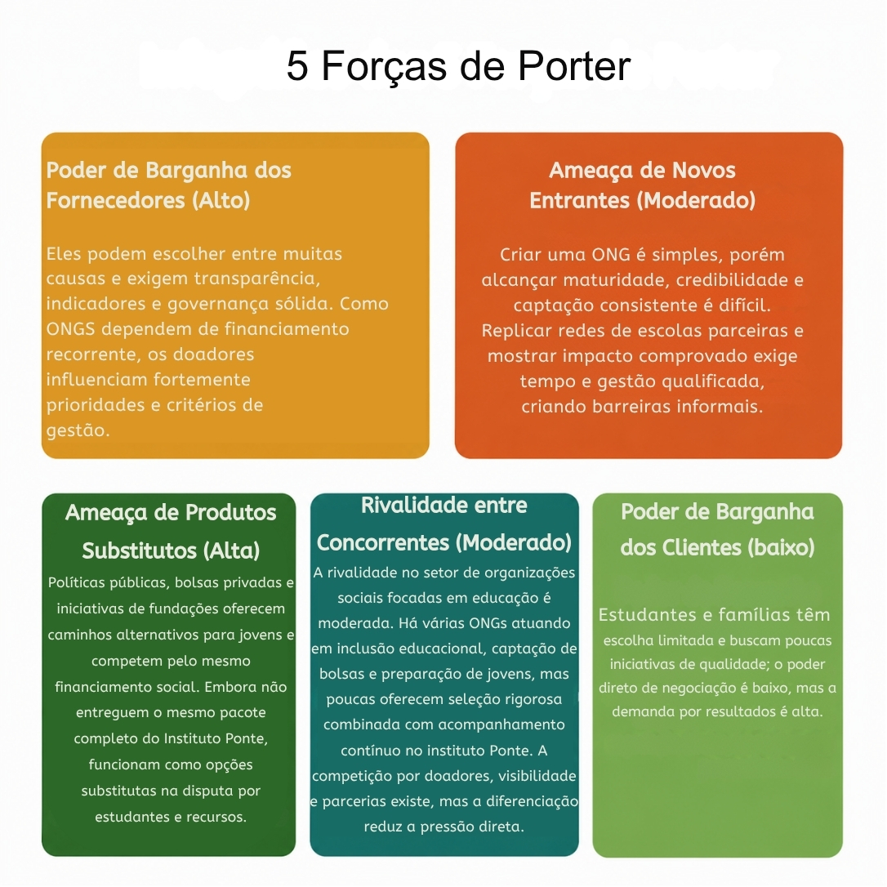
</div>

<div align="center">
  <strong>Figura 1 — 5 Forças de Porter do instituto Ponte.</strong><br><em>Fonte: elaboração própria.</em>
</div>

#### Rivalidade entre Concorrentes
A rivalidade no setor de organizações sociais voltadas à educação é moderada. Observa-se a atuação de diversas ONGs em inclusão educacional, captação de bolsas e preparação de jovens, mas poucas combinam seleção rigorosa com acompanhamento contínuo como o Instituto Ponte. A competição por doadores, visibilidade e parcerias existe, mas a diferenciação tende a reduzir a pressão direta.  
Referências-base: IDIS (2020), Transparência Brasil (2022), OECD (2019).

---

#### Ameaça de Novos Entrantes
A ameaça de novos entrantes é moderada. A criação de uma ONG é simples, mas alcançar maturidade, credibilidade e captação consistente é difícil. Replicar redes de escolas parceiras e demonstrar impacto comprovado exige tempo e gestão qualificada, criando barreiras informais.  
Referências-base: ABONG (2021), Itaú Social (2020), McKinsey (2022).

---

#### Ameaça de Produtos Substitutos
A ameaça de substitutos é alta. Políticas públicas, bolsas privadas e iniciativas de fundações oferecem caminhos alternativos para jovens e competem pelo mesmo financiamento social. Embora não entreguem o mesmo pacote completo do Instituto Ponte, funcionam como opções substitutas na disputa por estudantes e recursos.  
Referências-base: MEC (2023), Fundação Estudar (2023), Fundação Lemann (2022), OECD (2023).

---

#### Poder de Barganha dos Fornecedores
No contexto de uma OSCIP, os fornecedores primários são os doadores institucionais e empresariais, cujo financiamento constitui o principal insumo operacional da organização. O poder de barganha desses fornecedores é alto. Esses agentes podem escolher entre muitas causas e exigem transparência, indicadores e governança sólida. Como as ONGs dependem de financiamento recorrente, os doadores influenciam fortemente prioridades e critérios de gestão.  
Referências-base: IDIS (2022), CAF (2022), GIFE (2021).

---

#### Poder de Barganha dos Clientes
O poder dos beneficiários é baixo. Jovens vulneráveis têm poucas alternativas gratuitas com suporte prolongado, mentoria e acompanhamento acadêmico. A demanda supera muito a oferta, reduzindo a capacidade de barganha das famílias atendidas.  
Referências-base: IPEA (2021), UNICEF (2022), Todos Pela Educação (2023).

### 2.1.2. Análise SWOT do Instituto Ponte

<div align="center">
  
</div>

<div align="center">
  <strong>Figura 2 — Matriz SWOT do Instituto Ponte.</strong><br><em>Fonte: elaboração própria.</em>
</div>

&emsp;Identificou-se no Instituto Ponte posicionamento diferenciado no terceiro setor educacional: a taxa de aprovação de 92% nos vestibulares (INSTITUTO PONTE, 2024) — e o acompanhamento individualizado consolidam-se como diferenciais frente a organizações de maior escala, como Gerando Falcões e Parceiros da Educação. Os 2.375 inscritos anuais no processo seletivo, ante 440 alunos ativos, evidenciam alta demanda reprimida. Constatou-se vulnerabilidade financeira pela dependência de doações privadas e concentração no Espírito Santo. Verificaram-se oportunidades na expansão regional e na agenda ESG corporativa. Como ameaça central, reconheceu-se a disputa crescente por doadores institucionais em cenários de instabilidade econômica.

### 2.1.3. Solução (sprints 1 a 5)

&emsp;A solução é baseada no desenvolvimento de uma aplicação web para o Instituto Ponte, voltada à criação, aplicação e correção de avaliações remotas. Priorizam-se acessibilidade, organização e isonomia no processo avaliativo.

1. **Problema a ser resolvido**  
Verifica-se que o Instituto Ponte não possui uma plataforma centralizada para avaliações remotas. O processo atual, realizado por WhatsApp e e-mail, gera perda de arquivos, desorganização das submissões, correção pouco estruturada e inconsistências no acesso a feedbacks.

2. **Dados disponíveis**  
São atendidos 440 estudantes distribuídos em 18 estados do Brasil, em modelo híbrido (INSTITUTO PONTE, 2024). Esses dados ajudam a dimensionar o público atendido e reforçam a necessidade de uma solução simples e escalável.

3. **Solução proposta**  
Propõe-se uma plataforma web responsiva com interface simplificada, suporte a fórmulas matemáticas via LaTeX, upload estruturado por questão, salvamento automático e painel de correção por item. A solução também gera relatórios de desempenho e feedbacks individuais.

4. **Forma de utilização da solução**  
O acesso ocorre por link único. As questões são respondidas e os arquivos são enviados pelos alunos na própria plataforma. A correção é realizada por questão em um ambiente organizado. O histórico, os relatórios e as métricas são acompanhados pelos coordenadores para apoiar decisões pedagógicas.

5. **Benefícios esperados**  
Espera-se que a dificuldade de uso para alunos seja reduzida, que a perda de progresso seja evitada e que a segurança na navegação seja ampliada. Para docentes, a solução traz mais eficiência e padronização. Para a gestão, garantem-se dados centralizados e relatórios organizados.

6. **Critério de sucesso e avaliação**  
A solução será considerada bem-sucedida se: ≥ 90% dos alunos concluírem a prova sem suporte técnico; 100% das submissões forem persistidas sem perda; o coordenador acessar relatórios automatizados em todas as provas encerradas; e o tempo médio de correção por questão diminuir em relação ao processo manual.

### 2.1.4. Value Proposition Canvas

&emsp;Elaboraram-se três Value Proposition Canvas (VPC), um para cada perfil de usuário do sistema — Alunos, Professores e Coordenadores. Para cada segmento, analisaram-se as tarefas (Customer Jobs), dores (Pains) e ganhos (Gains) do cliente, e mapearam-se os produtos e serviços, aliviadores de dores (Pain Relievers) e criadores de ganhos (Gain Creators) da proposta de valor. O fit entre proposta e perfil é explicitado ao final de cada segmento.

---

#### VPC — Alunos

<div align="center">
  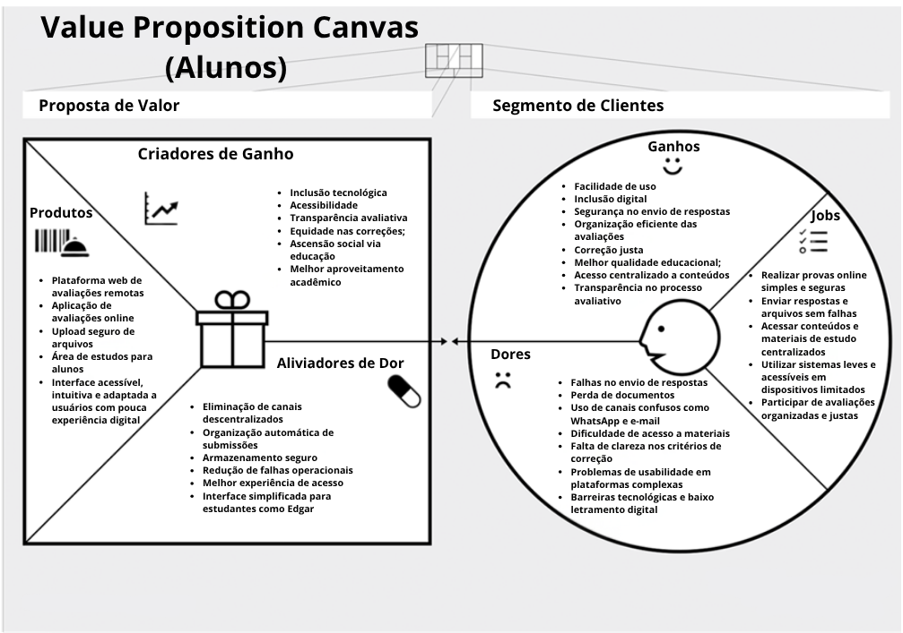
</div>

<div align="center">
  <strong>Figura 3 — Value Proposition Canvas (Alunos) do Instituto Ponte.</strong><br><em>Fonte: elaboração própria.</em>
</div>

##### A. Perfil do Cliente

###### Tarefas do cliente (Customer Jobs)

No contexto da plataforma de avaliação remota, os alunos assumem o papel de participantes ativos do processo avaliativo digital. Ao longo da experiência, as seguintes tarefas são realizadas:

- acessar provas em um ambiente centralizado;
- responder avaliações diretamente na plataforma;
- enviar respostas e arquivos de forma correta;
- acompanhar seu desempenho acadêmico;
- participar de avaliações organizadas e padronizadas.

Na prática, todas as etapas da avaliação são realizadas em um único ambiente, reduzindo a complexidade e facilitando o processo.

---

###### Dores (Pains)

Durante o uso de sistemas tradicionais, os alunos enfrentam dificuldades que impactam sua experiência. Entre as principais dores estão:

- dificuldade no envio de arquivos e respostas;
- insegurança quanto ao sucesso da submissão;
- uso de múltiplos canais desorganizados;
- risco de perda de informações;
- dificuldades tecnológicas;
- falta de clareza no processo avaliativo.

Essas dores são geradoras de ansiedade e prejudicam o desempenho, especialmente em ambientes digitais pouco estruturados.

---

###### Ganhos (Gains)

Com a plataforma, os alunos passam a ter uma experiência mais clara e segura. Entre os principais ganhos estão:

- maior segurança na realização de provas;
- facilidade no envio de respostas;
- acesso centralizado a conteúdos;
- melhor organização das avaliações;
- maior transparência no processo;
- inclusão digital.

Ao final, o aluno consegue focar no aprendizado, sem se preocupar com problemas técnicos ou organizacionais.

---

##### B. Mapa de Valor

###### Produtos e Serviços

A solução oferece:

- sistema de provas online;
- envio seguro de respostas e arquivos;
- interface simples e intuitiva;
- confirmação visual de submissão;
- acompanhamento de resultados e feedbacks.

---

###### Aliviadores de Dores (Pain Relievers)

Para reduzir as dificuldades, a plataforma:

- centraliza todas as atividades em um único ambiente;
- garante armazenamento seguro;
- reduz falhas no envio de arquivos;
- simplifica o uso com uma interface intuitiva.

---

###### Criadores de Ganhos (Gain Creators)

A solução gera valor ao:

- melhorar a experiência do aluno;
- aumentar a confiança no sistema;
- facilitar o acesso ao conteúdo;
- promover um ambiente mais organizado e justo.

&emsp;**Fit entre proposta e perfil:** A dor de insegurança quanto ao sucesso da submissão é diretamente aliviada pela confirmação visual de envio (US11) e pelo salvamento automático de progresso (US10). A dificuldade tecnológica é reduzida pela interface mobile-first (US09) e pelo acesso sem cadastro por link único (US08). O ganho de inclusão digital é criado pela renderização de fórmulas em qualquer dispositivo (RF011) e pelo suporte a uploads de resoluções manuscritas (RF006).

---

#### VPC — Professores

<div align="center">
  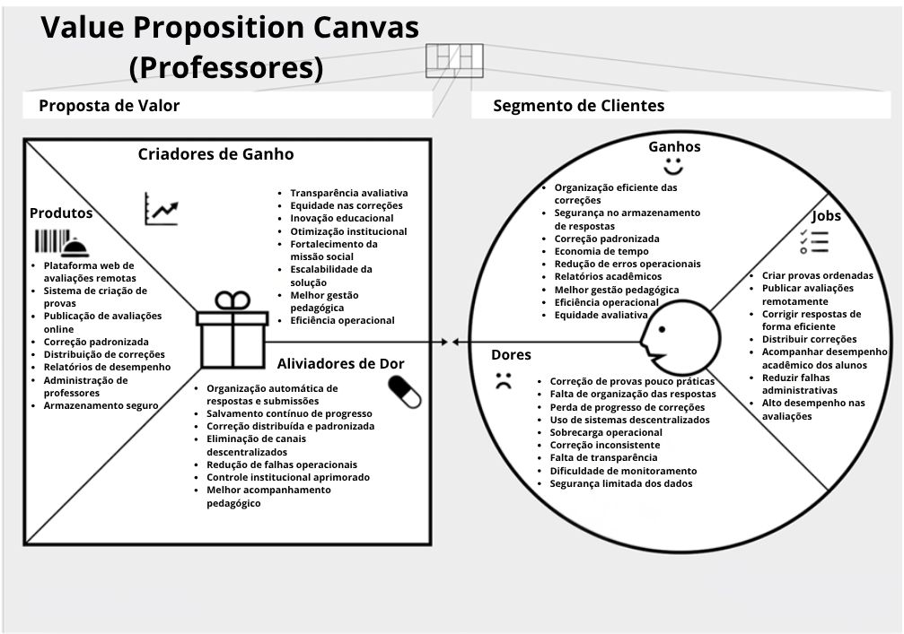
</div>

<div align="center">
  <strong>Figura 4 — Value Proposition Canvas (Professores) do Instituto Ponte.</strong><br><em>Fonte: elaboração própria.</em>
</div>

##### A. Perfil do Cliente

###### Tarefas do cliente (Customer Jobs)

Os professores são responsáveis pela criação e gestão das avaliações. Durante o processo, as seguintes atividades são desempenhadas:

- criar provas e atividades avaliativas;
- organizar e publicar avaliações;
- corrigir respostas dos alunos;
- corrigir avaliações por questão, garantindo isonomia;
- acompanhar o desempenho das turmas.

Na prática, essas tarefas são centralizadas na plataforma, tornando o trabalho mais estruturado e eficiente.

---

###### Dores (Pains)

Sem uma plataforma adequada, os professores enfrentam diversos problemas, como:

- sobrecarga administrativa;
- uso de ferramentas dispersas;
- perda de arquivos;
- falta de padronização nas correções;
- dificuldade em organizar avaliações;
- retrabalho constante.

Essas dificuldades resultam em um processo mais lento e menos eficiente.

---

###### Ganhos (Gains)

Com a solução, os professores passam a ter:

- maior organização das avaliações;
- correção mais eficiente e padronizada;
- redução de erros operacionais;
- economia de tempo;
- melhor acompanhamento dos alunos.

Assim, o professor consegue focar mais no ensino e menos em tarefas operacionais.

---

##### B. Mapa de Valor

###### Produtos e Serviços

A plataforma oferece:

- criação e publicação de provas;
- sistema de correção estruturado por questão;
- armazenamento de avaliações;
- acompanhamento acadêmico.

---

###### Aliviadores de Dores (Pain Relievers)

A solução reduz problemas ao:

- automatizar processos;
- centralizar informações;
- evitar perda de arquivos;
- padronizar correções;
- diminuir a sobrecarga.

---

###### Criadores de Ganhos (Gain Creators)

A plataforma gera benefícios ao:

- aumentar a eficiência do trabalho;
- melhorar a organização;
- facilitar o acompanhamento pedagógico;
- reduzir o tempo gasto em tarefas repetitivas.

&emsp;**Fit entre proposta e perfil:** A dor de falta de padronização nas correções é aliviada pelo módulo de correção por questão (US12), que agrupa todas as respostas de uma mesma questão em sequência. A sobrecarga administrativa é reduzida pela correção automática de questões objetivas (US13) e pela geração de planilhas de resultados (US14). O ganho de eficiência é criado pelo banco de questões reutilizáveis (US05) e pelo editor com suporte a LaTeX (US04).

---

#### VPC — Coordenadores

<div align="center">
  
</div>

<div align="center">
  <strong>Figura 5 — Value Proposition Canvas (Coordenadores) do Instituto Ponte.</strong><br><em>Fonte: elaboração própria.</em>
</div>

##### A. Perfil do Cliente

###### Tarefas do cliente (Customer Jobs)

Aos coordenadores é atribuído um papel estratégico dentro da instituição. As seguintes responsabilidades são exercidas:

- organizar processos avaliativos;
- supervisionar avaliações;
- monitorar desempenho acadêmico;
- acessar relatórios institucionais;
- apoiar decisões pedagógicas;
- garantir segurança e padronização.

Na prática, uma visão ampla e centralizada de toda a operação é proporcionada pela plataforma.

---

###### Dores (Pains)

Entre os principais desafios enfrentados estão:

- falta de centralização de dados;
- dificuldade de monitoramento;
- processos manuais e descentralizados;
- risco de inconsistências;
- dificuldade na tomada de decisão;
- baixa visibilidade dos resultados.

Esses problemas resultam em dificuldades para a gestão eficiente da instituição.

---

###### Ganhos (Gains)

Com a plataforma, os coordenadores passam a ter:

- acesso a dados organizados;
- relatórios automáticos;
- maior controle dos processos;
- melhoria na tomada de decisão;
- aumento da eficiência institucional;
- maior segurança da informação.

Com isso, a gestão é fortalecida e a qualidade dos processos educacionais é melhorada.

---

##### B. Mapa de Valor

###### Produtos e Serviços

A solução inclui:

- painéis administrativos;
- relatórios automáticos;
- armazenamento de dados;
- monitoramento acadêmico;
- gestão centralizada.

---

###### Aliviadores de Dores (Pain Relievers)

A plataforma ajuda ao:

- centralizar informações;
- automatizar relatórios;
- reduzir falhas humanas;
- melhorar o controle dos processos.

---

###### Criadores de Ganhos (Gain Creators)

A solução agrega valor ao:

- melhorar a gestão institucional;
- aumentar a transparência;
- apoiar decisões estratégicas;
- modernizar processos educacionais.

&emsp;**Fit entre proposta e perfil:** A dor de falta de centralização de dados é aliviada pelo painel de visualização de todas as provas (RF018) e pelos relatórios automáticos de desempenho (RF019). A dificuldade de monitoramento é reduzida pelo módulo de logs e analytics (US16), que oferece métricas de participação e desempenho por questão. O ganho de eficiência institucional é criado pela exportação estruturada de resultados em Excel (US14) e pelo histórico de envios de e-mail com status (US15).

---

### 2.1.5. Matriz de Riscos do Projeto

A seção foi estruturada com base no contexto do Instituto Ponte, no escopo da solução e nas restrições formais do TAPI.

#### Critério de classificação

A classificação foi definida pela combinação entre probabilidade e impacto, priorizando os riscos mais prováveis e com maior efeito sobre o cumprimento do escopo, do prazo e da qualidade da solução. Foram considerados os tipos esperados para este projeto: tecnológicos, de usuário, de negócio, de conteúdo e ético/regulatórios. A resposta foi descrita em três frentes: mitigação, prevenção e plano contingencial.

#### Matriz de riscos

<div align="center">
  
</div>

<div align="center">
  <strong>Figura 6 — Matriz de Risco do Instituto Ponte.</strong><br><em>Fonte: elaboração própria.</em>
</div>

| Risco | Tipo | Descrição | Probabilidade | Impacto | Classificação | Plano de resposta | Responsável |
|---|---|---|---|---|---|---|---|
| **A01 — Dificuldade de uso em cenários de acesso digital limitado** | Usuário / tecnológico | O público atendido pelo Instituto Ponte está distribuído em 18 estados e em contexto de vulnerabilidade social, o que pode gerar condições heterogêneas de uso e dificultar a realização da prova remota por parte de alguns alunos. | 70 | Muito Alto | Alta prioridade | **Mitigação:** interface simples, com fluxo curto e instruções claras; **Prevenção:** validação de usabilidade com foco no público-alvo; **Contingência:** orientação ao parceiro para disponibilizar janela de aplicação mais ampla quando necessário. | Equipe de UX e front-end |
| **A02 — Complexidade das funcionalidades de prova com equações e uploads** | Tecnológico / conteúdo | O escopo prevê suporte nativo a equações e envio de arquivos, o que amplia a complexidade da implementação e aumenta o risco de inconsistência entre o editor, a visualização e a submissão. | 70 | Alto | Alta prioridade | **Mitigação:** desenvolvimento incremental por entregas; **Prevenção:** priorização do fluxo mínimo de prova no MVP; **Contingência:** redução temporária de recursos secundários caso a integração comprometa a estabilidade. | Equipe de desenvolvimento |
| **A03 — Falhas no fluxo de submissão de respostas e anexos** | Tecnológico | Como a solução depende do envio de respostas e arquivos de resolução, qualquer falha nesse fluxo pode comprometer a integridade da prova e gerar retrabalho para o aluno e para o professor. | 50 | Muito Alto | Alta prioridade | **Mitigação:** validações de formulário e confirmação explícita de envio; **Prevenção:** testes do fluxo completo de submissão; **Contingência:** registro de falhas e reenvio orientado pelo sistema. | Equipe de back-end |
| **A04 — Dificuldade na correção por item** | Negócio / usuário | A proposta inclui organização da correção por itens da avaliação. Se a navegação entre questões não for clara, o ganho de padronização da correção pode ser reduzido. | 50 | Alto | Média-alta prioridade | **Mitigação:** arquitetura de navegação simples entre itens; **Prevenção:** revisão do fluxo com o parceiro antes da entrega final; **Contingência:** ajustes no agrupamento das respostas conforme o uso real. | Equipe de produto e validação com o parceiro |
| **A05 — Atraso na entrega das funcionalidades centrais** | Negócio / tecnológico | O projeto reúne criação de prova, submissão do aluno e painel de correção em um único produto, o que pode pressionar o cronograma e afetar a conclusão das entregas prioritárias. | 50 | Moderado | Média prioridade | **Mitigação:** divisão do escopo em incrementos; **Prevenção:** priorização do MVP e controle das sprints; **Contingência:** corte controlado de funcionalidades não essenciais. | Gestão do grupo |
| **A06 — Identificação não autenticada no fluxo do aluno** | Ético/regulatório / negócio | O acesso dos alunos ocorre por identificação simples (nome, CPF e e-mail), sem autenticação forte. Embora professores e coordenadores utilizem OAuth2 Google, o fluxo do aluno permanece sem verificação de identidade robusta, o que pode permitir submissões com dados falsos ou acesso não autorizado a provas por link. | 50 | Alto | Média-alta prioridade | **Mitigação:** registrar o acesso de forma transparente dentro do fluxo definido; **Prevenção:** documentar claramente o procedimento de uso; **Contingência:** adotar conferência manual quando o parceiro julgar necessário. | Equipe de produto e parceiro |
| **A07 — Limitação de expansão por ausência de APIs externas** | Negócio | Como o projeto não contempla integração com WebAPIs externas, a evolução futura da solução pode ficar limitada a funcionalidades internas da própria aplicação. | 50 | Moderado | Média prioridade | **Mitigação:** organizar a arquitetura com contratos internos bem definidos; **Prevenção:** documentar pontos de extensão; **Contingência:** tratar integrações futuras como evolução fora do escopo atual. | Equipe de back-end |
| **A08 — Ausência de mecanismos de proctoring** | Ético/regulatório | O TAPI exclui bloqueio de navegador e monitoramento por câmera. A solução, portanto, prioriza acessibilidade, mas não oferece meios de supervisão avançada durante a aplicação da prova. | 50 | Moderado | Média prioridade | **Mitigação:** reforçar a clareza das regras de aplicação com o parceiro; **Prevenção:** manter o escopo aderente ao TAPI; **Contingência:** eventual adoção de procedimentos manuais de supervisão pela instituição. | Parceiro e equipe de alinhamento |
| **O01 — Ampliação do alcance da solução para contextos semelhantes** | Negócio | A estrutura do Instituto Ponte e o problema enfrentado pelo parceiro indicam uma demanda que pode ser compartilhada por outras organizações com realidade educacional parecida. | 50 | Alto | Alta oportunidade | **Aproveitamento:** manter a solução simples, adaptável e documentada para facilitar futuras adaptações. | Equipe de produto |
| **O02 — Fortalecimento da padronização da correção** | Negócio / usuário | A organização da correção por item pode aumentar a consistência do processo avaliativo e reduzir dispersões entre professores. | 70 | Moderado | Alta oportunidade | **Aproveitamento:** destacar o painel de correção por questão como fluxo principal da experiência do professor. | Equipe de UX e back-end |
| **O03 — Melhoria da experiência avaliativa com suporte a equações e uploads** | Tecnológico / conteúdo | O suporte a equações e anexos permite uma prova mais próxima das necessidades reais de avaliação do parceiro e amplia a utilidade pedagógica da solução. | 50 | Moderado | Média oportunidade | **Aproveitamento:** integrar os recursos de forma estável e com linguagem visual consistente. | Equipe de front-end |
| **O04 — Ganho reputacional pela entrega de uma solução aderente ao contexto social do parceiro** | Negócio / ético | Uma solução coerente com acessibilidade, simplicidade e equidade pode reforçar o valor institucional do projeto junto ao parceiro. | 50 | Moderado | Média oportunidade | **Aproveitamento:** registrar as decisões de projeto e os resultados obtidos para uso em documentação e apresentação final. | Gestão do grupo |

## 2.2. Personas

&emsp;Foram elaboradas três proto-personas representando os perfis de usuários do sistema: Edgar Romeo (aluno), estudante com baixo letramento digital que necessita de interface simples e intuitiva; Ronaldo Silva (professor), docente experiente que busca eficiência e organização no processo de correção; e Valéria dos Santos (coordenadora), profissional com alto domínio digital que depende de dados estruturados para apoiar decisões pedagógicas. As personas são hipotéticas e foram construídas a partir do contexto institucional do Instituto Ponte e dos dados do TAPI (INSTITUTO PONTE, 2024).


<div align="center">
  
</div>

<div align="center">
  <strong>Figura 7 — Persona do Aluno.</strong><br><em>Foto de <a href="https://unsplash.com/pt-br/@sooprun?utm_source=unsplash&utm_medium=referral&utm_content=creditCopyText">Alex Suprun</a> na <a href="https://unsplash.com/pt-br/fotografias/man-in-black-button-up-shirt-ZHvM3XIOHoE?utm_source=unsplash&utm_medium=referral&utm_content=creditCopyText">Unsplash</a>
      </em>
</div>


<div align="center">
  
</div>

<div align="center">
  <strong>Figura 8 — Persona do Professor.</strong><br><em>Foto de <a href="https://unsplash.com/pt-br/@lancereis?utm_source=unsplash&utm_medium=referral&utm_content=creditCopyText">Lance Reis</a> na <a href="https://unsplash.com/pt-br/fotografias/um-homem-com-barba-pp76Y6Fq6xw?utm_source=unsplash&utm_medium=referral&utm_content=creditCopyText">Unsplash</a>
      </em>
</div>


<div align="center">
  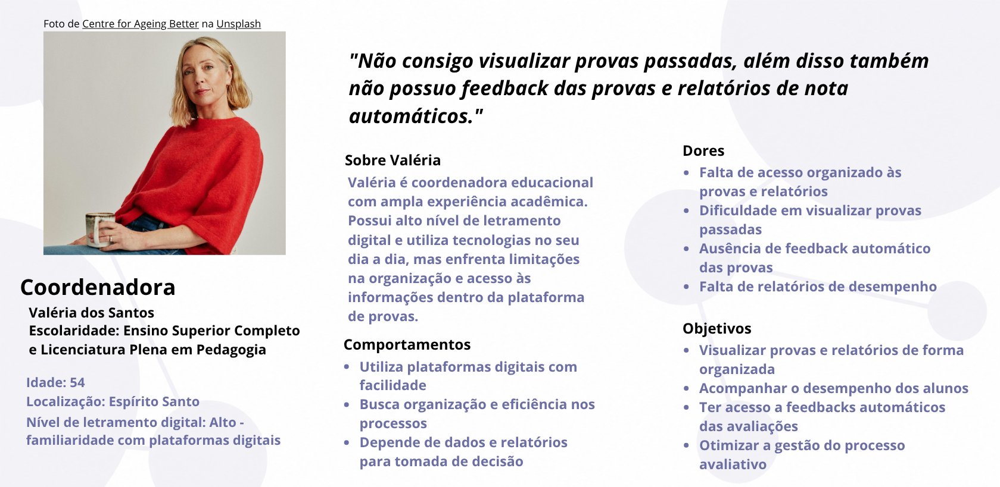
</div>

<div align="center">
  <strong>Figura 9 — Persona da Coordenadora.</strong><br><em>Fonte: Foto de <a href="https://unsplash.com/pt-br/@ageing_better?utm_source=unsplash&utm_medium=referral&utm_content=creditCopyText">Centre for Ageing Better</a> na <a href="https://unsplash.com/pt-br/fotografias/uma-mulher-sentada-em-uma-cadeira-segurando-uma-xicara-de-cafe--UPMX2uynvA?utm_source=unsplash&utm_medium=referral&utm_content=creditCopyText">Unsplash</a>
      </em>
</div>

### 2.2.1 Mapa de Empatia de uma persona

#### Mapa de Empatia — Professor do Ensino Médio (Ronaldo Silva)

<div align="center">
  
</div>

<div align="center">
  <strong>Figura 10 — Mapa de sentimento de persona.</strong><br><em>Fonte: elaboração própria.</em>
</div>

#### Visão Geral
Este mapa de empatia representa o perfil de Ronaldo Silva, professor do Ensino Médio, e tem como objetivo compreender suas necessidades, dores e comportamentos no processo de correção de provas. A análise auxilia na definição de soluções mais eficientes para plataformas de avaliação.

---

#### Dados Demográficos
- Idade: 40 anos  
- Renda: R$ 5.000/mês  
- Escolaridade: Ensino Superior Completo  
- Localização: Espírito Santo  
- Nível de letramento digital: Alto  

---

#### O que pensa?
Ronaldo frequentemente reflete sobre a eficiência e segurança do processo de correção:
- Dúvidas sobre a organização das respostas  
- Preocupação com perda de progresso  
- Busca por métodos mais rápidos e práticos  
- Questionamentos sobre justiça na avaliação dos alunos  

---

#### O que sente?
Durante o processo atual, ele experimenta:
- Frustração com ferramentas pouco eficientes  
- Insegurança ao corrigir sem organização clara  
- Ansiedade devido a prazos e volume de provas  
- Sobrecarga por tarefas repetitivas  

---

#### O que diz?
Algumas falas comuns que refletem sua experiência:
> "O método atual de correção é muito ruim."  
> "Não tenho acesso às respostas de forma organizada."  
> "Quando a página atualiza, eu perco meu progresso."  
> "Corrigir prova assim dá muito trabalho."

---

#### O que faz?
No cenário atual, Ronaldo:
- Corrige provas manualmente ou em arquivos digitais  
- Utiliza planilhas para organizar notas  
- Revisa respostas múltiplas vezes  
- Salva frequentemente para evitar perdas  
- Usa ferramentas externas como WhatsApp e e-mail  

---

#### Objetivos
Ronaldo busca:
- Organizar e facilitar a correção das provas  
- Reduzir o tempo gasto com correções  
- Ter clareza e estrutura nas respostas dos alunos  
- Garantir avaliações justas e consistentes  
- Acessar relatórios detalhados de desempenho  

---

#### Dores
Os principais problemas enfrentados incluem:
- Processo de correção pouco prático  
- Falta de organização das respostas  
- Risco de perda de progresso  
- Grande volume de provas para corrigir  
- Dificuldade em comparar respostas  
- Uso de múltiplas ferramentas desconectadas  

---

#### Necessidades
Com base nas dores e objetivos, surgem oportunidades claras:
- Sistema de correção por questão (visão agrupada)  
- Salvamento automático de progresso  
- Interface simples e intuitiva  
- Centralização de informações em um único sistema  
- Geração automática de relatórios

---

#### Conclusão
O mapa de empatia evidencia que o professor precisa de uma solução que reduza a complexidade operacional, aumente a confiabilidade do sistema e melhore a organização das informações.  
Esses pontos são essenciais para orientar o desenvolvimento de uma plataforma de avaliação mais eficiente.

## 2.3. User Stories (sprints 1 a 5)

<table>
  <tr><td><strong>Número</strong></td><td>US01</td></tr>
  <tr><td><strong>Título</strong></td><td>Autenticação de professores e coordenadores.</td></tr>
  <tr><td><strong>Persona</strong></td><td>Coordenador ou Professor.</td></tr>
  <tr><td><strong>Nota técnica</strong></td><td>O TAPI estabelece ausência de login/senha para acesso à plataforma. Essa restrição aplica-se ao fluxo do <strong>aluno</strong>, que acessa via link único sem credenciais. Para <strong>Professor e Coordenador</strong> — usuários internos com acesso a dados avaliativos sensíveis — optou-se pela autenticação OAuth2 via Google, que não constitui sistema de login/senha tradicional e atende à restrição de acessibilidade do TAPI ao eliminar o gerenciamento de senhas.</td></tr>
  <tr><td><strong>História</strong></td><td>Eu, enquanto <strong>Coordenador ou Professor</strong>, quero utilizar minha conta Google para realizar o Login na plataforma.</td></tr>
  <tr>
    <td><strong>Critérios de Aceitação</strong></td>
    <td>
      <strong>CR-01</strong> - somente usuários internos autorizados podem acessar o sistema.<br>
      <strong>Validação:</strong> o e-mail autenticado deve pertencer à lista de usuários autorizados.<br><br>
      <strong>CR-02</strong> - o sistema deve direcionar o usuário para o painel correspondente ao seu perfil.<br>
      Perfis possíveis: { "Coordenador", "Professor" }.<br><br>
      <strong>CR-03</strong> - usuários com sessão encerrada não podem acessar páginas protegidas sem novo login.
    </td>
  </tr>
  <tr>
    <td><strong>Testes de Aceitação</strong></td>
    <td>
      <strong>Critério de aceitação: CR-01</strong><br>
      a. Professor autorizado faz login com Google.<br>
      – Acessou o sistema = correto.<br>
      – Teve acesso negado = errado, deve ser corrigido.<br><br>
      b. Usuário não autorizado tenta fazer login com Google.<br>
      – Acessou o sistema = errado, deve ser corrigido.<br>
      – Teve acesso negado = correto.<br><br>
      <strong>Critério de aceitação: CR-02</strong><br>
      a. Coordenador autorizado realiza login.<br>
      – Foi direcionado para o painel do coordenador = correto.<br>
      – Foi direcionado para painel incorreto = errado, deve ser corrigido.<br><br>
      b. Professor autorizado realiza login.<br>
      – Foi direcionado para o painel do professor = correto.<br>
      – Foi direcionado para painel incorreto = errado, deve ser corrigido.<br><br>
      <strong>Critério de aceitação: CR-03</strong><br>
      a. Usuário autenticado encerra a sessão e tenta acessar página protegida.<br>
      – Foi redirecionado para login = correto.<br>
      – Acessou a página protegida = errado, deve ser corrigido.
    </td>
  </tr>
  <tr>
    <td><strong>Critérios INVEST</strong></td>
    <td>
      <strong>Independente:</strong> Pode ser desenvolvida e entregue sem depender de nenhuma outra história; o mecanismo de autenticação OAuth com Google é autocontido.<br><br>
      <strong>Negociável:</strong> O provedor de autenticação (Google) e o mecanismo de lista de usuários autorizados podem ser renegociados com o time sem alterar o objetivo da história.<br><br>
      <strong>Valorosa:</strong> Garante que apenas pessoas autorizadas acessem o sistema, protegendo dados sensíveis de avaliação e direcionando cada usuário ao seu contexto correto.<br><br>
      <strong>Estimável:</strong> O escopo é claro — OAuth2 com Google, validação de e-mail e roteamento por perfil — permitindo estimativa objetiva pelo time.<br><br>
      <strong>Pequena:</strong> Cobre apenas o fluxo de login e redirecionamento, sem incluir gestão de usuários ou permissões granulares, cabendo em uma sprint.<br><br>
      <strong>Testável:</strong> Os critérios de aceitação definem cenários objetivos com resultado esperado claro (acesso permitido/negado, painel correto, bloqueio de sessão encerrada).
    </td>
  </tr>
</table>

---

<table>
  <tr><td><strong>Número</strong></td><td>US02</td></tr>
  <tr><td><strong>Título</strong></td><td>Gestão de provas por status e filtros.</td></tr>
  <tr><td><strong>Persona</strong></td><td>Professor.</td></tr>
  <tr><td><strong>História</strong></td><td>Eu, enquanto <strong>Professor</strong>, quero visualizar provas antigas, rascunhos e encerradas com filtros, para encontrar rapidamente avaliações do processo seletivo.</td></tr>
  <tr>
    <td><strong>Critérios de Aceitação</strong></td>
    <td>
      <strong>CR-01</strong> - as provas devem ser exibidas separadas por status.<br>
      Status possíveis: { "Rascunho", "Publicada", "Encerrada", "Antiga" }.<br><br>
      <strong>CR-02</strong> - o professor deve conseguir filtrar provas por turma, semestre, disciplina ou professor.<br><br>
      <strong>CR-03</strong> - quando nenhum resultado for encontrado, o sistema deve exibir uma mensagem de estado vazio.
    </td>
  </tr>
  <tr>
    <td><strong>Testes de Aceitação</strong></td>
    <td>
      <strong>Critério de aceitação: CR-01</strong><br>
      a. Professor acessa a home com provas em diferentes status.<br>
      – Provas aparecem separadas por status = correto.<br>
      – Provas aparecem misturadas sem identificação = errado, deve ser corrigido.<br><br>
      <strong>Critério de aceitação: CR-02</strong><br>
      a. Professor aplica filtro por disciplina "Matemática".<br>
      – Sistema exibe apenas provas de Matemática = correto.<br>
      – Sistema exibe provas de outras disciplinas = errado, deve ser corrigido.<br><br>
      b. Professor aplica filtro por semestre "2026.1".<br>
      – Sistema exibe apenas provas do semestre selecionado = correto.<br>
      – Sistema exibe provas de outros semestres = errado, deve ser corrigido.<br><br>
      <strong>Critério de aceitação: CR-03</strong><br>
      a. Professor aplica filtros sem resultados compatíveis.<br>
      – Sistema exibe mensagem de estado vazio = correto.<br>
      – Sistema exibe lista vazia sem explicação = errado, deve ser corrigido.
    </td>
  </tr>
  <tr>
    <td><strong>Critérios INVEST</strong></td>
    <td>
      <strong>Independente:</strong> A listagem e filtragem de provas não depende de outras histórias; pode ser desenvolvida com dados mockados mesmo antes do editor de provas estar pronto.<br><br>
      <strong>Negociável:</strong> Os filtros disponíveis (turma, semestre, disciplina, professor) e a forma de exibição por status podem ser ajustados conforme feedback do professor sem alterar o valor central.<br><br>
      <strong>Valorosa:</strong> Permite ao professor localizar rapidamente qualquer avaliação, reduzindo tempo gasto em navegação e aumentando a produtividade no gerenciamento do processo seletivo.<br><br>
      <strong>Estimável:</strong> Listagem com agrupamento por status e filtros client/server-side têm complexidade conhecida, possibilitando estimativa pelo time de desenvolvimento.<br><br>
      <strong>Pequena:</strong> Limita-se à visualização e filtragem, sem edição ou criação de provas, sendo entregável de forma isolada em uma sprint.<br><br>
      <strong>Testável:</strong> Cada critério possui cenários com entrada e saída definidas, como filtro por disciplina exibindo apenas provas correspondentes ou mensagem de estado vazio.
    </td>
  </tr>
</table>

---

<table>
  <tr><td><strong>Número</strong></td><td>US03</td></tr>
  <tr><td><strong>Título</strong></td><td>Criação rápida de prova pela home.</td></tr>
  <tr><td><strong>Persona</strong></td><td>Professor.</td></tr>
  <tr><td><strong>História</strong></td><td>Eu, enquanto <strong>Professor</strong>, quero criar uma nova prova diretamente da home, para iniciar rapidamente uma avaliação do processo seletivo.</td></tr>
  <tr>
    <td><strong>Critérios de Aceitação</strong></td>
    <td>
      <strong>CR-01</strong> - a home deve possuir uma ação visível para criação de nova prova.<br><br>
      <strong>CR-02</strong> - o professor deve preencher os dados iniciais obrigatórios da prova.<br>
      Campos obrigatórios: { "Nome", "Modalidade", "Disciplina", "Turma", "Semestre" }.<br><br>
      <strong>CR-03</strong> - toda prova criada inicialmente deve ser salva como rascunho.
    </td>
  </tr>
  <tr>
    <td><strong>Testes de Aceitação</strong></td>
    <td>
      <strong>Critério de aceitação: CR-01</strong><br>
      a. Professor acessa a home e clica em "Criar prova".<br>
      – Foi levado ao formulário de criação = correto.<br>
      – Permaneceu na home sem resposta = errado, deve ser corrigido.<br><br>
      <strong>Critério de aceitação: CR-02</strong><br>
      a. Professor preenche todos os campos obrigatórios e salva.<br>
      – Sistema permite salvar = correto.<br>
      – Sistema bloqueia sem motivo = errado, deve ser corrigido.<br><br>
      b. Professor tenta salvar sem preencher disciplina.<br>
      – Sistema bloqueia e indica campo obrigatório = correto.<br>
      – Sistema salva a prova incompleta = errado, deve ser corrigido.<br><br>
      <strong>Critério de aceitação: CR-03</strong><br>
      a. Professor cria uma prova e sai antes de publicar.<br>
      – Prova permanece disponível como rascunho = correto.<br>
      – Prova desaparece do sistema = errado, deve ser corrigido.
    </td>
  </tr>
  <tr>
    <td><strong>Critérios INVEST</strong></td>
    <td>
      <strong>Independente:</strong> O formulário de criação inicial pode ser desenvolvido antes do editor completo de questões; a prova é salva como rascunho e o editor pode ser implementado em outra história.<br><br>
      <strong>Negociável:</strong> Os campos obrigatórios e o ponto de entrada (botão na home) podem ser ajustados sem comprometer o objetivo de iniciar a criação de forma rápida.<br><br>
      <strong>Valorosa:</strong> Reduz o atrito para iniciar uma nova avaliação, permitindo que o professor comece o trabalho sem precisar navegar por menus complexos.<br><br>
      <strong>Estimável:</strong> Formulário com validação de campos obrigatórios e persistência como rascunho é bem delimitado e estimável pelo time.<br><br>
      <strong>Pequena:</strong> Cobre apenas a criação dos metadados iniciais da prova (sem editor de questões), entregável em uma única sprint.<br><br>
      <strong>Testável:</strong> Os cenários validam ausência de campos obrigatórios, fluxo de navegação e persistência como rascunho com resultados binários claros.
    </td>
  </tr>
</table>

---

<table>
  <tr><td><strong>Número</strong></td><td>US04</td></tr>
  <tr><td><strong>Título</strong></td><td>Editor de questões com fórmulas e tipos variados.</td></tr>
  <tr><td><strong>Persona</strong></td><td>Professor.</td></tr>
  <tr><td><strong>História</strong></td><td>Eu, enquanto <strong>Professor</strong>, quero criar questões com enunciados, fórmulas e diferentes tipos de resposta, para montar provas adequadas a disciplinas como Matemática e Português.</td></tr>
  <tr>
    <td><strong>Critérios de Aceitação</strong></td>
    <td>
      <strong>CR-01</strong> - o professor deve poder criar questões dos tipos múltipla escolha, verdadeiro/falso e discursiva.<br><br>
      <strong>CR-02</strong> - enunciados com LaTeX devem ser renderizados corretamente na pré-visualização.<br><br>
      <strong>CR-03</strong> - questões discursivas devem permitir configuração de limite de palavras ou caracteres.<br><br>
      <strong>CR-04</strong> - o sistema deve impedir a publicação de provas com questões incompletas.
    </td>
  </tr>
  <tr>
    <td><strong>Testes de Aceitação</strong></td>
    <td>
      <strong>Critério de aceitação: CR-01</strong><br>
      a. Professor cria questão de múltipla escolha.<br>
      – Questão foi criada = correto.<br>
      – Sistema recusou o tipo válido = errado, deve ser corrigido.<br><br>
      b. Professor cria questão discursiva.<br>
      – Questão foi criada = correto.<br>
      – Sistema recusou o tipo válido = errado, deve ser corrigido.<br><br>
      <strong>Critério de aceitação: CR-02</strong><br>
      a. Professor insere fórmula em LaTeX no enunciado.<br>
      – Fórmula foi renderizada corretamente = correto.<br>
      – Fórmula apareceu quebrada ou como texto bruto = errado, deve ser corrigido.<br><br>
      <strong>Critério de aceitação: CR-03</strong><br>
      a. Professor define limite de 500 caracteres em questão discursiva.<br>
      – Interface do aluno respeita o limite = correto.<br>
      – Aluno consegue ultrapassar o limite sem aviso = errado, deve ser corrigido.<br><br>
      <strong>Critério de aceitação: CR-04</strong><br>
      a. Professor tenta publicar prova com questão sem enunciado.<br>
      – Sistema impede publicação e indica o erro = correto.<br>
      – Sistema publica a prova incompleta = errado, deve ser corrigido.
    </td>
  </tr>
  <tr>
    <td><strong>Critérios INVEST</strong></td>
    <td>
      <strong>Independente:</strong> O editor de questões pode ser construído de forma isolada, sem depender da publicação ou da distribuição da prova, que são histórias separadas.<br><br>
      <strong>Negociável:</strong> A quantidade de tipos de questão, bibliotecas de renderização LaTeX e regras de limite de caracteres são decisões negociáveis conforme viabilidade técnica.<br><br>
      <strong>Valorosa:</strong> Permite criar avaliações ricas e adequadas a disciplinas exatas e humanas, sendo o núcleo funcional da plataforma para o professor.<br><br>
      <strong>Estimável:</strong> Apesar da complexidade do LaTeX, as bibliotecas existentes (ex.: MathJax/KaTeX) têm comportamento previsível, tornando a história estimável.<br><br>
      <strong>Pequena:</strong> Esta história pode ser dividida caso necessário (ex.: tipos de questão em uma sprint, renderização LaTeX em outra), mas como definida cobre escopo coeso.<br><br>
      <strong>Testável:</strong> Cada critério tem cenário claro: renderização de fórmula, bloqueio de publicação incompleta e respeito ao limite de caracteres são verificáveis objetivamente.
    </td>
  </tr>
</table>

---

<table>
  <tr><td><strong>Número</strong></td><td>US05</td></tr>
  <tr><td><strong>Título</strong></td><td>Banco de questões.</td></tr>
  <tr><td><strong>Persona</strong></td><td>Professor.</td></tr>
  <tr><td><strong>História</strong></td><td>Eu, enquanto <strong>Professor</strong>, quero reutilizar questões de um banco, para montar provas com mais rapidez e consistência.</td></tr>
  <tr>
    <td><strong>Critérios de Aceitação</strong></td>
    <td>
      <strong>CR-01</strong> - o professor deve conseguir buscar questões por disciplina, tema ou tipo.<br><br>
      <strong>CR-02</strong> - questões selecionadas do banco devem ser adicionadas ao editor da prova.
    </td>
  </tr>
  <tr>
    <td><strong>Testes de Aceitação</strong></td>
    <td>
      <strong>Critério de aceitação: CR-01</strong><br>
      a. Professor filtra questões por disciplina "Matemática".<br>
      – Sistema exibe questões de Matemática = correto.<br>
      – Sistema exibe questões de outras disciplinas sem relação = errado, deve ser corrigido.<br><br>
      b. Professor filtra questões por tipo "Discursiva".<br>
      – Sistema exibe apenas questões discursivas = correto.<br>
      – Sistema exibe múltipla escolha ou verdadeiro/falso = errado, deve ser corrigido.<br><br>
      <strong>Critério de aceitação: CR-02</strong><br>
      a. Professor seleciona questão do banco e adiciona à prova.<br>
      – Questão aparece no editor da avaliação = correto.<br>
      – Questão não aparece na prova = errado, deve ser corrigido.
    </td>
  </tr>
  <tr>
    <td><strong>Critérios INVEST</strong></td>
    <td>
      <strong>Independente:</strong> O banco de questões é um módulo separado do editor; pode ser desenvolvido e populado independentemente, com integração ao editor feita por API.<br><br>
      <strong>Negociável:</strong> Os filtros de busca (disciplina, tema, tipo) e a forma de exibição das questões são aspectos negociáveis sem perda do valor da história.<br><br>
      <strong>Valorosa:</strong> Economiza tempo do professor ao permitir reaproveitamento de questões já validadas, aumentando a consistência e agilidade na montagem de provas.<br><br>
      <strong>Estimável:</strong> Busca com filtros é padrão e com complexidade bem conhecida, tornando a estimativa viável pelo time.<br><br>
      <strong>Pequena:</strong> Cobre apenas busca e adição de questões ao editor, sem incluir criação ou edição de questões no banco, mantendo o escopo controlado.<br><br>
      <strong>Testável:</strong> Os cenários de busca por filtro e adição ao editor têm resultados verificáveis objetivamente.
    </td>
  </tr>
</table>

---

<table>
  <tr><td><strong>Número</strong></td><td>US06</td></tr>
  <tr><td><strong>Título</strong></td><td>Configuração de tempo, datas e embaralhamento.</td></tr>
  <tr><td><strong>Persona</strong></td><td>Professor.</td></tr>
  <tr><td><strong>História</strong></td><td>Eu, enquanto <strong>Professor</strong>, quero configurar tempo, datas limite e embaralhamento, para controlar a aplicação da prova de forma justa.</td></tr>
  <tr>
    <td><strong>Critérios de Aceitação</strong></td>
    <td>
      <strong>CR-01</strong> - o professor deve definir data e horário de início e término da prova, seguindo obrigatoriamente o Horário de Brasília (GMT-3).<br><br>
      <strong>CR-02</strong> - o sistema deve respeitar o limite de tempo definido para cada aluno.<br><br>
      <strong>CR-03</strong> - o sistema deve permitir embaralhamento de questões ou alternativas.<br><br>
      <strong>CR-04</strong> - provas encerradas não devem aceitar novas submissões.
    </td>
  </tr>
  <tr>
    <td><strong>Testes de Aceitação</strong></td>
    <td>
      <strong>Critério de aceitação: CR-01</strong><br>
      a. Aluno tenta acessar a prova antes da data de início.<br>
      – Sistema bloqueia o acesso ou informa indisponibilidade = correto.<br>
      – Sistema permite iniciar a prova = errado, deve ser corrigido.<br><br>
      b. Aluno acessa a prova dentro do período permitido.<br>
      – Sistema permite iniciar a prova = correto.<br>
      – Sistema bloqueia o acesso = errado, deve ser corrigido.<br><br>
      c. Aluno em fuso horário diferente tenta acessar a prova.<br>
      – Sistema valida o acesso com base no Horário de Brasília configurado no servidor = correto.<br>
      – Sistema permite acesso antecipado ou tardio baseado no relógio local do dispositivo do aluno = errado, deve ser corrigido.<br><br>
      <strong>Critério de aceitação: CR-02</strong><br>
      a. Professor define limite de 60 minutos e aluno inicia a prova.<br>
      – Contador inicia em 60 minutos = correto.<br>
      – Prova inicia sem contador = errado, deve ser corrigido.<br><br>
      <strong>Critério de aceitação: CR-03</strong><br>
      a. Dois alunos acessam prova com embaralhamento ativado.<br>
      – Ordem das questões ou alternativas pode aparecer diferente = correto.<br>
      – Ordem permanece fixa mesmo com embaralhamento ativo = errado, deve ser corrigido.<br><br>
      <strong>Critério de aceitação: CR-04</strong><br>
      a. Aluno tenta enviar respostas após encerramento da prova.<br>
      – Sistema impede nova submissão = correto.<br>
      – Sistema aceita a submissão atrasada = errado, deve ser corrigido.
    </td>
  </tr>
  <tr>
    <td><strong>Critérios INVEST</strong></td>
    <td>
      <strong>Independente:</strong> As configurações de tempo e embaralhamento são atributos da prova, independentes do editor de questões e do fluxo do aluno, podendo ser desenvolvidas separadamente.<br><br>
      <strong>Negociável:</strong> A granularidade do timer, a opção de embaralhar apenas alternativas ou também questões, e o comportamento ao encerrar o tempo são decisões negociáveis.<br><br>
      <strong>Valorosa:</strong> Garante isonomia na aplicação da prova, impedindo acesso fora do prazo e variando a ordem das questões para reduzir cola entre candidatos.<br><br>
      <strong>Estimável:</strong> Controle de datas com fuso horário fixo (GMT-3), timer regressivo e lógica de embaralhamento são funcionalidades com complexidade conhecida e estimável.<br><br>
      <strong>Pequena:</strong> Restringe-se às configurações da prova sem alterar o editor ou o portal do aluno, sendo entregável de forma coesa em uma sprint.<br><br>
      <strong>Testável:</strong> Todos os cenários têm condições objetivas: bloqueio por data/hora, contagem regressiva iniciada corretamente e ordem variável entre alunos são verificáveis.
    </td>
  </tr>
</table>

---

<table>
  <tr><td><strong>Número</strong></td><td>US07</td></tr>
  <tr><td><strong>Título</strong></td><td>Publicação por URL e QR Code.</td></tr>
  <tr><td><strong>Persona</strong></td><td>Professor.</td></tr>
  <tr><td><strong>História</strong></td><td>Eu, enquanto <strong>Professor</strong>, quero gerar uma URL e um QR Code da prova, para distribuir o acesso aos candidatos sem uso de senha.</td></tr>
  <tr>
    <td><strong>Critérios de Aceitação</strong></td>
    <td>
      <strong>CR-01</strong> - ao publicar uma prova válida, o sistema deve gerar um link único de acesso.<br><br>
      <strong>CR-02</strong> - o sistema deve gerar QR Code correspondente ao link da prova.<br><br>
      <strong>CR-03</strong> - provas em rascunho não devem permitir submissão por link.
    </td>
  </tr>
  <tr>
    <td><strong>Testes de Aceitação</strong></td>
    <td>
      <strong>Critério de aceitação: CR-01</strong><br>
      a. Professor publica uma prova válida.<br>
      – Sistema gera link único de acesso = correto.<br>
      – Sistema publica sem gerar link = errado, deve ser corrigido.<br><br>
      <strong>Critério de aceitação: CR-02</strong><br>
      a. Professor solicita QR Code da prova publicada.<br>
      – Sistema exibe QR Code correspondente ao link = correto.<br>
      – Sistema não gera QR Code = errado, deve ser corrigido.<br><br>
      b. Professor copia ou baixa o QR Code.<br>
      – Sistema permite copiar ou baixar = correto.<br>
      – Sistema apenas exibe sem opção de uso = errado, deve ser corrigido.<br><br>
      <strong>Critério de aceitação: CR-03</strong><br>
      a. Aluno acessa link de prova ainda em rascunho.<br>
      – Sistema bloqueia submissão = correto.<br>
      – Sistema permite responder e enviar = errado, deve ser corrigido.
    </td>
  </tr>
  <tr>
    <td><strong>Critérios INVEST</strong></td>
    <td>
      <strong>Independente:</strong> A geração de URL e QR Code é um passo pós-publicação que pode ser implementado de forma isolada, sem alterar o editor ou o fluxo do aluno.<br><br>
      <strong>Negociável:</strong> O formato do link, o padrão do QR Code e as opções de download (PNG, SVG, copiar) são detalhes negociáveis que não afetam o objetivo central.<br><br>
      <strong>Valorosa:</strong> Simplifica a distribuição da prova, eliminando necessidade de senhas e permitindo que o professor compartilhe o acesso de forma rápida e prática.<br><br>
      <strong>Estimável:</strong> Geração de UUID para URL e bibliotecas de QR Code são soluções bem estabelecidas, com esforço previsível e estimável pelo time.<br><br>
      <strong>Pequena:</strong> Cobre apenas a geração e disponibilização do link e QR Code, sem incluir controle de acesso avançado ou analytics de cliques, mantendo o escopo pequeno.<br><br>
      <strong>Testável:</strong> É possível verificar objetivamente se o link foi gerado, se o QR Code corresponde ao link e se rascunhos bloqueiam submissão ao acessar pelo link.
    </td>
  </tr>
</table>

---

<table>
  <tr><td><strong>Número</strong></td><td>US08</td></tr>
  <tr><td><strong>Título</strong></td><td>Portal de entrada do aluno.</td></tr>
  <tr><td><strong>Persona</strong></td><td>Aluno.</td></tr>
  <tr><td><strong>História</strong></td><td>Eu, enquanto <strong>Aluno</strong>, quero acessar a prova por link e preencher meus dados, para iniciar a avaliação sem precisar criar conta.</td></tr>
  <tr>
    <td><strong>Critérios de Aceitação</strong></td>
    <td>
      <strong>CR-01</strong> - ao acessar uma prova disponível, o aluno deve visualizar título, orientações, duração e regras.<br><br>
      <strong>CR-02</strong> - o aluno deve preencher nome, e-mail e CPF antes de iniciar a prova.<br><br>
      <em>(Nota: o TAPI menciona "nome e e-mail" como identificação mínima. O CPF foi adicionado para garantir unicidade de identificação — impedindo múltiplas submissões — e para conformidade com a LGPD, cujo tratamento é explicitado no CR-04 por meio do checkbox de consentimento.)</em><br><br>
      <strong>CR-03</strong> - provas fora do período permitido devem exibir mensagem de indisponibilidade.<br><br>
      <strong>CR-04</strong> - o aluno deve marcar um checkbox obrigatório de aceite dos Termos de Uso e Política de Privacidade antes do botão "Iniciar Prova" ser habilitado.
    </td>
  </tr>
  <tr>
    <td><strong>Testes de Aceitação</strong></td>
    <td>
      <strong>Critério de aceitação: CR-01</strong><br>
      a. Aluno acessa link de prova disponível.<br>
      – Sistema exibe título, orientações, duração e regras = correto.<br>
      – Sistema inicia a prova sem mostrar informações = errado, deve ser corrigido.<br><br>
      <strong>Critério de aceitação: CR-02</strong><br>
      a. Aluno preenche nome, e-mail e CPF válidos.<br>
      – Sistema permite iniciar a prova = correto.<br>
      – Sistema bloqueia sem justificativa = errado, deve ser corrigido.<br><br>
      b. Aluno tenta iniciar sem CPF.<br>
      – Sistema bloqueia e indica campo obrigatório = correto.<br>
      – Sistema permite iniciar = errado, deve ser corrigido.<br><br>
      <strong>Critério de aceitação: CR-03</strong><br>
      a. Aluno acessa prova fora do período permitido.<br>
      – Sistema exibe mensagem de indisponibilidade = correto.<br>
      – Sistema permite iniciar a prova = errado, deve ser corrigido.<br><br>
      <strong>Critério de aceitação: CR-04</strong><br>
      a. Aluno preenche dados mas não marca o aceite da LGPD.<br>
      – Botão "Iniciar Prova" permanece desabilitado e um aviso solicita o aceite = correto.<br>
      – Sistema permite iniciar a prova sem o registro do consentimento = errado, deve ser corrigido.
    </td>
  </tr>
  <tr>
    <td><strong>Critérios INVEST</strong></td>
    <td>
      <strong>Independente:</strong> O portal de entrada do aluno pode ser desenvolvido com dados mockados da prova, independentemente do editor de questões ou da interface de correção.<br><br>
      <strong>Negociável:</strong> Os campos de identificação (nome, e-mail, CPF), o texto dos termos e o layout da tela de entrada são aspectos negociáveis sem comprometer a segurança e rastreabilidade.<br><br>
      <strong>Valorosa:</strong> Elimina a necessidade de cadastro prévio para o aluno, reduzindo fricção no acesso à prova e garantindo coleta de dados mínimos para identificação e conformidade com a LGPD.<br><br>
      <strong>Estimável:</strong> Formulário de identificação com validação de CPF, verificação de janela de tempo e checkbox de consentimento têm complexidade conhecida e estimável.<br><br>
      <strong>Pequena:</strong> Cobre apenas a tela de entrada e identificação do aluno, sem incluir a interface de resposta das questões, que é uma história separada.<br><br>
      <strong>Testável:</strong> Os cenários validam campos obrigatórios, bloqueio fora do período, exibição das informações da prova e obrigatoriedade do aceite dos termos de forma objetiva.
    </td>
  </tr>
</table>

---

<table>
  <tr><td><strong>Número</strong></td><td>US09</td></tr>
  <tr><td><strong>Título</strong></td><td>Interface de resposta mobile-first com anexos manuscritos.</td></tr>
  <tr><td><strong>Persona</strong></td><td>Aluno.</td></tr>
  <tr><td><strong>História</strong></td><td>Eu, enquanto <strong>Aluno</strong>, quero responder questões e enviar imagens de cálculos manuscritos pelo celular, para realizar a prova mesmo sem computador.</td></tr>
  <tr>
    <td><strong>Critérios de Aceitação</strong></td>
    <td>
      <strong>CR-01</strong> - o aluno deve conseguir anexar uma ou mais imagens em questões discursivas ou com cálculo.<br><br>
      <strong>CR-02</strong> - o sistema deve aceitar apenas arquivos JPG, PNG ou PDF com tamanho máximo de 5MB por arquivo.<br><br>
      <strong>CR-03</strong> - fórmulas devem ser renderizadas corretamente no mobile.
    </td>
  </tr>
  <tr>
    <td><strong>Testes de Aceitação</strong></td>
    <td>
      <strong>Critério de aceitação: CR-01</strong><br>
      a. Aluno anexa imagem em uma questão discursiva.<br>
      – Imagem é salva vinculada à questão correta = correto.<br>
      – Imagem é perdida ou vinculada à questão errada = errado, deve ser corrigido.<br><br>
      b. Aluno anexa mais de uma imagem na mesma questão.<br>
      – Todas as imagens são salvas corretamente = correto.<br>
      – Apenas uma imagem é salva sem aviso = errado, deve ser corrigido.<br><br>
      <strong>Critério de aceitação: CR-02</strong><br>
      a. Aluno tenta subir uma foto de alta resolução de 15MB.<br>
      – Sistema exibe erro: "Arquivo muito grande. Limite máximo de 5MB" = correto.<br>
      – Sistema tenta fazer o upload, trava a interface ou consome todos os dados do aluno = errado, deve ser corrigido.<br><br>
      <strong>Critério de aceitação: CR-03</strong><br>
      a. Aluno visualiza questão com fórmula no celular.<br>
      – Fórmula aparece corretamente renderizada = correto.<br>
      – Fórmula aparece quebrada ou cortada = errado, deve ser corrigido.
    </td>
  </tr>
  <tr>
    <td><strong>Critérios INVEST</strong></td>
    <td>
      <strong>Independente:</strong> A interface de resposta mobile pode ser desenvolvida de forma isolada, com upload de imagens testado por mocks, sem depender do módulo de correção ou exportação.<br><br>
      <strong>Negociável:</strong> Os tipos de arquivo aceitos, o limite de tamanho e a quantidade máxima de anexos por questão são parâmetros negociáveis conforme restrições de infraestrutura.<br><br>
      <strong>Valorosa:</strong> Permite que alunos realizem a prova pelo celular e enviem respostas manuscritas, democratizando o acesso à avaliação sem exigir computador.<br><br>
      <strong>Estimável:</strong> Upload com validação de tipo e tamanho e renderização LaTeX em mobile têm soluções conhecidas, com esforço estimável, embora o mobile-first exija atenção a testes em dispositivos.<br><br>
      <strong>Pequena:</strong> Foca na experiência de resposta e envio de anexos no mobile, sem incluir salvamento automático (US10) ou revisão final (US11), que são histórias separadas.<br><br>
      <strong>Testável:</strong> É possível verificar objetivamente se imagens são salvas corretamente, se arquivos grandes são rejeitados com mensagem adequada e se fórmulas renderizam no mobile.
    </td>
  </tr>
</table>

---

<table>
  <tr><td><strong>Número</strong></td><td>US10</td></tr>
  <tr><td><strong>Título</strong></td><td>Rascunho e salvamento durante a prova.</td></tr>
  <tr><td><strong>Persona</strong></td><td>Aluno.</td></tr>
  <tr><td><strong>História</strong></td><td>Eu, enquanto <strong>Aluno</strong>, quero ter minhas respostas salvas durante o preenchimento, para evitar perda de progresso por instabilidade, recarregamento ou queda de conexão.</td></tr>
  <tr>
    <td><strong>Critérios de Aceitação</strong></td>
    <td>
      <strong>CR-01</strong> - respostas digitadas devem ser salvas automaticamente quando houver conexão.<br><br>
      <strong>CR-02</strong> - respostas salvas devem ser restauradas após recarregamento da página.<br><br>
      <strong>CR-03</strong> - o sistema deve avisar quando houver alterações não sincronizadas antes de sair ou recarregar.<br><br>
      <strong>CR-04</strong> - ao final do tempo, o sistema deve preservar o último estado salvo.
    </td>
  </tr>
  <tr>
    <td><strong>Testes de Aceitação</strong></td>
    <td>
      <strong>Critério de aceitação: CR-01</strong><br>
      a. Aluno digita resposta com conexão ativa.<br>
      – Sistema salva automaticamente o progresso = correto.<br>
      – Sistema não salva até envio final = errado, deve ser corrigido.<br><br>
      <strong>Critério de aceitação: CR-02</strong><br>
      a. Aluno recarrega a página dentro do tempo permitido.<br>
      – Respostas salvas são restauradas = correto.<br>
      – Respostas desaparecem = errado, deve ser corrigido.<br><br>
      <strong>Critério de aceitação: CR-03</strong><br>
      a. Aluno tenta sair da página com alterações não sincronizadas.<br>
      – Sistema exibe aviso antes da saída = correto.<br>
      – Sistema permite sair sem aviso = errado, deve ser corrigido.<br><br>
      <strong>Critério de aceitação: CR-04</strong><br>
      a. Tempo da prova termina com respostas parcialmente salvas.<br>
      – Sistema preserva o último estado salvo = correto.<br>
      – Sistema apaga respostas recentes = errado, deve ser corrigido.
    </td>
  </tr>
  <tr>
    <td><strong>Critérios INVEST</strong></td>
    <td>
      <strong>Independente:</strong> O salvamento automático é uma camada sobre a interface de resposta; pode ser desenvolvido e testado separadamente com mocks das respostas do aluno.<br><br>
      <strong>Negociável:</strong> A frequência do autosave, a estratégia de armazenamento local versus servidor e o comportamento offline são aspectos técnicos negociáveis sem alterar o valor da história.<br><br>
      <strong>Valorosa:</strong> Protege o progresso do aluno em situações de instabilidade de rede ou dispositivo, aumentando a confiabilidade da plataforma e reduzindo retrabalho em provas longas.<br><br>
      <strong>Estimável:</strong> Autosave com debounce, restore de estado por sessionStorage/servidor e interceptação de beforeunload são padrões conhecidos com esforço estimável.<br><br>
      <strong>Pequena:</strong> Cobre apenas salvamento e restauração de rascunho durante a prova, sem incluir a submissão final ou revisão, que são histórias distintas.<br><br>
      <strong>Testável:</strong> É possível verificar se respostas persistem após reload, se o aviso de saída aparece com alterações pendentes e se o estado é preservado ao fim do tempo.
    </td>
  </tr>
</table>

---

<table>
  <tr><td><strong>Número</strong></td><td>US11</td></tr>
  <tr><td><strong>Título</strong></td><td>Revisão e confirmação final de envio.</td></tr>
  <tr><td><strong>Persona</strong></td><td>Aluno.</td></tr>
  <tr><td><strong>História</strong></td><td>Eu, enquanto <strong>Aluno</strong>, quero revisar meu progresso antes do envio final, para evitar submissões incompletas ou acidentais.</td></tr>
  <tr>
    <td><strong>Critérios de Aceitação</strong></td>
    <td>
      <strong>CR-01</strong> - questões em branco devem ser destacadas na tela de revisão.<br><br>
      <strong>CR-02</strong> - o sistema deve pedir confirmação antes do envio final.<br><br>
      <strong>CR-03</strong> - após o envio, o sistema deve bloquear alterações nas respostas.<br><br>
      <strong>CR-04</strong> - após o envio, o aluno deve receber confirmação visual de submissão.
    </td>
  </tr>
  <tr>
    <td><strong>Testes de Aceitação</strong></td>
    <td>
      <strong>Critério de aceitação: CR-01</strong><br>
      a. Aluno abre revisão com questões em branco.<br>
      – Sistema destaca questões não respondidas = correto.<br>
      – Sistema não indica pendências = errado, deve ser corrigido.<br><br>
      <strong>Critério de aceitação: CR-02</strong><br>
      a. Aluno clica em "Enviar prova".<br>
      – Sistema pede confirmação antes da submissão = correto.<br>
      – Sistema envia imediatamente sem confirmação = errado, deve ser corrigido.<br><br>
      <strong>Critério de aceitação: CR-03</strong><br>
      a. Aluno tenta alterar resposta após envio final.<br>
      – Sistema bloqueia edição = correto.<br>
      – Sistema permite alteração = errado, deve ser corrigido.<br><br>
      <strong>Critério de aceitação: CR-04</strong><br>
      a. Aluno finaliza a submissão.<br>
      – Sistema exibe confirmação visual de envio = correto.<br>
      – Sistema finaliza sem confirmação = errado, deve ser corrigido.
    </td>
  </tr>
  <tr>
    <td><strong>Critérios INVEST</strong></td>
    <td>
      <strong>Independente:</strong> A tela de revisão e confirmação é uma etapa final separada da interface de resposta (US09) e do salvamento (US10), podendo ser implementada de forma independente.<br><br>
      <strong>Negociável:</strong> O formato visual do destaque de questões em branco, o texto do modal de confirmação e o layout da tela de sucesso são detalhes negociáveis sem comprometer o objetivo.<br><br>
      <strong>Valorosa:</strong> Reduz submissões acidentais ou incompletas, aumentando a qualidade das respostas entregues e a confiança do aluno no processo avaliativo.<br><br>
      <strong>Estimável:</strong> Tela de revisão com mapeamento de questões respondidas/em branco, modal de confirmação e bloqueio pós-envio são funcionalidades de escopo claro e estimável.<br><br>
      <strong>Pequena:</strong> Cobre apenas o fluxo de revisão e envio final, sem incluir a interface de resposta ou o salvamento automático, mantendo o escopo coeso e entregável em uma sprint.<br><br>
      <strong>Testável:</strong> Todos os critérios têm comportamento binário verificável: destaque de questões em branco, exibição do modal, bloqueio de edição pós-envio e confirmação visual.
    </td>
  </tr>
</table>

---

<table>
  <tr><td><strong>Número</strong></td><td>US12</td></tr>
  <tr><td><strong>Título</strong></td><td>Correção por item.</td></tr>
  <tr><td><strong>Persona</strong></td><td>Professor.</td></tr>
  <tr><td><strong>História</strong></td><td>Eu, enquanto <strong>Professor</strong>, quero corrigir a mesma questão de todos os alunos em sequência, para aplicar critérios de avaliação com mais isonomia.</td></tr>
  <tr>
    <td><strong>Critérios de Aceitação</strong></td>
    <td>
      <strong>CR-01</strong> - o professor deve conseguir listar as respostas de uma mesma questão para todos os alunos.<br><br>
      <strong>CR-02</strong> - o professor deve atribuir nota e comentário para respostas abertas.<br><br>
      <strong>CR-03</strong> - o professor deve conseguir visualizar e ampliar anexos enviados pelo aluno.<br><br>
      <strong>CR-04</strong> - notas e comentários salvos devem permanecer disponíveis ao retornar para uma resposta.
    </td>
  </tr>
  <tr>
    <td><strong>Testes de Aceitação</strong></td>
    <td>
      <strong>Critério de aceitação: CR-01</strong><br>
      a. Professor seleciona a questão 3 de uma prova com submissões.<br>
      – Sistema lista respostas da questão 3 de todos os alunos = correto.<br>
      – Sistema mistura respostas de outras questões = errado, deve ser corrigido.<br><br>
      <strong>Critério de aceitação: CR-02</strong><br>
      a. Professor atribui nota e comentário a uma resposta aberta.<br>
      – Sistema salva nota e comentário = correto.<br>
      – Sistema perde os dados após avançar = errado, deve ser corrigido.<br><br>
      <strong>Critério de aceitação: CR-03</strong><br>
      a. Professor abre anexo enviado pelo aluno.<br>
      – Sistema permite ampliar a imagem = correto.<br>
      – Sistema exibe miniatura sem ampliação = errado, deve ser corrigido.<br><br>
      <strong>Critério de aceitação: CR-04</strong><br>
      a. Professor avança para outra resposta e retorna à anterior.<br>
      – Nota e comentário permanecem salvos = correto.<br>
      – Nota ou comentário desaparece = errado, deve ser corrigido.
    </td>
  </tr>
  <tr>
    <td><strong>Critérios INVEST</strong></td>
    <td>
      <strong>Independente:</strong> O módulo de correção por item pode ser desenvolvido após a submissão dos alunos estar implementada, mas é independente do cálculo de notas finais (US14) e da exportação.<br><br>
      <strong>Negociável:</strong> A interface de navegação entre respostas, os campos do comentário e as opções de visualização de anexo são negociáveis sem afetar o objetivo de isonomia na correção.<br><br>
      <strong>Valorosa:</strong> Permite que o professor aplique critérios uniformes corrigindo a mesma questão de todos os alunos em sequência, aumentando a justiça e consistência da avaliação.<br><br>
      <strong>Estimável:</strong> Listagem paginada de respostas por questão, formulário de nota/comentário com persistência e visualizador de imagem são funcionalidades com complexidade estimável.<br><br>
      <strong>Pequena:</strong> Cobre apenas a correção manual de questões abertas por item, sem incluir correção automática (US13) ou exportação de resultados (US14), mantendo o escopo controlado.<br><br>
      <strong>Testável:</strong> É possível verificar se a listagem filtra corretamente por questão, se nota e comentário persistem após navegação e se anexos podem ser ampliados.
    </td>
  </tr>
</table>

---

<table>
  <tr><td><strong>Número</strong></td><td>US13</td></tr>
  <tr><td><strong>Título</strong></td><td>Correção automática de questões objetivas.</td></tr>
  <tr><td><strong>Persona</strong></td><td>Professor.</td></tr>
  <tr><td><strong>História</strong></td><td>Eu, enquanto <strong>Professor</strong>, quero ter questões objetivas corrigidas automaticamente, para reduzir esforço manual na apuração das notas.</td></tr>
  <tr>
    <td><strong>Critérios de Aceitação</strong></td>
    <td>
      <strong>CR-01</strong> - questões de múltipla escolha com gabarito devem ser corrigidas automaticamente.<br><br>
      <strong>CR-02</strong> - questões de verdadeiro/falso com gabarito devem receber pontuação automaticamente.<br><br>
      <strong>CR-03</strong> - alterações no gabarito antes da liberação das notas devem permitir recálculo dos resultados.<br><br>
      <strong>CR-04</strong> - questões discursivas devem permanecer pendentes de correção manual.
    </td>
  </tr>
  <tr>
    <td><strong>Testes de Aceitação</strong></td>
    <td>
      <strong>Critério de aceitação: CR-01</strong><br>
      a. Aluno responde corretamente uma questão de múltipla escolha.<br>
      – Sistema marca como correta e atribui pontuação = correto.<br>
      – Sistema deixa pendente de correção manual = errado, deve ser corrigido.<br><br>
      b. Aluno responde incorretamente uma questão de múltipla escolha.<br>
      – Sistema marca como incorreta = correto.<br>
      – Sistema atribui pontuação indevida = errado, deve ser corrigido.<br><br>
      <strong>Critério de aceitação: CR-02</strong><br>
      a. Aluno responde corretamente uma questão verdadeiro/falso.<br>
      – Sistema atribui pontuação correspondente = correto.<br>
      – Sistema não calcula pontuação = errado, deve ser corrigido.<br><br>
      <strong>Critério de aceitação: CR-03</strong><br>
      a. Professor altera o gabarito antes da liberação das notas e recalcula.<br>
      – Sistema atualiza as notas objetivas = correto.<br>
      – Sistema mantém notas antigas = errado, deve ser corrigido.<br><br>
      <strong>Critério de aceitação: CR-04</strong><br>
      a. Aluno envia questão discursiva.<br>
      – Sistema mantém questão pendente de correção manual = correto.<br>
      – Sistema corrige automaticamente sem critério manual = errado, deve ser corrigido.
    </td>
  </tr>
  <tr>
    <td><strong>Critérios INVEST</strong></td>
    <td>
      <strong>Independente:</strong> A correção automática de objetivas pode ser implementada independentemente da correção manual (US12) e da exportação (US14), sendo acionada no momento da submissão.<br><br>
      <strong>Negociável:</strong> A política de pontuação parcial, o comportamento do recálculo por gabarito alterado e a forma de exibição do resultado ao professor são aspectos negociáveis.<br><br>
      <strong>Valorosa:</strong> Elimina o trabalho manual de correção de questões objetivas, acelerando a apuração de notas e permitindo ao professor focar nas questões discursivas.<br><br>
      <strong>Estimável:</strong> Comparação de resposta com gabarito e atribuição de pontuação são operações simples e bem delimitadas, com esforço facilmente estimável pelo time.<br><br>
      <strong>Pequena:</strong> Cobre apenas a correção automática de múltipla escolha e verdadeiro/falso, deixando discursivas para a história de correção manual (US12), mantendo o escopo pequeno.<br><br>
      <strong>Testável:</strong> É possível verificar objetivamente se respostas corretas recebem pontuação, incorretas não recebem, e se o recálculo após mudança de gabarito atualiza as notas.
    </td>
  </tr>
</table>

---

<table>
  <tr><td><strong>Número</strong></td><td>US14</td></tr>
  <tr><td><strong>Título</strong></td><td>Cálculo de notas e exportação de resultados.</td></tr>
  <tr><td><strong>Persona</strong></td><td>Coordenador.</td></tr>
  <tr><td><strong>História</strong></td><td>Eu, enquanto <strong>Coordenador</strong>, quero visualizar e exportar notas por aluno e por questão, para consolidar os resultados do processo seletivo.</td></tr>
  <tr>
    <td><strong>Critérios de Aceitação</strong></td>
    <td>
      <strong>CR-01</strong> - quando todas as questões estiverem corrigidas, o sistema deve exibir a nota total de cada aluno.<br><br>
      <strong>CR-02</strong> - a exportação para Excel deve conter alunos nas linhas e questões/notas nas colunas.<br><br>
      <strong>CR-03</strong> - anexos enviados devem poder ser exportados em pacote organizado por prova, aluno e questão.<br><br>
      <strong>CR-04</strong> - o sistema deve alertar sobre pendências antes da exportação do resultado final.
    </td>
  </tr>
  <tr>
    <td><strong>Testes de Aceitação</strong></td>
    <td>
      <strong>Critério de aceitação: CR-01</strong><br>
      a. Coordenador acessa resultados de prova totalmente corrigida.<br>
      – Sistema exibe nota total de cada aluno = correto.<br>
      – Sistema não calcula nota total = errado, deve ser corrigido.<br><br>
      <strong>Critério de aceitação: CR-02</strong><br>
      a. Coordenador exporta resultados para Excel.<br>
      – Planilha contém alunos nas linhas e questões/notas nas colunas = correto.<br>
      – Planilha sai sem estrutura por aluno e questão = errado, deve ser corrigido.<br><br>
      <strong>Critério de aceitação: CR-03</strong><br>
      a. Coordenador solicita exportação de anexos.<br>
      – Sistema gera pacote organizado por prova, aluno e questão = correto.<br>
      – Sistema exporta anexos sem organização = errado, deve ser corrigido.<br><br>
      <strong>Critério de aceitação: CR-04</strong><br>
      a. Coordenador tenta exportar resultado final com questões pendentes.<br>
      – Sistema alerta sobre pendências = correto.<br>
      – Sistema exporta como se estivesse completo = errado, deve ser corrigido.
    </td>
  </tr>
  <tr>
    <td><strong>Critérios INVEST</strong></td>
    <td>
      <strong>Independente:</strong> O módulo de cálculo e exportação depende que as correções (US12 e US13) estejam concluídas, mas pode ser desenvolvido em paralelo usando dados mockados de notas.<br><br>
      <strong>Negociável:</strong> O formato da planilha Excel, a estrutura do pacote de anexos e o formato do alerta de pendências são detalhes negociáveis sem impactar o objetivo de consolidação dos resultados.<br><br>
      <strong>Valorosa:</strong> Entrega ao coordenador a visão consolidada dos resultados do processo seletivo em formato exportável, viabilizando a tomada de decisão com base em dados estruturados.<br><br>
      <strong>Estimável:</strong> Soma de notas por aluno, geração de planilha Excel e compactação de anexos em pacote organizado são operações com bibliotecas maduras e esforço estimável.<br><br>
      <strong>Pequena:</strong> Cobre visualização de nota total e exportação de resultados e anexos, sem incluir a liberação de resultados por e-mail (US15) ou analytics (US16), que são histórias separadas.<br><br>
      <strong>Testável:</strong> É possível verificar se a nota total é calculada corretamente, se a planilha segue a estrutura definida, se o pacote de anexos está organizado e se o alerta de pendências é exibido.
    </td>
  </tr>
</table>

---

<table>
  <tr><td><strong>Número</strong></td><td>US15</td></tr>
  <tr><td><strong>Título</strong></td><td>Liberação de resultados por e-mail.</td></tr>
  <tr><td><strong>Persona</strong></td><td>Professor ou Coordenador.</td></tr>
  <tr><td><strong>História</strong></td><td>Eu, enquanto <strong>Professor ou Coordenador</strong>, quero liberar individualmente os resultados por e-mail, para comunicar os candidatos somente quando as notas estiverem validadas.</td></tr>
  <tr>
    <td><strong>Critérios de Aceitação</strong></td>
    <td>
      <strong>CR-01</strong> - o sistema deve enviar e-mail individual para cada aluno ao liberar notas.<br><br>
      <strong>CR-02</strong> - o sistema deve bloquear ou pedir confirmação explícita quando houver notas pendentes.<br><br>
      <strong>CR-03</strong> - o sistema deve registrar data, horário e status de cada envio.<br><br>
      <strong>CR-04</strong> - o sistema deve permitir nova tentativa quando um envio falhar.
    </td>
  </tr>
  <tr>
    <td><strong>Testes de Aceitação</strong></td>
    <td>
      <strong>Critério de aceitação: CR-01</strong><br>
      a. Coordenador libera notas calculadas.<br>
      – Sistema envia e-mail individual para cada aluno = correto.<br>
      – Sistema não envia os e-mails = errado, deve ser corrigido.<br><br>
      <strong>Critério de aceitação: CR-02</strong><br>
      a. Coordenador tenta liberar notas com correções pendentes.<br>
      – Sistema bloqueia ou pede confirmação explícita = correto.<br>
      – Sistema libera automaticamente sem aviso = errado, deve ser corrigido.<br><br>
      <strong>Critério de aceitação: CR-03</strong><br>
      a. Coordenador acessa histórico após envio de e-mails.<br>
      – Sistema exibe data, horário e status do envio = correto.<br>
      – Sistema não registra histórico = errado, deve ser corrigido.<br><br>
      <strong>Critério de aceitação: CR-04</strong><br>
      a. Um e-mail falha durante o envio.<br>
      – Sistema permite nova tentativa para aquele aluno = correto.<br>
      – Sistema não permite reenviar = errado, deve ser corrigido.
    </td>
  </tr>
  <tr>
    <td><strong>Critérios INVEST</strong></td>
    <td>
      <strong>Independente:</strong> O envio de e-mails pode ser desenvolvido com um serviço de e-mail transacional independente (ex.: SendGrid, SES), sem depender da interface de correção ou exportação.<br><br>
      <strong>Negociável:</strong> O template do e-mail, o conteúdo exibido ao aluno (nota total, detalhamento por questão) e o comportamento de retry são negociáveis conforme requisitos de comunicação.<br><br>
      <strong>Valorosa:</strong> Garante que os candidatos recebam seus resultados de forma controlada e individual, somente após validação, preservando a integridade do processo seletivo.<br><br>
      <strong>Estimável:</strong> Envio de e-mail transacional com log de status e mecanismo de reenvio são padrões com bibliotecas e serviços consolidados, tornando a história estimável.<br><br>
      <strong>Pequena:</strong> Cobre apenas o disparo dos e-mails de resultado e o registro de envios, sem incluir a geração dos resultados (US14) ou os analytics da prova (US16).<br><br>
      <strong>Testável:</strong> É possível verificar se e-mails individuais são enviados, se o bloqueio com pendências funciona, se o histórico registra data/horário/status e se o reenvio está disponível após falha.
    </td>
  </tr>
</table>

---

<table>
  <tr><td><strong>Número</strong></td><td>US16</td></tr>
  <tr><td><strong>Título</strong></td><td>Logs e analytics da avaliação.</td></tr>
  <tr><td><strong>Persona</strong></td><td>Coordenador.</td></tr>
  <tr><td><strong>História</strong></td><td>Eu, enquanto <strong>Coordenador</strong>, quero acompanhar logs e métricas da prova, para monitorar participação, desempenho e possíveis problemas operacionais.</td></tr>
  <tr>
    <td><strong>Critérios de Aceitação</strong></td>
    <td>
      <strong>CR-01</strong> - o painel deve exibir quantidade de acessos, inícios e envios por prova.<br><br>
      <strong>CR-02</strong> - o sistema deve registrar o tempo de resposta por questão.<br><br>
      <strong>CR-03</strong> - o sistema deve calcular porcentagem de acerto por questão do banco.<br><br>
      <strong>CR-04</strong> - erros de upload, submissão ou acesso devem gerar logs com data e contexto mínimo.
    </td>
  </tr>
  <tr>
    <td><strong>Testes de Aceitação</strong></td>
    <td>
      <strong>Critério de aceitação: CR-01</strong><br>
      a. Coordenador acessa painel de uma prova com alunos ativos.<br>
      – Sistema exibe acessos, inícios e envios = correto.<br>
      – Sistema não exibe métricas de participação = errado, deve ser corrigido.<br><br>
      <strong>Critério de aceitação: CR-02</strong><br>
      a. Aluno responde uma questão durante a prova.<br>
      – Sistema registra tempo de resposta da questão = correto.<br>
      – Sistema não registra tempo = errado, deve ser corrigido.<br><br>
      <strong>Critério de aceitação: CR-03</strong><br>
      a. Questão do banco é usada em uma prova com resultados.<br>
      – Sistema calcula porcentagem de acerto da questão = correto.<br>
      – Sistema não calcula desempenho por questão = errado, deve ser corrigido.<br><br>
      <strong>Critério de aceitação: CR-04</strong><br>
      a. Ocorre erro de upload durante a prova.<br>
      – Sistema registra log com data e contexto mínimo = correto.<br>
      – Sistema ignora o erro sem registro = errado, deve ser corrigido.
    </td>
  </tr>
  <tr>
    <td><strong>Critérios INVEST</strong></td>
    <td>
      <strong>Independente:</strong> O painel de logs e analytics pode ser desenvolvido após as histórias de participação do aluno estarem em produção, consumindo dados já registrados, sem bloquear outras entregas.<br><br>
      <strong>Negociável:</strong> As métricas exibidas, a granularidade dos logs de erro e o formato do painel (gráficos, tabelas) são negociáveis conforme prioridade do coordenador e capacidade do time.<br><br>
      <strong>Valorosa:</strong> Fornece ao coordenador visibilidade operacional e pedagógica da prova, permitindo identificar problemas técnicos e analisar o desempenho dos candidatos por questão.<br><br>
      <strong>Estimável:</strong> Contadores de acesso/início/envio, registro de tempo por questão e cálculo de porcentagem de acerto são operações analíticas com complexidade bem definida e estimável.<br><br>
      <strong>Pequena:</strong> Cobre métricas de participação, tempo de resposta, acerto por questão e logs de erro, sem incluir relatórios avançados ou exportação analítica, mantendo o escopo manejável.<br><br>
      <strong>Testável:</strong> É possível verificar se os contadores refletem eventos reais, se o tempo de resposta é registrado por questão, se a porcentagem de acerto é calculada corretamente e se erros geram logs com data e contexto.
    </td>
  </tr>
</table>

# <a name="c3"></a>3. Projeto da Aplicação Web (sprints 1 a 5)

## 3.1. Requisitos do Sistema (sprints 1 a 5)

#### Minimundo do Sistema

Identificou-se que o processo de correção de provas do Instituto Ponte é informal e descentralizado: as provas são enviadas por WhatsApp ou e-mail, as resoluções manuscritas são fotografadas pelos alunos e devolvidas pelos mesmos canais, e a correção é realizada prova a prova, sem isonomia entre questões. Isso resulta em perda de anexos, dificuldade de renderização de equações matemáticas, sobrecarga operacional dos professores e inconsistência nos critérios de correção aplicados aos alunos.

&emsp;Para resolver esse problema, desenvolveu-se uma aplicação web centralizada de gestão de avaliações remotas. A plataforma atende três perfis de usuário, com responsabilidades e permissões distintas.

&emsp;O **aluno** acessa a prova por link único, identificando-se por nome, CPF e e-mail, aceita os Termos de Uso e Política de Privacidade conforme a LGPD, responde questões objetivas e discursivas ou realiza upload de imagens de resoluções manuscritas, e consulta o feedback individual após a correção.

&emsp;O **professor** autentica-se via OAuth2 Google, cria provas com suporte a fórmulas matemáticas em LaTeX e timer opcional, reutiliza questões de um banco centralizado, gera links e QR Codes de acesso, corrige respostas agrupadas por questão para todos os alunos (correção isonômica), e acessa relatórios de desempenho e histórico de provas.

&emsp;O **coordenador**, também autenticado via OAuth2 Google, visualiza relatórios e histórico de provas de todos os professores, organizados por disciplina e período, monitora métricas de participação e desempenho, e exporta resultados em planilhas Excel — sem permissão para criar ou corrigir avaliações.

### 3.1.1. Requisitos Funcionais (sprint 1, refinar até sprint 5)

| ID | Descrição | Prioridade | Status |
|---|---|---|---|
| RF001 | O sistema deve permitir ao professor gerenciar provas em diferentes estados: rascunho, publicada, encerrada e antiga. | Alta | Planejado |
| RF002 | O sistema deve autenticar professores e coordenadores via OAuth2 Google, validando o e-mail na lista de usuários autorizados e redirecionando para o painel correspondente ao perfil. | Alta | Planejado |
| RF003 | O sistema deve manter um banco de questões pesquisável por disciplina, tema e tipo. | Alta | Planejado |
| RF004 | O sistema deve permitir a inserção de enunciados com suporte nativo a fórmulas matemáticas via LaTeX, renderizadas por KaTeX ou MathJax. | Alta | Planejado |
| RF005 | O sistema deve suportar questões de múltipla escolha, Verdadeiro/Falso (V/F) e questões discursivas. | Alta | Planejado |
| RF006 | O professor deve poder habilitar a opção para que o aluno envie fotos de resoluções manuscritas em questões específicas. | Alta | Planejado |
| RF007 | O sistema deve permitir a definição de limites de tempo (duração), datas e horários de início e término da prova. | Alta | Planejado |
| RF008 | O sistema deve gerar URLs únicas e QR Codes para o acesso dos alunos às provas. | Alta | Planejado |
| RF009 | O sistema deve realizar a identificação do aluno apenas por nome, e-mail e CPF, sem exigência de senhas complexas. | Alta | Planejado |
| RF010 | O sistema deve permitir que o aluno aplique zoom em imagens contidas nos enunciados para melhor visualização. | Alta | Planejado |
| RF011 | O ambiente do aluno deve renderizar fórmulas matemáticas de forma legível em qualquer dispositivo. | Alta | Planejado |
| RF012 | O aluno deve conseguir realizar o upload de múltiplas imagens ou arquivos por questão. | Alta | Planejado |
| RF013 | O sistema deve realizar a compressão de imagens no lado do cliente (client-side) antes do upload. | Alta | Planejado |
| RF014 | O sistema deve permitir a correção isonômica, corrigindo a mesma questão de todos os alunos em sequência. | Alta | Planejado |
| RF015 | O sistema deve disponibilizar campos para atribuição de notas e comentários diretamente na resposta. | Alta | Planejado |
| RF016 | O sistema deve oferecer uma galeria para ampliação instantânea das fotos enviadas durante a correção. | Alta | Planejado |
| RF017 | O sistema deve gerar planilhas em Excel com os resultados detalhados por aluno e por questão. | Alta | Planejado |
| RF018 | O coordenador deve ter acesso a um painel para visualizar todas as provas criadas por qualquer professor. | Alta | Planejado |
| RF019 | O coordenador deve ser capaz de gerar e visualizar relatórios de desempenho e estatísticas globais. | Alta | Planejado |
| RF020 | O coordenador deve conseguir monitorar e filtrar o status de todas as provas do instituto. | Alta | Planejado |
| RF021 | O sistema deve permitir ao professor as funções de criar, editar e excluir avaliações (CRUD completo). | Alta | Planejado |
| RF022 | O sistema deve permitir a filtragem de avaliações por turma, semestre, disciplina ou nome do professor. | Média | Planejado |
| RF023 | O sistema deve oferecer opções para embaralhar automaticamente a ordem das questões e das alternativas. | Média | Planejado |
| RF024 | O sistema deve exibir um portal de instruções com regras, duração e prazos antes do início da avaliação. | Média | Planejado |
| RF025 | O sistema deve permitir que o aluno escolha exibir ou ocultar o cronômetro (timer) de tempo restante. | Média | Planejado |
| RF026 | O sistema deve exibir avisos de questões em branco e um resumo de progresso antes do envio final. | Média | Planejado |
| RF027 | O sistema deve ser capaz de enviar o resultado individual e o feedback para o e-mail do aluno. | Média | Planejado |
| RF028 | O sistema deve permitir a exportação de todos os anexos enviados para armazenamento local ou em nuvem. | Baixa | Planejado |

### 3.1.2. Regras de Negócio (sprint 1, refinar até sprint 5)

| ID   | Descrição | RF associado |
|------|-----------|--------------|
| RN01 | O sistema deve gerenciar provas em estados válidos (rascunho, publicada, encerrada, antiga), impedindo edição quando encerradas ou antigas e permitindo filtragem por status. | RF001, RF020 |
| RN02 | O sistema deve permitir aplicação de filtros combinados (turma, semestre, disciplina, professor), retornando apenas resultados que atendam a todos os critérios. | RF022 |
| RN03 | O sistema deve garantir a correta criação de questões, incluindo tipo válido, validação de alternativas e renderização de fórmulas matemáticas. | RF004, RF005 |
| RN04 | O sistema deve controlar o envio de arquivos, permitindo upload apenas quando habilitado, aceitando formatos válidos, múltiplos arquivos por questão e mantendo vínculo correto. | RF006, RF012 |
| RN05 | O sistema deve controlar o tempo e acesso à prova, impedindo início fora do período, encerrando automaticamente ao término e respeitando configurações definidas. | RF007 |
| RN06 | O sistema deve aplicar corretamente o embaralhamento de questões e alternativas quando configurado. | RF023 |
| RN07 | Cada prova deve possuir acesso único por meio de URL e QR Code vinculados. | RF008 |
| RN08 | O sistema deve identificar o aluno por nome, e-mail e CPF, impedindo múltiplas submissões para a mesma prova. | RF009 |
| RN09 | O sistema deve exibir instruções obrigatórias antes do início e permitir controle de exibição do cronômetro durante a prova. | RF024, RF025 |
| RN10 | O sistema deve garantir a correta visualização de conteúdo, incluindo renderização de fórmulas e ampliação de imagens sem perda relevante de qualidade. | RF010, RF011 |
| RN11 | O sistema deve otimizar o envio de imagens, aplicando compressão sem comprometer a legibilidade. | RF013 |
| RN12 | O sistema deve validar a submissão da prova, alertando sobre questões em branco antes do envio final. | RF026 |
| RN13 | O sistema deve permitir correção por questão, com atribuição de notas e comentários e visualização adequada dos anexos. | RF014, RF015, RF016 |
| RN14 | O sistema deve processar e disponibilizar resultados, incluindo cálculo automático de notas e geração de relatórios estruturados. | RF017 |
| RN15 | O sistema deve controlar a divulgação de resultados e feedbacks aos alunos após finalização da correção. | RF027 |
| RN16 | O sistema deve garantir integridade na exportação de anexos, mantendo correspondência com aluno e questão. | RF028 |
| RN17 | O sistema deve permitir ao coordenador visualizar, filtrar e gerar relatórios sobre todas as provas do sistema. | RF018, RF019 |
| RN18 | Somente usuários com perfil Professor, autenticados via OAuth2, podem criar, editar e excluir avaliações. Coordenadores têm acesso somente de leitura a todas as provas e relatórios. Alunos não têm acesso a nenhum painel de gestão. A verificação de autorização deve ocorrer no backend em todas as rotas protegidas. | RF021, RF002 |
| RN19 | O sistema deve verificar se o e-mail retornado pelo Google OAuth2 consta na lista de usuários autorizados antes de criar a sessão. Caso o e-mail não esteja autorizado, o acesso deve ser negado com mensagem informativa. A sessão deve expirar após período de inatividade, bloqueando o acesso a páginas protegidas. | RF002 |
| RN20 | O sistema deve permitir ao professor buscar questões no banco por disciplina, tema e tipo, exibindo apenas questões compatíveis com os critérios informados. Questões selecionadas devem ser vinculadas ao editor da prova em edição sem duplicação no banco. | RF003 |

### 3.1.3. Requisitos Não Funcionais — 8 Eixos ISO/IEC 25010 (sprints 1 a 5)


| Eixo                     | Requisito | Métrica / Critério | Como atendido |
|--------------------------|-----------|--------------------|---------------|
| USAB — Usabilidade       | O sistema deve ser utilizável em dispositivos móveis e de fácil compreensão para alunos com baixo letramento digital, observando diretrizes de acessibilidade. | Interface funcional em telas ≥ 360px; ≥ 90% dos usuários conseguem iniciar a prova sem auxílio em testes com perfis de baixo letramento digital; conformidade parcial com WCAG 2.1 nível AA para elementos críticos do fluxo do aluno. | Design responsivo, interface simplificada com fluxo de no máximo 3 passos até iniciar a prova, e contraste de cores conforme WCAG 2.1. |
| CONF — Confiabilidade    | O sistema deve garantir a integridade das respostas e arquivos enviados. | 100% das submissões confirmadas armazenadas; taxa de falha < 2%. | Salvamento automático de progresso (US10), confirmação visual de envio (US11), persistência transacional em banco e validação de integridade na exportação de anexos (RN16). |
| DES — Desempenho         | O sistema deve responder de forma eficiente às ações principais do usuário, mesmo em conexões de baixa velocidade. | Endpoints de leitura (listagem de provas, questões) respondem em p95 < 500ms com até 200 registros; endpoints de escrita (submissão de prova) confirmam persistência em p95 < 1s; uploads de imagem processados com compressão client-side antes do envio. | Otimização de requisições, compressão de imagens client-side e cache de respostas frequentes. |
| SUP — Suportabilidade    | O sistema deve permitir manutenção e evolução contínua ao longo das sprints, com cobertura de testes que proteja funcionalidades existentes contra regressões. | Cobertura de testes automatizados ≥ 60% nas camadas de serviço ao final da Sprint 4; tempo de onboarding de novo desenvolvedor ≤ 2h seguindo o README; nenhuma alteração em sprint posterior deve quebrar testes existentes aprovados. | Arquitetura modular em camadas (Controller/Service/Repository), versionamento Git com branches por funcionalidade e suite de testes Jest. |
| SEG — Segurança          | O sistema deve restringir o acesso às provas, proteger dados pessoais dos alunos (CPF, e-mail) em conformidade com a LGPD, e validar todos os dados de entrada. | Acesso de alunos apenas via link UUID válido; 100% dos inputs validados no backend; tráfego obrigatoriamente via HTTPS; dados pessoais não armazenados em texto plano; consentimento LGPD registrado com timestamp por aluno. | URLs únicas por UUID, validação backend em todas as rotas, HTTPS obrigatório, hash de dados sensíveis e registro de consentimento explícito. |
| CAP — Capacidade         | O sistema deve suportar múltiplos usuários simultâneos sem falhas. | Suportar ≥ 50 usuários simultâneos em testes iniciais; taxa de erros 5xx < 1% e p95 < 1s sob essa carga. | Arquitetura Node.js com I/O não-bloqueante; uploads com compressão client-side reduzem carga no servidor; testável com k6 ou Artillery. |
| REST — Restrições Design | O sistema deve seguir as restrições definidas pelo projeto. | Ausência de sistema de login/senha para alunos; ausência de chamadas a WebAPIs externas não autorizadas; verificável por revisão de código. | Fluxo do aluno via link UUID sem senha; OAuth2 apenas para usuários internos; nenhuma dependência de API externa no package.json além das bibliotecas autorizadas (KaTeX, MathJax). |
| ORG — Organizacionais    | O sistema deve ser documentado e entregável de forma reproduzível, com README atualizado a cada sprint e instruções de instalação executáveis em ambiente limpo. | README com instruções de instalação executáveis em ambiente limpo Ubuntu/Node.js sem etapas adicionais; documentação sincronizada com o código a cada sprint; todas as variáveis de ambiente externalizadas em `.env.example`. | Documentação versionada junto ao código, variáveis de ambiente separadas e README com passo a passo de instalação verificado por membro externo ao time. |

---

#### Explicação dos Requisitos Não Funcionais

#### USAB — Usabilidade
&emsp;Este requisito foi derivado diretamente do perfil de Edgar Romeo (persona do aluno), que possui baixo letramento digital e utiliza dispositivos com telas pequenas. A conformidade parcial com WCAG 2.1 AA garante acessibilidade mínima para usuários com necessidades especiais, alinhando-se ao compromisso institucional do Instituto Ponte com a inclusão.  
Relaciona-se com RF008 (acesso via link único), RF024 (portal inicial de instruções) e RF011 (renderização de fórmulas em mobile).  
**Mensurabilidade:** testes de usabilidade com 5 usuários do perfil-alvo, registrando taxa de conclusão sem auxílio.  
**Conexão com contexto do parceiro:** alunos em 18 estados com condições heterogêneas de acesso exigem interface mínima e robusta.  
**Critério de aceite:** ≥ 90% dos participantes do teste iniciam a prova sem assistência técnica.

---

#### CONF — Confiabilidade
&emsp;Este requisito deriva diretamente do problema central do parceiro: no processo atual, respostas e arquivos são perdidos ao serem trocados por WhatsApp e e-mail — exatamente o problema que a solução se propõe a eliminar. A confiabilidade não é apenas um requisito técnico; é o compromisso mais fundamental da plataforma com os alunos e professores do Instituto Ponte.  
Relaciona-se com RF012 (upload de múltiplas imagens), RF013 (compressão client-side), RF017 (geração de planilhas de resultados) e com o critério de aceite CR-01 da US10 (salvamento automático).  
**Mensurabilidade:** log de submissões comparado ao banco de dados após testes de carga; taxa de falha calculada como (submissões perdidas / submissões confirmadas) × 100.  
**Conexão com contexto do parceiro:** perda de provas em processo seletivo tem impacto direto na vida dos estudantes atendidos — nenhuma submissão confirmada pode ser descartada.  
**Critério de aceite:** taxa de falha < 2% em testes com 50 submissões simultâneas; 100% das submissões com confirmação visual armazenadas no banco.

---

#### DES — Desempenho
&emsp;Este requisito deriva diretamente do contexto do parceiro: alunos em situação de vulnerabilidade social com frequência utilizam conexões instáveis ou de baixa largura de banda. A métrica de p95 < 500ms para leituras e < 1s para escritas é mensurável por ferramentas de teste de carga (ex.: k6, Artillery) e alinhada com padrões de qualidade de APIs REST.  
Relaciona-se com RF012 (upload de imagens) e RF013 (compressão client-side).  
**Mensurabilidade:** testável por ferramentas de carga com relatório de percentis.  
**Conexão com RF:** RF013 (compressão client-side) é o principal mecanismo de atendimento a este RNF.  
**Critério de aceite:** em teste com carga de 50 usuários simultâneos, 95% das requisições de leitura completam em < 500ms.

---

#### SUP — Suportabilidade
&emsp;Este requisito reflete a necessidade de evolução contínua do sistema ao longo de 5 sprints com times rotativos de desenvolvimento. A métrica de cobertura de testes ≥ 60% nas camadas de serviço garante proteção contra regressões, enquanto o critério de onboarding em ≤ 2h é verificável por qualquer membro novo do grupo.  
Relaciona-se com todos os RF, pois impacta a manutenibilidade geral da base de código.  
**Mensurabilidade:** relatório de cobertura Jest (comando `jest --coverage`) e registro de tempo de setup por novo colaborador.  
**Conexão com restrição organizacional:** o projeto será mantido por estudantes de semestres distintos — simplicidade de setup é essencial.  
**Critério de aceite:** `npm install && npm start` executa o projeto sem erros em ambiente limpo com Node.js LTS.

---

#### SEG — Segurança
&emsp;Este requisito foi derivado de duas fontes: (a) a restrição do TAPI quanto à ausência de login/senha para alunos, que exige controle de acesso alternativo via link UUID; e (b) a coleta de dados pessoais (CPF, e-mail) dos alunos, que impõe conformidade obrigatória com a Lei Geral de Proteção de Dados Pessoais (LGPD — Lei nº 13.709/2018).  
Relaciona-se com RF008 (URL única), RF009 (identificação do aluno), RF002 (OAuth2 para usuários internos) e com o critério de aceite CR-04 da US08 (consentimento LGPD).  
**Mensurabilidade:** auditoria de código para verificação de HTTPS, ausência de dados em texto plano e presença de registro de consentimento.  
**Critério de aceite:** nenhum dado pessoal armazenado em texto plano; consentimento LGPD registrado com timestamp; acesso ao painel interno apenas via sessão autenticada por OAuth2.

---

#### CAP — Capacidade
&emsp;Este requisito foi derivado do contexto operacional do Instituto Ponte: 440 alunos distribuídos em 18 estados podem realizar provas em janelas de tempo sobrepostas, gerando acessos simultâneos ao sistema. A métrica de 50 usuários simultâneos representa o cenário realista de uma aplicação de prova de processo seletivo, testável por ferramentas como k6 ou Artillery.  
Relaciona-se com RF007 (controle de tempo de prova) e RF012 (uploads simultâneos de imagens).  
**Mensurabilidade:** teste de carga com 50 usuários virtuais simultâneos, verificando ausência de erros 5xx e tempo de resposta dentro dos limites do eixo DES.  
**Conexão com contexto do parceiro:** o sistema precisa suportar todos os candidatos de uma turma realizando o processo seletivo ao mesmo tempo.  
**Critério de aceite:** o sistema permanece funcional com taxa de erros < 1% e p95 < 1s sob carga de 50 usuários simultâneos.

---

#### REST — Restrições de Design
&emsp;Este requisito deriva diretamente das restrições impostas pelo TAPI: ausência de sistema de login/senha para alunos e ausência de integração com WebAPIs externas (como Canvas ou Google Drive). Essas restrições foram definidas pelo parceiro para garantir simplicidade de acesso e controle total do código pelo time de desenvolvimento, sem dependências externas que possam introduzir falhas ou custos adicionais.  
Relaciona-se com toda a arquitetura do sistema, especialmente com RF002 (OAuth2 apenas para usuários internos), RF008 (link único para alunos) e RF009 (identificação sem senha).  
**Mensurabilidade:** verificação binária — o sistema não pode conter chamadas a WebAPIs externas não autorizadas; o acesso do aluno não pode exigir senha.  
**Conexão com restrição do parceiro:** explicitado no TAPI como "Restrições / O Projeto Não Contempla" (INSTITUTO PONTE, 2024).  
**Critério de aceite:** revisão de código confirma ausência de dependências externas não autorizadas; fluxo do aluno não exige criação de conta ou senha.

---

#### ORG — Organizacionais
&emsp;Este requisito foi derivado da necessidade do parceiro de receber uma solução documentada, reproduzível e mantida mesmo após o encerramento do projeto acadêmico. Ao contrário dos demais RNFs, este foca na documentação e entregabilidade do sistema como artefato, não apenas no seu comportamento em execução.  
Conecta-se ao processo de desenvolvimento e à sustentabilidade do sistema como produto entregue ao Instituto Ponte.  
**Mensurabilidade:** verificação do README por membro externo ao time, lista de variáveis de ambiente documentadas e histórico de commits no repositório.  
**Restrição organizacional do parceiro:** o Instituto Ponte não possui equipe técnica interna — a documentação precisa ser suficiente para onboarding de um fornecedor externo futuro.  
**Critério de aceite:** README atualizado a cada sprint; instalação reproduzível em ambiente limpo; variáveis de ambiente separadas em `.env.example`.


### 3.1.4. Matriz RF → RN → Endpoint (sprints 3 a 5)

A matriz abaixo foi atualizada a partir das rotas registradas no backend Fastify em `src/backend/src/app.ts`. Todos os endpoints expostos pela WebAPI usam o prefixo `/api/v1`; a documentação navegável é servida pelo próprio backend em `/docs`.

| RF | RN associadas | Endpoint(s) implementado(s) | Método(s) | Situação atual |
|----|---------------|-----------------------------|-----------|----------------|
| RF001 | RN01 | `/api/v1/provas`, `/api/v1/provas/{provaId}`, `/api/v1/provas/{provaId}/status-historico`, `/api/v1/provas/{provaId}/encerrar`, `/api/v1/provas/{provaId}/arquivar` | GET, PUT, DELETE, POST | Implementado no backend; evidências em `prova.routes.ts`, `prova.controller.ts`, `prova.service.ts` e `prova.repository.ts`. |
| RF002 | RN18, RN19 | `/api/v1/auth/google`, `/api/v1/auth/google/callback`, `/api/v1/auth/me`, `/api/v1/auth/logout` | GET, POST | Implementado no backend com OAuth Google/JWT e verificação de usuário interno cadastrado. |
| RF003 | RN20 | `/api/v1/questoes`, `/api/v1/questoes/{questaoId}`, `/api/v1/provas/{provaId}/questoes` | GET, POST, PUT, DELETE | Implementado no backend; banco de questões pesquisável por matéria, tema, tipo, status e busca textual. |
| RF004 | RN03 | `/api/v1/questoes`, `/api/v1/questoes/{questaoId}` | POST, PUT | Implementado no backend com enunciado em `conteudoLatex` validado por Zod e persistido em `enunciado.conteudo_latex`. |
| RF005 | RN03 | `/api/v1/questoes`, `/api/v1/questoes/{questaoId}` | POST, PUT | Implementado no backend com tipos `multipla_escolha`, `verdadeiro_falso` e `discursiva`. |
| RF006 | RN04 | `/api/v1/questoes`, `/api/v1/questoes/{questaoId}`, `/api/v1/public/respostas/{respostaId}/anexos` | POST, PUT | Implementado parcialmente: backend controla `permiteAnexo` e upload; galeria visual é responsabilidade do frontend. |
| RF007 | RN05 | `/api/v1/provas/{provaId}/configuracoes`, `/api/v1/public/provas/{urlAcesso}`, `/api/v1/provas/{provaId}/encerrar` | PATCH, GET, POST | Implementado no backend; regras de período e encerramento ficam em service/repository. |
| RF008 | RN07 | `/api/v1/provas/{provaId}/publicar` | POST | Implementado no backend; publicação gera URL única de acesso e payload de QR Code. |
| RF009 | RN08 | `/api/v1/public/provas/{urlAcesso}/iniciar` | POST | Implementado no backend; aluno se identifica por nome, e-mail, CPF e aceite de termos. |
| RF010 | RN10 | Sem endpoint próprio | N/A | Pendente no frontend; backend entrega os dados de questão/anexo necessários para visualização. |
| RF011 | RN10 | `/api/v1/public/provas/{urlAcesso}/iniciar`, `/api/v1/questoes` | GET, POST | Implementado parcialmente no backend por armazenamento/retorno de LaTeX; renderização visual é frontend. |
| RF012 | RN04 | `/api/v1/public/respostas/{respostaId}/anexos` | POST | Implementado no backend com multipart, validação de tipo e limite de tamanho. |
| RF013 | RN11 | Sem endpoint próprio | N/A | Pendente no frontend; backend recebe anexos, mas compressão client-side não é função da WebAPI. |
| RF014 | RN13 | `/api/v1/provas/{provaId}/correcao/questoes`, `/api/v1/provas/{provaId}/questoes/{questaoId}/respostas` | GET | Implementado no backend para correção por item. |
| RF015 | RN13 | `/api/v1/respostas/{respostaId}/correcao` | PUT | Implementado no backend com nota, observação e feedback. |
| RF016 | RN13 | `/api/v1/provas/{provaId}/questoes/{questaoId}/respostas`, `/api/v1/public/respostas/{respostaId}/anexos` | GET, POST | Implementado parcialmente: backend lista anexos junto das respostas; galeria visual é frontend. |
| RF017 | RN14 | `/api/v1/provas/{provaId}/resultados`, `/api/v1/provas/{provaId}/resultados/exportar` | GET, POST | Implementado no backend com consolidação e exportação de resultados. |
| RF018 | RN17 | `/api/v1/coordenador/provas` | GET | Implementado no backend com rota exclusiva de coordenador. |
| RF019 | RN17 | `/api/v1/provas/{provaId}/analytics`, `/api/v1/logs` | GET, POST | Implementado no backend para métricas e auditoria. |
| RF020 | RN01 | `/api/v1/coordenador/provas`, `/api/v1/provas?status=` | GET | Implementado no backend por querystring e rota de coordenador. |
| RF021 | RN18 | `/api/v1/provas`, `/api/v1/provas/{provaId}` | POST, PUT, DELETE | Implementado no backend com autorização por perfil e regras de estado. |
| RF022 | RN02 | `/api/v1/provas?turma=&semestre=&materiaId=&professorId=` | GET | Implementado no backend via querystring validada por Zod. |
| RF023 | RN06 | `/api/v1/provas/{provaId}/configuracoes` | PATCH | Implementado no backend com flags de embaralhamento. |
| RF024 | RN09 | `/api/v1/public/provas/{urlAcesso}` | GET | Implementado no backend para portal público de instruções. |
| RF025 | RN09 | `/api/v1/public/provas/{urlAcesso}` | GET | Implementado parcialmente: API retorna tempo e instruções; controle visual do cronômetro é frontend. |
| RF026 | RN12 | `/api/v1/public/provas-aluno/{provaAlunoId}/respostas`, `/api/v1/public/provas-aluno/{provaAlunoId}/enviar` | GET, PUT, POST | Implementado no backend com rascunho, respostas salvas e envio final. |
| RF027 | RN15 | `/api/v1/provas/{provaId}/resultados/liberar-email`, `/api/v1/provas/{provaId}/emails`, `/api/v1/emails/{emailEnvioId}/reenviar` | POST, GET | Implementado no backend com histórico e reenvio. |
| RF028 | RN16 | `/api/v1/provas/{provaId}/anexos/exportar` | POST | Implementado no backend para exportação de anexos. |

## 3.2. Arquitetura (sprints 1 a 5)

### 3.2.1. Diagrama de Arquitetura (sprints 3 e 4)

O backend segue Arquitetura em Camadas no padrão **Controller → Service → Repository → Model**, alinhado ao modelo de referência disponibilizado em `modelos-arquitetura-exemplo`. A separação impede que rotas HTTP acessem diretamente o banco e mantém as regras de negócio concentradas nas classes de serviço.

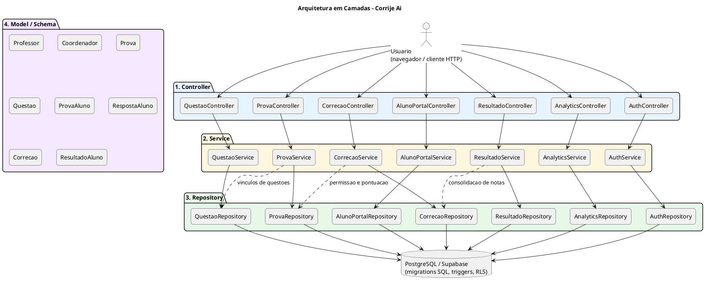
```plantuml
@startuml ArquiteturaEmCamadasCorrijeAi
title Arquitetura em Camadas - Corrije Ai

top to bottom direction
skinparam shadowing false
skinparam roundCorner 12
skinparam componentStyle rectangle

actor "Usuario\n(navegador / cliente HTTP)" as Cliente

package "1. Controller" as L1 #E8F4FD {
  [AuthController] as AuthC
  [ProvaController] as ProvaC
  [QuestaoController] as QuestaoC
  [AlunoPortalController] as PortalC
  [CorrecaoController] as CorrecaoC
  [ResultadoController] as ResultadoC
  [AnalyticsController] as AnalyticsC
}

package "2. Service" as L2 #FFF7E0 {
  [AuthService] as AuthS
  [ProvaService] as ProvaS
  [QuestaoService] as QuestaoS
  [AlunoPortalService] as PortalS
  [CorrecaoService] as CorrecaoS
  [ResultadoService] as ResultadoS
  [AnalyticsService] as AnalyticsS
}

package "3. Repository" as L3 #E8F8E8 {
  [AuthRepository] as AuthR
  [ProvaRepository] as ProvaR
  [QuestaoRepository] as QuestaoR
  [AlunoPortalRepository] as PortalR
  [CorrecaoRepository] as CorrecaoR
  [ResultadoRepository] as ResultadoR
  [AnalyticsRepository] as AnalyticsR
}

package "4. Model / Schema" as L4 #F3E8FF {
  [Professor]
  [Coordenador]
  [Prova]
  [Questao]
  [ProvaAluno]
  [RespostaAluno]
  [Correcao]
  [ResultadoAluno]
}

database "PostgreSQL / Supabase\n(migrations SQL, triggers, RLS)" as DB

Cliente -down-> AuthC
Cliente -down-> ProvaC
Cliente -down-> QuestaoC
Cliente -down-> PortalC
Cliente -down-> CorrecaoC
Cliente -down-> ResultadoC
Cliente -down-> AnalyticsC

AuthC -down-> AuthS
ProvaC -down-> ProvaS
QuestaoC -down-> QuestaoS
PortalC -down-> PortalS
CorrecaoC -down-> CorrecaoS
ResultadoC -down-> ResultadoS
AnalyticsC -down-> AnalyticsS

AuthS -down-> AuthR
ProvaS -down-> ProvaR
QuestaoS -down-> QuestaoR
PortalS -down-> PortalR
CorrecaoS -down-> CorrecaoR
ResultadoS -down-> ResultadoR
AnalyticsS -down-> AnalyticsR

ProvaS ..> QuestaoR : vinculos de questoes
CorrecaoS ..> ProvaR : permissao e pontuacao
ResultadoS ..> CorrecaoR : consolidacao de notas

AuthR -down-> DB
ProvaR -down-> DB
QuestaoR -down-> DB
PortalR -down-> DB
CorrecaoR -down-> DB
ResultadoR -down-> DB
AnalyticsR -down-> DB
@enduml
```

| Camada | O que faz | O que não faz | Evidências no código |
|---|---|---|---|
| Controller | Recebe requisições HTTP, aciona services e retorna status/body padronizados. | Não executa SQL e não concentra regras de negócio. | `src/backend/src/controllers`, `src/backend/src/routes` |
| Service | Aplica regras de negócio, valida transições e orquestra repositories. | Não conhece detalhes de renderização do frontend nem monta SQL diretamente. | `src/backend/src/services` |
| Repository | Encapsula SQL, transações e mapeamento entre banco e objetos de resposta. | Não decide autorização de rota nem trata protocolo HTTP. | `src/backend/src/repositories`, `src/backend/src/database/transaction.ts` |
| Model / Schema | Representa contratos de entrada/saída e entidades persistidas nas migrations. | Não acessa banco diretamente. | `src/backend/src/schemas`, `src/backend/src/database/migrations/migration.sql` |

Essa organização é observável nas rotas principais do artefato: `/api/v1/provas` passa por `ProvaController`, `ProvaService` e `ProvaRepository`; `/api/v1/questoes` passa por `QuestaoController`, `QuestaoService` e `QuestaoRepository`; `/api/v1/public/provas/{urlAcesso}` passa por `AlunoPortalController`, `AlunoPortalService` e `AlunoPortalRepository`.

### 3.2.2. Diagrama de Casos de Uso

<div align="center">
  
</div>

<div align="center">
  <strong>Figura 11 — Diagrama Casos de Usos.</strong><br><em>Fonte: elaboração própria.</em>
</div>

&emsp;  O diagrama apresenta os três atores principais da plataforma — Professor, Coordenador e Aluno — e os dezesseis casos de uso organizados em três grupos funcionais: gestão de provas, aplicação pelo aluno e correção/resultados. Atores externos (Google Auth e Serviço de E-mail) aparecem apenas onde há integração real. A relação `<<include>>` entre UC09 e UC10 explicita que o salvamento automático é comportamento obrigatório embutido na experiência de resposta.

---

#### Lista Consolidada de Casos de Uso

| ID | Caso de Uso | Ator Primário | Atores Secundários | Requisitos |
|---|---|---|---|---|
| UC01 | Autenticar-se | Professor / Coordenador | Google Auth | US01 |
| UC02 | Listar e filtrar provas por status | Professor / Coordenador | — | US02, RF001, RF022, RF020 |
| UC03 | Criar prova a partir da home | Professor | — | US03, RF021 |
| UC04 | Criar e editar questões com fórmulas e tipos variados | Professor | — | US04, RF004, RF005 |
| UC05 | Reutilizar questões do banco | Professor | — | US05, RF003 |
| UC06 | Configurar tempo, datas e embaralhamento | Professor | — | US06, RF007, RF023 |
| UC07 | Publicar prova com URL única e QR Code | Professor | — | US07, RF008 |
| UC08 | Acessar prova pelo portal do aluno | Aluno | — | US08, RF009, RF024, RF025 |
| UC09 | Responder prova no mobile com anexos manuscritos | Aluno | — | US09, RF010, RF011, RF012, RF013 |
| UC10 | Salvar rascunho durante a prova *(included por UC09)* | — | — | US10 |
| UC11 | Revisar e confirmar envio final | Aluno | — | US11, RF026 |
| UC12 | Corrigir prova por item | Professor | — | US12, RF014, RF015, RF016 |
| UC13 | Corrigir questões objetivas automaticamente | Professor | Aluno | US13 |
| UC14 | Calcular notas e exportar resultados | Coordenador | — | US14, RF017, RF028 |
| UC15 | Liberar resultados por e-mail | Professor / Coordenador | Serviço de E-mail | US15, RF027 |
| UC16 | Consultar logs e analytics da avaliação | Coordenador | — | US16 |

---

#### Descrições Detalhadas dos Casos de Uso

---

#### UC01 — Autenticar-se

**Descrição:** Permite que usuários internos acessem a plataforma com conta Google, sendo direcionados automaticamente ao painel correspondente ao perfil autorizado.

**Atores:** Professor, Coordenador.
**Atores secundários:** Google Auth.

**Pré-requisitos:**
- Usuário possui e-mail cadastrado na lista de autorizados da plataforma.
- Serviço Google Auth disponível.

**Pós-requisitos:**
- Sessão autenticada criada.
- Usuário redirecionado para o painel do seu perfil.

**Fluxo principal:**
1. Usuário acessa a plataforma e seleciona "Entrar com Google".
2. Sistema redireciona para o fluxo OAuth 2.0 do Google Auth.
3. Google Auth retorna a identidade (e-mail) do usuário autenticado.
4. Sistema valida se o e-mail consta na lista de autorizados.
5. Sistema identifica o perfil e redireciona para o painel correspondente.

**Fluxos alternativos:**
- A1: e-mail não autorizado — acesso negado com mensagem de erro.
- A2: sessão expirada — usuário redirecionado para novo login ao tentar acessar página protegida.

**Relações:**
- `<<include>>` Validar e-mail autorizado.
- `<<include>>` Redirecionar por perfil.

**Fluxos de exceção:**

| Passo | Situação | Solução |
|-------|----------|---------|
| 3 | Google Auth retorna erro ou está indisponível. | Sistema exibe mensagem de indisponibilidade temporária e orienta o usuário a tentar novamente. |
| 4 | E-mail retornado não consta na lista de autorizados. | Sistema nega o acesso, exibe mensagem informativa e não cria sessão. |
| Todos | O ator deseja cancelar a operação. | Cancelar operação; retornar à tela inicial. |

---

#### UC02 — Listar e filtrar provas por status

**Descrição:** Exibe as provas agrupadas por status (Rascunho, Publicada, Encerrada, Antiga), com possibilidade opcional de aplicar filtros combinados por turma, semestre, disciplina e professor.

**Atores:** Professor, Coordenador.
**Atores secundários:** Nenhum.

**Pré-requisitos:**
- Usuário autenticado.

**Pós-requisitos:**
- Lista exibida conforme critérios aplicados.

**Fluxo principal:**
1. Usuário acessa a tela inicial de provas.
2. Sistema carrega e agrupa as provas por status.
3. Usuário visualiza a listagem completa sem filtros aplicados.

**Fluxos alternativos:**
- A1: usuário aplica filtros — sistema retorna apenas provas que atendem a todos os critérios combinados *(extend: Filtrar provas)*.
- A2: nenhum resultado encontrado — sistema exibe mensagem de estado vazio *(extend: Exibir estado vazio)*.
- A3: prova encerrada — sistema bloqueia a opção de edição para aquela prova.

**Relações:**
- `<<extend>>` Filtrar provas *(condição: usuário aplica ao menos um filtro)*.
- `<<extend>>` Exibir estado vazio *(condição: nenhuma prova atende aos critérios)*.

**Fluxos de exceção:**

| Passo | Situação | Solução |
|-------|----------|---------|
| 2 | Falha na comunicação com o banco de dados ao carregar provas. | Sistema exibe mensagem de erro genérica e orienta o usuário a recarregar a página. |
| Todos | O ator deseja cancelar a operação. | Cancelar operação; retornar à tela anterior. |

---

#### UC03 — Criar prova a partir da home

**Descrição:** Permite ao professor iniciar rapidamente a criação de uma nova prova pela tela inicial, preenchendo metadados obrigatórios e salvando o registro como rascunho.

**Atores:** Professor.
**Atores secundários:** Nenhum.

**Pré-requisitos:**
- Professor autenticado.

**Pós-requisitos:**
- Prova criada em estado Rascunho, disponível para edição posterior.

**Fluxo principal:**
1. Professor clica em "Criar prova".
2. Sistema exibe formulário com campos obrigatórios.
3. Professor preenche: Nome, Modalidade, Disciplina, Turma e Semestre.
4. Sistema valida os campos preenchidos.
5. Sistema salva a prova como Rascunho e redireciona para o editor.

**Fluxos alternativos:**
- A1: campo obrigatório ausente — sistema impede o salvamento e destaca o campo faltante.

**Relações:**
- `<<include>>` Salvar como rascunho.

**Fluxos de exceção:**

| Passo | Situação | Solução |
|-------|----------|---------|
| 4 | Campo obrigatório ausente ou inválido. | Sistema destaca o campo e bloqueia o salvamento até que seja preenchido corretamente. |
| 5 | Falha de persistência no banco de dados. | Sistema exibe mensagem de erro e mantém os dados no formulário para nova tentativa. |
| Todos | O ator deseja cancelar a operação. | Cancelar operação; retornar à tela inicial sem salvar. |

---

#### UC04 — Criar e editar questões com fórmulas e tipos variados

**Descrição:** Permite ao professor montar o conteúdo da prova com questões de múltipla escolha, verdadeiro/falso e discursivas. Enunciados com notação LaTeX são renderizados quando presentes.

**Atores:** Professor.
**Atores secundários:** Nenhum.

**Pré-requisitos:**
- Prova em estado Rascunho aberta no editor.

**Pós-requisitos:**
- Questões salvas e vinculadas à prova.
- Gabarito registrado para questões objetivas (usado em UC13).

**Fluxo principal:**
1. Professor abre o editor da prova.
2. Sistema exibe interface para adicionar questão e selecionar o tipo.
3. Professor informa enunciado e, conforme o tipo: alternativas com gabarito (objetivas) ou critérios e limite de caracteres (discursivas).
4. Sistema valida campos obrigatórios e consistência das alternativas.
5. Sistema salva a questão vinculada à prova.

**Fluxos alternativos:**
- A1: questão incompleta — sistema bloqueia o salvamento e indica os campos ausentes.
- A2: professor tenta publicar prova com questão sem enunciado — sistema bloqueia a publicação.

**Relações:**
- `<<include>>` Validar alternativas e campos obrigatórios.
- `<<extend>>` Renderizar fórmulas LaTeX *(condição: enunciado contém notação LaTeX)*.

**Fluxos de exceção:**

| Passo | Situação | Solução |
|-------|----------|---------|
| 4 | Alternativas de questão objetiva sem gabarito marcado. | Sistema bloqueia o salvamento e indica a ausência do gabarito. |
| 4 | Sintaxe LaTeX inválida no enunciado. | Sistema exibe aviso de renderização incorreta; o salvamento é permitido, mas o professor é alertado. |
| Todos | O ator deseja cancelar a operação. | Cancelar operação; retornar ao editor sem salvar a questão. |

---

#### UC05 — Reutilizar questões do banco

**Descrição:** Permite ao professor buscar questões já cadastradas e incorporá-las à prova.

**Atores:** Professor.
**Atores secundários:** Nenhum.

**Pré-requisitos:**
- Banco de questões populado.
- Prova em edição aberta no editor.

**Pós-requisitos:**
- Questões selecionadas adicionadas ao editor da prova.

**Fluxo principal:**
1. Professor acessa o banco de questões.
2. Sistema exibe filtros por disciplina, tema e tipo.
3. Professor aplica filtros e visualiza questões compatíveis.
4. Professor seleciona uma ou mais questões para a prova.
5. Sistema adiciona as questões ao editor.

**Fluxos alternativos:**
- Nenhum.

**Relações:**
- `<<include>>` Buscar por disciplina, tema ou tipo.

**Fluxos de exceção:**

| Passo | Situação | Solução |
|-------|----------|---------|
| 3 | Nenhuma questão encontrada com os filtros aplicados. | Sistema exibe mensagem de estado vazio e sugere ampliar os filtros. |
| Todos | O ator deseja cancelar a operação. | Cancelar operação; retornar ao editor da prova sem adicionar questões. |

---

#### UC06 — Configurar tempo, datas e embaralhamento

**Descrição:** Permite ao professor definir a janela de disponibilidade da prova, duração máxima e regras de embaralhamento de questões e alternativas.

**Atores:** Professor.
**Atores secundários:** Nenhum.

**Pré-requisitos:**
- Prova em edição existe.

**Pós-requisitos:**
- Configurações de execução persistidas, utilizadas pelo sistema no controle de acesso em UC08.

**Fluxo principal:**
1. Professor acessa as configurações da prova.
2. Define data e horário de início e término no Horário de Brasília (GMT-3).
3. Define duração máxima por aluno.
4. Escolhe embaralhamento de questões e/ou alternativas (opcional).
5. Sistema valida que o término é posterior ao início e persiste a configuração.

**Fluxos alternativos:**
- A1: término anterior ao início — sistema rejeita a configuração com mensagem de erro.

**Relações:**
- `<<include>>` Validar período da prova.

**Fluxos de exceção:**

| Passo | Situação | Solução |
|-------|----------|---------|
| 5 | Data/horário de término anterior ao de início. | Sistema rejeita a configuração, exibe mensagem de erro e mantém os campos para correção. |
| 5 | Duração máxima zerada ou negativa. | Sistema bloqueia o salvamento e indica o campo inválido. |
| Todos | O ator deseja cancelar a operação. | Cancelar operação; retornar ao editor da prova sem salvar configurações. |

---

#### UC07 — Publicar prova com URL única e QR Code

**Descrição:** Após validação da consistência, o sistema publica a prova e gera link exclusivo e QR Code para distribuição aos candidatos.

**Atores:** Professor.
**Atores secundários:** Nenhum.

**Pré-requisitos:**
- Prova em estado Rascunho com ao menos uma questão completa e período definido.

**Pós-requisitos:**
- Prova no estado Publicada.
- URL única e QR Code disponíveis para compartilhamento.

**Fluxo principal:**
1. Professor solicita a publicação da prova.
2. Sistema valida consistência (questões completas, período definido).
3. Sistema gera URL única para a prova.
4. Sistema gera QR Code correspondente ao link.
5. Sistema disponibiliza URL e QR Code para cópia ou download.

**Fluxos alternativos:**
- A1: prova com inconsistências — sistema bloqueia a publicação e exibe os problemas encontrados.

**Relações:**
- `<<include>>` Gerar URL única.
- `<<include>>` Gerar QR Code.

**Fluxos de exceção:**

| Passo | Situação | Solução |
|-------|----------|---------|
| 2 | Prova sem questões completas ou sem período definido. | Sistema bloqueia a publicação e lista as inconsistências encontradas para correção. |
| 3–4 | Falha na geração do UUID ou do QR Code. | Sistema exibe mensagem de erro e permite nova tentativa de publicação. |
| Todos | O ator deseja cancelar a operação. | Cancelar operação; prova permanece em estado Rascunho. |

---

#### UC08 — Acessar prova pelo portal do aluno

**Descrição:** Exibe a tela de entrada da prova com orientações e solicita identificação mínima do aluno. Valida período de disponibilidade, coleta consentimento LGPD e impede múltiplas submissões.

**Atores:** Aluno.
**Atores secundários:** Nenhum.

**Pré-requisitos:**
- Prova no estado Publicada e dentro do período de disponibilidade (Horário de Brasília).
- Aluno não realizou submissão anterior para esta prova.

**Pós-requisitos:**
- Aluno identificado por nome, e-mail e CPF.
- Consentimento LGPD registrado.
- Prova liberada para início.

**Fluxo principal:**
1. Aluno acessa o link ou QR Code da prova.
2. Sistema valida se a prova está dentro do período de disponibilidade.
3. Sistema exibe título, orientações, duração e regras.
4. Aluno preenche nome, e-mail e CPF.
5. Aluno marca o checkbox de aceite dos Termos de Uso e Política de Privacidade.
6. Sistema valida os campos e habilita o botão "Iniciar Prova".
7. Sistema registra o consentimento LGPD do aluno.

**Fluxos alternativos:**
- A1: prova fora do período — sistema exibe mensagem de indisponibilidade e bloqueia o acesso.
- A2: CPF ausente ou inválido — sistema mantém o botão desabilitado e destaca o campo.
- A3: checkbox LGPD não marcado — sistema mantém o botão desabilitado.
- A4: prova em estado Rascunho acessada pelo link — sistema bloqueia o acesso.
- A5: aluno já realizou submissão anterior — sistema informa que a prova já foi enviada.

**Relações:**
- `<<include>>` Validar período de disponibilidade.
- `<<include>>` Registrar consentimento LGPD.

**Fluxos de exceção:**

| Passo | Situação | Solução |
|-------|----------|---------|
| 4 | CPF informado em formato inválido. | Sistema destaca o campo e bloqueia o avanço até o CPF ser corrigido. |
| 4 | E-mail informado em formato inválido. | Sistema destaca o campo e bloqueia o avanço até o e-mail ser corrigido. |
| 6 | Checkbox LGPD não marcado. | Sistema mantém o botão "Iniciar Prova" desabilitado e exibe aviso de obrigatoriedade. |
| 7 | Falha ao registrar consentimento no banco. | Sistema exibe mensagem de erro e não permite o início da prova. |
| Todos | O ator deseja cancelar a operação. | Cancelar operação; retornar à tela de entrada sem iniciar a prova. |

---

#### UC09 — Responder prova no mobile com anexos manuscritos

**Descrição:** Permite ao aluno responder questões em dispositivos móveis com suporte a fórmulas e upload de imagens ou arquivos de resolução manuscrita. O progresso é salvo automaticamente via UC10.

**Atores:** Aluno.
**Atores secundários:** Nenhum.

**Pré-requisitos:**
- Aluno identificado e prova iniciada (UC08 concluído).

**Pós-requisitos:**
- Respostas e anexos vinculados corretamente ao aluno e à questão.
- Progresso salvo automaticamente.

**Fluxo principal:**
1. Aluno visualiza a questão no dispositivo móvel (layout responsivo ≥ 360 px).
2. Aluno fornece a resposta (objetiva ou discursiva).
3. Quando habilitado, aluno anexa imagens ou PDF da resolução manuscrita.
4. Sistema valida tipo (JPG, PNG, PDF) e tamanho (máximo 5 MB por arquivo).
5. Sistema comprime imagens no lado do cliente antes do upload.
6. Sistema salva o vínculo entre arquivo, aluno e questão.
7. Sistema salva automaticamente o progresso da prova *(include: UC10)*.

**Fluxos alternativos:**
- A1: arquivo acima de 5 MB — sistema rejeita com mensagem de erro e informa o limite.
- A2: formato inválido — sistema impede o upload e informa os formatos aceitos.

**Relações:**
- `<<include>>` Anexar arquivos por questão.
- `<<include>>` Comprimir imagens no cliente.
- `<<include>>` UC10 Salvar rascunho durante a prova.
- `<<extend>>` Renderizar fórmulas LaTeX *(condição: questão contém notação LaTeX)*.

**Fluxos de exceção:**

| Passo | Situação | Solução |
|-------|----------|---------|
| 4 | Arquivo com formato inválido (não JPG, PNG ou PDF). | Sistema rejeita o upload, exibe mensagem indicando os formatos aceitos. |
| 4 | Arquivo acima de 5 MB. | Sistema rejeita o upload antes do envio ao servidor, exibe mensagem com o limite. |
| 7 | Falha no salvamento automático por ausência de conexão. | Sistema exibe indicador de pendência de sincronização; progresso é preservado no armazenamento local. |
| Todos | O ator deseja cancelar a operação. | Cancelar operação; retornar à tela de provas; respostas salvas até o momento são preservadas. |

---

#### UC10 — Salvar rascunho durante a prova

**Descrição:** Garante o armazenamento automático e contínuo do progresso do aluno enquanto responde a prova, protegendo contra perda de dados por instabilidade de rede ou recarga de página.

**Atores:** *(nenhum — disparado pelo sistema durante UC09)*.
**Atores secundários:** Nenhum.

**Pré-requisitos:**
- Prova em andamento (UC09 ativo).

**Pós-requisitos:**
- Último estado salvo disponível para restauração.

**Fluxo principal:**
1. Sistema detecta alteração em resposta digitada ou anexo vinculado.
2. Sistema salva automaticamente o progresso quando há conexão ativa.
3. Ao recarregar a página dentro do período permitido, sistema restaura o conteúdo salvo.
4. Ao detectar tentativa de sair com alterações não sincronizadas, sistema exibe aviso.

**Fluxos alternativos:**
- A1: término do tempo com respostas parcialmente salvas — sistema preserva o último estado salvo.

**Relações:**
- É `<<include>>` de UC09.

**Fluxos de exceção:**

| Passo | Situação | Solução |
|-------|----------|---------|
| 2 | Falha na comunicação com o servidor ao tentar sincronizar. | Sistema preserva o estado localmente e exibe indicador de pendência; tenta sincronizar novamente quando a conexão for restaurada. |
| Todos | O ator deseja cancelar a operação. | Cancelar operação; último estado salvo é preservado. |

---

#### UC11 — Revisar e confirmar envio final

**Descrição:** Apresenta um resumo do progresso antes do envio definitivo, destaca questões em branco e exige confirmação explícita do aluno.

**Atores:** Aluno.
**Atores secundários:** Nenhum.

**Pré-requisitos:**
- Prova respondida parcial ou integralmente.
- Prova dentro do período de disponibilidade.

**Pós-requisitos:**
- Prova enviada e bloqueada para alterações, com confirmação visual exibida ao aluno. Ou aluno retorna à tela de respostas para continuar o preenchimento.

**Fluxo principal:**
1. Aluno solicita a revisão final.
2. Sistema exibe mapa de questões respondidas e em branco.
3. Sistema destaca questões em branco.
4. Aluno confirma o envio final.
5. Sistema registra a submissão, bloqueia alterações e exibe confirmação visual.

**Fluxos alternativos:**
- A1: aluno cancela a confirmação — sistema mantém a prova aberta.
- A2: tempo encerrado antes da confirmação — sistema submete automaticamente o último estado salvo.

**Relações:**
- `<<include>>` Destacar questões em branco.
- `<<include>>` Confirmar envio final.

**Fluxos de exceção:**

| Passo | Situação | Solução |
|-------|----------|---------|
| 5 | Falha na persistência da submissão final (erro de rede ou servidor). | Sistema exibe mensagem de erro, mantém a prova aberta e permite nova tentativa de envio. |
| Todos | O ator deseja cancelar a operação. | Cancelar operação; retornar à tela de respostas com o progresso preservado. |

---

#### UC12 — Corrigir prova por item

**Descrição:** Permite ao professor corrigir a mesma questão de todos os alunos em sequência, garantindo isonomia na aplicação dos critérios. Suporta visualização de anexos, atribuição de nota e comentário por resposta.

**Atores:** Professor.
**Atores secundários:** Nenhum.

**Pré-requisitos:**
- Existem submissões registradas para a prova.

**Pós-requisitos:**
- Notas e comentários salvos por resposta e por questão.

**Fluxo principal:**
1. Professor acessa o painel de correção e seleciona uma questão.
2. Sistema lista as respostas daquela questão de todos os alunos em sequência.
3. Professor visualiza a resposta e, quando houver, abre os anexos.
4. Professor amplia anexos quando necessário.
5. Professor atribui nota e, opcionalmente, insere comentário.
6. Sistema salva e disponibiliza navegação para a próxima resposta.

**Fluxos alternativos:**
- A1: anexo ilegível — professor registra observação no comentário.
- A2: retorno a resposta já corrigida — dados persistidos são exibidos e podem ser editados.

**Relações:**
- `<<include>>` Listar respostas por questão.
- `<<include>>` Visualizar e ampliar anexos.
- `<<include>>` Registrar nota e comentário.

**Fluxos de exceção:**

| Passo | Situação | Solução |
|-------|----------|---------|
| 5 | Nota informada fora do intervalo permitido (ex.: valor negativo ou acima do máximo). | Sistema bloqueia o salvamento e destaca o campo com o intervalo válido. |
| 6 | Falha ao salvar nota/comentário no banco de dados. | Sistema exibe mensagem de erro; nota e comentário permanecem no formulário para nova tentativa. |
| Todos | O ator deseja cancelar a operação. | Cancelar operação; retornar à listagem de questões. |

---

#### UC13 — Corrigir questões objetivas automaticamente

**Descrição:** Aplica o gabarito registrado às respostas objetivas dos alunos, atribuindo pontuação automaticamente. Permite recálculo caso o gabarito seja alterado antes da liberação das notas.

**Atores:** Professor.
**Atores secundários:** Aluno *(suas submissões alimentam o processo de correção)*.

**Pré-requisitos:**
- Questões objetivas com gabarito registrado (configurado em UC04).
- Alunos realizaram submissão da prova (UC11).

**Pós-requisitos:**
- Questões objetivas pontuadas automaticamente.
- Questões discursivas com status "pendente de correção manual".

**Fluxo principal:**
1. Professor acessa o painel de resultados e inicia a correção automática.
2. Sistema recupera as respostas objetivas de todos os alunos.
3. Sistema compara cada resposta com o gabarito registrado.
4. Sistema atribui pontuação correta; respostas erradas recebem zero.
5. Questões discursivas permanecem com status "pendente", aguardando UC12.

**Fluxos alternativos:**
- A1: gabarito alterado antes da liberação — sistema recalcula todas as pontuações objetivas afetadas *(extend: Recalcular resultados)*.

**Relações:**
- `<<include>>` Aplicar gabarito.
- `<<extend>>` Recalcular resultados *(condição: gabarito alterado antes da liberação das notas)*.

**Fluxos de exceção:**

| Passo | Situação | Solução |
|-------|----------|---------|
| 3–4 | Gabarito não registrado para questão objetiva. | Sistema ignora a questão no cálculo automático e a mantém com status "pendente de correção manual". |
| Todos | O ator deseja cancelar a operação. | Cancelar operação; pontuações automáticas calculadas até o momento são preservadas. |

---

#### UC14 — Calcular notas e exportar resultados

**Descrição:** Consolida correções manuais e automáticas, calcula a nota final de cada aluno e exporta os resultados em planilha Excel, com opção de exportar os anexos organizados por prova, aluno e questão.

**Atores:** Coordenador.
**Atores secundários:** Nenhum.

**Pré-requisitos:**
- Todas as questões corrigidas, ou coordenador ciente das pendências e confirmando prosseguimento.

**Pós-requisitos:**
- Nota total calculada por aluno.
- Resultados exportados em formato estruturado.

**Fluxo principal:**
1. Coordenador acessa a tela de resultados da prova.
2. Sistema calcula a nota total de cada aluno.
3. Sistema exibe a nota total por aluno.
4. Coordenador solicita exportação para Excel.
5. Sistema gera planilha com alunos nas linhas e questões/notas nas colunas.
6. Coordenador solicita exportação de anexos.
7. Sistema gera pacote organizado por prova, aluno e questão.

**Fluxos alternativos:**
- A1: questões pendentes de correção — sistema alerta o coordenador antes da exportação final *(extend: Alertar pendências de correção)*; coordenador decide prosseguir ou aguardar.

**Relações:**
- `<<include>>` Consolidar notas.
- `<<include>>` Exportar planilha Excel.
- `<<include>>` Exportar anexos organizados.
- `<<extend>>` Alertar pendências de correção *(condição: há questões com status "pendente")*.

**Fluxos de exceção:**

| Passo | Situação | Solução |
|-------|----------|---------|
| 5 | Falha na geração da planilha Excel. | Sistema exibe mensagem de erro e permite nova tentativa de exportação. |
| 7 | Falha na geração do pacote de anexos. | Sistema exibe mensagem de erro parcial; exportação da planilha permanece disponível. |
| Todos | O ator deseja cancelar a operação. | Cancelar operação; retornar à tela de resultados. |

---

#### UC15 — Liberar resultados por e-mail

**Descrição:** Envia o resultado individual de cada aluno por e-mail quando as notas estiverem validadas. Registra histórico de envios e permite reenvio em caso de falha.

**Atores:** Professor, Coordenador.
**Atores secundários:** Serviço de E-mail.

**Pré-requisitos:**
- Notas consolidadas (UC14 concluído).
- Pendências resolvidas ou confirmação explícita realizada.

**Pós-requisitos:**
- E-mails enviados individualmente.
- Envio registrado com data, horário e status.

**Fluxo principal:**
1. Professor ou coordenador solicita a liberação dos resultados.
2. Sistema verifica se há questões pendentes de correção.
3. Sistema envia e-mail individual para cada aluno com seu resultado.
4. Sistema registra data, horário e status de cada envio.

**Fluxos alternativos:**
- A1: notas ainda pendentes — sistema bloqueia o envio ou exige confirmação explícita.
- A2: falha no envio — sistema sinaliza os envios falhos e permite nova tentativa *(extend: Reenviar e-mail falho)*.

**Relações:**
- `<<include>>` Enviar e-mail individual.
- `<<include>>` Registrar histórico de envio.
- `<<extend>>` Reenviar e-mail falho *(condição: envio falhou para ao menos um aluno)*.

**Fluxos de exceção:**

| Passo | Situação | Solução |
|-------|----------|---------|
| 3 | Serviço de e-mail transacional indisponível. | Sistema marca todos os envios como falhos e notifica o usuário; permite nova tentativa individual ou em lote. |
| 3 | E-mail do aluno inválido ou inexistente. | Sistema marca o envio específico como falho e registra o erro no histórico. |
| Todos | O ator deseja cancelar a operação. | Cancelar operação; e-mails já enviados permanecem registrados. |

---

#### UC16 — Consultar logs e analytics da avaliação

**Descrição:** Permite ao coordenador acessar o painel analítico para monitorar participação, desempenho por questão e identificar problemas operacionais. O registro de eventos ocorre automaticamente pelo sistema em segundo plano durante toda a execução das provas.

**Atores:** Coordenador.
**Atores secundários:** Nenhum.

**Pré-requisitos:**
- Sistema em operação com ao menos uma prova em andamento ou encerrada.
- Coordenador autenticado.

**Pós-requisitos:**
- Painel analítico exibido com dados atualizados.

**Fluxo principal:**
1. Coordenador acessa o painel de analytics.
2. Sistema exibe métricas de participação: acessos, inícios e envios por prova.
3. Sistema exibe tempo médio de resposta por questão.
4. Sistema exibe porcentagem de acerto por questão do banco.
5. Coordenador filtra por prova ou período para análise específica.
6. Sistema atualiza o painel conforme filtro aplicado.

**Fluxos alternativos:**
- A1: nenhuma prova no filtro aplicado — sistema exibe estado vazio.

> **Comportamento de infraestrutura:** o sistema registra automaticamente acessos, inícios, submissões e erros operacionais com data e contexto mínimo durante toda a execução das provas. Esses dados alimentam o painel consultado neste caso de uso.

**Relações:**
- `<<include>>` Exibir métricas de participação.
- `<<include>>` Exibir desempenho por questão.

**Fluxos de exceção:**

| Passo | Situação | Solução |
|-------|----------|---------|
| 2–4 | Nenhum dado disponível para as métricas solicitadas. | Sistema exibe mensagem de estado vazio e indica que os dados serão gerados à medida que as provas forem realizadas. |
| Todos | O ator deseja cancelar a operação. | Cancelar operação; retornar ao painel do coordenador. |

---

### 3.2.3. Diagrama de Classes do Dominio (sprint 2)

O diagrama de dominio abaixo foi alinhado ao backend atual e a migration src/backend/src/database/migrations/migration.sql. Coordenador, professor e aluno sao entidades/tabelas independentes. A composicao da prova usa prova_questao, a tentativa do aluno usa prova_aluno, os anexos usam resposta_anexo e a exportacao/resultado/e-mail usam tabelas proprias.

~~~plantuml
@startuml DiagramaDeClassesDominioAtual
skinparam classAttributeIconSize 0
skinparam linetype ortho

package "Identidade e acesso" {
  class Coordenador {
    +id: UUID
    +auth_user_id: UUID
    +nome: string
    +email: string
  }

  class Professor {
    +id: UUID
    +auth_user_id: UUID
    +coordenador_id: UUID
    +nome: string
    +email: string
  }

  class Aluno {
    +id: UUID
    +nome: string
    +email: string
    +cpf: string
    +aceitou_termos_em: timestamptz
  }
}

package "Catalogo e questoes" {
  class Materia {
    +id: UUID
    +nome: string
    +codigo: string
  }

  class MateriaProfessor {
    +materia_id: UUID
    +professor_id: UUID
  }

  class Tema {
    +id: UUID
    +materia_id: UUID
    +nome: string
  }

  class Questao {
    +id: UUID
    +materia_id: UUID
    +tema_id: UUID
    +tipo: questao_tipo
    +permite_anexo: boolean
    +ativa: boolean
  }

  class Enunciado {
    +id: UUID
    +questao_id: UUID
    +conteudo_latex: text
    +url_imagem: text
  }

  class Alternativa {
    +id: UUID
    +questao_id: UUID
    +texto: text
    +correta: boolean
    +ordem: integer
  }
}

package "Provas e aplicacao" {
  class Prova {
    +id: UUID
    +professor_id: UUID
    +materia_id: UUID
    +status: prova_status
    +url_acesso: UUID
    +qr_code: text
  }

  class ProvaStatusHistorico {
    +id: UUID
    +prova_id: UUID
    +status_anterior: prova_status
    +status_novo: prova_status
  }

  class ProvaQuestao {
    +prova_id: UUID
    +questao_id: UUID
    +ordem: integer
    +pontuacao_max: numeric
  }

  class ProvaAluno {
    +id: UUID
    +prova_id: UUID
    +aluno_id: UUID
    +status: prova_aluno_status
  }

  class RespostaAluno {
    +id: UUID
    +prova_aluno_id: UUID
    +questao_id: UUID
    +alternativa_id: UUID
    +resposta_texto: text
  }

  class RespostaAnexo {
    +id: UUID
    +resposta_id: UUID
    +nome_arquivo: string
    +storage_path: text
  }
}

package "Correcao e resultados" {
  class Correcao {
    +id: UUID
    +resposta_id: UUID
    +professor_id: UUID
    +nota: numeric
    +tipo: string
  }

  class Feedback {
    +id: UUID
    +correcao_id: UUID
    +mensagem: text
  }

  class ResultadoAluno {
    +prova_aluno_id: UUID
    +nota_total: numeric
    +percentual: numeric
  }

  class ExportacaoResultado {
    +id: UUID
    +prova_id: UUID
    +formato: exportacao_formato
  }

  class EmailEnvio {
    +id: UUID
    +prova_aluno_id: UUID
    +status: email_status
  }

  class AvaliacaoLog {
    +id: UUID
    +prova_id: UUID
    +acao: string
  }
}

Coordenador "1" -- "0..*" Professor
Professor "0..*" -- "0..*" Materia : materia_professor
Materia "1" -- "0..*" Tema
Materia "1" -- "0..*" Questao
Materia "1" -- "0..*" Prova
Questao "1" -- "1" Enunciado
Questao "1" -- "0..*" Alternativa
Prova "0..*" -- "0..*" Questao : prova_questao
Prova "1" -- "0..*" ProvaStatusHistorico
Prova "1" -- "0..*" ProvaAluno
Aluno "1" -- "0..*" ProvaAluno
ProvaAluno "1" -- "0..*" RespostaAluno
RespostaAluno "1" -- "0..*" RespostaAnexo
RespostaAluno "1" -- "0..1" Correcao
Correcao "1" -- "0..*" Feedback
ProvaAluno "1" -- "0..1" ResultadoAluno
Prova "1" -- "0..*" ExportacaoResultado
ProvaAluno "1" -- "0..*" EmailEnvio
Prova "1" -- "0..*" AvaliacaoLog
@enduml
~~~

#### 3.2.3.1 Diagrama de Classes Arquitetural

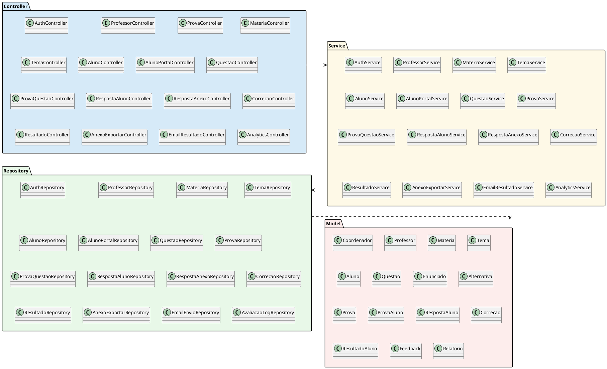
```plantuml
@startuml ArquiteturaGeral
skinparam linetype ortho
skinparam classAttributeIconSize 0

package "Controller" #D6EAF8 {
  class AuthController
  class ProfessorController
  class ProvaController
  class MateriaController
  class TemaController
  class AlunoController
  class AlunoPortalController
  class QuestaoController
  class ProvaQuestaoController
  class RespostaAlunoController
  class RespostaAnexoController
  class CorrecaoController
  class ResultadoController
  class AnexoExportarController
  class EmailResultadoController
  class AnalyticsController
}

package "Service" #FEF9E7 {
  class AuthService
  class ProfessorService
  class MateriaService
  class TemaService
  class AlunoService
  class AlunoPortalService
  class QuestaoService
  class ProvaService
  class ProvaQuestaoService
  class RespostaAlunoService
  class RespostaAnexoService
  class CorrecaoService
  class ResultadoService
  class AnexoExportarService
  class EmailResultadoService
  class AnalyticsService
}

package "Repository" #E8F8E8 {
  class AuthRepository
  class ProfessorRepository
  class MateriaRepository
  class TemaRepository
  class AlunoRepository
  class AlunoPortalRepository
  class QuestaoRepository
  class ProvaRepository
  class ProvaQuestaoRepository
  class RespostaAlunoRepository
  class RespostaAnexoRepository
  class CorrecaoRepository
  class ResultadoRepository
  class AnexoExportarRepository
  class EmailEnvioRepository
  class AvaliacaoLogRepository
}

package "Model" #FDEDEC {
  class Coordenador
  class Professor
  class Materia
  class Tema
  class Aluno
  class Questao
  class Enunciado
  class Alternativa
  class Prova
  class ProvaAluno
  class RespostaAluno
  class Correcao
  class ResultadoAluno
  class Feedback
  class Relatorio
}

Controller ..> Service
Service ..> Repository
Repository ..> Model

@enduml
```


```plantuml
@startuml Controllers
class AlunoPortalController {
  + obterProvaPublica()
  + iniciarProva()
}

class RespostaAlunoController {
  + salvar()
  + listar()
  + enviar()
}

class RespostaAnexoController {
  + upload()
}

class CorrecaoController {
  + listarQuestoes()
  + executarObjetivas()
  + listarRespostasPorQuestao()
  + salvar()
}

class ResultadoController {
  + listarPorProva()
  + exportar()
}

class AnexoExportarController {
  + exportar()
}

class EmailResultadoController {
  + liberar()
  + listarEnvios()
  + reenviar()
}

class AnalyticsController {
  + metricas()
  + participacao()
  + desempenhoPorQuestao()
}

package "Services" {
  class AuthService
  class ProfessorService
  class MateriaService
  class TemaService
  class AlunoService
  class AlunoPortalService
  class QuestaoService
  class ProvaService
  class ProvaQuestaoService
  class RespostaAlunoService
  class RespostaAnexoService
  class CorrecaoService
  class ResultadoService
  class AnexoExportarService
  class EmailResultadoService
  class AnalyticsService
}

AuthController ..> AuthService
ProfessorController ..> ProfessorService
MateriaController ..> MateriaService
TemaController ..> TemaService
AlunoController ..> AlunoService
AlunoPortalController ..> AlunoPortalService
QuestaoController ..> QuestaoService
ProvaController ..> ProvaService
ProvaQuestaoController ..> ProvaQuestaoService
RespostaAlunoController ..> RespostaAlunoService
RespostaAnexoController ..> RespostaAnexoService
CorrecaoController ..> CorrecaoService
ResultadoController ..> ResultadoService
AnexoExportarController ..> AnexoExportarService
EmailResultadoController ..> EmailResultadoService
AnalyticsController ..> AnalyticsService

@enduml
```

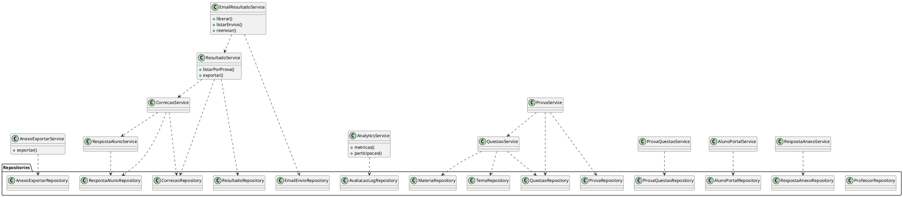
```plantuml
@startuml Services

class ResultadoService {
  + listarPorProva()
  + exportar()
}

class AnexoExportarService {
  + exportar()
}

class EmailResultadoService {
  + liberar()
  + listarEnvios()
  + reenviar()
}

class AnalyticsService {
  + metricas()
  + participacao()
}

package "Repositories" {
  class ProfessorRepository
  class MateriaRepository
  class TemaRepository
  class QuestaoRepository
  class ProvaRepository
  class ProvaQuestaoRepository
  class AlunoPortalRepository
  class RespostaAlunoRepository
  class RespostaAnexoRepository
  class CorrecaoRepository
  class ResultadoRepository
  class AnexoExportarRepository
  class EmailEnvioRepository
  class AvaliacaoLogRepository
}

QuestaoService ..> QuestaoRepository
QuestaoService ..> MateriaRepository
QuestaoService ..> TemaRepository

ProvaService ..> ProvaRepository
ProvaService ..> QuestaoRepository

ProvaQuestaoService ..> ProvaQuestaoRepository
AlunoPortalService ..> AlunoPortalRepository
RespostaAlunoService ..> RespostaAlunoRepository
RespostaAnexoService ..> RespostaAnexoRepository

CorrecaoService ..> CorrecaoRepository
CorrecaoService ..> RespostaAlunoRepository

ResultadoService ..> ResultadoRepository
ResultadoService ..> CorrecaoRepository

AnexoExportarService ..> AnexoExportarRepository
EmailResultadoService ..> EmailEnvioRepository
AnalyticsService ..> AvaliacaoLogRepository

ProvaService ..> QuestaoService
CorrecaoService ..> RespostaAlunoService
ResultadoService ..> CorrecaoService
EmailResultadoService ..> ResultadoService

@enduml
```


```plantuml
@startuml Repositories

scale 0.55
left to right direction

skinparam dpi 120
skinparam shadowing false
skinparam linetype ortho
skinparam classAttributeIconSize 0
skinparam classFontSize 8
skinparam packageStyle rectangle

package "Repositories" {

class AuthRepository {
  + buscarProfessorPorAuthId()
  + buscarCoordenadorPorAuthId()
  + buscarProfessorPorEmail()
  + buscarCoordenadorPorEmail()
}

class ProfessorRepository {
  + findById()
  + findAll()
  + findByEmail()
  + save()
  + update()
  + delete()
}

class MateriaRepository {
  + findById()
  + findAll()
  + findByProfessor()
  + save()
  + update()
  + delete()
  + associarProfessor()
}

class TemaRepository {
  + findById()
  + findByMateria()
  + save()
  + update()
  + delete()
}

class AlunoRepository {
  + findById()
  + findByCpf()
  + findByEmail()
  + save()
  + update()
}

class QuestaoRepository {
  + findById()
  + findAll()
  + save()
  + update()
  + delete()
  + saveEnunciado()
  + saveAlternativa()
}

class ProvaRepository {
  + findById()
  + findAll()
  + save()
  + update()
  + delete()
  + updateStatus()
}

class ProvaQuestaoRepository {
  + adicionar()
  + listar()
  + remover()
}

class AlunoPortalRepository {
  + obterProvaPublica()
  + iniciarProva()
}

class RespostaAlunoRepository {
  + findById()
  + save()
  + update()
  + saveResposta()
}

class RespostaAnexoRepository {
  + findResposta()
  + saveAnexo()
}

class CorrecaoRepository {
  + findById()
  + save()
  + update()
  + upsert()
  + saveFeedback()
}

class ResultadoRepository {
  + findByProvaAluno()
  + findByProva()
  + save()
  + update()
  + upsert()
  + saveExportacao()
}

class AnexoExportarRepository {
  + listarAnexosPorProva()
}

class EmailEnvioRepository {
  + findById()
  + save()
  + update()
}

class AvaliacaoLogRepository {
  + save()
  + findByProva()
  + findByAcao()
}

}

package "Models" {

class Professor
class Coordenador
class Materia
class Tema
class Aluno
class Questao
class Enunciado
class Alternativa
class Prova
class ProvaAluno
class RespostaAluno
class RespostaAnexo
class Correcao
class Feedback
class ResultadoAluno
class ExportacaoResultado
class Relatorio
class EmailEnvio
class AvaliacaoLog

}

AuthRepository ..> Professor
AuthRepository ..> Coordenador

ProfessorRepository ..> Professor

MateriaRepository ..> Materia
TemaRepository ..> Tema
AlunoRepository ..> Aluno

QuestaoRepository ..> Questao
QuestaoRepository ..> Enunciado
QuestaoRepository ..> Alternativa

ProvaRepository ..> Prova

ProvaQuestaoRepository ..> Prova
ProvaQuestaoRepository ..> Questao
AlunoPortalRepository ..> ProvaAluno
AlunoPortalRepository ..> Aluno
RespostaAlunoRepository ..> RespostaAluno
RespostaAnexoRepository ..> RespostaAnexo

CorrecaoRepository ..> Correcao
CorrecaoRepository ..> Feedback

ResultadoRepository ..> ResultadoAluno
ResultadoRepository ..> ExportacaoResultado

AnexoExportarRepository ..> RespostaAnexo

EmailEnvioRepository ..> EmailEnvio

AvaliacaoLogRepository ..> AvaliacaoLog

@enduml
```

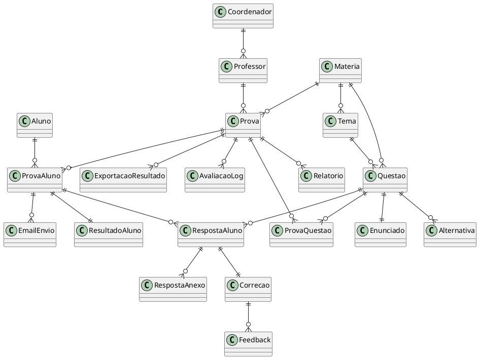
```plantuml
@startuml Dominio
skinparam classAttributeIconSize 0

class Coordenador
class Professor
class Materia
class Tema
class Questao
class Enunciado
class Alternativa
class Prova
class ProvaQuestao
class ProvaAluno
class RespostaAluno
class RespostaAnexo
class Correcao
class Feedback
class ResultadoAluno
class Relatorio
class ExportacaoResultado
class EmailEnvio
class AvaliacaoLog
class Aluno

Coordenador ||--o{ Professor
Materia ||--o{ Tema
Materia ||--o{ Questao
Tema ||--o{ Questao

Questao ||--|| Enunciado
Questao ||--o{ Alternativa

Professor ||--o{ Prova
Materia ||--o{ Prova

Prova ||--o{ ProvaQuestao
Questao ||--o{ ProvaQuestao

Aluno ||--o{ ProvaAluno
Prova ||--o{ ProvaAluno

ProvaAluno ||--o{ RespostaAluno
Questao ||--o{ RespostaAluno

RespostaAluno ||--o{ RespostaAnexo
RespostaAluno ||--|| Correcao

Correcao ||--o{ Feedback

ProvaAluno ||--|| ResultadoAluno

Prova ||--o{ Relatorio
Prova ||--o{ ExportacaoResultado
ProvaAluno ||--o{ EmailEnvio
Prova ||--o{ AvaliacaoLog

@enduml
```

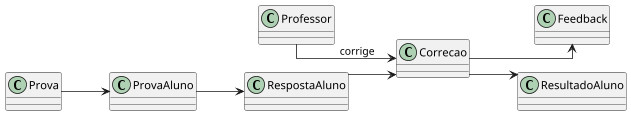
```plantuml
@startuml FluxoCorrecao

left to right direction
scale 0.8

skinparam shadowing false
skinparam linetype ortho

class Professor
class Prova
class ProvaAluno
class RespostaAluno
class Correcao
class Feedback
class ResultadoAluno

Professor --> Correcao : corrige
Prova --> ProvaAluno
ProvaAluno --> RespostaAluno
RespostaAluno --> Correcao
Correcao --> Feedback
Correcao --> ResultadoAluno

@enduml
```

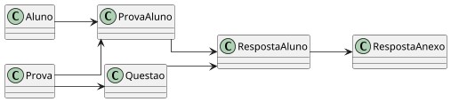
```plantuml
@startuml FluxoAplicacaoProva

left to right direction
scale 0.8

skinparam shadowing false
skinparam linetype ortho

class Aluno
class Prova
class ProvaAluno
class Questao
class RespostaAluno
class RespostaAnexo

Aluno --> ProvaAluno
Prova --> ProvaAluno
Prova --> Questao

ProvaAluno --> RespostaAluno
Questao --> RespostaAluno

RespostaAluno --> RespostaAnexo

@enduml
```

### 3.2.4. Diagrama de Sequência UML (sprint 3)

Os diagramas de sequência a seguir detalham os fluxos das UC01, UC02 e UC03. A modelagem mantém a separação em camadas usada no projeto: o ator interage com a interface, a requisição é tratada por um controller, as regras de negócio ficam no service, a persistência é isolada no repository e o banco armazena as entidades do domínio.

# Diagramas de Sequência UML — UC01, UC02, UC03

---

## UC01 — Autenticar-se

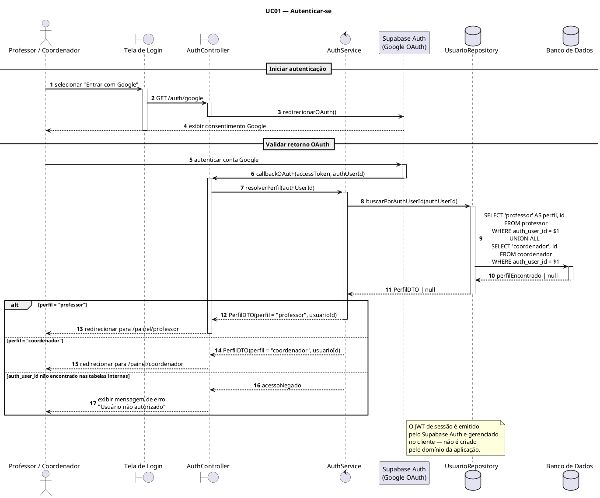
```plantuml
@startuml DiagramaSequenciaUC01
title UC01 — Autenticar-se

autonumber
skinparam sequenceArrowThickness 2
skinparam sequenceMessageAlign center
skinparam responseMessageBelowArrow true
skinparam ParticipantPadding 25
skinparam BoxPadding 10

actor "Professor / Coordenador" as Usuario
boundary "Tela de Login" as Tela
boundary "AuthController" as Controller
control "AuthService" as Service
participant "Supabase Auth\n(Google OAuth)" as Supabase
database "UsuarioRepository" as UsuarioRepository
database "Banco de Dados" as Banco

== Iniciar autenticação ==

Usuario -> Tela: selecionar "Entrar com Google"
activate Tela

Tela -> Controller: GET /auth/google
activate Controller

Controller -> Supabase: redirecionarOAuth()
deactivate Controller

Supabase --> Usuario: exibir consentimento Google
deactivate Tela

== Validar retorno OAuth ==

Usuario -> Supabase: autenticar conta Google
activate Supabase

Supabase -> Controller: callbackOAuth(accessToken, authUserId)
deactivate Supabase
activate Controller

Controller -> Service: resolverPerfil(authUserId)
activate Service

Service -> UsuarioRepository: buscarPorAuthUserId(authUserId)
activate UsuarioRepository

UsuarioRepository -> Banco: SELECT 'professor' AS perfil, id\n  FROM professor\n  WHERE auth_user_id = $1\nUNION ALL\nSELECT 'coordenador', id\n  FROM coordenador\n  WHERE auth_user_id = $1
activate Banco
Banco --> UsuarioRepository: perfilEncontrado | null
deactivate Banco

UsuarioRepository --> Service: PerfilDTO | null
deactivate UsuarioRepository

alt perfil = "professor"
    Service --> Controller: PerfilDTO(perfil = "professor", usuarioId)
    deactivate Service

    Controller --> Usuario: redirecionar para /painel/professor
    deactivate Controller

else perfil = "coordenador"
    Service --> Controller: PerfilDTO(perfil = "coordenador", usuarioId)
    deactivate Service

    Controller --> Usuario: redirecionar para /painel/coordenador
    deactivate Controller

else auth_user_id não encontrado nas tabelas internas
    Service --> Controller: acessoNegado
    deactivate Service

    Controller --> Usuario: exibir mensagem de erro\n"Usuário não autorizado"
    deactivate Controller
end

note right of Supabase
  O JWT de sessão é emitido
  pelo Supabase Auth e gerenciado
  no cliente — não é criado
  pelo domínio da aplicação.
end note

@enduml
```

<div align="center">
  <strong>Figura X — Diagrama de Sequência — UC01.</strong><br><em>Fonte: elaboração própria.</em>
</div>

---

## UC02 — Listar e filtrar provas por status

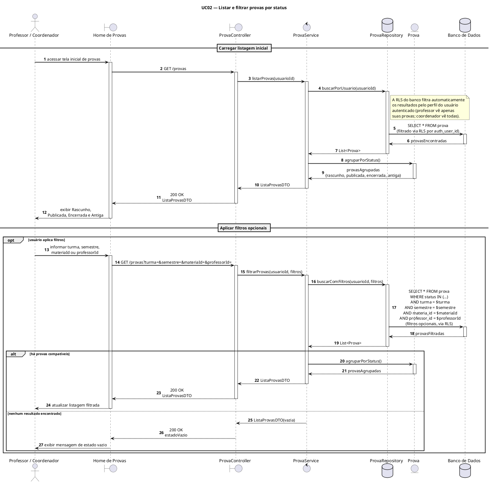
```plantuml
@startuml DiagramaSequenciaUC02
title UC02 — Listar e filtrar provas por status

autonumber
skinparam sequenceArrowThickness 2
skinparam sequenceMessageAlign center
skinparam responseMessageBelowArrow true
skinparam ParticipantPadding 25
skinparam BoxPadding 10

actor "Professor / Coordenador" as Usuario
boundary "Home de Provas" as Tela
boundary "ProvaController" as Controller
control "ProvaService" as Service
database "ProvaRepository" as ProvaRepository
entity "Prova" as Prova
database "Banco de Dados" as Banco

== Carregar listagem inicial ==

Usuario -> Tela: acessar tela inicial de provas
activate Tela

Tela -> Controller: GET /provas
activate Controller

Controller -> Service: listarProvas(usuarioId)
activate Service

Service -> ProvaRepository: buscarPorUsuario(usuarioId)
activate ProvaRepository

note right of ProvaRepository
  A RLS do banco filtra automaticamente
  os resultados pelo perfil do usuário
  autenticado (professor vê apenas
  suas provas; coordenador vê todas).
end note

ProvaRepository -> Banco: SELECT * FROM prova\n(filtrado via RLS por auth_user_id)
activate Banco
Banco --> ProvaRepository: provasEncontradas
deactivate Banco

ProvaRepository --> Service: List<Prova>
deactivate ProvaRepository

Service -> Prova: agruparPorStatus()
activate Prova
Prova --> Service: provasAgrupadas\n{rascunho, publicada, encerrada, antiga}
deactivate Prova

Service --> Controller: ListaProvasDTO
deactivate Service

Controller --> Tela: 200 OK\nListaProvasDTO
deactivate Controller

Tela --> Usuario: exibir Rascunho,\nPublicada, Encerrada e Antiga
deactivate Tela

== Aplicar filtros opcionais ==

opt usuário aplica filtros
    Usuario -> Tela: informar turma, semestre,\nmateriaId ou professorId
    activate Tela

    Tela -> Controller: GET /provas?turma=&semestre=&materiaId=&professorId=
    activate Controller

    Controller -> Service: filtrarProvas(usuarioId, filtros)
    activate Service

    Service -> ProvaRepository: buscarComFiltros(usuarioId, filtros)
    activate ProvaRepository

    ProvaRepository -> Banco: SELECT * FROM prova\nWHERE status IN (...)\n  AND turma = $turma\n  AND semestre = $semestre\n  AND materia_id = $materiaId\n  AND professor_id = $professorId\n(filtros opcionais, via RLS)
    activate Banco
    Banco --> ProvaRepository: provasFiltradas
    deactivate Banco

    ProvaRepository --> Service: List<Prova>
    deactivate ProvaRepository

    alt há provas compatíveis
        Service -> Prova: agruparPorStatus()
        activate Prova
        Prova --> Service: provasAgrupadas
        deactivate Prova

        Service --> Controller: ListaProvasDTO
        deactivate Service

        Controller --> Tela: 200 OK\nListaProvasDTO
        deactivate Controller

        Tela --> Usuario: atualizar listagem filtrada
        deactivate Tela
    else nenhum resultado encontrado
        Service --> Controller: ListaProvasDTO(vazia)
        deactivate Service

        Controller --> Tela: 200 OK\nestadoVazio
        deactivate Controller

        Tela --> Usuario: exibir mensagem de estado vazio
        deactivate Tela
    end
end

@enduml
```

<div align="center">
  <strong>Figura X+1 — Diagrama de Sequência — UC02.</strong><br><em>Fonte: elaboração própria.</em>
</div>

---

## UC03 — Criar prova a partir da home

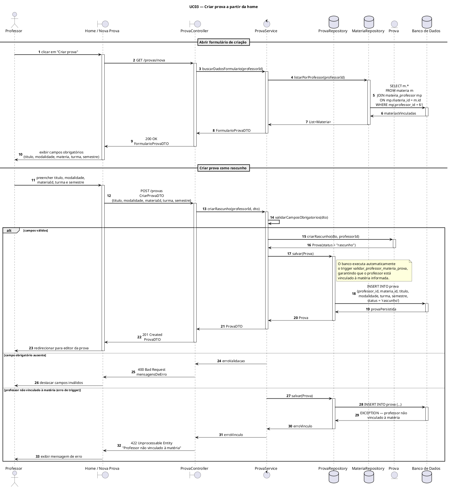
```plantuml
@startuml DiagramaSequenciaUC03
title UC03 — Criar prova a partir da home

autonumber
skinparam sequenceArrowThickness 2
skinparam sequenceMessageAlign center
skinparam responseMessageBelowArrow true
skinparam ParticipantPadding 25
skinparam BoxPadding 10

actor "Professor" as Professor
boundary "Home / Nova Prova" as Tela
boundary "ProvaController" as Controller
control "ProvaService" as Service
database "ProvaRepository" as ProvaRepository
database "MateriaRepository" as MateriaRepository
entity "Prova" as Prova
database "Banco de Dados" as Banco

== Abrir formulário de criação ==

Professor -> Tela: clicar em "Criar prova"
activate Tela

Tela -> Controller: GET /provas/nova
activate Controller

Controller -> Service: buscarDadosFormulario(professorId)
activate Service

Service -> MateriaRepository: listarPorProfessor(professorId)
activate MateriaRepository

MateriaRepository -> Banco: SELECT m.*\nFROM materia m\nJOIN materia_professor mp\n  ON mp.materia_id = m.id\nWHERE mp.professor_id = $1
activate Banco
Banco --> MateriaRepository: materiasVinculadas
deactivate Banco

MateriaRepository --> Service: List<Materia>
deactivate MateriaRepository

Service --> Controller: FormularioProvaDTO
deactivate Service

Controller --> Tela: 200 OK\nFormularioProvaDTO
deactivate Controller

Tela --> Professor: exibir campos obrigatórios\n(titulo, modalidade, materia, turma, semestre)
deactivate Tela

== Criar prova como rascunho ==

Professor -> Tela: preencher titulo, modalidade,\nmateriaId, turma e semestre
activate Tela

Tela -> Controller: POST /provas\nCriarProvaDTO\n{titulo, modalidade, materiaId, turma, semestre}
activate Controller

Controller -> Service: criarRascunho(professorId, dto)
activate Service

Service -> Service: validarCamposObrigatorios(dto)

alt campos válidos
    Service -> Prova: criarRascunho(dto, professorId)
    activate Prova
    Prova --> Service: Prova(status = "rascunho")
    deactivate Prova

    Service -> ProvaRepository: salvar(Prova)
    activate ProvaRepository

    note right of ProvaRepository
      O banco executa automaticamente
      o trigger validar_professor_materia_prova,
      garantindo que o professor está
      vinculado à matéria informada.
    end note

    ProvaRepository -> Banco: INSERT INTO prova\n(professor_id, materia_id, titulo,\n modalidade, turma, semestre,\n status = 'rascunho')
    activate Banco
    Banco --> ProvaRepository: provaPersistida
    deactivate Banco

    ProvaRepository --> Service: Prova
    deactivate ProvaRepository

    Service --> Controller: ProvaDTO
    deactivate Service

    Controller --> Tela: 201 Created\nProvaDTO
    deactivate Controller

    Tela --> Professor: redirecionar para editor da prova
    deactivate Tela

else campo obrigatório ausente
    Service --> Controller: erroValidacao
    deactivate Service

    Controller --> Tela: 400 Bad Request\nmensagensDeErro
    deactivate Controller

    Tela --> Professor: destacar campos inválidos
    deactivate Tela

else professor não vinculado à matéria (erro de trigger)
    Service -> ProvaRepository: salvar(Prova)
    activate ProvaRepository

    ProvaRepository -> Banco: INSERT INTO prova (...)
    activate Banco
    Banco --> ProvaRepository: EXCEPTION — professor não\nvinculado à matéria
    deactivate Banco

    ProvaRepository --> Service: erroVinculo
    deactivate ProvaRepository

    Service --> Controller: erroVinculo
    deactivate Service

    Controller --> Tela: 422 Unprocessable Entity\n"Professor não vinculado à matéria"
    deactivate Controller

    Tela --> Professor: exibir mensagem de erro
    deactivate Tela
end

@enduml
```

<div align="center">
  <strong>Figura X+2 — Diagrama de Sequência — UC03.</strong><br><em>Fonte: elaboração própria.</em>
</div>


### 3.2.5. Diagrama de Atividades ou Estados (sprint 3)

*Ao menos um fluxo relevante em UML ou BPMN. Use a notação da ferramenta escolhida de forma consistente (sem misturar convenções).*

### 3.2.6. Diagrama de Implantação (sprints 4 e 5)

*Diagrama UML de deployment mostrando nós físicos, artefatos e canais de comunicação. Representa a visão Engineering + Technology do RM-ODP.*

### 3.2.7. Padroes de Projeto Aplicados (sprints 3 a 5)

Esta secao registra apenas padroes que aparecem no backend atual. A evidencia esta em src/backend/src/controllers, src/backend/src/services, src/backend/src/repositories, src/backend/src/schemas, src/backend/src/middlewares/auth.ts, src/backend/src/database/pool.ts e src/backend/src/database/migrations/migration.sql.

#### 1. Repository Pattern

Os repositories concentram SQL e isolam PostgreSQL/Supabase do restante da aplicacao. Controllers e services chamam classes como ProfessorRepository, ProvaRepository, QuestaoRepository, ProvaQuestaoRepository, AlunoPortalRepository, RespostaAlunoRepository, RespostaAnexoRepository, CorrecaoRepository, ResultadoRepository, EmailEnvioRepository e AvaliacaoLogRepository.

- Necessidade: manter JOINs, filtros, UPSERTs, paginacao, RLS e constraints fora da camada HTTP.
- Evidencia: QuestaoRepository.findMany, ProvaRepository.findMany, CorrecaoRepository.corrigirObjetivas e ProvaQuestaoRepository.remover.
- Requisitos: RF001, RF003, RF009, RF012, RF014, RF017, RF027 e RF028.

#### 2. Service Layer

A camada de service concentra regra de negocio e orquestra repositories. ProvaService decide transicoes de status; QuestaoService valida edicao de questoes; AlunoPortalService inicia prova publica; RespostaAlunoService salva e envia respostas; CorrecaoService corrige; ResultadoService consolida notas; EmailResultadoService libera resultados por e-mail; AnalyticsService registra eventos.

- Necessidade: impedir que controllers conhecam regras como prova editavel somente em rascunho, aluno unico por prova, limites de pontuacao, envio final e autorizacao por vinculo professor/materia.
- Evidencia: controllers chamam services, services chamam repositories e as rotas retornam envelopes padronizados.
- Requisitos: RF001, RF007, RF008, RF009, RF014, RF015, RF017, RF019, RF027.

#### 3. DTO e validacao por schema Zod

Os schemas em src/backend/src/schemas definem params, querystring, body e response usados nas rotas Fastify por fastify-type-provider-zod. Entradas invalidas sao rejeitadas antes de chegar aos services, com status 422 e erro padronizado.

- Evidencia: createProvaBodySchema, updateProvaConfiguracoesBodySchema, createQuestaoBodySchema, iniciarProvaBodySchema, salvarRespostaBodySchema, salvarCorrecaoBodySchema e schemas de resultado/e-mail.
- Requisitos: RF004, RF005, RF006, RF007, RF009, RF012, RF015.

#### 4. Strategy para correcao

O dominio de correcao usa duas estrategias comprovaveis: correcao automatica de objetivas e correcao manual de discursivas. CorrecaoRepository.corrigirObjetivas calcula nota em lote com CASE WHEN e ON CONFLICT; a correcao manual recebe nota, observacao e feedback do professor.

- Evidencia: POST /api/v1/provas/:provaId/correcao/objetivas e PUT /api/v1/respostas/:respostaId/correcao.
- Requisitos: RF014, RF015, RN13.

#### 5. State para ciclo de vida

Prova percorre rascunho, publicada, encerrada e antiga. ProvaService.publicar, ProvaService.encerrar e ProvaService.arquivar executam transicoes; a migration reforca regras com validar_transicao_e_publicacao_prova_trigger e prova_status_historico. O fluxo do aluno usa prova_aluno.status, AlunoPortalService e RespostaAlunoService.

- Evidencia: POST /api/v1/provas/:provaId/publicar, /encerrar, /arquivar e POST /api/v1/public/provas-aluno/:provaAlunoId/enviar.
- Requisitos: RF001, RF007, RF008, RF020, RF026, RN01, RN05, RN12.

#### 6. Chain of Responsibility em auth

Rotas protegidas passam por leitura do token, montagem do usuario autenticado e validacao de perfil por requireRole. A cadeia retorna 401 quando nao ha autenticacao valida e 403 quando o perfil nao pode executar a acao.

- Evidencia: src/backend/src/middlewares/auth.ts aplicado em provas, questoes, correcao, resultados, e-mails, analytics, cadastros e coordenador.
- Requisitos: RF002, RF018, RF019, RF021, RN18, RN19.

#### 7. Singleton do pool PostgreSQL

src/backend/src/database/pool.ts exporta uma unica instancia de pg.Pool configurada por DATABASE_URL. Repositories reutilizam o mesmo pool e evitam abrir conexoes por requisicao.

- Evidencia: imports de pool nos repositories e helper withTransaction.
- Requisitos: RNF desempenho e capacidade.

#### 8. Observer por triggers, logs e analytics

A migration contem triggers que reagem a eventos de escrita: set_atualizado_em, registrar_status_prova, gerar_qr_code_prova e triggers de validacao. Na aplicacao, AnalyticsService e AvaliacaoLogRepository registram eventos por POST /api/v1/logs.

- Evidencia: avaliacao_log, prova_status_historico e triggers em migration.sql.
- Requisitos: RF008, RF019, RF020, RN07, RN17.

#### 9. Facade em services compostos

ResultadoService, EmailResultadoService, AnexoExportarService e AlunoPortalService escondem orquestracoes de varios repositories atras de metodos simples para os controllers.

- Evidencia: GET /api/v1/provas/:provaId/resultados, POST /api/v1/provas/:provaId/resultados/exportar, POST /api/v1/provas/:provaId/resultados/liberar-email e POST /api/v1/provas/:provaId/anexos/exportar.
- Requisitos: RF017, RF027, RF028, RF009, RF026.

| Padrao | Evidencia no backend | Requisitos centrais |
|--------|----------------------|---------------------|
| Repository | repositories/*.repository.ts | RF001, RF003, RF014, RF017 |
| Service Layer | services/*.service.ts | RF001, RF007, RF009, RF017 |
| DTO/Zod | schemas/*.schema.ts e rotas Fastify | RF004, RF007, RF009, RF015 |
| Strategy | CorrecaoService e CorrecaoRepository | RF014, RF015 |
| State | ProvaService, RespostaAlunoService e triggers | RF001, RF008, RF026 |
| Chain of Responsibility | middlewares/auth.ts e requireRole | RF002, RF018, RF019 |
| Singleton | database/pool.ts | RNF desempenho/capacidade |
| Observer | triggers, AvaliacaoLogRepository, AnalyticsService | RF008, RF019, RF020 |
| Facade | ResultadoService, EmailResultadoService, AnexoExportarService | RF017, RF027, RF028 |

## 3.3. Wireframes (sprint 2)

### Visualização das telas do **aluno** a partir das USER STORIES: US-06, US-08, US-09, US-10, US-11

<div align="center">
  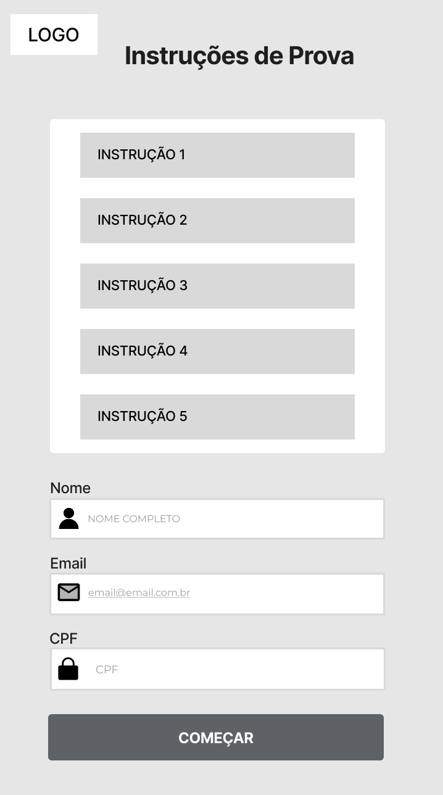
</div>

<div align="center">
  <strong>Figura # — Tela de instrucao.</strong><br> <em>
    Fonte: elaboração própria, feita usando a ferramenta do figma, segue o 
    <a href="https://www.figma.com/design/hT0ZlGn9DAz64Y1gIwFVrM/corrije-ai?node-id=14-210&p=f&t=ueNC5oJRQc9NjNEb-0">
      Link
    </a>.
  </em>
</div>

<div align="center">
  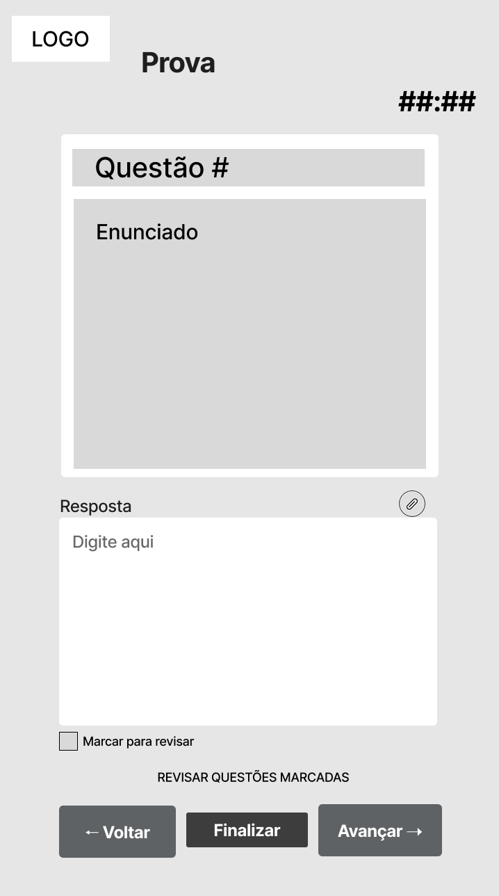
</div>

<div align="center">
  <strong>Figura # — Tela de prova.</strong><br> <em>
    Fonte: elaboração própria, feita usando a ferramenta do figma, segue o 
    <a href="https://www.figma.com/design/hT0ZlGn9DAz64Y1gIwFVrM/corrije-ai?node-id=14-210&p=f&t=ueNC5oJRQc9NjNEb-0">
      Link
    </a>.
  </em>
</div>

<div align="center">
  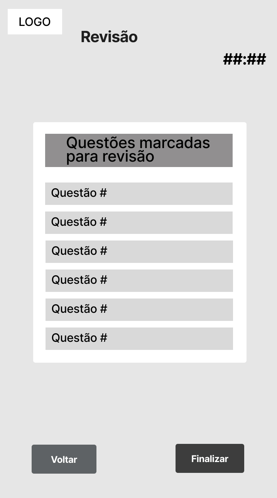
</div>

<div align="center">
  <strong>Figura # — Tela de revisao.</strong><br> <em>
    Fonte: elaboração própria, feita usando a ferramenta do figma, segue o 
    <a href="https://www.figma.com/design/hT0ZlGn9DAz64Y1gIwFVrM/corrije-ai?node-id=14-210&p=f&t=ueNC5oJRQc9NjNEb-0">
      Link
    </a>.
  </em>
</div>

<div align="center">
  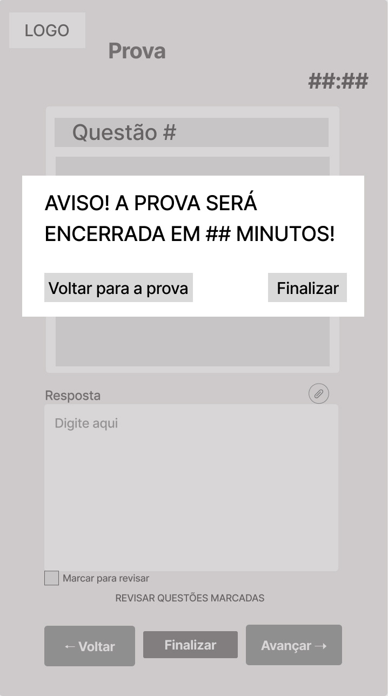
</div>

<div align="center">
  <strong>Figura # — Tela de aviso.</strong><br> <em>
    Fonte: elaboração própria, feita usando a ferramenta do figma, segue o 
    <a href="https://www.figma.com/design/hT0ZlGn9DAz64Y1gIwFVrM/corrije-ai?node-id=14-210&p=f&t=ueNC5oJRQc9NjNEb-0">
      Link
    </a>.
  </em>
</div>

<div align="center">
  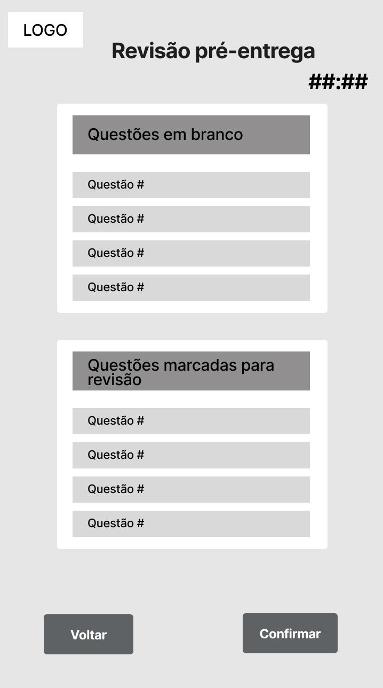
</div>

<div align="center">
  <strong>Figura # — Tela de revisão pré-entrega.</strong><br> <em>
    Fonte: elaboração própria, feita usando a ferramenta do figma, segue o 
    <a href="https://www.figma.com/design/hT0ZlGn9DAz64Y1gIwFVrM/corrije-ai?node-id=14-210&p=f&t=ueNC5oJRQc9NjNEb-0">
      Link
    </a>.
  </em>
</div>

<div align="center">
  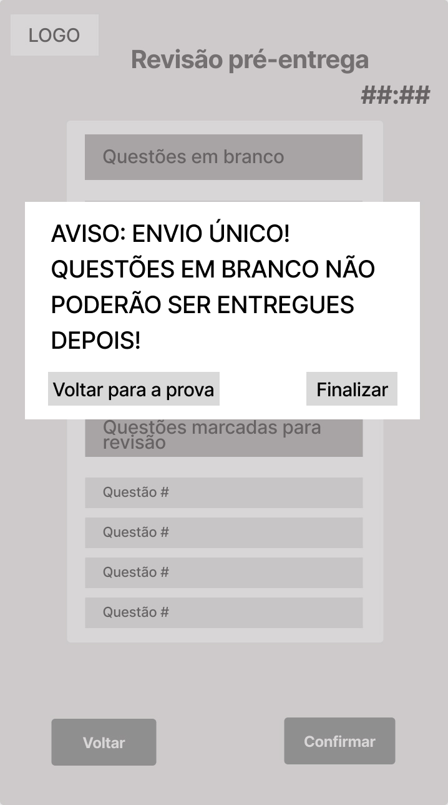
</div>

<div align="center">
  <strong>Figura # — Tela de entrega.</strong><br> <em>
    Fonte: elaboração própria, feita usando a ferramenta do figma, segue o 
    <a href="https://www.figma.com/design/hT0ZlGn9DAz64Y1gIwFVrM/corrije-ai?node-id=14-210&p=f&t=ueNC5oJRQc9NjNEb-0">
      Link
    </a>.
  </em>
</div>

<div align="center">
  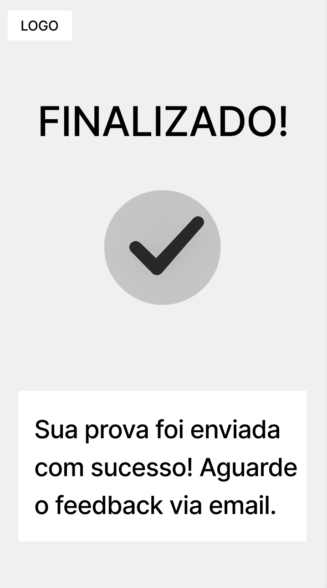
</div>

<div align="center">
  <strong>Figura # — Tela de conclusão.</strong><br> <em>
    Fonte: elaboração própria, feita usando a ferramenta do figma, segue o 
    <a href="https://www.figma.com/design/hT0ZlGn9DAz64Y1gIwFVrM/corrije-ai?node-id=14-210&p=f&t=ueNC5oJRQc9NjNEb-0">
      Link
    </a>.
  </em>
</div>

### Visualização de telas do **coordenador** A partir das USER STORIES: US-01, US-14, US-15, US-16 

<div align="center">
  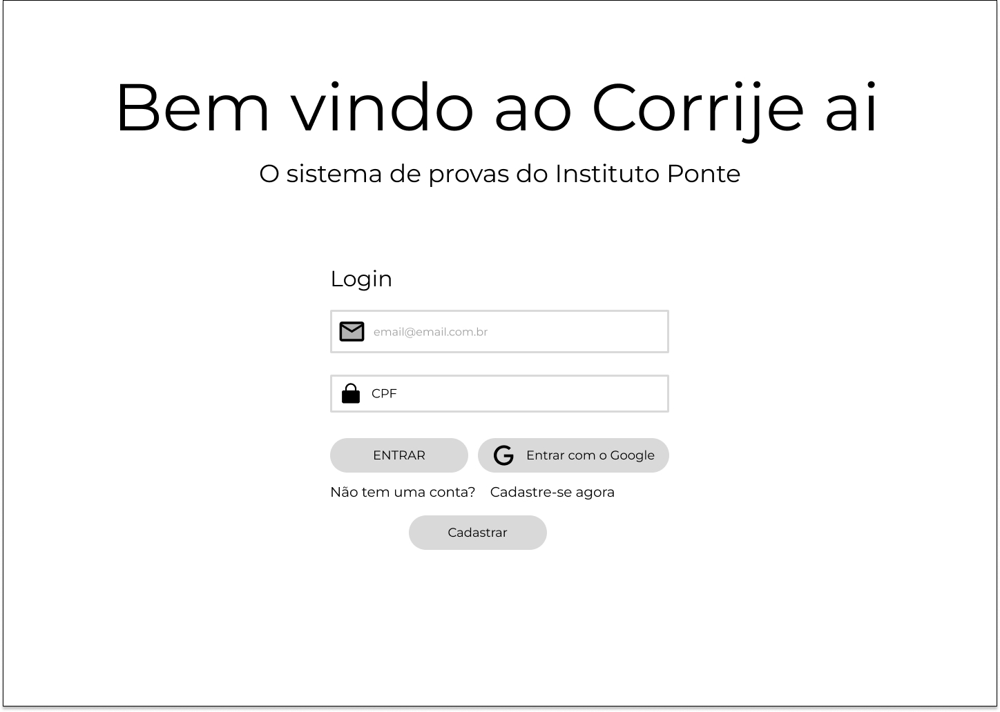
</div>

<div align="center">
  <strong>Figura 1 — Tela de Login.</strong><br><em>
    Fonte: elaboração própria, feita usando a ferramenta do Figma, segue o 
    <a href="https://www.figma.com/design/hT0ZlGn9DAz64Y1gIwFVrM/corrije-ai?node-id=14-210&p=f&t=ueNC5oJRQc9NjNEb-0">
      Link
    </a>.
  </em>
</div>

<div align="center">
  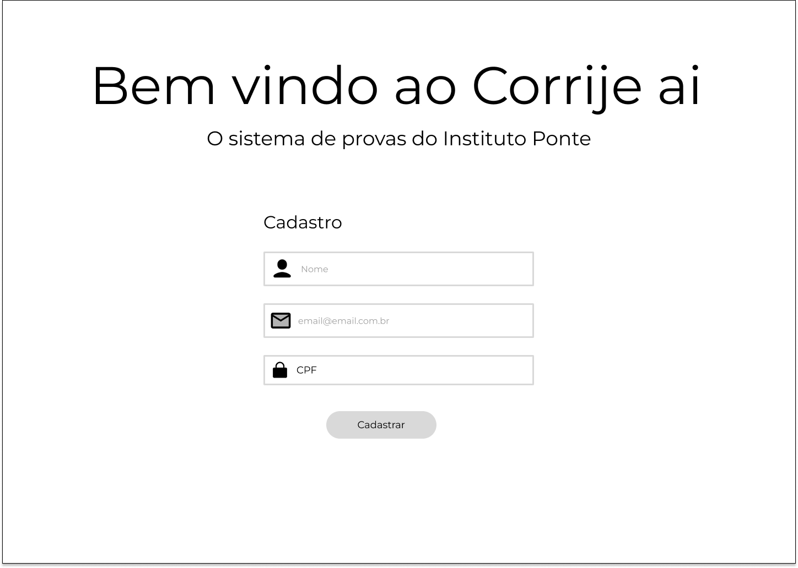
</div>

<div align="center">
  <strong>Figura 2 — Tela de Cadastro.</strong><br><em>
    Fonte: elaboração própria, feita usando a ferramenta do Figma, segue o 
    <a href="https://www.figma.com/design/hT0ZlGn9DAz64Y1gIwFVrM/corrije-ai?node-id=14-210&p=f&t=ueNC5oJRQc9NjNEb-0">
      Link
    </a>.
  </em>
</div>

<div align="center">
  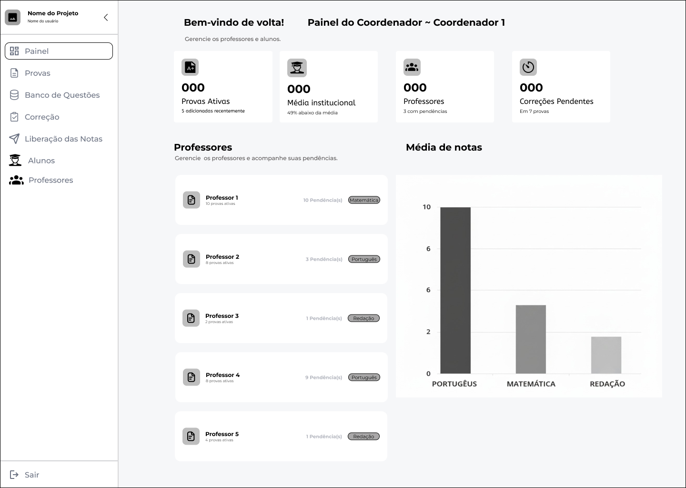
</div>

<div align="center">
  <strong>Figura 3 — Painel do Coordenador.</strong><br><em>
    Fonte: elaboração própria, feita usando a ferramenta do Figma, segue o 
    <a href="https://www.figma.com/design/hT0ZlGn9DAz64Y1gIwFVrM/corrije-ai?node-id=14-210&p=f&t=ueNC5oJRQc9NjNEb-0">
      Link
    </a>.
  </em>
</div>

<div align="center">
  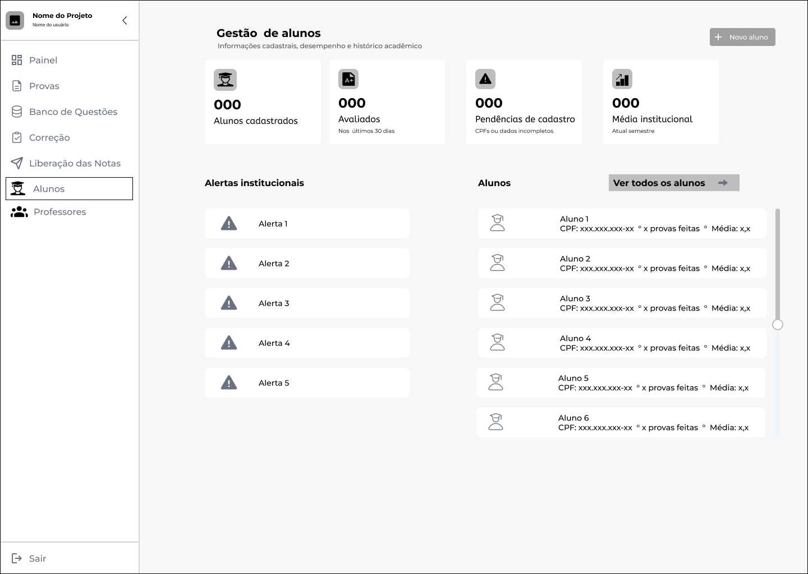
</div>

<div align="center">
  <strong>Figura 4 — Gestão de Alunos.</strong><br><em>
    Fonte: elaboração própria, feita usando a ferramenta do Figma, segue o 
    <a href="https://www.figma.com/design/hT0ZlGn9DAz64Y1gIwFVrM/corrije-ai?node-id=14-210&p=f&t=ueNC5oJRQc9NjNEb-0">
      Link
    </a>.
  </em>
</div>

<div align="center">
  
</div>

<div align="center">
  <strong>Figura 5 — Cadastro de Novo Aluno.</strong><br><em>
    Fonte: elaboração própria, feita usando a ferramenta do Figma, segue o 
    <a href="https://www.figma.com/design/hT0ZlGn9DAz64Y1gIwFVrM/corrije-ai?node-id=14-210&p=f&t=ueNC5oJRQc9NjNEb-0">
      Link
    </a>.
  </em>
</div>

<div align="center">
  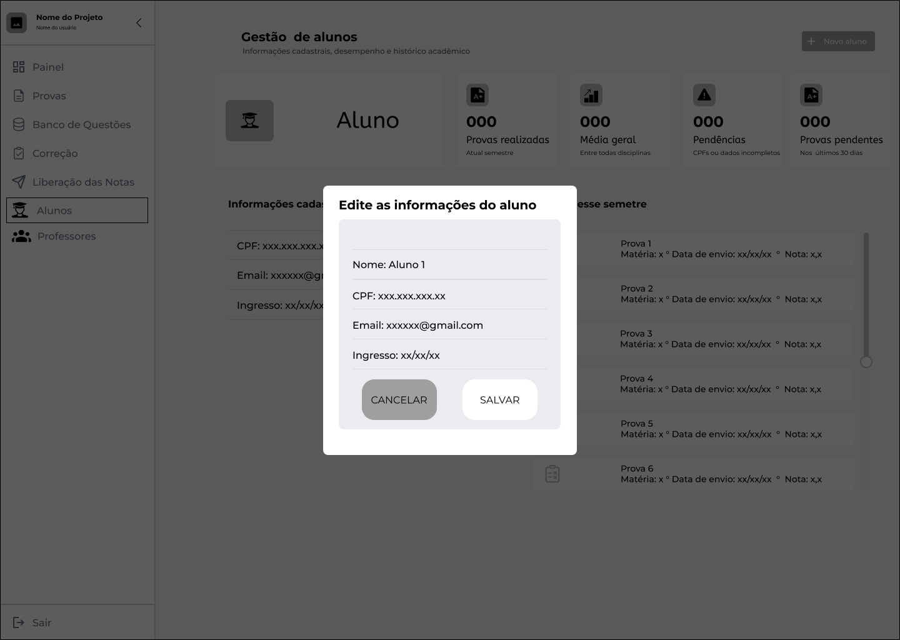
</div>

<div align="center">
  <strong>Figura 6 — Edição de Aluno.</strong><br><em>
    Fonte: elaboração própria, feita usando a ferramenta do Figma, segue o 
    <a href="https://www.figma.com/design/hT0ZlGn9DAz64Y1gIwFVrM/corrije-ai?node-id=14-210&p=f&t=ueNC5oJRQc9NjNEb-0">
      Link
    </a>.
  </em>
</div>

<div align="center">
  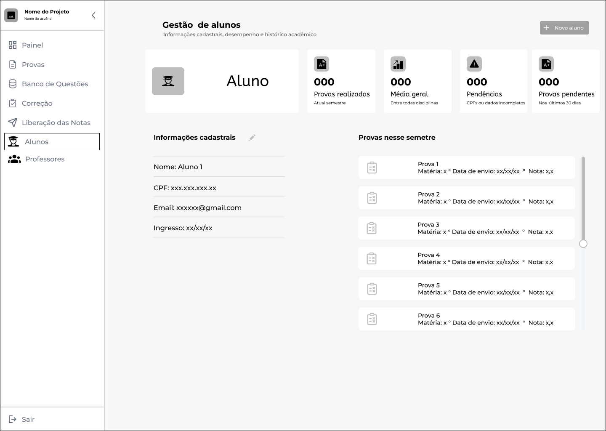
</div>

<div align="center">
  <strong>Figura 7 — Perfil do Aluno.</strong><br><em>
    Fonte: elaboração própria, feita usando a ferramenta do Figma, segue o 
    <a href="https://www.figma.com/design/hT0ZlGn9DAz64Y1gIwFVrM/corrije-ai?node-id=14-210&p=f&t=ueNC5oJRQc9NjNEb-0">
      Link
    </a>.
  </em>
</div>

<div align="center">
  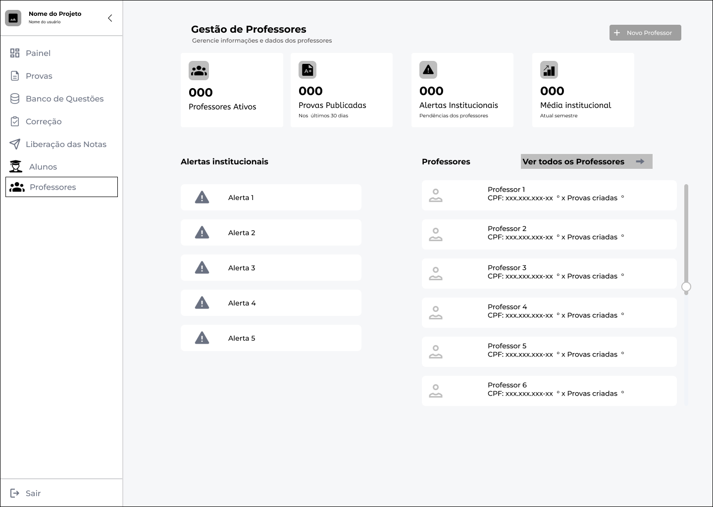
</div>

<div align="center">
  <strong>Figura 8 — Gestão de Professores.</strong><br><em>
    Fonte: elaboração própria, feita usando a ferramenta do Figma, segue o 
    <a href="https://www.figma.com/design/hT0ZlGn9DAz64Y1gIwFVrM/corrije-ai?node-id=14-210&p=f&t=ueNC5oJRQc9NjNEb-0">
      Link
    </a>.
  </em>
</div>

<div align="center">
  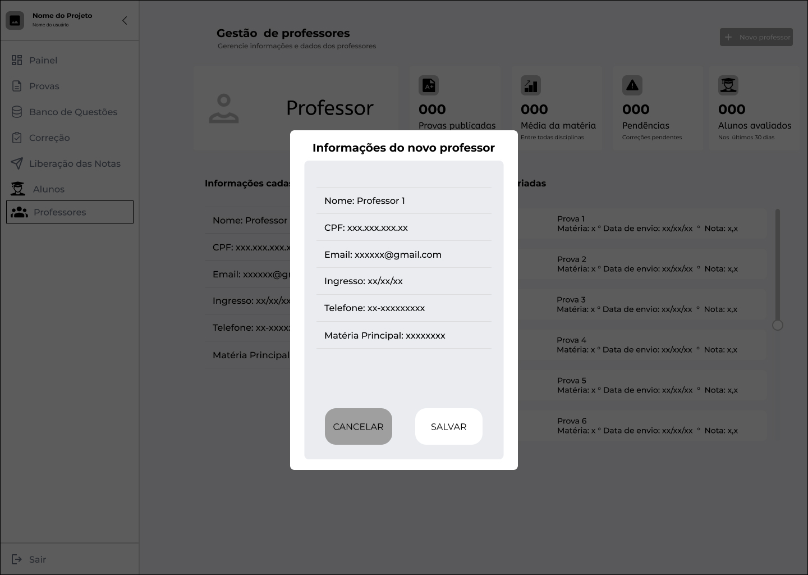
</div>

<div align="center">
  <strong>Figura 9 — Cadastro de Novo Professor.</strong><br><em>
    Fonte: elaboração própria, feita usando a ferramenta do Figma, segue o 
    <a href="https://www.figma.com/design/hT0ZlGn9DAz64Y1gIwFVrM/corrije-ai?node-id=14-210&p=f&t=ueNC5oJRQc9NjNEb-0">
      Link
    </a>.
  </em>
</div>

<div align="center">
  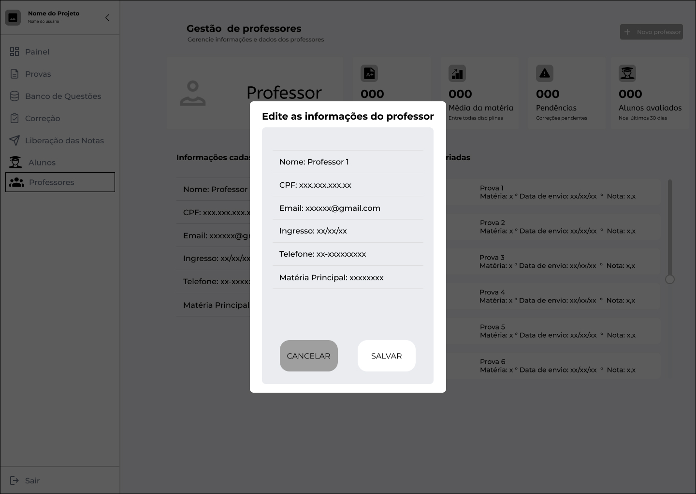
</div>

<div align="center">
  <strong>Figura 10 — Edição de Professor.</strong><br><em>
    Fonte: elaboração própria, feita usando a ferramenta do Figma, segue o 
    <a href="https://www.figma.com/design/hT0ZlGn9DAz64Y1gIwFVrM/corrije-ai?node-id=14-210&p=f&t=ueNC5oJRQc9NjNEb-0">
      Link
    </a>.
  </em>
</div>

<div align="center">
  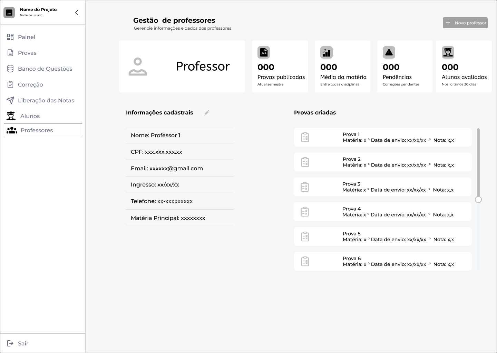
</div>

<div align="center">
  <strong>Figura 11 — Perfil do Professor.</strong><br><em>
    Fonte: elaboração própria, feita usando a ferramenta do Figma, segue o 
    <a href="https://www.figma.com/design/hT0ZlGn9DAz64Y1gIwFVrM/corrije-ai?node-id=14-210&p=f&t=ueNC5oJRQc9NjNEb-0">
      Link
    </a>.
  </em>
</div>

<div align="center">
  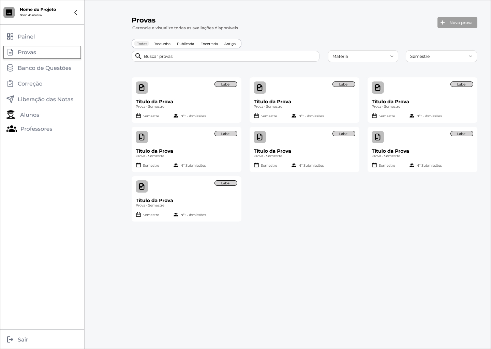
</div>

<div align="center">
  <strong>Figura 12 — Gestão de Provas.</strong><br><em>
    Fonte: elaboração própria, feita usando a ferramenta do Figma, segue o 
    <a href="https://www.figma.com/design/hT0ZlGn9DAz64Y1gIwFVrM/corrije-ai?node-id=14-210&p=f&t=ueNC5oJRQc9NjNEb-0">
      Link
    </a>.
  </em>
</div>

<div align="center">
  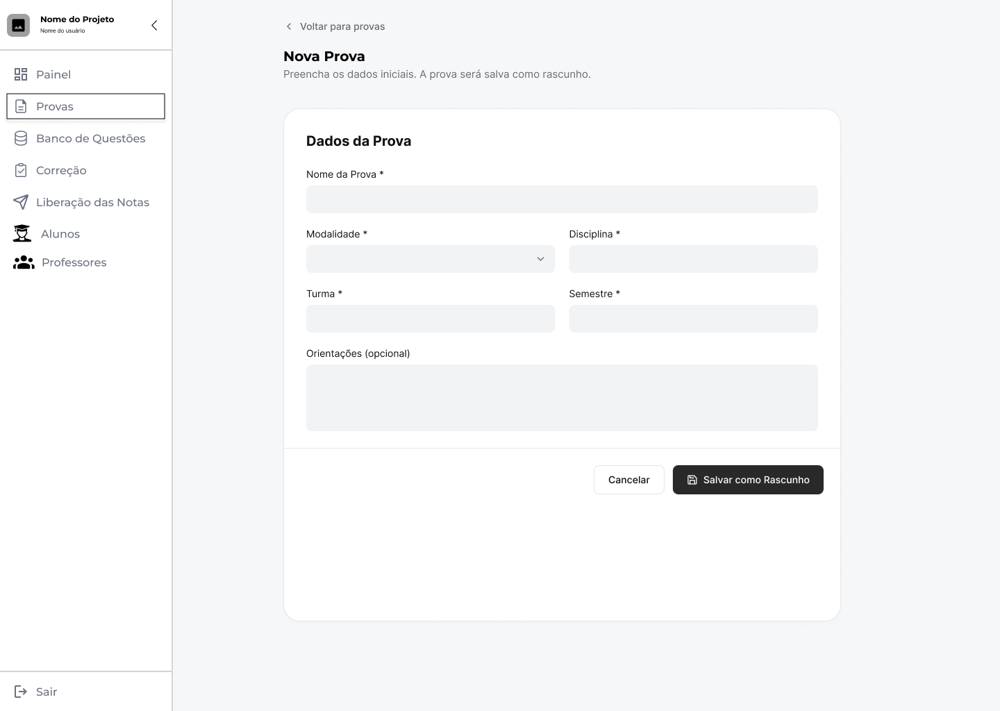
</div>

<div align="center">
  <strong>Figura 13 — Criação de Nova Prova.</strong><br><em>
    Fonte: elaboração própria, feita usando a ferramenta do Figma, segue o 
    <a href="https://www.figma.com/design/hT0ZlGn9DAz64Y1gIwFVrM/corrije-ai?node-id=14-210&p=f&t=ueNC5oJRQc9NjNEb-0">
      Link
    </a>.
  </em>
</div>

<div align="center">
  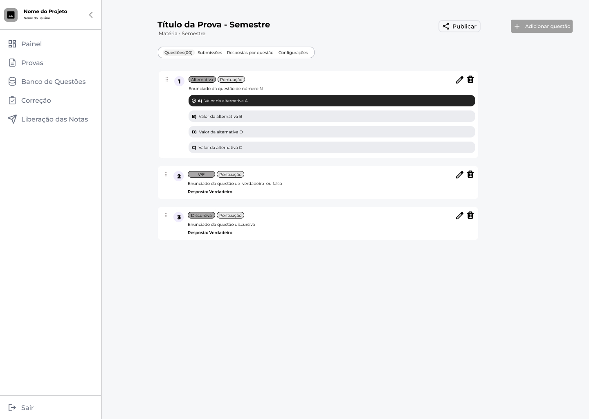
</div>

<div align="center">
  <strong>Figura 14 — Estruturação da Prova.</strong><br><em>
    Fonte: elaboração própria, feita usando a ferramenta do Figma, segue o 
    <a href="https://www.figma.com/design/hT0ZlGn9DAz64Y1gIwFVrM/corrije-ai?node-id=14-210&p=f&t=ueNC5oJRQc9NjNEb-0">
      Link
    </a>.
  </em>
</div>

<div align="center">
  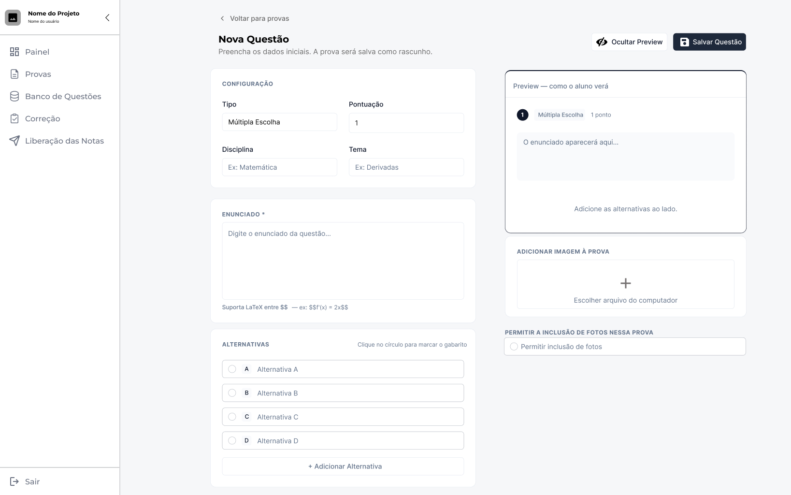
</div>

<div align="center">
  <strong>Figura 15 — Criação de Nova Questão.</strong><br><em>
    Fonte: elaboração própria, feita usando a ferramenta do Figma, segue o 
    <a href="https://www.figma.com/design/hT0ZlGn9DAz64Y1gIwFVrM/corrije-ai?node-id=14-210&p=f&t=ueNC5oJRQc9NjNEb-0">
      Link
    </a>.
  </em>
</div>

<div align="center">
  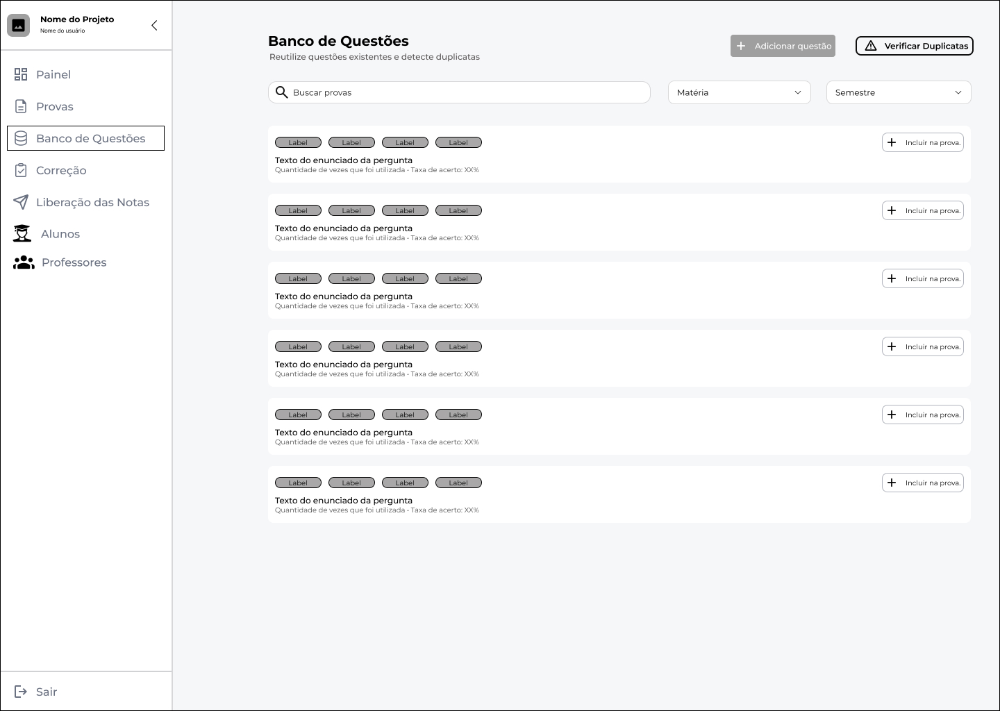
</div>

<div align="center">
  <strong>Figura 16 — Banco de Questões.</strong><br><em>
    Fonte: elaboração própria, feita usando a ferramenta do Figma, segue o 
    <a href="https://www.figma.com/design/hT0ZlGn9DAz64Y1gIwFVrM/corrije-ai?node-id=14-210&p=f&t=ueNC5oJRQc9NjNEb-0">
      Link
    </a>.
  </em>
</div>

<div align="center">
  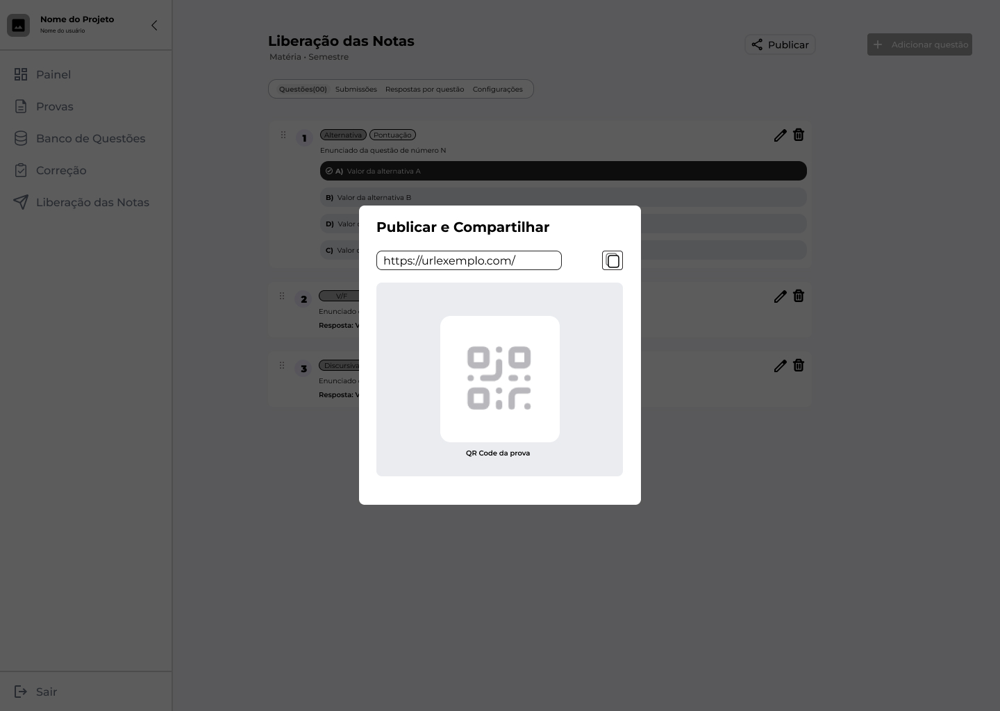
</div>

<div align="center">
  <strong>Figura 17 — Compartilhamento de Prova.</strong><br><em>
    Fonte: elaboração própria, feita usando a ferramenta do Figma, segue o 
    <a href="https://www.figma.com/design/hT0ZlGn9DAz64Y1gIwFVrM/corrije-ai?node-id=14-210&p=f&t=ueNC5oJRQc9NjNEb-0">
      Link
    </a>.
  </em>
</div>

<div align="center">
  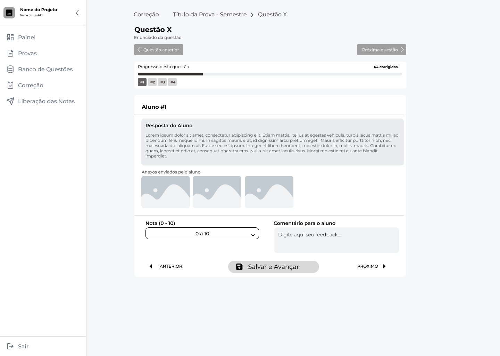
</div>

<div align="center">
  <strong>Figura 18 — Correção de Prova.</strong><br><em>
    Fonte: elaboração própria, feita usando a ferramenta do Figma, segue o 
    <a href="https://www.figma.com/design/hT0ZlGn9DAz64Y1gIwFVrM/corrije-ai?node-id=14-210&p=f&t=ueNC5oJRQc9NjNEb-0">
      Link
    </a>.
  </em>
</div>

<div align="center">
  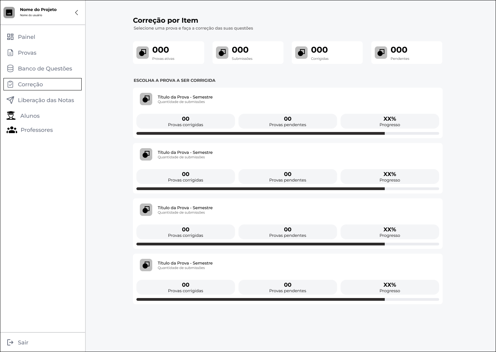
</div>

<div align="center">
  <strong>Figura 19 — Correção por Item.</strong><br><em>
    Fonte: elaboração própria, feita usando a ferramenta do Figma, segue o 
    <a href="https://www.figma.com/design/hT0ZlGn9DAz64Y1gIwFVrM/corrije-ai?node-id=14-210&p=f&t=ueNC5oJRQc9NjNEb-0">
      Link
    </a>.
  </em>
</div>

<div align="center">
  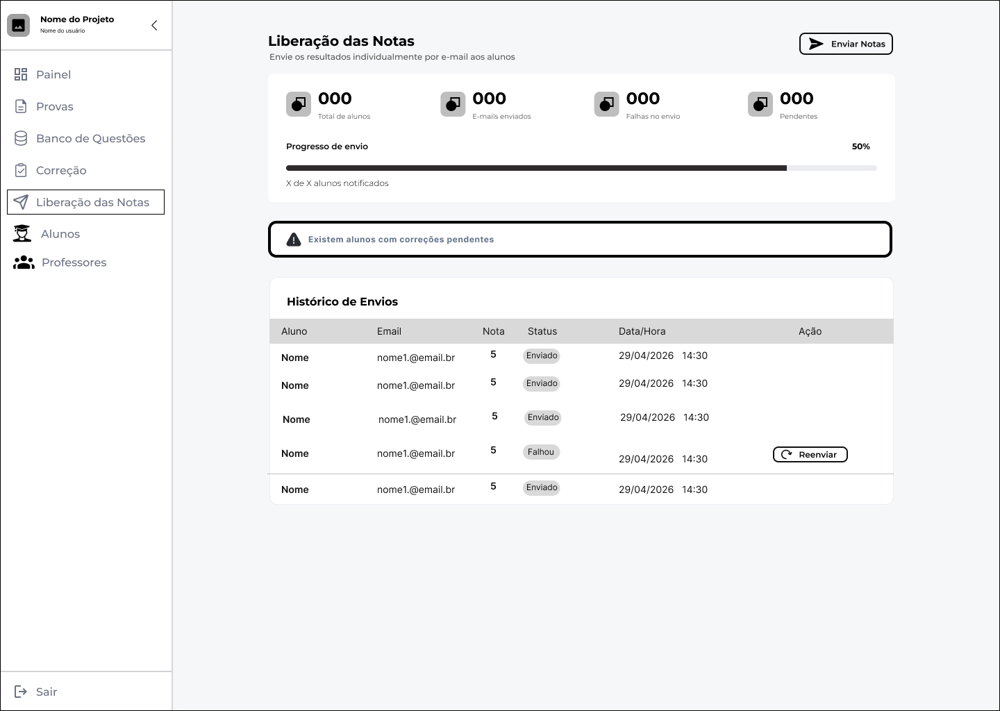
</div>

<div align="center">
  <strong>Figura 20 — Liberação das Notas.</strong><br><em>
    Fonte: elaboração própria, feita usando a ferramenta do Figma, segue o 
    <a href="https://www.figma.com/design/hT0ZlGn9DAz64Y1gIwFVrM/corrije-ai?node-id=14-210&p=f&t=ueNC5oJRQc9NjNEb-0">
      Link
    </a>.
  </em>
</div>

<div align="center">
  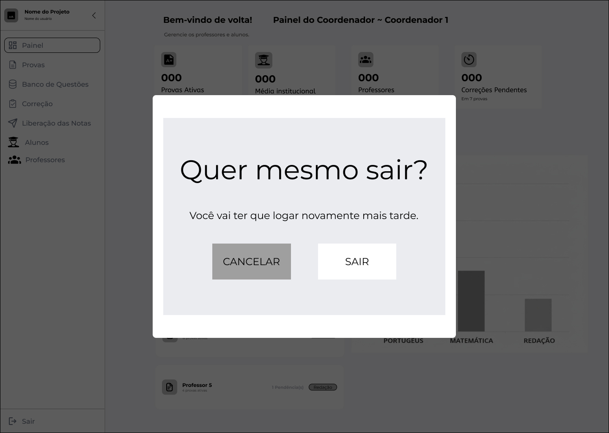
</div>

<div align="center">
  <strong>Figura 21 — Tela de Logout.</strong><br><em>
    Fonte: elaboração própria, feita usando a ferramenta do Figma, segue o 
    <a href="https://www.figma.com/design/hT0ZlGn9DAz64Y1gIwFVrM/corrije-ai?node-id=14-210&p=f&t=ueNC5oJRQc9NjNEb-0">
      Link
    </a>.
  </em>
</div>

### Visualização de telas do **professor** A partir das USER STORIES: US-01, US-02, US-03, US-04, US-05, US-07, US-12, US-13, US-15

<div align="center">
  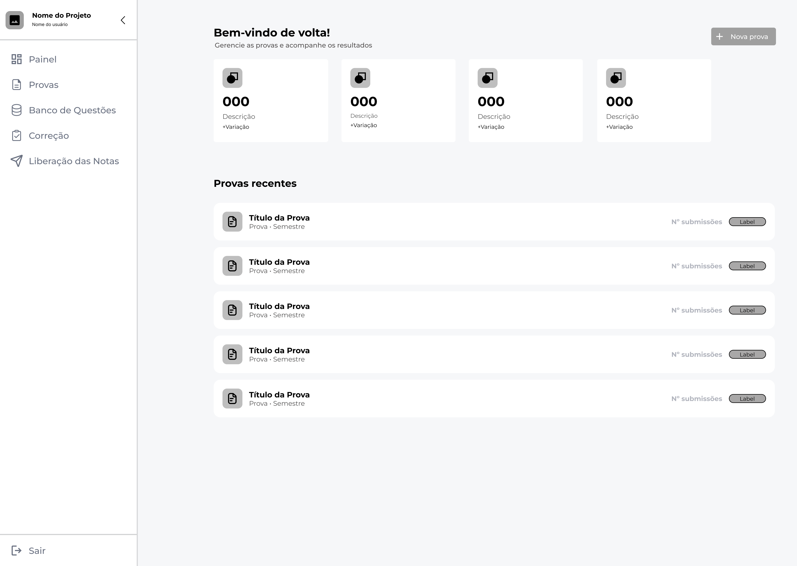
</div>

<div align="center">
  <strong>Figura 22 — Painel do Professor.</strong><br><em>
    Fonte: elaboração própria, feita usando a ferramenta do Figma, segue o 
    <a href="https://www.figma.com/design/hT0ZlGn9DAz64Y1gIwFVrM/corrije-ai?node-id=14-210&p=f&t=ueNC5oJRQc9NjNEb-0">
      Link
    </a>.
  </em>
</div>

<div align="center">
  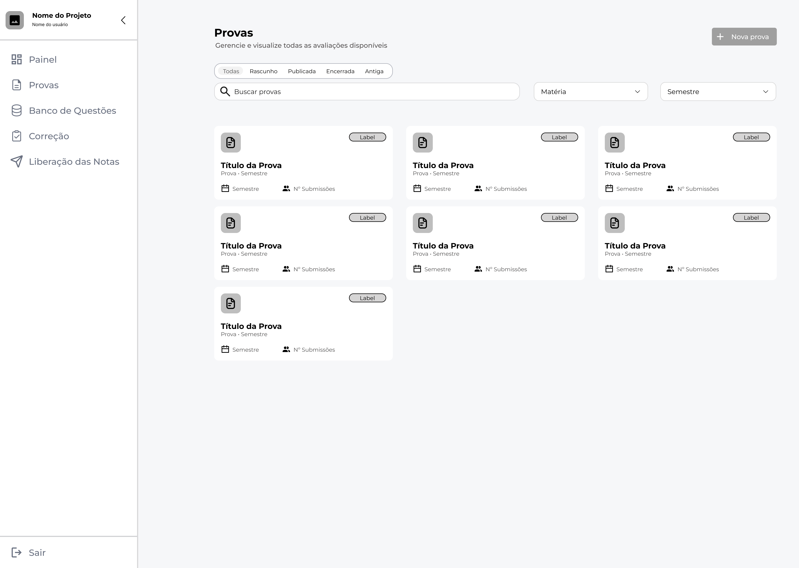
</div>

<div align="center">
  <strong>Figura 23 — Provas.</strong><br><em>
    Fonte: elaboração própria, feita usando a ferramenta do Figma, segue o 
    <a href="https://www.figma.com/design/hT0ZlGn9DAz64Y1gIwFVrM/corrije-ai?node-id=14-210&p=f&t=ueNC5oJRQc9NjNEb-0">
      Link
    </a>.
  </em>
</div>

<div align="center">
  
</div>

<div align="center">
  <strong>Figura 24 — Banco de Questões.</strong><br><em>
    Fonte: elaboração própria, feita usando a ferramenta do Figma, segue o 
    <a href="https://www.figma.com/design/hT0ZlGn9DAz64Y1gIwFVrM/corrije-ai?node-id=14-210&p=f&t=ueNC5oJRQc9NjNEb-0">
      Link
    </a>.
  </em>
</div>

<div align="center">
  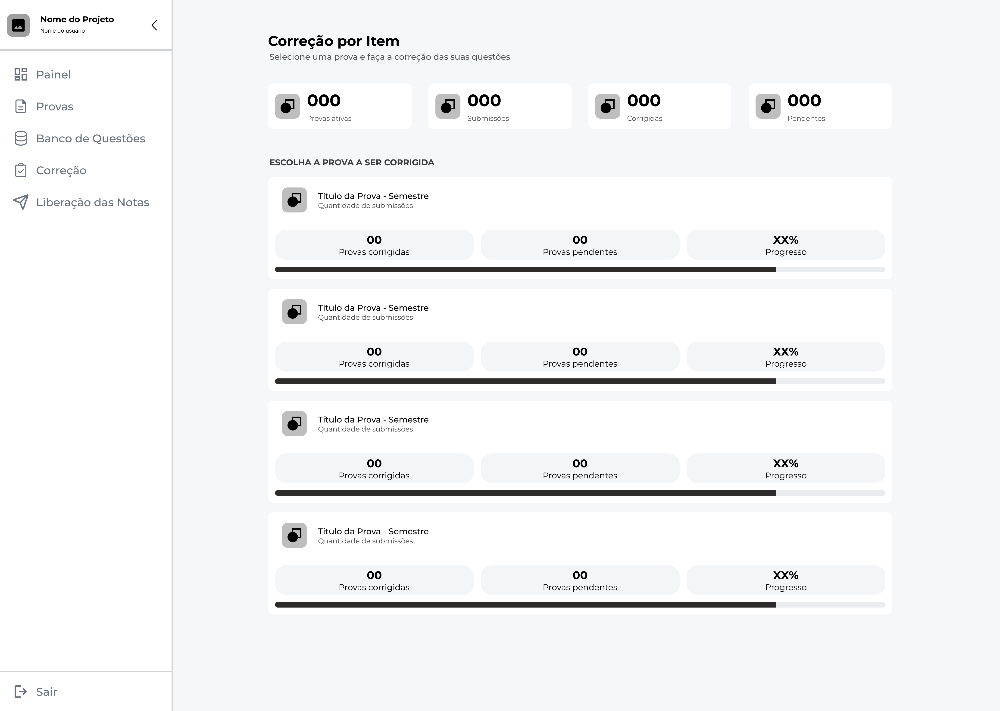
</div>

<div align="center">
  <strong>Figura 25 — Correção das Provas.</strong><br><em>
    Fonte: elaboração própria, feita usando a ferramenta do Figma, segue o 
    <a href="https://www.figma.com/design/hT0ZlGn9DAz64Y1gIwFVrM/corrije-ai?node-id=14-210&p=f&t=ueNC5oJRQc9NjNEb-0">
      Link
    </a>.
  </em>
</div>

<div align="center">
  
</div>

<div align="center">
  <strong>Figura 26 — Liberação de Nota.</strong><br><em>
    Fonte: elaboração própria, feita usando a ferramenta do Figma, segue o 
    <a href="https://www.figma.com/design/hT0ZlGn9DAz64Y1gIwFVrM/corrije-ai?node-id=14-210&p=f&t=ueNC5oJRQc9NjNEb-0">
      Link
    </a>.
  </em>
</div>

<div align="center">
  
</div>

<div align="center">
  <strong>Figura 27 — Nova Prova.</strong><br><em>
    Fonte: elaboração própria, feita usando a ferramenta do Figma, segue o 
    <a href="https://www.figma.com/design/hT0ZlGn9DAz64Y1gIwFVrM/corrije-ai?node-id=14-210&p=f&t=ueNC5oJRQc9NjNEb-0">
      Link
    </a>.
  </em>
</div>

<div align="center">
  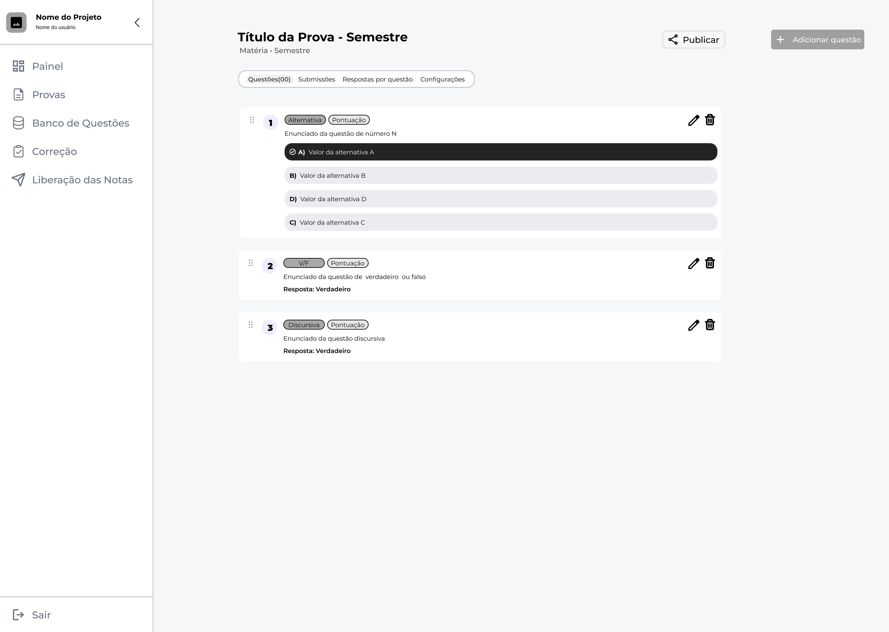
</div>

<div align="center">
  <strong>Figura 28 — Prova com suas questões.</strong><br><em>
    Fonte: elaboração própria, feita usando a ferramenta do Figma, segue o 
    <a href="https://www.figma.com/design/hT0ZlGn9DAz64Y1gIwFVrM/corrije-ai?node-id=14-210&p=f&t=ueNC5oJRQc9NjNEb-0">
      Link
    </a>.
  </em>
</div>

<div align="center">
  
</div>

<div align="center">
  <strong>Figura 29 — Compartilhar Prova.</strong><br><em>
    Fonte: elaboração própria, feita usando a ferramenta do Figma, segue o 
    <a href="https://www.figma.com/design/hT0ZlGn9DAz64Y1gIwFVrM/corrije-ai?node-id=14-210&p=f&t=ueNC5oJRQc9NjNEb-0">
      Link
    </a>.
  </em>
</div>

<div align="center">
  
</div>

<div align="center">
  <strong>Figura 30 — Nova Questão.</strong><br><em>
    Fonte: elaboração própria, feita usando a ferramenta do Figma, segue o 
    <a href="https://www.figma.com/design/hT0ZlGn9DAz64Y1gIwFVrM/corrije-ai?node-id=14-210&p=f&t=ueNC5oJRQc9NjNEb-0">
      Link
    </a>.
  </em>
</div>

<div align="center">
  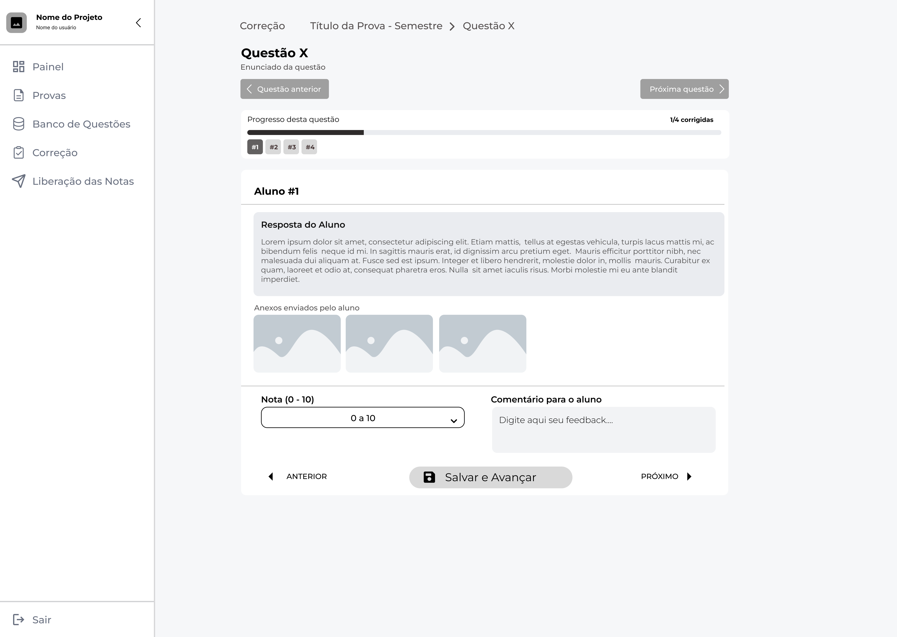
</div>

<div align="center">
  <strong>Figura 31 — Correção de questão.</strong><br><em>
    Fonte: elaboração própria, feita usando a ferramenta do Figma, segue o 
    <a href="https://www.figma.com/design/hT0ZlGn9DAz64Y1gIwFVrM/corrije-ai?node-id=14-210&p=f&t=ueNC5oJRQc9NjNEb-0">
      Link
    </a>.
  </em>
</div>


## 3.4. Guia de estilos (sprint 3)

O Style Guide da plataforma **Corrije Aí** foi desenvolvido para garantir consistência visual, acessibilidade e uma experiência intuitiva para todos os usuários (alunos, professores e coordenadores). O sistema de design segue princípios de design SaaS educacional com foco em simplicidade, confiança e organização.

### Princípios de Design

- **Visual minimalista:** uso generoso de espaço em branco para evitar sobrecarga cognitiva.
- **Hierarquia clara:** tipografia responsiva em 7 níveis distintos.
- **Bordas arredondadas:** radius entre 8px e 16px para suavidade visual.
- **Acessibilidade:** contraste mínimo AA (WCAG 2.1) em todas as combinações de cores.
- **Componentes modulares:** botões, inputs e cards reutilizáveis com estados bem definidos.
- **Grid responsivo:** sistema adaptativo de 4, 8 ou 12 colunas conforme breakpoint.
- **Espaçamento consistente:** escala baseada em múltiplos de 4px (4, 8, 16, 24, 32, 48, 64).

### Breakpoints Responsivos

| Dispositivo | Largura | Grid |
|---|---:|---:|
| Mobile | < 768px | 4 colunas |
| Tablet | 768px – 1023px | 8 colunas |
| Desktop | ≥ 1024px | 12 colunas |

### 3.4.1 Cores

A paleta de cores da Corrije Aí transmite confiança (azul escuro), energia positiva (amarelo), clareza (ciano) e simplicidade (tons neutros). Todas as combinações foram testadas para conformidade **WCAG AA**.

#### Cores Principais

| Nome | Função | Código HEX | Uso Principal | Contraste de Texto |
|---|---|---|---|---|
| Amarelo | Primária | `#FFDE59` | CTAs principais, destaques, badges | Texto escuro (`#05245F`) |
| Ciano | Secundária | `#009799` | Links, elementos interativos, acentos | Texto branco (`#FFFFFF`) |
| Azul Escuro | Estrutural | `#05245F` | Cabeçalhos, textos principais, bordas | Texto branco (`#FFFFFF`) |
| Branco Suave | Background | `#F2F2F2` | Fundos de página, áreas de conteúdo | Texto escuro (`#000000`) |
| Preto | Texto | `#000000` | Texto principal, ícones | Texto branco (`#FFFFFF`) |

#### Cores de Feedback

| Estado | Código HEX | Aplicação |
|---|---|---|
| Sucesso | `#22C55E` | Confirmações, aprovações, resultados positivos |
| Erro | `#EF4444` | Validações falhadas, avisos críticos, exclusões |
| Aviso | `#F59E0B` | Alertas moderados, campos obrigatórios |
| Informação | `#3B82F6` | Tooltips, mensagens neutras, ajuda contextual |

#### Exemplos de Uso

```css
/* Botão primário */
background: #FFDE59;
color: #05245F;

/* Input com foco */
border: 1.5px solid #009799;
background: #F2F2F2;

/* Input com erro */
border: 1.5px solid #EF4444;
background: #FEF2F2;
```

### 3.4.2 Tipografia

A tipografia utiliza três famílias de fontes com funções específicas para garantir legibilidade e hierarquia visual em todos os dispositivos.

#### Famílias de Fonte

| Família | Pesos Usados | Função | Aplicação |
|---|---|---|---|
| Poppins | 300 (Light), 500 (Medium) | Títulos e subtítulos | H1, H2, H3, labels de botões |
| Inter | 400 (Regular) | Corpo de texto | Parágrafos, inputs, descrições |
| JetBrains Mono | 400 (Regular) | Código e dados técnicos | Badges, códigos hexadecimais, endpoints |

#### Escala Tipográfica (Desktop)

| Nível | Tag | Tamanho | Peso | Família | Uso |
|---:|---|---:|---:|---|---|
| 1 | H1 | 48px | 500 | Poppins | Títulos de página principal |
| 2 | H2 | 32px | 500 | Poppins | Seções principais |
| 3 | H3 | 24px | 500 | Poppins | Subsecções e cards |
| 4 | Subtítulo | 20px | 300 | Poppins | Descrições de seção |
| 5 | Padrão | 16px | 400 | Inter | Corpo de texto |
| 6 | Secundário | 14px | 400 | Inter | Metadados, timestamps |
| 7 | Pequeno | 12px | 400 | Inter | Labels, ajuda |

#### Tipografia Responsiva

| Elemento | Mobile (< 768px) | Tablet (768–1023px) | Desktop (≥ 1024px) |
|---|---:|---:|---:|
| H1 | 32px | 40px | 48px |
| H2 | 24px | 28px | 32px |
| H3 | 20px | 22px | 24px |
| Subtítulo | 18px | 18px | 20px |
| Texto padrão | 16px | 16px | 16px |
| Texto secundário | 14px | 14px | 14px |
| Texto pequeno | 12px | 12px | 12px |

**Nota:** Títulos (H1–H3) aumentam progressivamente para aproveitar espaço em telas maiores, enquanto textos de corpo permanecem consistentes para manter legibilidade.

#### Line-height (altura de linha)

- **Títulos (Poppins):** 1.1 – 1.2 (compacto para impacto visual).
- **Corpo de texto (Inter):** 1.6 – 1.7 (confortável para leitura prolongada).
- **Código (JetBrains Mono):** 1.4 (otimizado para dados técnicos).

### 3.4.3 Iconografia e imagens 

#### Sistema de Ícones

A plataforma utiliza ícones lineares da biblioteca **Lucide React** (variante moderna do Heroicons), com estilo minimalista e *stroke* consistente.

**Especificações técnicas:**

- **Stroke width:** 1.5px
- **Tamanhos padrão:** 14px (inline), 16px (texto), 20px (botões), 24px (cards)
- **Cor primária:** `#05245F` (azul escuro)
- **Cor secundária:** `#6B7280` (cinza neutro para metadados)

**Ícones utilizados:**

| Ícone | Componente Lucide | Contexto de Uso |
|---|---|---|
| 📄 | `FileText` | Provas, documentos, arquivos |
| 👥 | `Users` | Submissões, alunos, turmas |

#### Diretrizes de Uso

- **Alinhamento:** ícones devem estar verticalmente centralizados com o texto adjacente.
- **Espaçamento:** margem de 6–8px entre ícone e texto.
- **Estados interativos:** reduzir opacidade para 70% em estado *disabled*.
- **Containers de ícones:** background `#F2F2F2`, dimensões 44×44px, border-radius 12px.

#### Imagens e Assets

**Logotipo:**

- **Formato:** PNG com fundo transparente.
- **Dimensões máximas:** 340px (largura) × 100px (altura).
- **Container:** fundo branco (`#FFFFFF`), padding 32px, border-radius 16px.
- **Sombra:** `0 4px 16px rgba(0,0,0,0.1)`.

<div align="center">
  <strong>Figura 32 — Style guide.</strong><br><em>
    Fonte: elaboração própria, feita usando a ferramenta do Figma, segue o
    <a href="https://www.figma.com/design/hT0ZlGn9DAz64Y1gIwFVrM/corrije-ai?node-id=418-10782&t=6EwlpwAERlPfGWIS-0">
      Link
    </a>.
  </em>
</div>

<div align="center">
  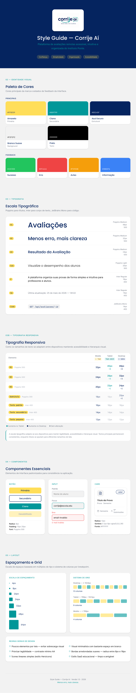
</div>

**Componente `ImageWithFallback`:** todas as imagens devem usar o componente `ImageWithFallback` para garantir tratamento de erros e carregamento progressivo:

```tsx
import { ImageWithFallback } from "@/app/components/figma/ImageWithFallback";

<ImageWithFallback
  src={imageSrc}
  alt="Descrição acessível"
  className="w-full object-contain"
/>
```

**Diretrizes para imagens:**

- **Aspect ratio:** preservar proporção original.
- **object-fit:** `contain` para logos/ícones; `cover` para backgrounds.
- **Lazy loading:** nativo via `loading=\"lazy\"` quando apropriado.
- **Alt text:** sempre descritivo e contextual para acessibilidade.

#### Recursos Adicionais

- Fonte Poppins: Google Fonts
- Fonte Inter: Google Fonts
- Fonte JetBrains Mono: Google Fonts
- Ícones Lucide: https://lucide.dev

## 3.5 Protótipo de alta fidelidade (sprint 3)

As telas a seguir apresentam recortes do protótipo de alta fidelidade do Corrije Aí. O protótipo completo pode ser visualizado no link público do Figma:

<div align="center">
  <a href="https://www.figma.com/design/hT0ZlGn9DAz64Y1gIwFVrM/corrije-ai?node-id=372-2092&p=f&t=KHZxl8QX36lqNdaW-0">
    telas do protótipo
  </a>
  •
  <a href="https://spool-cobalt-21834134.figma.site">
    fluxo (coordenador/professor)
  </a>
  •
  <a href="https://gravy-craft-64395734.figma.site">
    fluxo (aluno)
  </a>.
</div>

<div align="center">
  <strong>Figura 33 — Tela de login do professor.</strong><br><em>
    Fonte: elaboração própria, feita usando a ferramenta do Figma, segue as
    <a href="https://www.figma.com/design/hT0ZlGn9DAz64Y1gIwFVrM/corrije-ai?node-id=372-2092&p=f&t=KHZxl8QX36lqNdaW-0">
      telas do protótipo
    </a>
    e o
    <a href="https://spool-cobalt-21834134.figma.site">
      fluxo (coordenador/professor)
    </a>.
  </em>
</div>

<div align="center">
  
</div>

<div align="center">
  <strong>Figura 34 — Tela de home do professor.</strong><br><em>
    Fonte: elaboração própria, feita usando a ferramenta do Figma, segue as
    <a href="https://www.figma.com/design/hT0ZlGn9DAz64Y1gIwFVrM/corrije-ai?node-id=372-2092&p=f&t=KHZxl8QX36lqNdaW-0">
      telas do protótipo
    </a>
    e o
    <a href="https://spool-cobalt-21834134.figma.site">
      fluxo (coordenador/professor)
    </a>.
  </em>
</div>

<div align="center">
  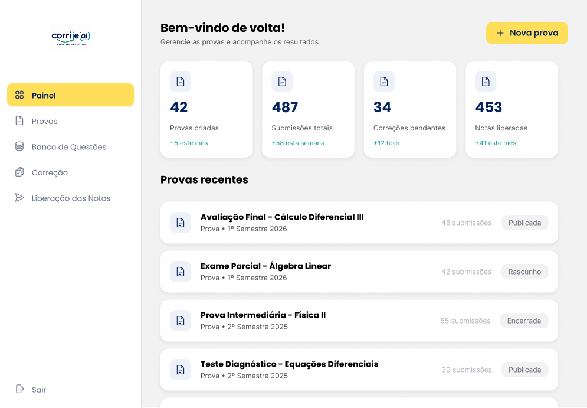
</div>

<div align="center">
  <strong>Figura 35 — Tela de nova prova.</strong><br><em>
    Fonte: elaboração própria, feita usando a ferramenta do Figma, segue as
    <a href="https://www.figma.com/design/hT0ZlGn9DAz64Y1gIwFVrM/corrije-ai?node-id=372-2092&p=f&t=KHZxl8QX36lqNdaW-0">
      telas do protótipo
    </a>
    e o
    <a href="https://spool-cobalt-21834134.figma.site">
      fluxo (coordenador/professor)
    </a>.
  </em>
</div>

<div align="center">
  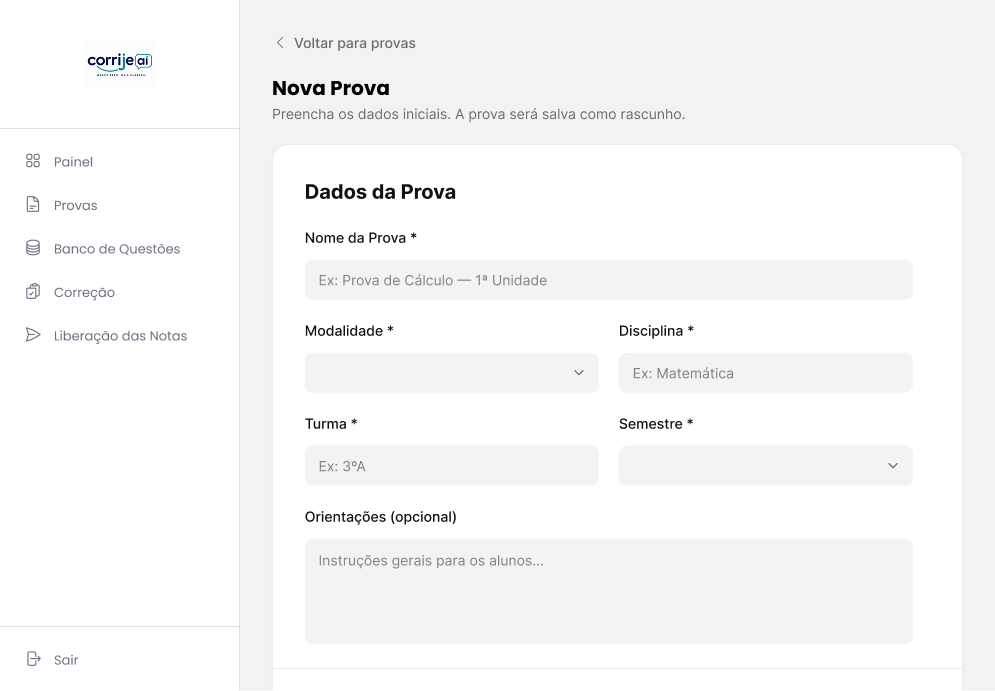
</div>

<div align="center">
  <strong>Figura 36 — Tela de instrução de prova.</strong><br><em>
    Fonte: elaboração própria, feita usando a ferramenta do Figma, segue as
    <a href="https://www.figma.com/design/hT0ZlGn9DAz64Y1gIwFVrM/corrije-ai?node-id=372-2092&p=f&t=KHZxl8QX36lqNdaW-0">
      telas do protótipo
    </a>
    e o
    <a href="https://gravy-craft-64395734.figma.site">
      fluxo (aluno)
    </a>.
  </em>
</div>

<div align="center">
  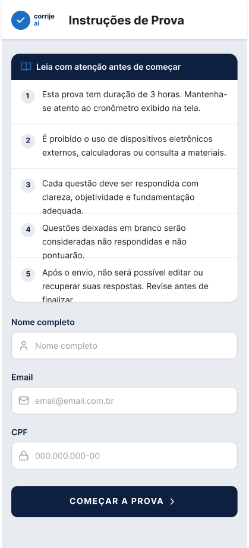
</div>

<div align="center">
  <strong>Figura 37 — Tela de início de prova.</strong><br><em>
    Fonte: elaboração própria, feita usando a ferramenta do Figma, segue as
    <a href="https://www.figma.com/design/hT0ZlGn9DAz64Y1gIwFVrM/corrije-ai?node-id=372-2092&p=f&t=KHZxl8QX36lqNdaW-0">
      telas do protótipo
    </a>
    e o
    <a href="https://gravy-craft-64395734.figma.site">
      fluxo (aluno)
    </a>.
  </em>
</div>

<div align="center">
  
</div>

## 3.6. Modelagem do banco de dados (sprints 2 e 4)

### 3.6.1. Modelo Entidade-Relacionamento (ER) (sprint 2)

O ER conceitual abaixo segue a migration atual e usa apenas entidades reais do backend: coordenador, professor, aluno, materia, tema, questao, enunciado, alternativa, prova, prova_questao, prova_aluno, resposta_aluno, resposta_anexo, correcao, feedback, resultado_aluno, exportacao_resultado, email_envio e avaliacao_log.

~~~plantuml
@startuml ERAtual
hide circle
skinparam linetype ortho

entity coordenador
entity professor
entity aluno
entity materia
entity materia_professor
entity tema
entity questao
entity enunciado
entity alternativa
entity prova
entity prova_status_historico
entity prova_questao
entity prova_aluno
entity resposta_aluno
entity resposta_anexo
entity correcao
entity feedback
entity resultado_aluno
entity exportacao_resultado
entity email_envio
entity avaliacao_log

coordenador ||--o{ professor
professor ||--o{ materia_professor
materia ||--o{ materia_professor
materia ||--o{ tema
materia ||--o{ questao
materia ||--o{ prova
questao ||--|| enunciado
questao ||--o{ alternativa
prova ||--o{ prova_status_historico
prova ||--o{ prova_questao
questao ||--o{ prova_questao
prova ||--o{ prova_aluno
aluno ||--o{ prova_aluno
prova_aluno ||--o{ resposta_aluno
questao ||--o{ resposta_aluno
alternativa |o--o{ resposta_aluno
resposta_aluno ||--o{ resposta_anexo
resposta_aluno ||--o| correcao
correcao ||--o{ feedback
prova_aluno ||--o| resultado_aluno
prova ||--o{ exportacao_resultado
prova_aluno ||--o{ email_envio
prova ||--o{ avaliacao_log
@enduml
~~~

### 3.6.2. Diagrama Entidade-Relacionamento (DER) (sprint 2)

O DER fisico preserva os nomes de tabela e campos implementados. As relacoes principais sao:

| Relacao | Implementacao fisica |
|---------|----------------------|
| Coordenador -> Professor | professor.coordenador_id referencia coordenador.id |
| Professor <-> Materia | materia_professor(professor_id, materia_id) |
| Materia -> Tema/Questao/Prova | tema.materia_id, questao.materia_id e prova.materia_id |
| Questao -> Enunciado/Alternativa | enunciado.questao_id e alternativa.questao_id |
| Prova <-> Questao | prova_questao(prova_id, questao_id) com ordem e pontuacao_max |
| Prova -> ProvaAluno | prova_aluno.prova_id |
| Aluno -> ProvaAluno | prova_aluno.aluno_id |
| ProvaAluno -> RespostaAluno | resposta_aluno.prova_aluno_id |
| RespostaAluno -> RespostaAnexo | resposta_anexo.resposta_id |
| RespostaAluno -> Correcao | correcao.resposta_id unico por resposta |
| Correcao -> Feedback | feedback.correcao_id |
| ProvaAluno -> ResultadoAluno | resultado_aluno.prova_aluno_id |
| Prova -> ExportacaoResultado/AvaliacaoLog | exportacao_resultado.prova_id e avaliacao_log.prova_id |
| ProvaAluno -> EmailEnvio | email_envio.prova_aluno_id |

Regras fisicas relevantes:

- prova_questao impede duplicidade de questao na mesma prova e controla ordem.
- resposta_aluno vincula a resposta a prova_aluno e questao; alternativa_id e opcional para discursivas.
- correcao usa ON CONFLICT por resposta_id para permitir atualizacao de nota.
- prova_status_historico registra transicoes de status.
- avaliacao_log guarda eventos de auditoria/analytics.

### 3.6.3. Modelo Relacional e Modelo Fisico

Esta secao apresenta a modelagem fisica implementada no PostgreSQL/Supabase. A fonte de verdade e src/backend/src/database/migrations/migration.sql, que define tipos, tabelas, PKs, FKs, indices, triggers, funcoes auxiliares e politicas de Row Level Security.

#### Decisoes fisicas implementadas

- UUID como chave primaria nas entidades centrais.
- TIMESTAMPTZ para datas de criacao, atualizacao, publicacao, envio e correcao.
- ENUMs para status de prova, tipo de questao, perfil, status de prova_aluno, formato de exportacao e status de e-mail.
- FOREIGN KEY entre coordenador, professor, materia, questao, prova, aluno, respostas, correcoes e resultados.
- Indices em professor_id, materia_id, tema_id, status, prova_id, questao_id e acoes de log.
- UNIQUE e indices parciais para e-mails, professor-materia, questao em prova e alternativa correta por questao quando aplicavel.
- Triggers de validacao para publicacao, alternativas, vinculo professor/materia, resposta, correcao e transicao de status.
- RLS habilitado nas tabelas do dominio.

| Grupo | Tabelas | Finalidade |
|-------|---------|------------|
| Identidade e acesso | coordenador, professor, aluno | Usuarios internos e identificacao do aluno. |
| Catalogo academico | materia, materia_professor, tema | Disciplinas, vinculos e temas. |
| Banco de questoes | questao, enunciado, alternativa | Questao, LaTeX/imagem e alternativas. |
| Provas | prova, prova_status_historico, prova_questao | Metadados, ciclo de vida, URL/QR Code e composicao. |
| Aplicacao ao aluno | prova_aluno, resposta_aluno, resposta_anexo | Inicio, respostas, envio final e anexos. |
| Correcao e feedback | correcao, feedback | Nota, observacao e feedback do professor. |
| Resultados e comunicacao | resultado_aluno, exportacao_resultado, email_envio | Notas, exportacoes e e-mails. |
| Auditoria e analytics | avaliacao_log, relatorio | Eventos de uso, logs e relatorios. |

#### Relacionamentos principais

- coordenador 1:N professor.
- professor N:N materia por materia_professor.
- materia 1:N tema, questao e prova.
- questao 1:1 enunciado e 1:N alternativa.
- prova N:N questao por prova_questao.
- prova 1:N prova_aluno e prova_status_historico.
- aluno 1:N prova_aluno.
- prova_aluno 1:N resposta_aluno.
- resposta_aluno 1:N resposta_anexo e 1:1 correcao.
- correcao 1:N feedback.
- prova 1:N resultado_aluno, exportacao_resultado, email_envio e avaliacao_log.

#### Migration DDL

~~~text
src\backend\src\database\migrations\migration.sql
~~~

### 3.6.4. Consultas SQL e logica proposicional (sprint 2)

As consultas abaixo foram retiradas ou derivadas diretamente dos repositories e da migration do backend. Cada consulta possui condicao composta e demonstra AND, OR, EXISTS, ILIKE, IN, IS NOT NULL, negacao logica e UPSERT.

#### Consulta 1 - validacao de questoes objetivas antes da publicacao

~~~sql
SELECT COUNT(*)
FROM "prova_questao" pq
JOIN "questao" q ON q."id" = pq."questao_id"
WHERE pq."prova_id" = $1
  AND q."tipo" = 'multipla_escolha'
  AND (
    (SELECT COUNT(*) FROM "alternativa" a WHERE a."questao_id" = q."id") < 2
    OR
    (SELECT COUNT(*) FROM "alternativa" a WHERE a."questao_id" = q."id" AND a."correta" = TRUE) <> 1
  );
~~~

Descricao: conta questoes de multipla escolha invalidas antes da publicacao.

| Proposicao | Significado |
|------------|-------------|
| A | A questao pertence a prova informada. |
| B | A questao e multipla escolha. |
| C | A questao tem menos de duas alternativas. |
| D | A questao nao tem exatamente uma alternativa correta. |

Expressao logica: A AND B AND (C OR D).

| A | B | C | D | C OR D | Resultado |
|---|---|---|---|--------|-----------|
| F | F | F | F | F | F |
| F | V | V | F | V | F |
| V | F | V | V | V | F |
| V | V | F | F | F | F |
| V | V | V | F | V | V |
| V | V | F | V | V | V |
| V | V | V | V | V | V |

#### Consulta 2 - listagem de questoes por professor, status ativo e busca textual

~~~sql
SELECT q.*, e."conteudo_latex" AS "enunciado_conteudo_latex"
FROM "questao" q
JOIN "enunciado" e ON e."questao_id" = q."id"
WHERE EXISTS (
  SELECT 1
  FROM "materia_professor" mp
  WHERE mp."materia_id" = q."materia_id"
    AND mp."professor_id" = $1
)
AND q."ativa" = TRUE
AND e."conteudo_latex" ILIKE $2;
~~~

Descricao: baseada em QuestaoRepository.findMany, filtra por vinculo professor/materia, questao ativa e busca ILIKE.

| Proposicao | Significado |
|------------|-------------|
| A | Existe vinculo entre materia da questao e professor autenticado. |
| B | A questao esta ativa. |
| C | O enunciado atende ao filtro ILIKE. |

Expressao logica: A AND B AND C.

| A | B | C | Resultado |
|---|---|---|-----------|
| F | F | F | F |
| F | V | V | F |
| V | F | V | F |
| V | V | F | F |
| V | V | V | V |

#### Consulta 3 - UPSERT de correcao automatica de objetivas

~~~sql
INSERT INTO "correcao" ("resposta_id", "professor_id", "nota", "tipo", "corrigida_em")
SELECT
  ra."id",
  $2,
  CASE WHEN a."correta" = TRUE THEN pq."pontuacao_max" ELSE 0 END,
  'automatica',
  CURRENT_TIMESTAMP
FROM "resposta_aluno" ra
JOIN "prova_aluno" pa ON pa."id" = ra."prova_aluno_id"
JOIN "prova_questao" pq ON pq."prova_id" = pa."prova_id" AND pq."questao_id" = ra."questao_id"
JOIN "questao" q ON q."id" = ra."questao_id"
JOIN "alternativa" a ON a."id" = ra."alternativa_id"
WHERE pa."prova_id" = $1
  AND pa."status" IN ('enviada', 'corrigida')
  AND q."tipo" IN ('multipla_escolha', 'verdadeiro_falso')
  AND ra."alternativa_id" IS NOT NULL
ON CONFLICT ("resposta_id") DO UPDATE
SET "nota" = EXCLUDED."nota",
    "tipo" = 'automatica',
    "corrigida_em" = CURRENT_TIMESTAMP;
~~~

Descricao: query real de CorrecaoRepository.corrigirObjetivas.

| Proposicao | Significado |
|------------|-------------|
| A | A resposta pertence a prova informada. |
| B | A prova do aluno esta enviada ou corrigida. |
| C | A questao e objetiva. |
| D | A resposta possui alternativa marcada. |

Expressao logica: A AND B AND C AND D.

| A | B | C | D | Resultado |
|---|---|---|---|-----------|
| F | F | F | F | F |
| F | V | V | V | F |
| V | F | V | V | F |
| V | V | F | V | F |
| V | V | V | F | F |
| V | V | V | V | V |

#### Consulta 4 - remocao de questao de uma prova

~~~sql
DELETE FROM "prova_questao"
WHERE "prova_id" = $1
  AND "questao_id" = $2;
~~~

Descricao: query real de ProvaQuestaoRepository.remover.

| Proposicao | Significado |
|------------|-------------|
| A | O vinculo pertence a prova informada. |
| B | O vinculo aponta para a questao informada. |

Expressao logica: A AND B.

| A | B | Resultado |
|---|---|-----------|
| F | F | F |
| F | V | F |
| V | F | F |
| V | V | V |

## 3.7. WebAPI e endpoints (sprints 3 e 4)

A WebAPI esta implementada em Fastify, documentada por Swagger UI em /docs e registrada sob o prefixo /api/v1. A documentacao OpenAPI e gerada a partir dos schemas Zod usados nas rotas.

| Item | Padrao |
|------|--------|
| Base URL | /api/v1 |
| Swagger UI | /docs |
| Header protegido | Authorization: Bearer <token> |
| Content-Type | application/json; uploads usam multipart/form-data |
| Sucesso | { "success": true, "data": ..., "meta": ... } |
| Erro | { "success": false, "error": { "code": "...", "message": "...", "details": ... } } |
| Status comuns | 200, 201, 204, 400, 401, 403, 404, 409, 422 e 500 |

| Dominio | Metodo | Rota | Entrada | Resposta | Status | RF/RN |
|---------|--------|------|---------|----------|--------|-------|
| Saude | GET | /api/v1/health | Sem body | Status da aplicacao | 200 | RNF disponibilidade |
| Saude | GET | /api/v1/health/db | Sem body | Status do PostgreSQL | 200, 500 | RNF disponibilidade |
| Auth | GET | /api/v1/auth/google | Sem body | Inicio OAuth | 200, 302 | RF002/RN18 |
| Auth | GET | /api/v1/auth/google/callback | Query OAuth | Token/sessao | 200, 401, 422 | RF002/RN18 |
| Auth | GET | /api/v1/auth/me | Bearer token | Usuario autenticado | 200, 401 | RF002/RN18/RN19 |
| Auth | POST | /api/v1/auth/logout | Bearer token | Logout | 200, 401 | RF002 |
| Provas | POST | /api/v1/provas | Body da prova | Prova em rascunho | 201, 401, 403, 422 | RF001/RF021 |
| Provas | GET | /api/v1/provas | Filtros status, turma, semestre, materia, professor | Lista filtrada | 200, 401, 403, 422 | RF001/RF022 |
| Provas | GET/PUT/DELETE | /api/v1/provas/:provaId | Path e body quando edicao | Detalhe, edicao ou remocao | 200, 204, 401, 403, 404, 409, 422 | RF001/RF021 |
| Provas | GET | /api/v1/provas/:provaId/status-historico | Path provaId | Historico | 200, 401, 403, 404, 422 | RF020 |
| Provas | PATCH | /api/v1/provas/:provaId/configuracoes | Datas, tempo e embaralhamento | Configuracoes | 200, 401, 403, 404, 409, 422 | RF007/RF023 |
| Provas | POST | /api/v1/provas/:provaId/publicar | Configuracao | URL e QR Code | 200, 401, 403, 404, 409, 422 | RF008 |
| Provas | POST | /api/v1/provas/:provaId/encerrar | Path provaId | Prova encerrada | 200, 401, 403, 404, 409, 422 | RF001 |
| Provas | POST | /api/v1/provas/:provaId/arquivar | Path provaId | Prova antiga | 200, 401, 403, 404, 409, 422 | RF001 |
| Questoes | POST/GET | /api/v1/questoes | Body ou filtros | Questao criada/listada | 200, 201, 401, 403, 422 | RF003-RF006 |
| Questoes | GET/PUT/DELETE | /api/v1/questoes/:questaoId | Path e body quando edicao | Detalhe, edicao ou remocao | 200, 204, 401, 403, 404, 409, 422 | RF003-RF006 |
| Prova-questao | POST/GET | /api/v1/provas/:provaId/questoes | questaoId, ordem, pontuacao | Vinculo/lista | 200, 201, 401, 403, 404, 409, 422 | RF003 |
| Prova-questao | DELETE | /api/v1/provas/:provaId/questoes/:questaoId | Path provaId/questaoId | Sem conteudo | 204, 401, 403, 404, 409, 422 | RF003 |
| Portal aluno | GET | /api/v1/public/provas/:urlAcesso | Link publico | Dados publicos da prova | 200, 404, 409, 422 | RF009/RF024/RF025 |
| Portal aluno | POST | /api/v1/public/provas/:urlAcesso/iniciar | Nome, e-mail, CPF e aceite | prova_aluno e questoes | 201, 404, 409, 422 | RF009 |
| Respostas | PUT | /api/v1/public/provas-aluno/:provaAlunoId/respostas/:questaoId | Texto, alternativa ou metadados | Resposta salva | 200, 404, 409, 422 | RF010/RF011/RF026 |
| Respostas | GET | /api/v1/public/provas-aluno/:provaAlunoId/respostas | Path provaAlunoId | Respostas salvas | 200, 404, 422 | RF026 |
| Respostas | POST | /api/v1/public/provas-aluno/:provaAlunoId/enviar | Confirmacao | Prova enviada | 200, 404, 409, 422 | RF026 |
| Anexos | POST | /api/v1/public/respostas/:respostaId/anexos | multipart/form-data | Anexo registrado | 201, 400, 404, 409, 422 | RF012/RF013 |
| Correcao | GET | /api/v1/provas/:provaId/correcao/questoes | Path provaId | Questoes para correcao | 200, 401, 403, 422 | RF014 |
| Correcao | POST | /api/v1/provas/:provaId/correcao/objetivas | Path provaId | Objetivas corrigidas | 200, 401, 403, 422 | RF014 |
| Correcao | GET | /api/v1/provas/:provaId/questoes/:questaoId/respostas | Path prova/questao | Respostas para correcao | 200, 401, 403, 422 | RF014/RF016 |
| Correcao | PUT | /api/v1/respostas/:respostaId/correcao | Nota, observacao, feedback | Correcao salva | 200, 401, 403, 404, 409, 422 | RF015 |
| Resultados | GET | /api/v1/provas/:provaId/resultados | Path provaId | Resultados consolidados | 200, 401, 403, 422 | RF017/RF019 |
| Resultados | POST | /api/v1/provas/:provaId/resultados/exportar | Formato | Exportacao registrada | 201, 401, 403, 422 | RF017 |
| E-mail | POST | /api/v1/provas/:provaId/resultados/liberar-email | Configuracao | E-mails gerados | 200, 401, 403, 422 | RF027 |
| E-mail | GET | /api/v1/provas/:provaId/emails | Path provaId | Historico de e-mails | 200, 401, 403, 422 | RF027 |
| E-mail | POST | /api/v1/emails/:emailEnvioId/reenviar | Path emailEnvioId | Reenvio | 200, 401, 403, 404, 422 | RF027 |
| Analytics | GET | /api/v1/provas/:provaId/analytics | Path provaId | Metricas | 200, 401, 403, 422 | RF019 |
| Analytics | POST | /api/v1/logs | Evento e contexto | Log registrado | 201, 401, 403, 422 | RF019/RF020 |
| Anexos | POST | /api/v1/provas/:provaId/anexos/exportar | Filtros/formato | Exportacao de anexos | 201, 401, 403, 422 | RF028 |
| Coordenador | GET | /api/v1/coordenador/provas | Filtros | Painel de provas | 200, 401, 403, 422 | RF018 |
| Cadastros | CRUD | /api/v1/professores, /materias, /temas, /alunos | Path/body/query | Cadastro criado/listado/editado/removido | 200, 201, 204, 401, 403, 404, 409, 422 | RF003/RF018/RF009 |

## 3.8. Autenticação, Autorização e Resiliência (sprint 5)

### 3.8.1. Autenticação

*Descreva o fluxo de autenticação implementado: persistência de senha com hash bcrypt/argon2 (parâmetros de custo explícitos e justificados), validação de credenciais e criação de sessão. Senhas em texto plano no banco não são aceitas.*

### 3.8.2. Controle de sessão

*Descreva o controle de sessão baseado em `session id` persistido em tabela própria, com expiração. Se optar por JWT, justifique a escolha explicando os trade-offs (stateless, não revogável, payload exposto).*

### 3.8.3. Autorização

*Descreva as regras de autorização por rota e por operação, baseadas no perfil do usuário autenticado. A verificação deve ocorrer no backend — o frontend nunca é fonte de verdade para autorização.*

### 3.8.4. Estratégias de Resiliência

*Descreva as estratégias aplicadas no tratamento de falhas de rede: timeout, retry com backoff exponencial, circuit breaker e idempotência em operações críticas (`PUT`, `DELETE`, operações de pagamento etc.).*

## 3.9. Matriz de Rastreabilidade (RTM) (sprints 3 a 5)

A matriz abaixo consolida RF, RN, endpoint, tela e evidencia tecnica a partir das rotas reais em src/backend/src/routes. O status separa backend implementado de pendencias de frontend.

| Persona | RF | RN | Endpoint real ou suporte tecnico | Tela relacionada | Evidencia | Status |
|---------|----|----|----------------------------------|------------------|-----------|--------|
| Professor, Coordenador | RF002 | RN18, RN19 | GET /api/v1/auth/google; GET /api/v1/auth/google/callback; GET /api/v1/auth/me; POST /api/v1/auth/logout | Login interno | auth.routes.ts, AuthService, requireRole | Implementado no backend |
| Professor, Coordenador | RF001 | RN01 | POST/GET/PUT/DELETE /api/v1/provas; GET /api/v1/provas/:provaId/status-historico | Home/editor de provas | prova.routes.ts, ProvaService | Implementado no backend |
| Professor, Coordenador | RF022 | RN02 | GET /api/v1/provas com filtros | Home com filtros | listProvasQuerySchema, ProvaRepository.findMany | Implementado no backend |
| Coordenador | RF020 | RN01 | GET /api/v1/coordenador/provas; historico de status | Painel coordenador | coordenador.routes.ts, prova_status_historico | Implementado no backend |
| Professor | RF021 | RN18 | POST/GET/PUT /api/v1/provas | Nova prova/editor | ProvaController, trigger professor-materia | Implementado no backend |
| Professor | RF003 | RN20 | CRUD /api/v1/questoes; vinculos /api/v1/provas/:provaId/questoes | Banco de questoes | questao.routes.ts, prova.routes.ts | Implementado no backend |
| Professor | RF004 | RN03 | POST/PUT /api/v1/questoes com enunciado.conteudoLatex | Editor questao | enunciado.conteudo_latex | Implementado no backend |
| Professor | RF005 | RN03 | POST/PUT /api/v1/questoes com tipo | Editor questao | enum questao_tipo | Implementado no backend |
| Professor | RF006 | RN04 | POST/PUT /api/v1/questoes com permite_anexo e limites | Configuracao questao | schema e migration | Implementado no backend |
| Professor | RF007 | RN05 | PATCH /api/v1/provas/:provaId/configuracoes | Configuracoes prova | ProvaService | Implementado no backend |
| Professor | RF023 | RN06 | PATCH /api/v1/provas/:provaId/configuracoes | Configuracoes prova | embaralhar_questoes/alternativas | Implementado no backend |
| Professor | RF008 | RN07 | POST /api/v1/provas/:provaId/publicar | Compartilhar prova | url_acesso, qr_code | Implementado no backend |
| Aluno | RF024 | RN09 | GET /api/v1/public/provas/:urlAcesso | Portal instrucoes | aluno-portal.routes.ts | Implementado no backend |
| Aluno | RF009 | RN08 | POST /api/v1/public/provas/:urlAcesso/iniciar | Identificacao aluno | AlunoPortalService | Implementado no backend |
| Aluno | RF025 | RN09 | Dados de tempo em GET /api/v1/public/provas/:urlAcesso | Timer | API entrega tempo limite | Backend implementado; timer depende do frontend |
| Aluno | RF010 | RN10 | PUT /api/v1/public/provas-aluno/:provaAlunoId/respostas/:questaoId | Responder prova | RespostaAlunoService | Backend implementado; zoom depende do frontend |
| Aluno | RF011 | RN10 | Enunciado LaTeX no portal publico | Responder prova | enunciado.conteudo_latex | Backend implementado; renderizacao depende do frontend |
| Aluno | RF012 | RN04 | POST /api/v1/public/respostas/:respostaId/anexos | Upload | RespostaAnexoService | Implementado no backend |
| Aluno | RF013 | RN11 | POST /api/v1/public/respostas/:respostaId/anexos | Upload/compressao | validacao de arquivo | Backend implementado; compressao final depende do frontend/storage |
| Aluno | RF026 | RN12 | GET/PUT respostas; POST enviar | Revisao final | resposta-aluno.routes.ts | Implementado no backend |
| Professor | RF014 | RN13 | GET correcao/questoes e respostas por questao | Correcao | correcao.routes.ts | Implementado no backend |
| Professor | RF015 | RN13 | PUT /api/v1/respostas/:respostaId/correcao | Correcao manual | CorrecaoRepository | Implementado no backend |
| Professor | RF016 | RN13 | Respostas de correcao retornam anexos | Galeria/anexos | RespostaAnexoRepository | Implementado no backend |
| Professor, Coordenador | RF017 | RN14 | GET resultados; POST resultados/exportar | Resultados | ResultadoService | Implementado no backend |
| Coordenador | RF018 | RN17 | GET /api/v1/coordenador/provas; CRUD cadastros | Painel coordenador | coordenador/professor/materia routes | Implementado no backend |
| Coordenador | RF019 | RN17 | GET /api/v1/provas/:provaId/analytics; POST /api/v1/logs | Analytics | AnalyticsService | Implementado no backend |
| Professor, Coordenador | RF027 | RN15 | liberar-email, listar emails, reenviar | E-mails | EmailResultadoService | Implementado no backend |
| Coordenador | RF028 | RN16 | POST /api/v1/provas/:provaId/anexos/exportar | Exportacao anexos | AnexoExportarService | Implementado no backend |

# <a name="c4"></a>4. Desenvolvimento da Aplicação Web

## 4.1. Primeira versao da aplicacao web (sprint 3)

Durante a sprint 3, a aplicacao deixou de ser apenas uma base tecnica e passou a contar com uma WebAPI operante para os fluxos centrais do dominio. O backend em Fastify esta organizado em controllers, services, repositories, schemas Zod, middlewares de autenticacao/autorizacao e migration PostgreSQL/Supabase com constraints, triggers, indices e RLS. A documentacao interativa esta em /docs e as rotas de dominio sao servidas sob /api/v1.

**(a) O que foi implementado**

- WebAPI Fastify com Swagger UI em /docs, validacao Zod e envelopes de sucesso/erro.
- Autenticacao OAuth/JWT com /auth/google, /auth/google/callback, /auth/me e /auth/logout, alem de requireRole nas rotas protegidas.
- CRUD e ciclo de vida de provas: criacao, listagem, edicao, exclusao, configuracao, publicacao, encerramento, arquivamento e historico.
- Banco de questoes com materias, temas, LaTeX, tipos, alternativas e vinculo prova-questao.
- Portal publico do aluno: acesso por URL, identificacao, inicio, respostas, envio final e anexos.
- Correcao manual e automatica, resultados, exportacao, liberacao por e-mail, reenvio, analytics e exportacao de anexos.
- Cadastros de professores, materias, temas, alunos, vinculos professor-materia e painel do coordenador.
- Migration com tabelas do dominio, FKs, indices, triggers de validacao/auditoria e RLS.
- Testes automatizados de backend para rotas, services, repositories, middlewares e integracao com banco.

**(b) O que nao foi concluido**

- O frontend ainda precisa consumir todos os fluxos da WebAPI para entregar a experiencia final de professor, coordenador e aluno.
- Timer visual, zoom, renderizacao final de LaTeX, compressao no cliente e telas completas de analytics/resultados dependem de integracao frontend.
- A entrega final ainda deve consolidar evidencias visuais ponta a ponta, apesar de o backend ja possuir rotas e testes para os principais RFs.

**(c) Dificuldades tecnicas enfrentadas**

A principal dificuldade foi manter coerencia entre regras de negocio, WebAPI e banco. O time precisou ajustar validacoes em Zod, services, repositories e triggers/constraints no PostgreSQL, alem de separar rotas publicas do portal do aluno das rotas protegidas por professor ou coordenador.

**(d) Proximos passos**

Integrar o frontend as rotas ja documentadas e produzir evidencias navegaveis: login, criacao/publicacao de prova, acesso publico do aluno, envio de respostas/anexos, correcao, resultados, e-mails e analytics.

## 4.2. Segunda versão da aplicação web (sprint 4)

*Descreva e ilustre aqui o desenvolvimento da segunda versão do sistema web, com foco no que foi consolidado entre a primeira versão funcional e o sistema operacional integrado. Utilize prints de tela para ilustrar. Indique obrigatoriamente: (a) o que foi implementado, (b) o que não foi concluído, (c) dificuldades técnicas enfrentadas e próximos passos.*

## 4.3. Versão final da aplicação web (sprint 5)

*Descreva e ilustre aqui o desenvolvimento da versão final do sistema web, com foco em refatorações, correções finais e na camada de autenticação/autorização entregue. Utilize prints de tela para ilustrar. Indique obrigatoriamente: (a) o que foi refinado ou adicionado desde a sprint 4, (b) pendências remanescentes, (c) dificuldades técnicas enfrentadas.*

# <a name="c5"></a>5. Testes

## 5.1. Relatório de testes de integração de endpoints automatizados (sprint 4)

*Liste e descreva os testes automatizados dos endpoints criados e planejados para sua solução, implementados com **Jest**. Cubra as duas abordagens:*

- ***White-box*** *— testes unitários de Service que exercitam ramos internos, exceções e regras de negócio (conhecimento da implementação).*
- ***Black-box*** *— testes de integração dos endpoints via Jest + Supertest, verificando apenas o contrato HTTP (status, body, efeito observável), sem depender da implementação interna.*

*Posicione aqui também o relatório de cobertura de testes Jest se houver (através de link ou transcrito para estrutura markdown).*

## 5.2. Testes de usabilidade (sprint 5)

### 5.2.1. Relatório de testes de guerrilha

*Posicione aqui as tabelas com enunciados de tarefas, etapas e resultados de testes de usabilidade. Ou utilize um link para seu relatório de testes (mantenha o link sempre público para visualização).*

### 5.2.2. Relatório de testes SUS (System Usability Scale)

*Posicione aqui o relatório dos testes SUS realizados.*

# <a name="c6"></a>6. Estudo de Mercado e Plano de Marketing (sprint 4)

## 6.1 Resumo Executivo

*Preencher com até 300 palavras, sem necessidade de fonte*

*Apresente de forma clara e objetiva os principais destaques do projeto: oportunidades de mercado, diferenciais competitivos da aplicação web e os objetivos estratégicos pretendidos.*

## 6.2 Análise de Mercado

*a) Visão Geral do Setor (até 250 palavras)*
*Contextualize o setor no qual a aplicação está inserida, considerando aspectos econômicos, tecnológicos e regulatórios. Utilize fontes confiáveis.*

*b) Tamanho e Crescimento do Mercado (até 250 palavras)*
*Apresente dados quantitativos sobre o tamanho atual e projeções de crescimento do mercado. Utilize fontes confiáveis.*

*c) Tendências de Mercado (até 300 palavras)*
*Identifique e analise tendências relevantes (tecnológicas, comportamentais e mercadológicas) que influenciam o setor. Utilize fontes confiáveis.*

## 6.3 Análise da Concorrência

*a) Principais Concorrentes (até 250 palavras)*
*Liste os concorrentes diretos e indiretos, destacando suas principais características e posicionamento no mercado.*

*b) Vantagens Competitivas da Aplicação Web (até 250 palavras)*
*Descreva os diferenciais da sua aplicação em relação aos concorrentes, sem necessidade de citação de fontes.*


## 6.4 Público-Alvo

*a) Segmentação de Mercado (até 250 palavras)*
Descreva os principais segmentos de mercado a serem atendidos pela aplicação. Utilize bases de dados e fontes confiáveis.*

*b) Perfil do Público-Alvo (até 250 palavras)*
*Caracterize o público-alvo com dados demográficos, psicográficos e comportamentais, incluindo necessidades específicas. Utilize fontes obrigatórias.*


## 6.5 Posicionamento

*a) Proposta de Valor Única (até 250 palavras)*
*Defina de maneira clara o que torna a sua aplicação única e valiosa para o mercado.*

*b) Estratégia de Diferenciação (até 250 palavras)*
*Explique como sua aplicação se destacará da concorrência, evidenciando a lógica por trás do posicionamento.*

## 6.6 Estratégia de Marketing 

*a) Produto/Serviço (até 200 palavras)*
*Descreva as funcionalidades, benefícios e diferenciais da aplicação*

*b) Preço (até 200 palavras)*
*Explique o modelo de precificação adotado e justifique com base nas análises anteriores.*

*c) Praça (Distribuição) (até 200 palavras)*
*Apresente os canais digitais utilizados para distribuir e entregar a aplicação ao público.*

*d) Promoção (até 200 palavras)*
*Descreva as estratégias digitais planejadas, como SEO, redes sociais, marketing de conteúdo e campanhas pagas.*

# <a name="c7"></a>7. Conclusões e trabalhos futuros (sprint 5)

*Escreva de que formas a solução da aplicação web atingiu os objetivos descritos na seção 2 deste documento. Indique pontos fortes e pontos a melhorar de maneira geral.*

*Relacione os pontos de melhorias evidenciados nos testes com planos de ações para serem implementadas. O grupo não precisa implementá-las, pode deixar registrado aqui o plano para ações futuras*

*Relacione também quaisquer outras ideias que o grupo tenha para melhorias futuras*

# <a name="c8"></a>8. Referências (sprints 1 a 5)

ABONG – Associação Brasileira de Organizações Não Governamentais. **Panorama das Associações Brasileiras de Organizações da Sociedade Civil**. São Paulo: ABONG, 2021. Disponível em: https://www.abong.org.br. Acesso em: 1 mai. 2025.

CAF – Charities Aid Foundation. **World Giving Index 2022**. West Malling: CAF, 2022. Disponível em: https://www.cafonline.org/docs/default-source/about-us-publications/caf_world_giving_index_2022_210922-final.pdf. Acesso em: 1 mai. 2025.

BRASIL. Lei nº 13.709, de 14 de agosto de 2018. **Lei Geral de Proteção de Dados Pessoais (LGPD)**. Brasília: Presidência da República, 2018. Disponível em: http://www.planalto.gov.br/ccivil_03/_ato2015-2018/2018/lei/l13709.htm. Acesso em: 1 mai. 2025.

FUNDAÇÃO ESTUDAR. **Relatório de Impacto 2023**. São Paulo: Fundação Estudar, 2023. Disponível em: https://www.estudar.org.br/relatorio-de-impacto. Acesso em: 1 mai. 2025.

FUNDAÇÃO LEMANN. **Relatório Anual 2022**. São Paulo: Fundação Lemann, 2022. Disponível em: https://fundacaolemann.org.br/relatorio-anual. Acesso em: 1 mai. 2025.

GIFE – Grupo de Institutos, Fundações e Empresas. **Mapeamento do Investimento Social Privado no Brasil**. São Paulo: GIFE, 2021. Disponível em: https://gife.org.br/publicacoes. Acesso em: 1 mai. 2025.

IDIS – Instituto para o Desenvolvimento do Investimento Social. **Doação Brasil 2022**. São Paulo: IDIS, 2022. Disponível em: https://idis.org.br/pesquisa/doacao-brasil. Acesso em: 1 mai. 2025.

IDIS – Instituto para o Desenvolvimento do Investimento Social. **Censo GIFE 2020**. São Paulo: IDIS/GIFE, 2020. Disponível em: https://idis.org.br. Acesso em: 1 mai. 2025.

INSTITUTO PONTE. **TAPI – Termo de Abertura do Projeto Inteli**. Vitória: Instituto Ponte, 2024. (Documento interno fornecido pelo parceiro ao Inteli.)

IPEA – Instituto de Pesquisa Econômica Aplicada. **Desigualdades socioeducacionais no Brasil: acesso, permanência e aprendizado**. Brasília: IPEA, 2021. (Texto para Discussão, n. 2644). Disponível em: https://repositorio.ipea.gov.br. Acesso em: 1 mai. 2025.

ISO/IEC 25010:2011. **Systems and software engineering — Systems and software Quality Requirements and Evaluation (SQuaRE) — System and software quality models**. Geneva: ISO, 2011.

ITAÚ SOCIAL. **Avaliação de Impacto em Educação: desafios e perspectivas**. São Paulo: Fundação Itaú Social, 2020. Disponível em: https://www.itausocial.org.br/publicacoes. Acesso em: 1 mai. 2025.

MCKINSEY & COMPANY. **High-performing NGOs: unlocking their potential**. Nova York: McKinsey, 2022. Disponível em: https://www.mckinsey.com/featured-insights/social-sector. Acesso em: 1 mai. 2025.

MINISTÉRIO DA EDUCAÇÃO. **Programa Universidade para Todos (ProUni)**. Brasília: MEC, 2023. Disponível em: http://prouniportal.mec.gov.br. Acesso em: 1 mai. 2025.

OECD. **Education at a Glance 2023: OECD Indicators**. Paris: OECD Publishing, 2023. Disponível em: https://doi.org/10.1787/e13bef63-en. Acesso em: 1 mai. 2025.

OECD. **Philanthropy and Education: Harnessing the Potential for Learning**. Paris: OECD Publishing, 2019. Disponível em: https://doi.org/10.1787/000e0c1e-en. Acesso em: 1 mai. 2025.

TODOS PELA EDUCAÇÃO. **Anuário Brasileiro da Educação Básica 2023**. São Paulo: Todos Pela Educação, 2023. Disponível em: https://todospelaeducacao.org.br/anuario. Acesso em: 1 mai. 2025.

TRANSPARÊNCIA BRASIL. **Organizações da Sociedade Civil: dados e transparência**. São Paulo: Transparência Brasil, 2022. Disponível em: https://www.transparencia.org.br. Acesso em: 1 mai. 2025.

UNICEF – United Nations Children's Fund. **Relatório Situação da Infância e Adolescência Brasileira 2022**. Brasília: UNICEF, 2022. Disponível em: https://www.unicef.org/brazil/relatorios. Acesso em: 1 mai. 2025.

W3C – World Wide Web Consortium. **Web Content Accessibility Guidelines (WCAG) 2.1**. W3C Recommendation, 5 June 2018. Disponível em: https://www.w3.org/TR/WCAG21. Acesso em: 1 mai. 2025.

# <a name="c9"></a>Anexos

*Inclua aqui quaisquer complementos para seu projeto, como diagramas, imagens, tabelas etc. Organize em sub-tópicos utilizando headings menores (use ## ou ### para isso)*
